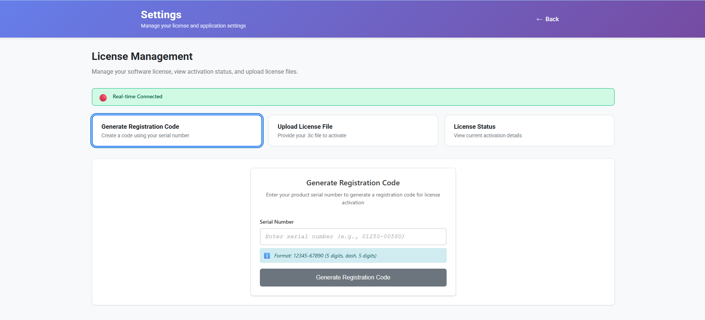
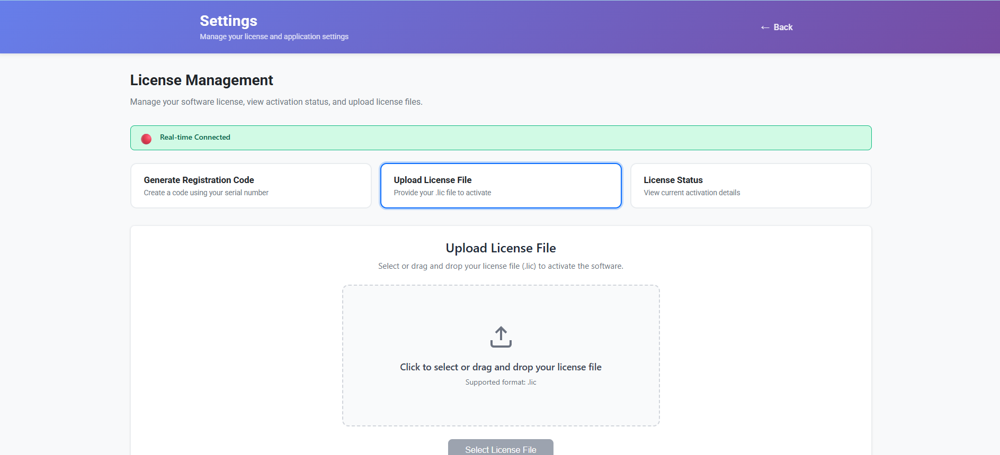
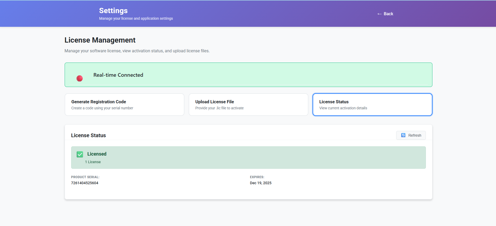

Open the app settings to register & activate the license.
If unavailable, use the built‑in demo period (restart app to refresh demo window for evaluation cycles).
Plan tests so demo timer doesn’t expire mid‑rundown.

