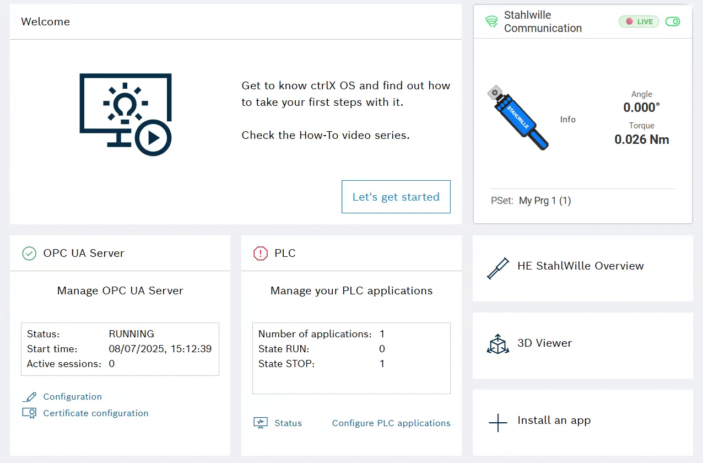

## Dashboard Widget
Displays connection status, enable state, last result quality (color), selected/active PSet, and last torque/angle values.

Click to open the Tool Manager page for detailed controls.

The widget provides realtime updates via WebSocket push for immediate feedback and ensures data is always current.

<!-- `/img/user-guide/tool-manager-page.png` – Tool Manager with PSet selection & results. -->

