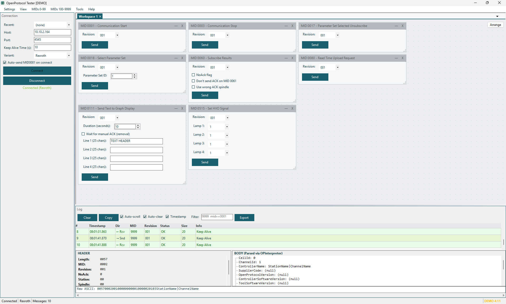

# Getting Started

## System Requirements

- **OS**: Windows 10 or later (64-bit)
- **Runtime**: .NET 8 Desktop Runtime (the installer downloads it automatically if missing)
- **Network**: TCP/IP access to the tightening controller

## Installation

Run the installer:

```
OpenProtocolTester-Setup-0.6.0-beta.exe
```

The installer will:
- Check for .NET 8 Desktop Runtime and offer to download it if missing
- Install to `C:\Program Files\Haller + Erne GmbH\OpenProtocolTester\`
- Create a Start Menu shortcut

## First Launch

When you first start the application, you'll see:

<!-- SCREENSHOT: Main application window with labeled areas -->


The interface has these main areas:

| Area | Description |
|------|-------------|
| **Menu Bar** | Access all MID panels, tools, and settings |
| **Connection Panel** | Configure and manage the TCP connection |
| **Log Panel** | View all sent and received messages |
| **Status Bar** | Connection status, protocol variant, message count |
| **Docked Panels** | MID panels, tools, and utilities (via Syncfusion DockingManager) |

## UI Layout

The application uses a **dockable panel** layout powered by Syncfusion DockingManager. You can:

- **Drag** panels to rearrange them
- **Float** panels by dragging them out of the dock
- **Auto-hide** panels by clicking the pin icon
- **Close** panels from the tab's X button
- **Restore** panels from the menu

### Menu Structure

The menu bar is organized into 23 groups matching the Open Protocol specification:

| Menu Group | MIDs | Description |
|------------|------|-------------|
| Connection | 0001, 0003 | Communication start/stop |
| Generic Messages | 0008, 0009 | Subscribe/unsubscribe (per variant) |
| Parameter Set | 0010, 0012, 0014, 0017–0021 | Parameter set data and selection |
| Job Data | 0030, 0032, 0034 | Job information |
| Job | 0038, 0554, 0557, 0570–0574 | Job control and status |
| Tool Data | 0040, 0127 | Tool information |
| Tool Enable | 0042, 0043 | Enable/disable tool |
| Calibration | 0045 | Calibration data |
| ID Code | 0050, 0051, 0054, 0150 | Vehicle/part identification |
| Result Data | 0060, 0063, 0064, 0100, 0103 | Tightening results and curves |
| Alarms | 0070, 0073, 0078 | Alarm subscribe/acknowledge |
| Time | 0080, 0082 | Controller time |
| Various | 0110, 0111, 0113 | Multi-spindle status |
| Signals | 0200, 0210, 0213, 0500–0504 | I/O signals |
| User Data | 0240, 0241, 0244, 0245 | User-defined data |
| Tool Tag ID | 0260, 0261 | RFID tool identification |
| Mode Settings | 0400, 0403, 0404, 0410 | Mode control |
| HVO | 0510, 0513, 0515 | Hand-held Video Output |
| Socket Tray | 0520, 0523, 0524 | Socket tray selection |
| Battery | 0800, 0802 | Battery status |
| Wi-Fi | 0805, 0807 | Wi-Fi status |
| Customer BMW | 9005, 9006, 9090, 9091 | BMW-specific custom MIDs |
| Alive | 9998, 9999 | Keep-alive messages |

### Tools Menu

| Menu Item | Description |
|-----------|-------------|
| **Test Suites** | Open the Lua test scripting window |
| **Statistics** | Tightening/curve counters |
| **Autosender** | Loop-send messages at intervals |
| **Hex Editor** | View/edit binary message data |
| **Header Editor** | Edit Rexroth protocol header fields |

## Demo Mode

The application runs in **demo mode** without a license. A reminder dialog appears periodically (3 times) before features are disabled. See [Licensing](10-licensing.md) for details on activating a license.
