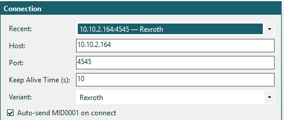
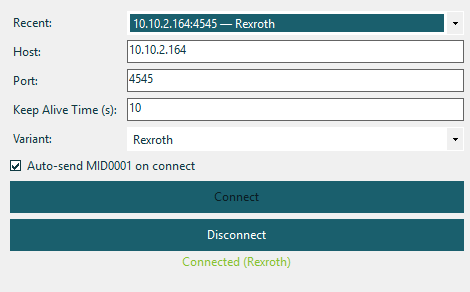
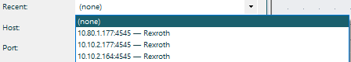

# Connecting to a Controller

## Connection Panel

The Connection panel is your primary interface for establishing TCP connections to tightening controllers.

<!-- SCREENSHOT: Connection panel with all fields labeled -->

### Fields

| Field | Default | Description |
|-------|---------|-------------|
| **Recent** | *(empty)* | Dropdown of previously used connections |
| **Host** | `localhost` | Controller hostname or IP address |
| **Port** | `4545` | TCP port number |
| **Keep Alive Time (s)** | `10` | Interval for keep-alive messages (MID 9999) |
| **Variant** | `Rexroth` | Protocol variant: **Rexroth**, **BMW**, or **Ford** |
| **Auto-send MID0001 on connect** | ✅ Checked | Automatically send Communication Start after connecting |

### Protocol Variants

The protocol variant affects the **header layout** of all messages:

| Variant | Header Layout | Usage |
|---------|---------------|-------|
| **Rexroth** | Standard 20-byte header (Length, MID, Revision, NoAck, Station, Spindle, Sequence, PartCount, PartNumber) | Bosch Rexroth controllers |
| **BMW** | BMW/Ford 20-byte header (Length, MID, Spindle, Revision, Spare) | BMW assembly lines |
| **Ford** | Same as BMW layout | Ford assembly lines |

> **Important**: Select the correct variant *before* connecting. The variant determines how headers are parsed and serialized for all subsequent messages.

### Connecting

1. Enter the **Host** (IP or hostname) and **Port**
2. Select the **Variant**
3. Click **Connect**

<!-- SCREENSHOT: Connected state showing green status -->

When connected:
- The status label shows **"Connected"** in green
- The status bar shows the connection state and variant
- The **Disconnect** button becomes active
- If **Auto-send MID0001** is checked, MID 0001 is sent automatically

### Disconnecting

Click **Disconnect** to close the TCP connection. This performs a hard TCP close without sending MID 0003 (Communication Stop). To send a clean protocol disconnect, use the MID 0003 panel first.

### Keep-Alive

The application sends **MID 9999** (Alive Acknowledge) at the configured interval to keep the connection active. Most controllers expect keep-alive messages every 10 seconds and will drop the connection if none are received.

### Recent Connections

<!-- SCREENSHOT: Recent connections dropdown -->

The **Recent** dropdown remembers your last connections. Selecting a recent entry fills in the Host, Port, and Variant fields automatically. Connections are saved when you successfully connect.

### Status Bar

The bottom status bar shows:

| Indicator | Description |
|-----------|-------------|
| **Connection status** | ● Connected (green) or ● Disconnected (gray) |
| **Variant** | Currently selected protocol variant |
| **Message count** | Number of messages sent/received |

### Connection Errors

| Error | Cause | Solution |
|-------|-------|----------|
| "Connection refused" | Controller not reachable or wrong port | Verify IP, port, and firewall settings |
| "Connection timed out" | Network issue or controller offline | Check network connectivity |
| "Already connected" | Connection already active | Disconnect first |
| "No response to MID 0001" | Controller not responding | Check variant selection, try different revision |

## License Lock

If the demo period expires without a license, the connection panel is disabled. See [Licensing](10-licensing.md) for activation instructions.
