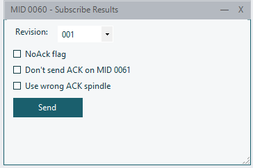
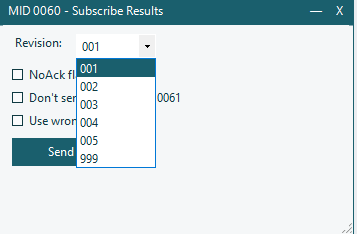

# Sending & Receiving MIDs

## MID Panels

Each MID (Message ID) has a dedicated panel for composing and sending protocol messages. Open a MID panel from the **menu bar** — panels are organized into the same 23 groups as the Open Protocol specification.

<!-- SCREENSHOT: A MID panel (e.g., MID 0060) showing revision selector, fields, and Send button -->

### Panel Layout

Every MID panel has:

| Element | Description |
|---------|-------------|
| **Revision** dropdown | Select the message revision (e.g., 001, 002, 003) |
| **Fields** | Input fields specific to this MID (text, checkboxes, numbers, dropdowns) |
| **Send** button | Serialize and transmit the message over TCP |

### Selecting a Revision

Different revisions of a MID include different fields. The available revisions depend on:
- The **MID number** — each MID defines its own supported revisions
- The **protocol variant** — some revisions are only available for specific variants (Rexroth, BMW, Ford)

<!-- SCREENSHOT: Revision dropdown showing multiple revision options -->

Select the revision that matches your controller's firmware. When in doubt, use **001** (the base revision).

### Field Types

MID panels use four types of input fields:

| Type | Control | Usage |
|------|---------|-------|
| **Text** | TextBox | Free-form text (Cell ID, Channel ID, etc.) |
| **Numeric** | NumberBox | Numeric values with min/max bounds (torque, angle, etc.) |
| **Checkbox** | CheckBox | Boolean flags (batch status, ok/nok, etc.) |
| **Dropdown** | ComboBox | Selection from predefined options |

### Sending a Message

1. Open the desired MID panel from the menu
2. Select the appropriate **Revision**
3. Fill in the **fields** as needed
4. Click **Send**

The message is serialized according to the Open Protocol specification and sent over TCP. You can see the sent message in the [Log Viewer](04-log-viewer.md).

### Receiving Responses

When the controller sends a response:
- It appears in the **Log** panel automatically
- Sent messages are labeled **"SENT"** and received messages are labeled **"RECV"**
- The log shows the raw message data and parsed fields

### Common MID Workflows

#### Basic Communication

1. **MID 0001** → Communication Start (often auto-sent on connect)
2. Controller responds with **MID 0002** (Communication Start Acknowledge) or **MID 0004** (error)
3. **MID 0003** → Communication Stop (graceful disconnect)

#### Subscribing to Data

1. **MID 0008** → Generic Subscribe (specify the MID to subscribe to)
2. Controller responds with **MID 0005** (accepted) or **MID 0004** (rejected)
3. Controller sends data messages as events occur
4. **MID 0009** → Generic Unsubscribe

#### Tightening Results

1. Subscribe to MID 0060 using MID 0008
2. Perform a tightening on the controller
3. Controller sends **MID 0061** with result data (torque, angle, status)
4. Unsubscribe using MID 0009

#### Job Selection

1. **MID 0038** → Select Job (specify job number)
2. Controller responds with **MID 0005** (accepted) or **MID 0004** (rejected)

### Variant-Specific Panels

Some MIDs have variant-specific panels:

| Panel | Variant | Description |
|-------|---------|-------------|
| MID 0008 | Rexroth | Standard generic subscribe |
| MID 0008 BMW | BMW | BMW-specific subscribe with different fields |
| MID 0008 Ford | Ford | Ford-specific subscribe |
| MID 9005 | BMW | BMW Result Subscribe |
| MID 9006 | BMW | BMW Result Data |
| MID 9090 | BMW | BMW Custom Subscribe |
| MID 9091 | BMW | BMW Custom Data |

### Tips

- **Multiple panels** can be open simultaneously — dock them side by side for efficient workflow
- The **Header Editor** (Tools menu) lets you customize the Rexroth header fields (Station, Spindle, Sequence, etc.) applied to all outgoing messages
- Use the **Autosender** tool to send a message repeatedly at a configurable interval
