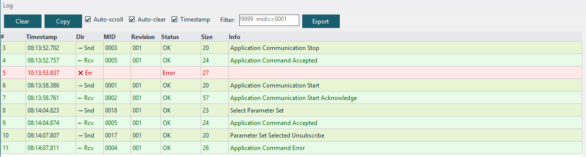
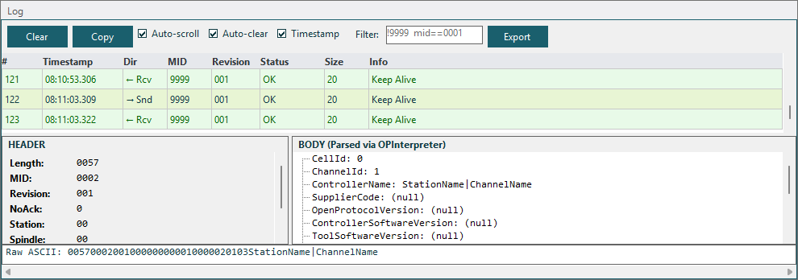
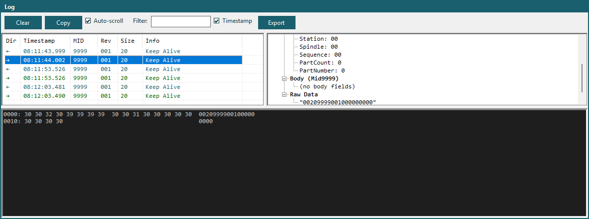
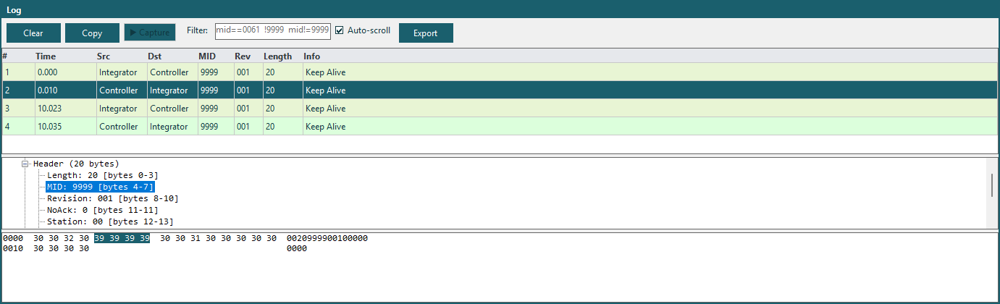

# Log Viewer

The Log panel displays all TCP traffic — every message sent and received. It supports three viewing modes for different analysis needs.

<!-- SCREENSHOT: Log panel showing messages with color-coded entries -->

## Log Modes

Switch between modes using the toolbar at the top of the Log panel:

### DataGrid Mode

<!-- SCREENSHOT: DataGrid mode with columns -->

A tabular view with sortable columns:

| Column | Description |
|--------|-------------|
| **Direction** | SENT or RECV |
| **Timestamp** | When the message was sent/received |
| **MID** | Message ID number |
| **Description** | Human-readable MID name (e.g., "Communication Start") |
| **Raw Data** | Full ASCII message content |

### TreeView Mode

<!-- SCREENSHOT: TreeView mode with expanded message -->

A hierarchical view that groups messages and shows parsed field details. Expand a message to see:
- Header fields (Length, MID, Revision, Station, etc.)
- Body fields parsed by the Open Protocol Interpreter

### Wireshark Mode

<!-- SCREENSHOT: Wireshark mode with dissected fields -->

A protocol dissection view inspired by Wireshark. Shows:
- The full raw message in the top pane
- Dissected protocol fields in the bottom pane
- Each field with its byte offset, length, name, and value
- Click a field to highlight its bytes in the raw data

## Log Features

### Color Coding

Messages are color-coded by type:

| Color | Meaning |
|-------|---------|
| **Blue** | Sent messages |
| **Green** | Received messages |
| **Red** | Error messages |
| **Gray** | Keep-alive messages (MID 9998/9999) |

### Hide Alive Messages

Use **Settings → Hide Alive** (a checkbox menu item) to filter out keep-alive messages (MID 9998/9999) that can clutter the log during long sessions. When checked:

- Keep-alive messages are suppressed from logging
- The log viewer filters them from the display
- The setting is persisted automatically and restored on next launch

### Auto-Scroll

The log auto-scrolls to show the latest messages. When you scroll up to review history, auto-scroll pauses. Scroll to the bottom to re-enable it.

### Clear Log

Click **Clear** to remove all log entries. The message counter in the status bar resets to zero.

### Log Capacity

The log maintains up to **11,000 entries**. When the limit is reached, the oldest 1,000 entries are automatically trimmed (keeping the most recent 10,000).

## Interactive Log

The Interactive Log panel provides a master-detail view for inspecting protocol traffic:

| Area | Description |
|------|-------------|
| **Toolbar** | Clear, Copy, Auto-scroll, Auto-clear, Timestamp, Filter, Export |
| **Log grid** (top, ~60%) | DataGridView showing log entries in virtual mode |
| **Detail panel** (bottom, ~40%) | Parsed MID Header fields, Body fields tree, and Raw ASCII |

Click a log row to see its full parsed MID details in the bottom panel. Sending MIDs is done from the individual MID panels — this panel is read-only.
