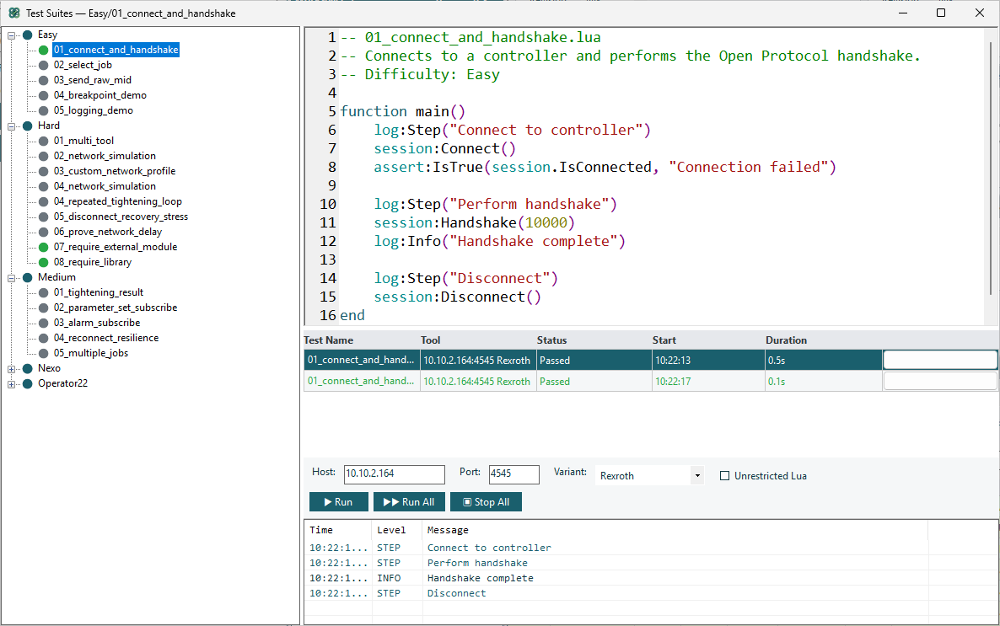
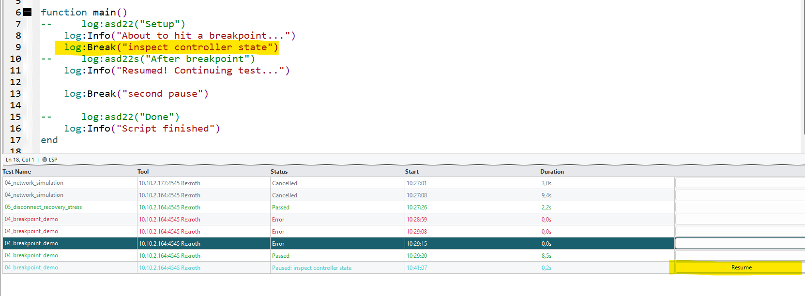

# Lua Scripting

OpenProtocol Tester includes a built-in **Lua scripting engine** (MoonSharp) for writing automated test scripts that communicate with tightening controllers over TCP.

## Overview

Scripts let you:
- Automate protocol handshakes and message sequences
- Validate tightening results against expected tolerances
- Run repeatable test suites across controller configurations
- Simulate network conditions for robustness testing
- Generate test reports (HTML, JSON, JUnit XML)

## Quick Start

1. Open **Tools → Test Suites**
2. Right-click the tree → **New Workspace** → name it
3. Right-click the workspace → **New Test** → name it
4. Write your script:

```lua
function main()
    log:Step("Connect and handshake")
    session:Connect()
    session:Handshake()

    log:Step("Verify connection")
    assert:IsTrue(session.IsConnected, "Should be connected")

    log:Step("Disconnect")
    session:Disconnect()
end
```

5. Set **Host**, **Port**, and **Variant** in the toolbar
6. Click **Run**

<!-- SCREENSHOT: Test Suites window with a simple script and Run button -->


## Script Structure

Every script **must** define a `function main()` — this is the entry point the engine calls.

```lua
-- Helper functions go above main()
function myHelper()
    -- ...
end

-- Entry point (required)
function main()
    -- Your test logic here
end
```

## Three Global Objects

Your scripts have access to three pre-injected globals:

| Global | Purpose |
|--------|---------|
| `session` | TCP connection, send/receive messages, handshake |
| `assert` | Test assertions (fail on mismatch) |
| `log` | Logging, test steps, breakpoints |

Plus one global function:
- `createSession()` — create an additional independent TCP session

## Connecting

### Default Connection (from toolbar)

```lua
session:Connect()           -- uses Host/Port/Variant from the toolbar
session:Handshake()         -- sends MID 0001, waits for MID 0002
```

### Custom Connection

```lua
session:Connect("10.10.2.177", 4545, "OpenProtocol_Rexroth")
session:Handshake(15000)    -- 15 second timeout
```

Valid variant IDs:
- `"OpenProtocol_Rexroth"` — Bosch Rexroth
- `"OpenProtocol_BMW"` — BMW
- `"OpenProtocol_Ford"` — Ford

### Disconnecting

```lua
session:Disconnect()          -- hard TCP close
session:DisconnectWithMid3()  -- send MID 0003 first (clean protocol stop)
```

### Auto-Reconnect

If the connection drops mid-test, the next send/wait call **automatically reconnects** and re-handshakes. No manual recovery code needed.

## Sending Messages

### By MID Number

```lua
session:SendMid(38)                     -- send MID 0038 with empty body
session:SendMid(38, { jobId = 12 })     -- send with body fields
```

### With Header Control

By default, `SendMid` uses revision 1 and default header values. You can customize header fields:

```lua
-- Set persistent defaults for all subsequent sends
session:SetHeader({ revision = 3, station = "01", spindle = "02" })

session:SendMid(10)     -- uses revision 3, station 01, spindle 02

-- Per-call override (takes precedence over persistent defaults)
session:SendMid(10, nil, { revision = 1 })   -- revision 1, but station/spindle from SetHeader

-- Body fields AND header overrides together
session:SendMid(18, { ParameterSetId = "001" }, { revision = 1, noAck = 1 })

-- Clear persistent defaults (back to built-in: revision=1, station=00, ...)
session:ClearHeader()
```

Available header fields: `revision`, `station`, `spindle`, `sequence`, `noAck`, `partCount`, `partNumber`.

### Raw ASCII

```lua
session:SendRaw("002400380010000000000000120000")
```

The NUL terminator (`\0`) is appended automatically.

## Receiving Messages

### Wait for a Specific MID

```lua
local resp = session:WaitForMid(5, 5000)   -- wait for MID 0005, 5s timeout
log:Info("Got MID " .. tostring(resp.mid))
```

### Wait for Any Message

```lua
local msg = session:WaitForRawResponse(5000)
```

### Non-Throwing Wait

```lua
local r = session:TryWaitForRawResponse(5000)
if r == nil then
    log:Info("No response within 5s")
end
```

### Response Table

Every received message is a Lua table:

| Field | Type | Description |
|-------|------|-------------|
| `mid` | number | MID number (e.g., 2, 5, 61) |
| `revision` | number | Revision number |
| `length` | number | Total message length |
| `raw` | string | Full raw ASCII message |
| `body` | string | Body after the 20-byte header |
| `parseError` | string/nil | Error if OPI parsing failed |
| `header` | table | Parsed header fields |
| `fields` | table | Parsed body fields (all values are **strings**) |

```lua
local result = session:WaitForMid(61, 30000)
local torque = tonumber(result.fields.Torque)    -- always use tonumber()!
local status = result.fields.TighteningStatus
```

## High-Level Helpers

| Function | Description |
|----------|-------------|
| `session:SelectJob(jobId)` | Send MID 0038 + wait for accept/reject (10s) |
| `session:StartTightening()` | Subscribe to MID 0060 results |
| `session:StopTightening()` | Unsubscribe from MID 0060 |
| `session:WaitForResult(timeoutMs)` | Wait for MID 0061 tightening result |
| `session:Sleep(ms)` | Pause execution (max 60s, respects cancel) |

## Test Steps

Steps organize your test into logical phases. Each step gets its own pass/fail status in the results:

```lua
function main()
    log:Step("Connect to controller")
    session:Connect()
    session:Handshake()

    log:Step("Select job and subscribe")
    session:SelectJob(12)
    session:StartTightening()

    log:Step("Wait for tightening result")
    local result = session:WaitForResult(30000)
    assert:TorqueWithin(result, 10.0, 25.0)
    assert:AngleWithin(result, 50.0, 120.0)

    log:Step("Cleanup")
    session:StopTightening()
    session:Disconnect()
end
```

<!-- SCREENSHOT: Test results showing steps with pass/fail indicators -->


## Assertions

Assertions validate expected values. A failed assertion **stops the test immediately** and marks it as **Failed**.

### Basic Assertions

```lua
assert:IsTrue(session.IsConnected, "Should be connected")
assert:IsFalse(hasError, "Should have no error")
assert:Equals(5, resp.mid, "Expected MID 0005")
assert:NotEquals(4, resp.mid, "Should not be error")
assert:NotNil(resp, "Expected a response")
assert:Fail("Unreachable code reached")
```

### Tightening-Specific

```lua
assert:TorqueWithin(result, 10.0, 25.0)       -- torque in [10, 25] Nm
assert:AngleWithin(result, 50.0, 120.0)        -- angle in [50, 120] deg
assert:NoAlarm(result)                          -- no error code
assert:MidFieldEquals(resp, "jobId", 12)        -- specific field check
```

### Continuing After Failed Checks

Use `pcall` to catch assertion errors without stopping the test:

```lua
local ok, err = pcall(function()
    session:SelectJob(-1)
end)
assert:IsFalse(ok, "Should have rejected invalid job")
```

## Logging

```lua
log:Info("Connected to " .. session.ToolHost)
log:Warn("Retrying...")
log:Error("Unexpected response")
log:Debug("Raw: " .. resp.raw)
print("This goes to log:Debug()")    -- print() is redirected
```

## Breakpoints

Pause script execution for manual inspection:

```lua
log:Break("inspect before tightening")    -- pauses until user clicks Resume
log:Break()                                -- default label: "breakpoint"
```

Breakpoints have a **5-minute auto-resume timeout**.

<!-- SCREENSHOT: Paused test with Resume button -->


## Multi-Tool Testing

Use `createSession()` to connect to multiple controllers simultaneously:

```lua
function main()
    log:Step("Connect to primary tool")
    session:Connect("10.10.2.177", 4545, "OpenProtocol_Rexroth")
    session:Handshake()

    log:Step("Connect to second tool")
    local tool2 = createSession()
    tool2:Connect("10.10.2.178", 4545, "OpenProtocol_BMW")
    tool2:Handshake()

    log:Step("Run both tools")
    session:SelectJob(12)
    tool2:SelectJob(5)

    session:Disconnect()
    tool2:Disconnect()
end
```

Each session has its own TCP connection and message queue.

## Network Simulation

Simulate poor network conditions **before** connecting:

### Built-In Profiles

```lua
session:SetNetworkProfile("poor_radio")     -- 200ms send, 300ms recv, 150ms jitter
session:SetNetworkProfile("slow_station")   -- 0ms send, 2000ms recv, 500ms jitter
session:SetNetworkProfile("disconnect_after_3")  -- drops after 3 messages
session:SetNetworkProfile("normal")         -- no simulation (default)
```

### Custom Profile

```lua
session:SetNetworkProfileCustom({
    sendDelayMs = 100,
    receiveDelayMs = 150,
    jitterMs = 50,
    packetLossPercent = 5.0,
    disconnectAfterMessages = 0
})
session:Connect()
```

## Sandbox & Unrestricted Mode

By default, scripts run in **SoftSandbox** mode — `io`, `os.execute`, `require`, etc. are blocked.

To enable unrestricted mode (per workspace):
1. Check **"Unrestricted Lua"** in the Test Suites toolbar
2. Confirm the security warning
3. This unlocks `os.*`, `io.*`, `require`, `dofile`, `loadfile`

> **Warning**: Only enable unrestricted mode for scripts you trust.

## Error Handling

| Exception | Test Status | Cause |
|-----------|-------------|-------|
| Assertion failure | **Failed** | Any `assert:*` call |
| Timeout | **Failed** | `WaitForMid` / `Handshake` timeout |
| User cancellation | **Cancelled** | Click **Stop** |
| Already connected | **Error** | `Connect()` called twice |
| Lua runtime error | **Error** | Syntax error, nil reference |

## Tips

1. **Always define `function main()`** — the engine won't find your script otherwise
2. **Use `log:Step()` liberally** — aim for 3–10 steps per test
3. **Timeouts are in milliseconds** — `5000` = 5 seconds
4. **Field values are always strings** — use `tonumber()` for numeric comparisons
5. **Define helpers above `main()`** — Lua processes top-to-bottom
6. **Auto-reconnect is built in** — dropped connections are recovered automatically
7. **`print()` works** — it routes to `log:Debug()`
