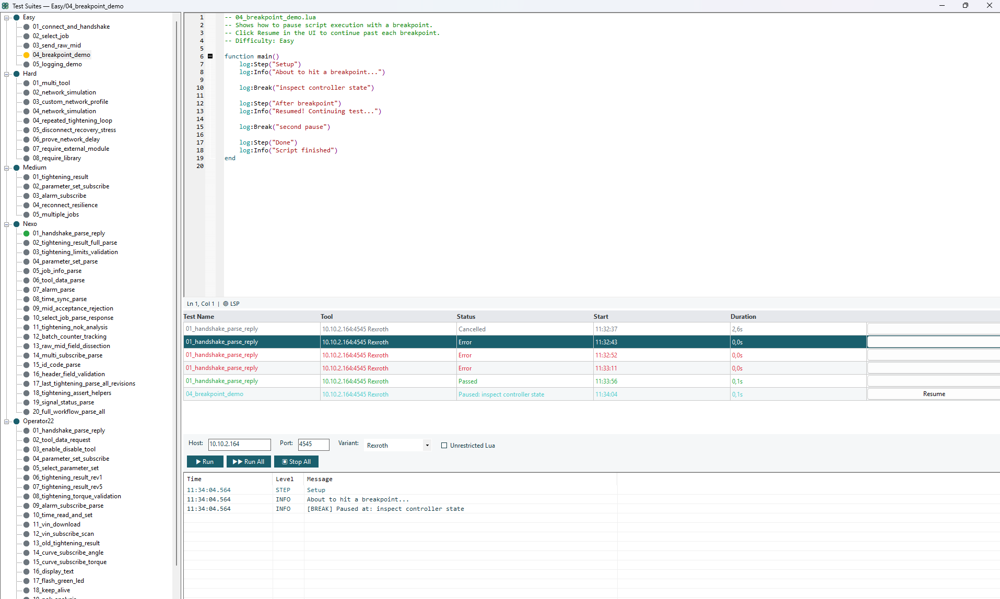
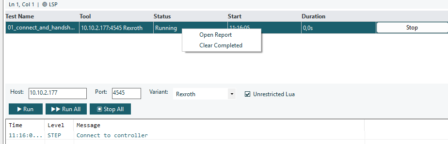
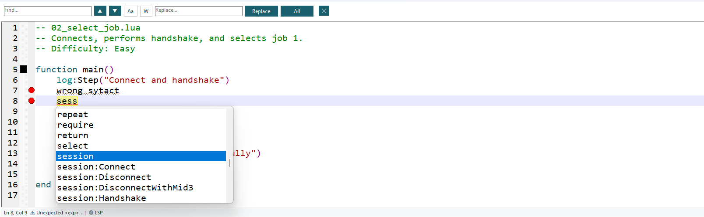
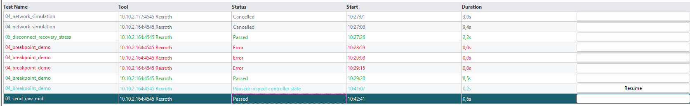
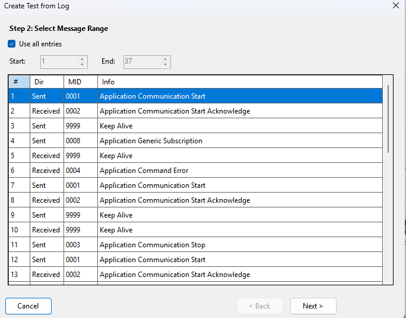

# Test Suites

The Test Suites window (**Tools → Test Suites**) is the management hub for Lua test scripts.

<!-- SCREENSHOT: Full Test Suites window with tree, editor, and results -->


## Window Layout

| Area | Description |
|------|-------------|
| **Toolbar** | Host, Port, Variant fields + Run/Stop/Report buttons |
| **Tree panel** (left) | Workspace and test hierarchy |
| **Code editor** (center) | Lua script editor with syntax highlighting and LSP diagnostics |
| **Results panel** (bottom) | Test step results, log output, duration |

## Toolbar

<!-- SCREENSHOT: Test Suites toolbar with labeled controls -->


| Control | Description |
|---------|-------------|
| **Host** | Controller hostname/IP for `session:Connect()` |
| **Port** | TCP port for `session:Connect()` |
| **Variant** | Protocol variant dropdown |
| **Run** | Execute the selected test |
| **Run All** | Execute all tests in the current workspace sequentially |
| **Stop All** | Cancel all running tests |
| **Generate Report** | Export results (HTML, JSON, JUnit XML) |
| **Unrestricted Lua** | Toggle sandbox mode for the workspace |

## Workspaces

Tests are organized into **workspaces** (folders on disk). Right-click the tree to manage:

| Action | Description |
|--------|-------------|
| **New Workspace** | Create a new test folder |
| **Rename Workspace** | Rename a workspace |
| **Delete Workspace** | Delete workspace and all its tests |
| **New Test** | Create a new Lua test script |
| **Rename Test** | Rename a test |
| **Delete Test** | Delete a test script |
| **Import** | Import `.lua` or `.zip` files into a workspace |
| **Export** | Export workspace as a `.zip` archive |

### File Storage

Tests are stored at:

```
%APPDATA%\Haller + Erne GmbH\heOPTester\Tests\
├── MyWorkspace/
│   ├── test1.lua
│   ├── test1.lua.meta       ← metadata sidecar
│   ├── test2.lua
│   └── test2.lua.meta
```

### Metadata Sidecar

Each test has an optional `.lua.meta` JSON file storing:

| Field | Description |
|-------|-------------|
| `name` | Display name |
| `description` | Test description |
| `tags` | Categorization tags |
| `defaultToolConfig` | Override host/port/variant for this test |
| `lastResult` | Last run status |
| `lastRun` | Timestamp of last run |
| `runHistory` | Last 20 run results |

## Code Editor

<!-- SCREENSHOT: Code editor with syntax highlighting, error markers, and autocomplete -->


The editor features:

| Feature | Description |
|---------|-------------|
| **Syntax highlighting** | Lua syntax coloring |
| **Error markers** | Red dots and underlines for syntax errors (from lua-language-server) |
| **Autocomplete** | Method/property suggestions for `session`, `log`, `assert` |
| **Tooltips** | Hover over API methods to see signatures and descriptions |
| **Find/Replace** | Ctrl+F for find, Ctrl+H for replace |
| **Code folding** | Collapse/expand `function`/`if`/`for` blocks |
| **Status bar** | Line/column, total lines, diagnostic message for current line |

### LSP Setup

The editor uses **lua-language-server** for real-time diagnostics. To install:

```powershell
.\scripts\install-lua-ls.ps1
```

This downloads the server binary to `OpenProtocol.WinForms/tools/lua-language-server/bin/`. Without it, the editor works but without real-time error checking.

## Running Tests

### Single Test

1. Select a test in the tree
2. Click **Run** (or right-click → Run)

### All Tests in Workspace

1. Select a workspace in the tree
2. Click **Run All**

### Concurrent Runs

Up to **5 tests** can run simultaneously. Each gets its own TCP connection and log.

### Test Status

| Status | Meaning |
|--------|---------|
| **Running** | Test is executing |
| **Paused** | Stopped at a `log:Break()` breakpoint |
| **Passed** | All steps completed without assertion failures |
| **Failed** | An assertion failed or a timeout occurred |
| **Error** | A Lua runtime error or unexpected exception |
| **Cancelled** | User clicked Stop |

### Test Results

<!-- SCREENSHOT: Test results panel showing steps, status, duration -->


Each test run shows:
- **Steps**: Each `log:Step()` call with its own pass/fail
- **Duration**: Total execution time
- **Log**: Full log output (Info, Warn, Error, Debug messages)

## Generating Reports

After running tests, click **Generate Report** to export:

| Format | Description |
|--------|-------------|
| **HTML** | Human-readable report with color-coded log output |
| **JSON** | Machine-readable results with full log entries |
| **JUnit XML** | CI/CD integration (Jenkins, GitHub Actions) |

All formats include the **complete log output** from the test run.

### Custom HTML Templates

Place a `report_template.html` at `%APPDATA%\Haller + Erne GmbH\heOPTester\` with these placeholders:

| Placeholder | Replaced With |
|-------------|---------------|
| `{{TITLE}}` | Report title |
| `{{GENERATED}}` | Generation timestamp |
| `{{CONTENT}}` | Test results HTML |

## Creating Tests from Logs

1. Capture traffic in the main log panel
2. Go to **Tools → Create Test from Log**
3. Configure:

<!-- SCREENSHOT: Create Test from Log wizard -->


| Option | Description |
|--------|-------------|
| **Include assertions** | Generate `assert:Equals` for responses |
| **Include timing delays** | Add timing comments |
| **Default timeout** | Timeout for `WaitForMid()` calls (default 5000ms) |
| **Test name** | Function name (defaults to `main`) |

4. Preview the generated script
5. Save to a workspace

The wizard automatically:
- Generates `Connect()` + `Handshake()` from MID 0001/0002 pairs
- Converts sent messages to `SendMid()` or `SendRaw()`
- Adds `WaitForMid()` for responses
- Detects disconnect/reconnect cycles
- Skips keep-alive messages (MID 9998/9999)
