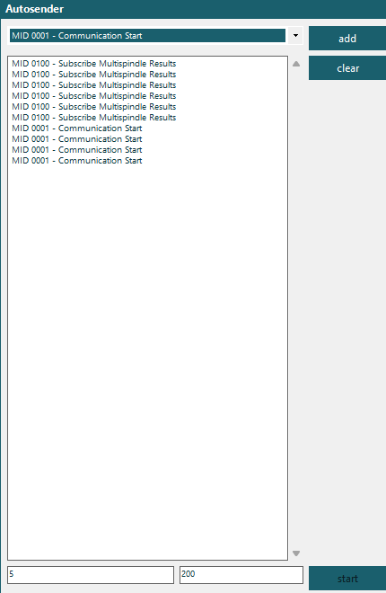
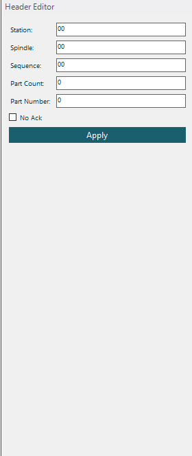
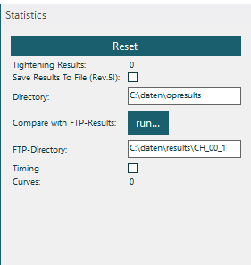

# Tools & Utilities

## Autosender

The Autosender panel (**Tools → Autosender**) sends a message repeatedly at a configurable interval.

<!-- SCREENSHOT: Autosender panel with interval and message fields -->

| Field | Description |
|-------|-------------|
| **Message** | Raw ASCII message to send |
| **Interval (ms)** | Delay between sends (milliseconds) |
| **Start / Stop** | Toggle loop sending |

Use cases:
- Stress testing a controller with repeated messages
- Simulating periodic data requests
- Testing keep-alive behavior at different intervals

## Header Editor

The Header Editor panel (**Tools → Header Editor**) lets you customize the **Rexroth protocol header** fields applied to outgoing messages.

<!-- SCREENSHOT: Header Editor with all header fields -->

| Field | Bytes | Default | Description |
|-------|-------|---------|-------------|
| **Station** | 12–13 | 01 | Station ID |
| **Spindle** | 14–15 | 01 | Spindle/channel ID |
| **Sequence** | 16–17 | 00 | Message sequence number |
| **PartCount** | 18 | 0 | Multi-part message count |
| **PartNumber** | 19 | 0 | Current part number |

> **Note**: The Header Editor only applies to the **Rexroth** variant. BMW and Ford variants use a different header layout where these fields don't exist.

## Statistics

The Statistics panel (**Tools → Statistics**) tracks tightening and curve counters.

<!-- SCREENSHOT: Statistics panel showing counters -->

| Counter | Description |
|---------|-------------|
| **Tightening count** | Number of MID 0061 results received |
| **Curve count** | Number of curve data messages received |

Counters reset when the connection is closed or when you click **Reset**.
