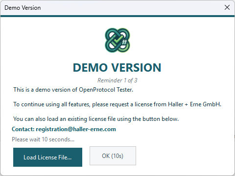
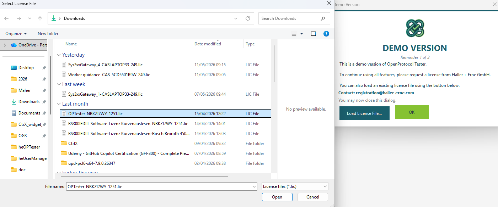

# Licensing

## Demo Mode

OpenProtocol Tester runs in **demo mode** without a license file. In demo mode:

- All features are fully functional initially
- A **reminder dialog** appears periodically (up to 3 times)
- After the 3rd reminder, some features are disabled until a license is activated

<!-- SCREENSHOT: Demo reminder dialog -->


The reminder dialog shows:
- A countdown timer (30 seconds before you can dismiss)
- A **Load License File** button for immediate activation
- The reminder number (e.g., "Reminder 1 of 3")

## Activating a License

### Loading a License File

1. When the demo reminder appears, click **Load License File...**
   — or at any time, use the menu to load a license
2. Select your `.lic` license file
3. The application validates the license immediately
4. If valid, demo mode is deactivated and all features are unlocked

The license is stored at:

```
C:\ProgramData\Haller + Erne GmbH\Licensing\OPTester.lic
```

<!-- SCREENSHOT: Load License File dialog -->


### Obtaining a License

Contact **Haller + Erne GmbH** to request a license:

- **Email**: registration@haller-erne.com
- Provide your organization name and the number of seats needed

## License Status

The status bar shows the current license state:

| Status | Meaning |
|--------|---------|
| **Licensed** | Valid license active |
| **Demo** | Running in demo mode |
| **Demo (features disabled)** | Demo period expired |

## Feature Restrictions

When the demo period expires (after 3 reminders), the following features are disabled:

| Feature | Status |
|---------|--------|
| **Connection** | Disabled — cannot connect |
| **MID panels** | Read-only — cannot send |
| **Test Suites** | Disabled — cannot run tests |
| **Log Viewer** | Still functional (view-only) |

Load a license file to restore full functionality.
