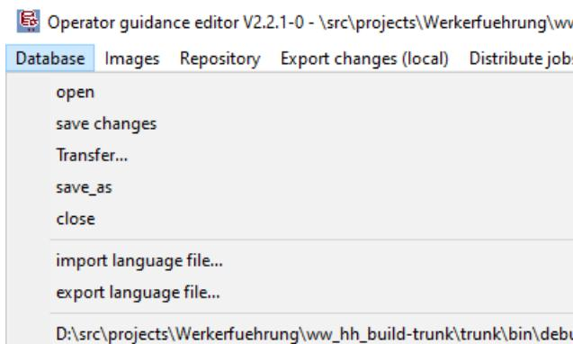
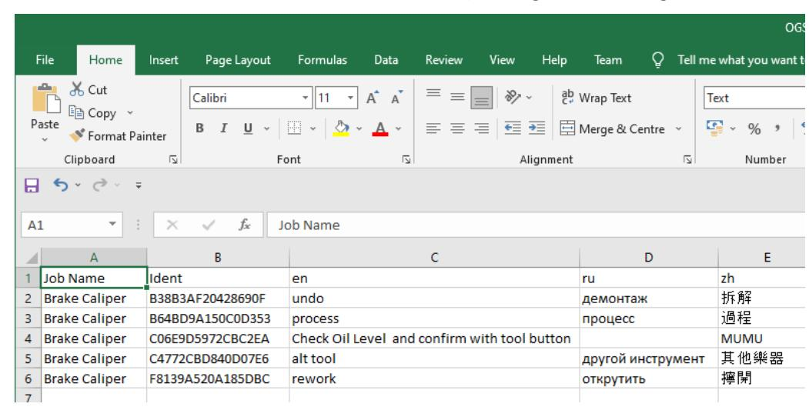
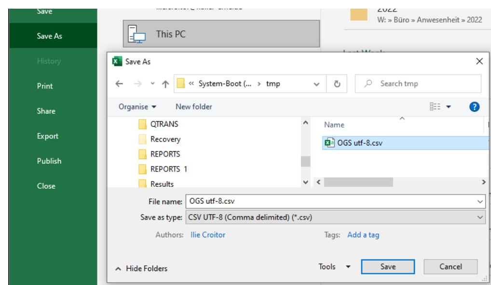
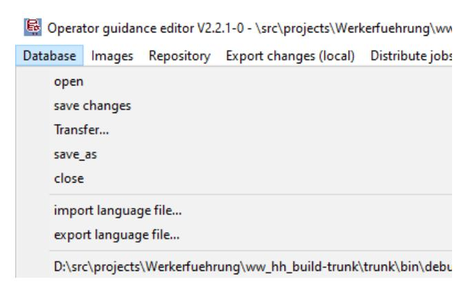
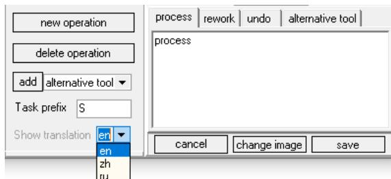
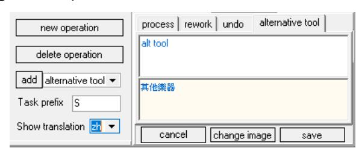
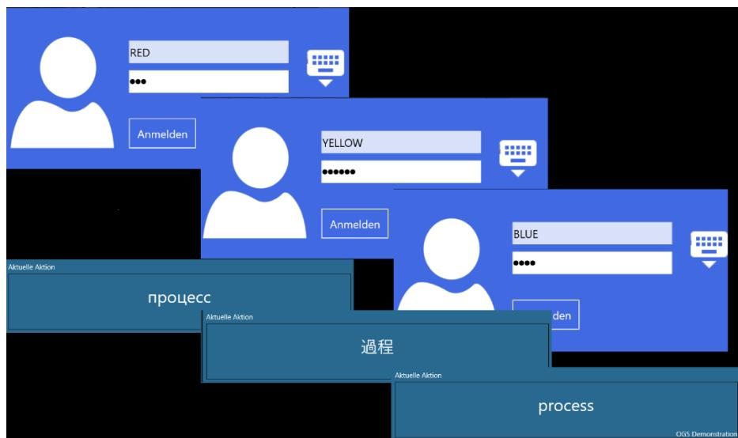

---
mdx:
  format: md
title: Multilanguage Support
sidebar_label: Multilanguage Support
---

# Haller + Erne GmbH

**heOGS – Multilanguage support Application Note**

HEI-22-0318 Version R01

## **Version history**

## **About this document**

This document contains information about how to setup OGS for multilanguage use. It provides best practices on how to setup, configure and use the OGS editor and runtime for multiple languages.

## **Table of Contents**

| 1     | Overview          | __________________________________________________________________________4           |
|-------|-------------------|---------------------------------------------------------------------------------------|
| 1.1   | Components        | ____________________________________________________________________4                 |
| 1.2   |                   | Language codes and primary language________________________________________________4  |
| 1.3   |                   | Language packs and file formats_____________________________________________________5 |
| 2     |                   | Workflow editor_____________________________________________________________________6 |
| 2.1   | Overview          | _______________________________________________________________________6              |
| 2.2   | Walkthrough       | – inline translations____________________________________________________6            |
| 2.2.1 |                   | Define available languages _____________________________________________________6     |
| 2.2.2 | Edit action texts | ______________________________________________________________6                       |
| 2.3   | Walkthrough       | – external translations _________________________________________________7            |
| 2.3.1 | Setup             | ______________________________________________________________________8               |
| 2.3.2 |                   | Generate (export) translation file ________________________________________________9  |
| 2.3.3 |                   | Translate using Excel __________________________________________________________9     |
| 2.3.4 |                   | Merge (import) translation file _________________________________________________11   |
| 2.3.5 |                   | Check translated texts ________________________________________________________11     |
| 3     | Station runtime   | ____________________________________________________________________12                |
| 4     | Reference         | _________________________________________________________________________13           |
| 4.1   |                   | Workflow Editor (heOpCfg.exe) ____________________________________________________13  |
| 4.2   |                   | Station runtime_________________________________________________________________13    |
| 4.3   |                   | heOGS Database Browser (Locate.exe) ______________________________________________13  |

## 1 Overview

Handling multiple different languages is an important aspect of any software application and thus also supported in the OGS applications. However, as the OGS use case differs from standard Windows applications, it provides additional features, like having different languages active in a single user session or switching languages without leaving the Windows session. Also, the text context is important, as not necessarily the same original text translates to the same translated text in a different context. OGS therefore supports contexts based on the job.

## 1.1 Components

The components related to multi-language support in OGS are:

- OGS workflow editor (heOpCfg.exe): o Change the user interface language for the editor itself (e. g. have "correct" language menus) o Enter language specific texts while creating workflows (e. g. the engineer who writes the workflows creates them in two languages) o Export/import translations (for external translation services)
- OGS Runtime (Monitor.exe): o Show the operator the instructions in "his" language o Dynamically switch languages depending on current operator

The following chapters describe on how to setup multi-language support and how to use it in typical scenarios.

## 1.2 Language codes and primary language

The OGS software uses ISO-639-1 (2-character) language codes to select a translation to use. Sample language codes are:

- de (German)
- en (English)
- …

Usually (see below for details) the language code is automatically detected (according to the Windows language settings for the currently logged in user) but can also be overridden by changing parameters in the software configuration.

In general, there are two different types of texts for translation:

- Static parts of the user interface: These are part of the application itself and a set of translation files are shipped with the application to translate these.
- Dynamic parts of the user interface and custom texts (like instruction texts): Depending on the actual type of text, the translations are stored in the configuration database or in a user-define translation memory / terms store.

The language code is used to lookup the translated texts in either case. If a matching text is not found (either due to the translation file missing, the text not available in the database or the terms store), then the "primary" language is used as a fallback.

For all static parts of the user interface English (language code "en") is used as the primary language (and as fallback). For the project specific texts in the database, a primary language can be defined by the user (see below).

## 1.3 Language packs and file formats

A language pack consists of all files required to translate the static parts of the user interface for a single language. It usually consists of a set of files which contain the translated texts. The OGS software uses two file formats to store translations in a language pack:

- a) \*.mo files: This is an industry standard binary format for storing translations. \*.mo files are generated by compiling textual \*.po files. The \*.po file can be directly edited using any text editor, translating or editing the \*.mo files requires a specialized application (see below).
- b) \*.ini files: This is a custom text-based file format with a list of key and value pairs. In use for translation, the key identifies the primary text (either as text in the primary language or by having a unique text-id) and the value keeps the translated text.

Note that all files have a 2-character `&lt;languagecode&gt;` as part of their filename – this is used by the application to select the correct file, when looking for a translation.

To support a language, where no language pack is shipped with the application, either a corresponding language pack can be requested from Haller + Erne or new translation files can be generated based on the files from an existing language pack.

More details for the file formats and translation tools can be found here:

- GNU gettext \*.po format[: https://www.gnu.org/software/gettext/manual/html\\_node/PO-Files.html](https://www.gnu.org/software/gettext/manual/html_node/PO-Files.html)
- GNU gettext \*.mo format[: https://www.gnu.org/software/gettext/manual/html\\_node/MO-](https://www.gnu.org/software/gettext/manual/html_node/MO-Files.html)[Files.html](https://www.gnu.org/software/gettext/manual/html_node/MO-Files.html)
- DevExpress VCL \*.ini localization files and downloadable translation packages: &lt;https://supportcenter.devexpress.com/ticket/details/k18138/how-to-localize-vcl-components&gt;
- A list of common PO editing tools[: http://docs.translatehouse.org/projects/localization](http://docs.translatehouse.org/projects/localization-guide/en/latest/guide/tools/trans_editors.html)[guide/en/latest/guide/tools/trans\\_editors.html](http://docs.translatehouse.org/projects/localization-guide/en/latest/guide/tools/trans_editors.html)

# 2 Workflow editor

## 2.1 Overview

## 2.2 Walkthrough – inline translations

The following sections show a quick walkthrough of the settings needed in the editor and using the editor to translate individual texts. The use-case here is to have the full context for translation available – while editing a job, the Engineer can also see the original texts and add the translations.

#### 2.2.1 Define available languages

The first step in adding language support to a projects database is to define the languages to use. The first language (this is always available by default) is the "primary" language – additional languages define the translations.

To add a language, select the "Tools" page, then select the "Additional languages" tab in the bottom pane.

To add a language, click the small "+" sign in the bottom left corner, then either choose a language from the dropdown or enter a new one (see below). To change the primary language, click the checkbox in the "primary" column.

**NOTE**: The dropdown lists the "known" languages, if you add another language, then make sure to provide the 2-character language code in the same format as the other languages (enclosed in braces at the end, "&lt;language name&gt; (<code>)"). In this case also additional translation files might be required (if not, then the user interface might show the defaults, i. e. English texts).

#### 2.2.2 Edit action texts

Action texts can be edited as usual in the text box at the bottom-right corner in the job editor screen. If multiple languages are set up, then the editor shows two different views:

- Primary language edit view: If the primary language is selected (or no additional language is added), then the editor shows a single text edit box (❶) for each of the process, rework, undo and alternative tool texts. Also, the "Show translation" text is grayed indicate that (❷):

- Translated language edit view: If a non-primary language is selected, then the editor shows a split view (❶) with primary language (read-only) and translated text (editable) beneath it. The "Show translation" text is colored black to indicate that a translation is selected (❷):

To switch between the languages, the dropdown left to the actual editors is used – the dropdown lists only the configured languages and allows choosing from them:

## 2.3 Walkthrough – external translations

The following sections show a quick walkthrough of how to export all project texts for translating using external services or contractors and how to import the translated texts.

The overall use case for this is:

- 1. Enter all primary language texts in the editor.
- 2. Generate a translation file by exporting the texts. The file contains all primary language texts, already pre-translated texts and the text context (i. e. job name).
- 3. Send the translation file to the external translation service. The service now translates the primary language texts into the given languages and adds these to the translation file.
- 4. If the completed translation file is received, merge the translations into the project database (by importing the file)

Note that importing a translation file has the following requirements:

- The text key must not be changed in any way. The text key consists of the context (mainly job name) plus the primary language text. The text key is required to correctly merge the translated texts back into the database (due to the job context, OGS supports identical primary language texts to be translated into different texts per job)
- Changed primary language texts (or any other change in the text key) will not import the translated text, as the text key is not found. The consequence is that the translation file cannot change the primary language text, this must always be done through the editor (see above).
- Non-empty translated texts by default do \*not\* overwrite the texts already existing in the database, but there is a setting (see below) to enable overwriting existing translations during import. If you

have enabled this and use external translation services, then edits in the database should only be done on the primary texts or the translation file should be regenerated after any change (and sent to the translation service), else changes to the translated texts might get lost with the next translation file import.

The translation file uses a CSV (comma separated value) file format (using UTF8 encoding), which can easily be edited using Excel or a Text editor. Each row has the following columns (first row has column captions):

- Column 1: Job name: Name of the job, where this rows text comes from (to provide some translation context)
- Column 2: Ident: Unique key to identify the text in the database must not be changed, see above.
- Column 3: Primary language text (do not change)
- Column 4…N: Translated texts (the column header has the two-digit language code)

Here is a sample (opened in Excel):

#### 2.3.1 Setup

The editor uses a CSV file in UTF8-format to export the project texts. However, the separator characters in the CSV file are also language dependent, so this can be configured. In addition, the behavior for importing already translated texts in the database can be defined to overwrite or ignore.

To change a setting, select the "Tools" page, then select the "INI Parameters" tab in the bottom pane. The section column has the following parameters:

- Section "CSV", Parameter "SEPARATOR": defines the column separator character for the CSV export and import.
- Section "CSV", Parameter "OVERWRITE\_EXISTING": If set to non-zero, then an already translated text in the database will be overwritten by the import. If set to zero, then already translated texts will not be modified

A typical setting is shown in the following screenshot:

#### 2.3.2 Generate (export) translation file

To generate a translation file, use "export language file…" from the main "Database" menu:

The editor will ask for a target folder/filename and generate a CSV-file with the project texts.

### 2.3.3 Translate using Excel

As a sample process, translating the file using Excel is shown in the following screenshots. Please note, that normally (if the CSV separator character is configured correctly, see [2.3.1\)](#page-7-0), Excel can open the translation file by double clicking it through Windows explorer. The following steps show how to use the text import wizard anyway.

#### 2.3.3.1 Step 1: Open the file using Excels text import wizard

Start Excel, then switch to the "Data" ribbon and click the "From Text/CSV" button from the "Get & Transform Data" section:

This then starts the import wizard, where you first select the CSV file. After choosing the file, the import wizard tries to detect the format – change the separator, if it is not detected correctly:

After clicking the "Load" button, Excel then loads the file.

#### 2.3.3.2 Step 2: Editing translations

After the file is loaded, the translations can be edited (starting and including column D):

**NOTE**: Make sure not to change the "Job name" and "Ident" column values! Also do \*not\* change the primary language texts (column C, English language in the screenshot above!

#### 2.3.3.3 Step 3: Saving the updated/translated CSV file

To save the file, use the Save As function of Excel. Make sure to select the UTF-8 CSV file format:

#### 2.3.4 Merge (import) translation file

To import a translation file, use "import language file…" from the main "Database" menu:

Depending on the setting in the CSV section (see chapter [2.3.1\)](#page-7-0), already translated text is overwritten or not.

#### 2.3.5 Check translated texts

Finally, the freshly import translations can be viewed and validated in the editor.

To do so, open a job, then select a language:

Verify the translated text (e. g. Chinese):

# 3 Station runtime

By default, the station runtime (monitor.exe) automatically selects the language based on the Windows current user language. However, as the runtime is heavily configurable, there are a few more things to consider:

- To set a fixed language for the project: See the reference section below (chapte[r 4.2\)](#page-12-2) for more details on how to set this
- Custom web pages (such as the "instruction view", the "sidepanel" or custom URLs shown as job/task views) must provide their own translations. Note, that LUA scripting can be used to inject the currently active language into the web browsers runtime, so this can also be made fully dynamic.
- Add a LUA script to dynamically switch the language used for the instruction texts (action texts) by extending the logon/logoff LUA function.
- Custom LUA scripts may need to be translated, as they also might have texts (like alarms or other messages shown in the station runtime GUI)

To change the language from a LUA script, use the SetUserLanguage() global function as follows (best is to attach this to the logon event):

Note, that dynamically switching languages for the OGS user through LUA currently (for version &lt;= 2.2.2) does not have any effect on the static texts used for the GUI!

# 4 Reference

## 4.1 Workflow Editor (heOpCfg.exe)

The workflow editor uses the configuration files from inside the "./Tables/Templates" folder (relative to the installation directory of heOpCfg.exe) to locate its configuration files. The following files are used to configure language setting and provide translations:

- station.ini: Allows overriding the automatically detected GUI language. To set an override language code, set it in the LANGUAGE-Parameter in the [GENERAL] section:

; tables/templates/station.ini [GENERAL] ;… LANGUAGE=de ;…

- operation\_guide\_`&lt;languagecode&gt;`.mo: The "\*.mo"-files provide the translated texts for the static user interface elements, e. g. "operation\_guide\_de.mo" for the German language.
- devex\_language\_`&lt;languagecode&gt;`.ini: The "devex\*.ini"-files provide the translated texts for the static user interface grid controls, e. g. "devex\_language\_de.ini" for the German language.

## 4.2 Station runtime

As the station runtime allows switching between multiple configurations (each configuration is a separate folder), it uses a two-step approach to look for the translation files and settings:

- Step 1: Search for files/settings in the project specific configuration
- Step 2: If the file is not found in step 1, then look for the file in the installation folder (where monitor.exe is installed).

The following settings and files are used:

- Monitor-`&lt;languagecode&gt;`.po: User interface static translation file.
- station.ini: Allows overriding the automatically detected GUI language. To set an override language code, set it in the LANGUAGE-Parameter in the [GENERAL] section:

; custom\_folder/station.ini [GENERAL] ;… LANGUAGE=de ;…

**NOTE**: The actual language a user will see might depend on the user logged on to OGS (see above for configuring user-specific language support).

## 4.3 heOGS Database Browser (Locate.exe)

The database browser does not support localization of its user interface. However, it provides a term translation feature, where typically used terms can be adjusted to the actual project (e. g. "part id" "engine id"). It uses the configuration files from inside the "./Tables/Templates" folder (relative to the installation directory of Locate.exe) to locate its configuration files. The following files are used:

- Alias.txt: Allows changing (translating) user interface terms. To change a term, a value can be changed (on the righthand side of the equal sign) in the [Alias] section of the file:

; tables/templates/Alias.ini

[Alias]

;…

Assembly=Motormontage

Model=Motortyp

Part=Motor

Part number=Seriennummer

;…