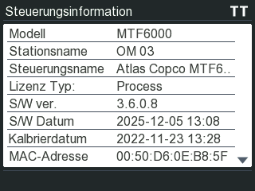
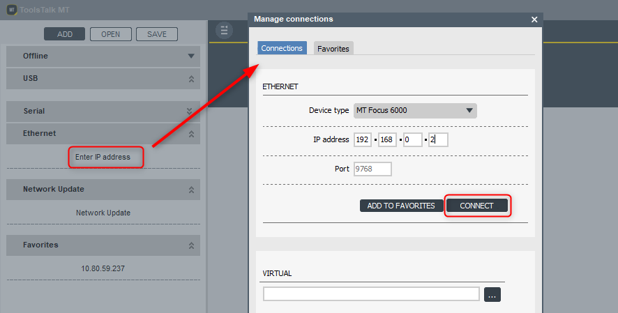
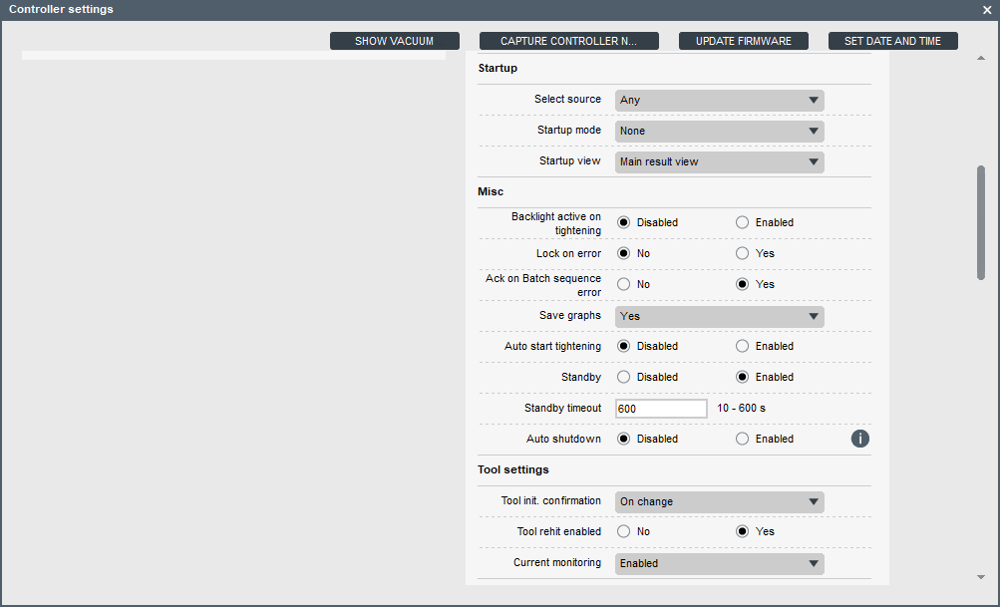
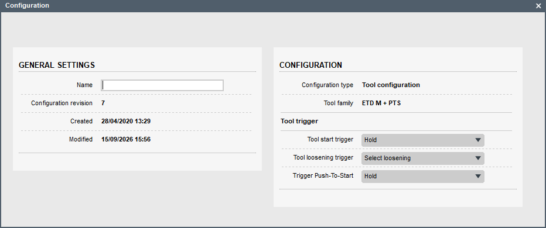

# Atlas Copco MicroTorque tools


The [Atlas Copco MicroTorque tools](https://www.atlascopco.com/en-us/itba/expert-hub/product-training/microtorque) and [MT Focus 6000 Controller](https://www.atlascopco.com/de-de/itba/products/assembly-solutions/electric-assembly-systems/mt-focus-6000-sku8432085100) deliver advanced tightening solutions for any low-torque application. Designed to meet the high standards of the modern electronics industry, these tools ensure precision and accuracy for every fastener—boosting both production efficiency and quality.

What sets MicroTorque apart is its innovative tightening strategy, which focuses on actual clamp torque rather than the traditional torque and angle method. This approach excels in environments with inconsistent production materials, ensuring consistent clamp force. The result? Enhanced product quality, increased productivity, and reduced production costs.

They use the [OpenProtocol](./README.md) communication protocol to communicate with the heOGS software. They also support traceability data and curve output through OpenProtocol.

<!--  -->

:::danger

Be careful when switching on the power supply of the tool/controller. By default the tool runs an automatic calibration cycle on powerup which makes the tools output drive rotate.

Before powering up the tool/controller make sure, that the tool can run freely!

:::

## Prerequisites and Notes

:::warning

The controller must be upgrade to a minimum firmware version of `V3.6.0.8`. Older firmware versions do not support blocking loosening over OpenProtocol! 

:::

The following versions are required:

- MT FOCUS 6000 Controller: V3.6.0.8
- ToolsTalk MT 9.6.1.0 (or any other version compatible with the MT FOCUS 6000 Controller firmware)

The current firmware version of the MT Focus 6000 controller (V3.6.0.8) still has some limitations in its OpenProtocol implementation:

- Data output over MID0061 sometimes does not send a result, even though the tool was started. While this is not generally an issue, it does increment the batch counter in this case, leading to blocking the tool without the integrator being noticed. This reproducibly happens in V3.6.0.8, if the start button is pushed for a short time. OGS works around this bug by monitoring the BUSY signals falling edge - in case no MID0061 result is received within the time window specified in station.ini, the batch counter is reset. In this case, it is assumed, that the tool did not create any relevant torque, so a retry is allowed (heuristics for the "play at start button" case).
- Loosening runs do not send any result over MID0061. OGS works around this issue by waiting for the falling edge of BUSY and internally resetting the bolts tightened state if the falling edge is detected for a loosening run.  

## Installation and configuration

### OGS project configuration

For generic information about how to configure OGS with OpenProtocol tools, see [OpenProtocol documentation](./README.md).

### Tool registration and configuration

Before using the MicroTorque tools, ensure that the `heMTF6000.dll` module is enabled in the `[TOOL_DLL]` section of the `station.ini` configuration file.
``` ini
[TOOL_DLL]
heMTF6000.dll=1
```

The MicroTorque controllers are identified by specifying the tool type `MTC` in the `[OPENPROTO]` section of `station.ini`. 

A typical configuration of the `[OPENPROTO]` section looks like the following (assuming the MT Focus 6000 controller is used as tool #1 (Channel 01)):

``` ini
[OPENPROTO]
; Channel/Tool 1 parameters
CHANNEL_01=10.10.2.184
CHANNEL_01_PORT=4545
CHANNEL_01_TYPE=MTF
; Define the time (in milliseconds, default = 500) to
; wait for a MID0061 result after falling edge of BUSY 
; (workaround for MTF firmware issue)
CHANNEL_01_WAIT_FOR_RESULT=500
; Force CCW switch selection for rework/loosen
CHANNEL_01_CCW_ACK=1
; Enable cyclic enable check
CHANNEL_01_CHECK_EXT_COND=1
; To enable curve transmission, set to 1:
; NOTE: requires a license!
CHANNEL_01_CURVE_REQUEST=0
; Enable time synchronization 
CHANNEL_01_CHECK_TIME_ENABLED=1
```

The typical parameters are (for more details about the possible parameters, see [OpenProtocol documentation](../README.md)):

- `CHANNEL_<channel>`: Define the IP address used to communicate with the tool.
- `CHANNEL_<channel>_TYPE`: Defines the OpenProtocol communication variant, **must** be set to `MTC`.
- `CHANNEL_<channel>_PORT`: (optional) Define the TCP port number used for OpenProtocol (typically 4545, default is 4545 if not set globally to another default port).
- `CHANNEL_<channel>_CCW_ACK`: (optional) If set to a nonzero value, then the CCWSel switch is monitored for
the correct position - i.e. if OGS expects loosen, the switch must be set to the CCW position.
- `CHANNEL_<channel>_WAIT_FOR_RESULT`: (optional, default=500) Set the timeout for waiting for a valid MID0061 result from the tool (in Milliseconds). If not configured, uses 500ms - this is relevant to workaround firmware issues in the tool, where the tool does not send a result even though the tool was started (for short starts in clockwise and generally in loosen). Can be decreased, if the default waiting time for loosen is too high (or better contact your tool vendor for a fixed firmware).
- `CHANNEL_<channel>_CURVE_REQUEST`: Set to 1 to enable curve transmission over OpenProtocol, set to 0 to disable. Set to 1, if you need the curve data in OGS (e.g. for display or dynamic curve analysis with LUA scripting). Disable (set to zero), if you don't need it (for performance reasons or if you don't have a license). See also [tool data output](#tool-data-output-tool-data-http-output) for additional configuration.
- `CHANNEL_<channel>_CHECK_TIME_ENABLED`: (recommended) If set to a nonzero value, then the tools internal time is synchronized with the OGS date and time.

:::info

To make OGS control loosening and tightening correctly, the following requirements must be met:

- Set the controllers `Tool loosening trigger` to `Select loosening` mode (see [controller setting](#controller-settings))
- In the workflow editor, set the MTF tools loosening program to empty (or 99).
- In `station.ini` set the `CHANNEL_<xx>_CHECK_EXT_COND=1` to enable monitoring the loosen switch.

:::

### Tool data output {#tool-data-http-output}

Like other tools, the `MT Focus 6000` tools can use the OGS buit-in connectivity options to send out data and curves (`Traceability` data) to backend data management systems (like [ToolsNet](https://www.atlascopco.com/en-us/itba/products/assembly-solutions/software-solutions/toolsnet-8-sku4531), [CSP I-P.M.](https://www.csp-sw.com/quality-management-software-solutions/error-prevention-with-ipm/), [Sciemetric QualityWorX](https://www.sciemetric.com/data-intelligence/qualityworx-data-collection), [QualityR](https://www.haller-erne.de/qualityr-web/), etc.). 

To understand the system architecture and details on how to use data output in general, please see [OGS Traceability](../../dataoutput/traceability.md). To setup `Traceability` for `MT Focus 6000` tools, enable it as shown below and add the tools channel to the list of channels in the `[FTP_CLIENT]` (or `[HTTP_CLIENT]`) section.

Here is a sample setup:

```ini
[FTP_CLIENT]
Enabled=1
;... 
; (more settings)
;...
; Parameters for each channel:
CHANNEL_01_INFO={ "ChannelName": "WS010|AC_MTF6000_1", "location name": ["Tool", "Line 2", "WS010", "default", "", "", ""] }
```

The following parameters are **required** for the `MT Focus 6000` tools, as the tool does not provide them through its interface:

- `ChannelName`: Defines the station and channel name seperated by a pipe symbol (`<station>|<channel>`).
- `location name`: Defines the location name values to use. Note that this setting depends on the Sys3xxGateway settings for processing the tightening results. Make sure to add the relevant information (like data link name, building, line name, etc.), so the tool can be registered in the correct organizational unit.

## Tool and controller configuration

### Controller firmware version

The officially supported and tested firmware version for the `MT Focus 6000` controller is as follows:



Things to check here:

- MT Focus 6000 controller firmware version (S/W ver.) `3.6.0.8`
- ToolsTalk MT `9.6.1.0` (or other compatibe versions)

Please contact [Atlas Copco](https://www.atlascopco.com) for information about current firmware versions - it is recommended to use up-to-date firmware for compatibility, performance and security!

### Using ToolsTak MT

See [MT Focus 6000 online manual](https://picontent.atlascopco.com/cont/external/dir/20/1181269515_A0580001_html5_external/index.html) and the [Tools Talk MT online Manual](https://picontent.atlascopco.com/cont/external/dir/4e/1275008523__html5_external/index.html) for details about how to configure the tightening controller and enable OpenProtocol.

To configure the controller and tool, connect it to the Eternet network (or using a USB cable) and run ToolsTalk MT. In the connection pane, select one of favorites or create a new conntection by double-clicking one of the entries in the pane. Here is a sample for Ethernet: 



### Controller settings

To open the controller settings, use `ToolsTalk MT` and open the `Controller settings` view by clicking the main symbol bars controller settings icon:


This will then open the `Controller settings` view. Scroll down to the `Startup`, `Misc` and `Tool settings` sections and configure as follows.  



Important settings are:

- `Startup: Select source`: set to `Any` or `OpenProtocol only` to allow OGS to control the tool over OpenProtocol.

### Tool trigger configuration

It is **very important** to configure the tool trigger parameters correctly. To do so, use `ToolsTalk MT` and open the `Configurations` view by clicking the main symbol bars configuration icon:


This will then open the `Configurations` view, where you can open the tools `Configuration` (double-click a line).  



The settings are:

- `Tool loosening trigger`: **must** be set to `Select loosening`. This makes the loosening slider on the tool act as a selector between tightening and loosening. With this setting, the tool only starts loosening, if the loosening slider is moved to the loosen position **and** one of the start switches (trigger or push-to-start) is activated.
- `Tool start trigger` and `Trigger Push-To-Start`: setup as needed, preferred mode is `Hold` (which stops the tool, if the trigger is released).

<!--
## Nexo 1: Wifi notes

- Nexo 1 has issues, if roaming is enabled. Make sure to disable the "roaming" setting in the wifi configuration.
- Nexo 1 by default uses the insecure TKIP encryption for WPA2-PSK, make sure to switch to AES mode instead.
-->
