Haller + Erne GmbH

# Software-Lizensierung

Hinweise zur Lizensierung von Haller & Erne Softwareprodukten

# **Dokumentenversionen**

R01 2017-01-10 he Erste Version als eigenständiges Dokument R02 2017-11-17 Rb Kostenlose Trial Version hinzugefügt

# **Inhalt**

| 1 Übersicht......................................................................................................................................................... |                                                                                                                                                                 | 1 |
|----------------------------------------------------------------------------------------------------------------------------------------------------------------------|-----------------------------------------------------------------------------------------------------------------------------------------------------------------|---|
| 1.1                                                                                                                                                                  | Lizenztypen                                                                                                                                                     | 1 |
| 1.1.1                                                                                                                                                                | Vollversionen.................................................................................................................................................. | 1 |
| 1.1.2                                                                                                                                                                | Testversionen.................................................................................................................................................  | 1 |
| 1.1.3                                                                                                                                                                | Ohne Lizenzschlüssel......................................................................................................................................      | 1 |
| 2 Details                                                                                                                                                            |                                                                                                                                                                 | 2 |
| 2.1                                                                                                                                                                  | Kostenlose Evaluationslizenz anfordern                                                                                                                          | 2 |
| 2.2                                                                                                                                                                  | Aktivierung der Evaluationslizenz...........................................................................................................................    | 3 |
| 2.3                                                                                                                                                                  | Kostenpflichtige Lizenz anfordern...........................................................................................................................    | 4 |
| 2.4                                                                                                                                                                  | Aktivierung der vollen Lizenz.................................................................................................................................. | 4 |
| 3 Häufig gestellte Fragen (FAQ)                                                                                                                                      |                                                                                                                                                                 | 6 |
| 3.1                                                                                                                                                                  | Lizenz auf einen anderen Computer übertragen                                                                                                                    | 6 |
| 3.2                                                                                                                                                                  | Lizenz auf eine andere Software übertragen..........................................................................................................            | 6 |
| 3.3                                                                                                                                                                  | Abspeichern & Wiederherstellen der Lizenz...........................................................................................................            | 6 |
| 3.4                                                                                                                                                                  | Geänderter Computername....................................................................................................................................     | 6 |
| 3.5                                                                                                                                                                  | Geänderte Lizenzparameter                                                                                                                                       | 6 |

# **1 Übersicht**

#### **1.1 Lizenztypen**

#### **1.1.1** Vollversionen

Um die Software zu benutzen und den vollen Funktionsumfang der Lizenz entsprechend freizuschalten, muss zunächst die vollständige Aktivierung durchgeführt werden.

#### **1.1.2** Testversionen

Zur Verwendung der 30-Tage-Testversionen muss selbstverständlich keine Lizenz erworben werden. Es muss dennoch ein Lizenzschlüssel für die Aktivierung angefordert werden, sonst kann der volle Funktionsumfang nicht getestet werden.

#### **1.1.3** Ohne Lizenzschlüssel

Die Software kann auch ohne Lizenzschlüssel verwendet werden, jedoch mit eingeschränkter Funktionalität. Manche Programme stellen z.B. die Funktionalität dann nach einer gewissen Anzahl von Schraubvorgängen ein.

# **2 Details**

*Anmerkung*: Durch die Aktivierung werden die Lizenz und die Seriennummer der Software an den Computernamen gebunden. Jeder Lizenzschlüssel gilt nur für einen PC. Falls ein PC ausgetauscht werden muss (z.B. wegen einem Hardwaredefekt), kann die Software ohne erneute Aktivierung weiter benutzt werden, solang der Computername gleich bleibt (wie z.B. bei der Wiederherstellung aus einem Image/Backup). Wenn die Software jedoch auf ein komplett neues System mit einem anderen Computernamen installiert wird, muss sie auch wieder neu aktiviert werden.

Um die Software zu benutzen und den vollen Funktionsumfang der erworbenen Lizenz entsprechend freizuschalten, muss zunächst die Aktivierung durchgeführt werden.

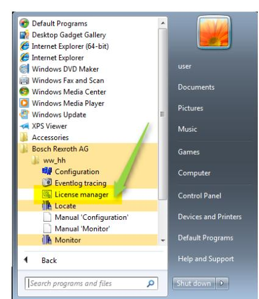

### **2.1 Kostenlose Evaluationslizenz anfordern**

Nach der Installation läuft die Software standardmäßig im Demo Modus. Um sie zu aktivieren starten Sie bitte den Licensing Manager aus dem Startmenü (Standardpfad):

Start Alle Programme Bosch Rexroth AG ww\_hh License manager

Der Licensing Manager sieht so aus:

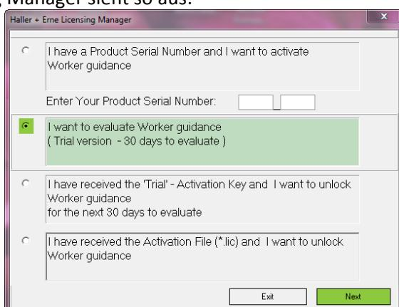

Wählen Sie die zweite Option aus und geben Sie die Seriennummer ein, die Sie entweder auf der CD oder der Bestellbestätigung finden.

Auf der nächsten Seite geben Sie bitte Ihre Kontaktinformationen ein und drücken Sie auf den Knopf "Generate Registration Code" in der Mitte des Fensters:

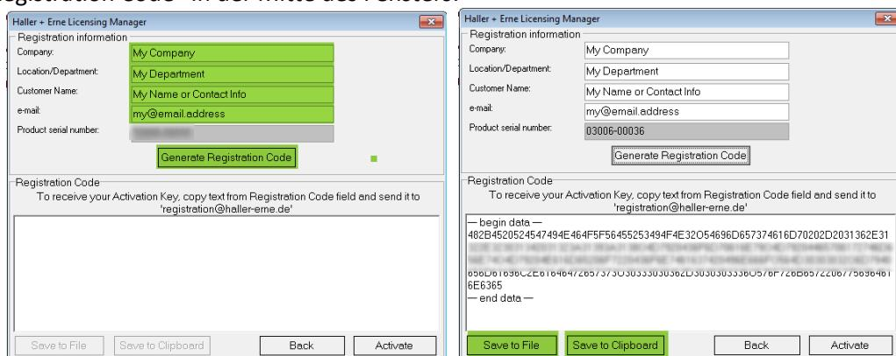

Nun erstellt das Programm einen "Registration Code", welcher mit dem Knopf "Save to Clipboard" oder per copy & paste in eine E-Mail kopiert und entweder an [contact@haller-erne.de](mailto:contact@haller-erne.de) oder an [activation@haller](mailto:activation@haller-erne.de)[erne.de](mailto:activation@haller-erne.de) geschickt werden muss. Damit wird basierend auf Ihren eingegebenen Daten und der Seriennummer der Software ein Aktivierungsschlüssel erstellt, den wir Ihnen per E-Mail zuschicken.

Sie können den Licensing Manager vorerst schließen, da er erst wieder benötigt wird um die endgültige Freischaltung mit dem Aktivierungsschlüssel durchzuführen. Dieser Schritt wird im nächsten Kapitel erklärt.

#### **2.2 Aktivierung der Evaluationslizenz**

Wenn Sie ihren Aktivierungsschlüssel erhalten haben, können Sie den Licensing Manager erneut starten, um die Unbegrenzte Nutzung der Software der erworbenen Lizenz entsprechend freizuschalten.

Um die Software zu aktivieren starten Sie bitte den Licensing Manager aus dem Startmenü (Standardpfad):

Start Bosch Rexroth AG ww\_hh License manager

Dadurch gelangen Sie wieder in den Hauptbildschirm des License managers:

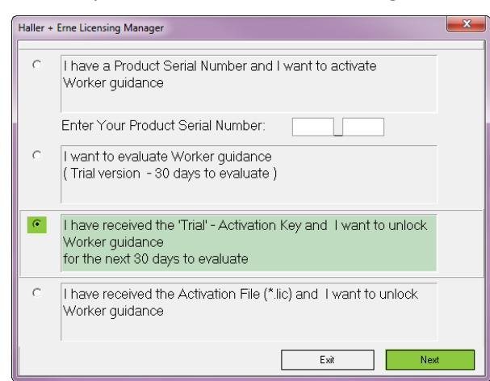

Wählen Sie nun wie oben gezeigt die vierte Option aus und drücken Sie auf "Next", um den Aktivierungsschlüssel einzugeben

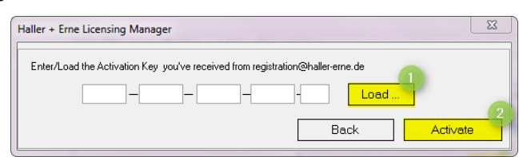

In dieser Ansicht können Sie den Aktivierungsschlüssel, den Sie von uns erhalten haben mit dem Knopf "Load" (❶) laden oder von Hand eingeben. Mit dem Knopf "Activate" (❷) wird der Aktivierungsvorgang abgeschlossen.

#### **2.3 Kostenpflichtige Lizenz anfordern**

Nach der Installation läuft die Software standardmäßig im Demo Modus.

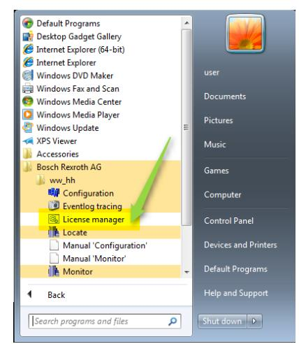

Um sie zu aktivieren starten Sie bitte den Licensing Manager aus dem Startmenü (Standardpfad):

Start Alle Programme Bosch Rexroth AG ww\_hh License manager

Der Licensing Manager sieht so aus:

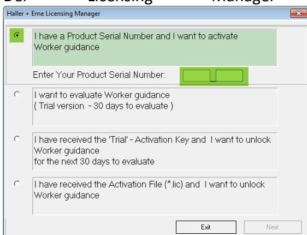

Wählen Sie die erste Option aus und geben Sie die Seriennummer ein, die Sie entweder auf der CD oder der Bestellbestätigung finden.

Auf der nächsten Seite geben Sie bitte Ihre Kontaktinformationen ein und drücken Sie auf den Knopf "Generate Registration Code" in der Mitte des Fensters:

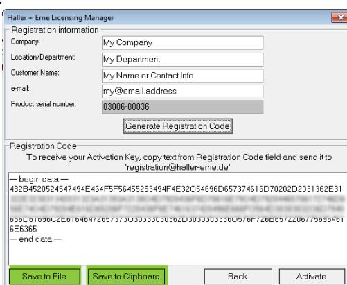

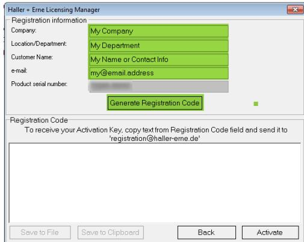

Nun erstellt das Programm einen "Registration Code", welcher mit dem Knopf "Save to Clipboard" oder per copy & paste in eine E-Mail kopiert und entweder an [contact@haller-erne.de](mailto:contact@haller-erne.de) oder an [activation@haller](mailto:activation@haller-erne.de)[erne.de](mailto:activation@haller-erne.de) geschickt werden muss. Damit wird basierend auf Ihren eingegebenen Daten und der Seriennummer der Software eine Lizenzdatei erstellt, den wir Ihnen per E-Mail zuschicken.

Sie können den Licensing Manager vorerst schließen, da er erst wieder benötigt wird um die endgültige Freischaltung mit der Lizenzdatei durchzuführen. Dieser Schritt wird im nächsten Kapitel erklärt.

### **2.4 Aktivierung der vollen Lizenz**

Wenn Sie ihre Lizenzdatei erhalten haben, können Sie den Licensing Manager erneut starten, um die Unbegrenzte Nutzung der Software der erworbenen Lizenz entsprechend freizuschalten.

Um die Software zu aktivieren starten Sie bitte den Licensing Manager aus dem Startmenü (Standardpfad):

Start Bosch Rexroth AG ww\_hh License manager

Dadurch gelangen Sie wieder in den Hauptbildschirm des License managers:

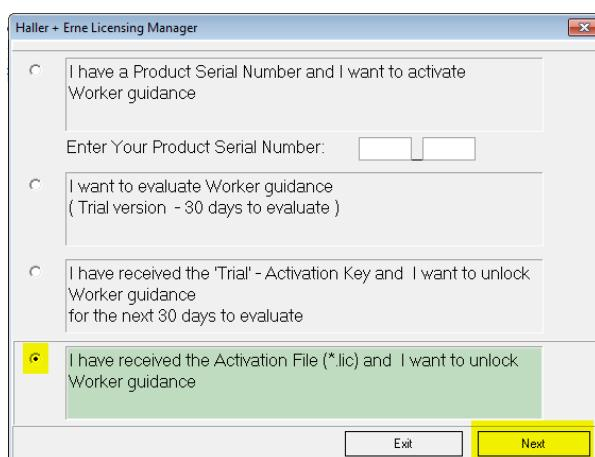

Wählen Sie nun wie oben gezeigt die vierte Option aus und drücken Sie auf "Next", um den Dateipfad für Ihre Lizenzdatei auszuwählen.

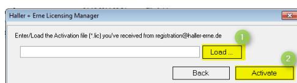

In dieser Ansicht können Sie die Lizenzdatei (\*.lic), die Sie von uns per E-Mail erhalten haben mit dem Knopf "Load" (❶) laden und mit dem Knopf "Activate" (❷) die den Aktivierungsvorgang abschliessen.

*Achtung:* Ein Neustart des Programms ist erforderlich, damit die Aktivierung funktioniert. Beenden Sie also die Anwendung und starten sie neu oder fahren Sie ihren PC runter und Starten Sie ihn neu.

# **3 Häufig gestellte Fragen (FAQ)**

#### **3.1 Lizenz auf einen anderen Computer übertragen**

Das Übertragen der Lizenz von einem Computer auf den anderen ist nur möglich, wenn der Computername derselbe bleibt. Falls der alte Computername nicht wiederverwendet wird, ist das Übertragen der Lizenz nicht ohne weiteres möglich. Bitte setzen Sie sich in diesem Fall mit dem Hersteller in Verbindung.

#### **3.2 Lizenz auf eine andere Software übertragen**

Das Übertragen der Lizenz von einem Programm auf ein anderes ist nicht möglich.

### **3.3 Abspeichern & Wiederherstellen der Lizenz**

Grundsätzlich kann die Lizenzdatei abgespeichert werden und (z.B. nach dem Formatieren oder Austauschen der Festplatten) wiederverwendet werden. Man muss jedoch denselben Computernamen wie vorher wählen.

#### **3.4 Geänderter Computername**

Wenn der Computername nicht derselbe ist, wie der, für den die Lizenz erworben wurde, muss eine neue Lizenz angefordert werden. Bitte setzen Sie sich hierfür mit dem Hersteller in Verbindung.

### **3.5 Geänderte Lizenzparameter**

Wenn sich Ihre Infrastruktur geändert hat, sodass z.B. mehr Schraubkanäle oder Spindeln vorhanden sind, als die erworbene Lizenz erlaubt, muss eine neue Lizenz angefordert werden.