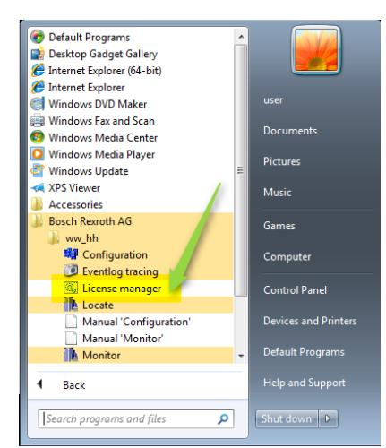
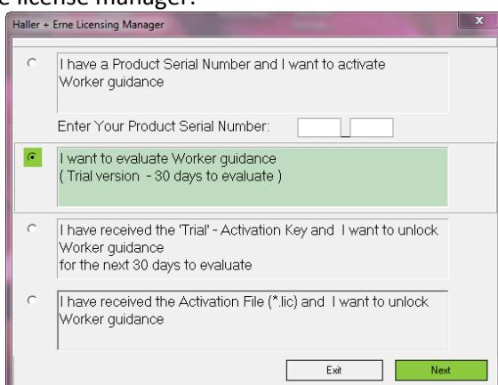
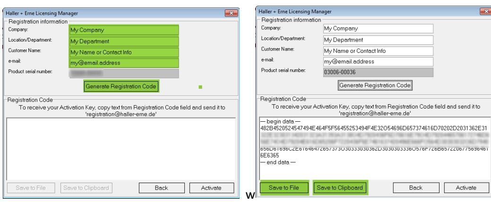
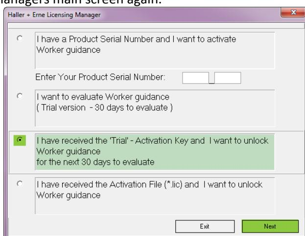
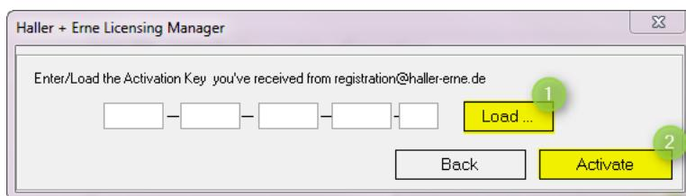
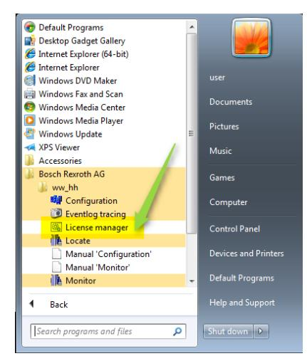
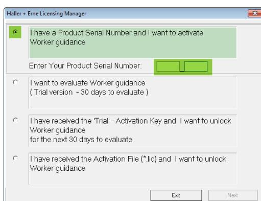
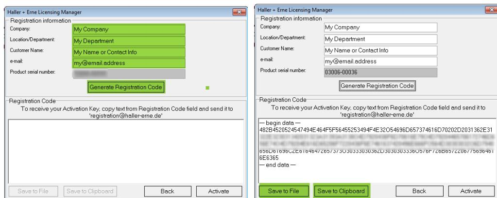
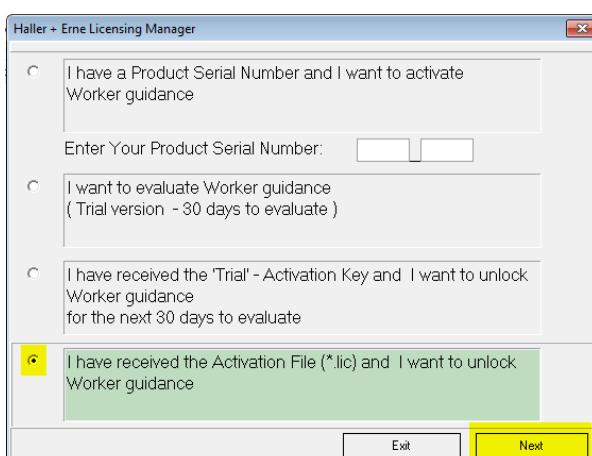
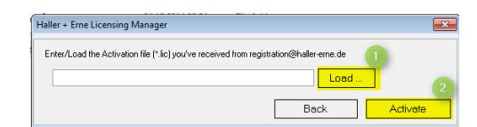

Haller + Erne GmbH

# Licensing Guide

Guide to licensing Haller & Erne software products

## **Document revisions**

R01 2017-03-23 rb Initial revision (english) R02 2017-11-17 Rb Added trial version (english)

## **Content**

| 1 Overview                                                                                                                                           |                                                                                                                                                                   | 1 |
|------------------------------------------------------------------------------------------------------------------------------------------------------|-------------------------------------------------------------------------------------------------------------------------------------------------------------------|---|
| 1.1                                                                                                                                                  | Types of licenses                                                                                                                                                 | 1 |
| 1.1.1                                                                                                                                                | Full version                                                                                                                                                      | 1 |
| 1.1.2                                                                                                                                                | Trial version.................................................................................................................................................... | 1 |
| 1.1.3                                                                                                                                                | Without Key....................................................................................................................................................   | 1 |
| 2 Details                                                                                                                                            |                                                                                                                                                                   | 2 |
| 2.1                                                                                                                                                  | Request a trial license                                                                                                                                           | 2 |
| 2.2                                                                                                                                                  | Activate the software with a trial license................................................................................................................        | 3 |
| 2.3                                                                                                                                                  | Request a full license                                                                                                                                            | 3 |
| 2.4                                                                                                                                                  | Activate the software with a full license.................................................................................................................        | 4 |
| 3 Frequently asked questions (FAQ).................................................................................................................. |                                                                                                                                                                   | 6 |
| 3.1                                                                                                                                                  | Transfer the license to another computer..............................................................................................................            | 6 |
| 3.2                                                                                                                                                  | Transfer the license to another software                                                                                                                          | 6 |
| 3.3                                                                                                                                                  | Save & restore the license                                                                                                                                        | 6 |
| 3.4                                                                                                                                                  | Changed computer name........................................................................................................................................     | 6 |
| 3.5                                                                                                                                                  | Changed license parameters...................................................................................................................................     | 6 |

## **1 Overview**

## **1.1 Types of licenses**

#### **1.1.1** Full version

For full access to the functions of the software according to the acquired license, the full licensing process and activation has to be completed using the previously acquired key.

#### **1.1.2** Trial version

For full access to the functions of the software according to the trial license conditions (30 days trial), the full licensing process and activation has to be completed using the previously requested free key.

#### **1.1.3** Without Key

The software can be used without any license key, but with limited functionality. E.g. some programs stop working after a certain amount of tightening procedures.

# **2 Details**

Use of the software requires activation to enable all functions according to the purchased license.

*Note*: The software activation binds the software license and the software serial number to the computer name. An activation key is only valid for one computer. When replacing a computer (e.g. in case of a hardware defect), the software can be used without re-activation in case the computer name stays the same (as e.g. with an image backup/restore). Installing the software on a new system with a different computer name requires re-activation.

## **2.1 Request a trial license**

After installation, the software runs in demo mode by default.

To activate the software, please start the software license manager from the start menu (default path):

Start All Programs Bosch Rexroth AG ww\_hh License manager

This starts the license manager:

Check the second entry to request a trial license.

In the following page, enter your license contact details and click the "Generate Registration Code" button in the middle:

Then use the "Save to Clipboard" button or copy & paste the "Registration Code". Put the text into an email and send it to [contact@haller-erne.de](mailto:contact@haller-erne.de) or [activation@haller-erne.de](mailto:activation@haller-erne.de) to request an activation key based on the licensing information and serial number of the software. Your activation key will be emailed to you. Close the license manager for now – the software license is not yet activated, but it requires starting the license manager again to finally unlock licensed mode. Please see the next chapter on how to proceed.

#### **2.2 Activate the software with a trial license**

After you have received the activation key, start the license manager again to activate the software for unlimited use according to your purchased license.

To activate the software, please start the license manager from the start menu (default path):

Start Bosch Rexroth AG Operator Guidance System License manager

This will bring up the license managers main screen again.

Now select the third option and click next (as shown above) to enter the activation key:

In this screen, you can load (❶) the activation key you received from us or enter it by hand. Click the "Activate" button (❷) to finalize the activation process.

*Note*: Restarting the software is required for the activation to become active. So either close and restart the application or reboot your computer.

### **2.3 Request a full license**

After installation, the software runs in demo mode by default.

To activate the software, please start the software license manager from the start menu (default path):

Start All Programs Bosch Rexroth AG ww\_hh License manager

This starts the license manager:

Check the first entry and enter your product serial number (from the CD cover or the purchase order receipt). Then click "Next".

In the following page, enter your license contact details and click the "Generate Registration Code" button in the middle:

Then use the "Save to Clipboard" button or copy & paste the "Registration Code". Put the text into an email and send it to [contact@haller-erne.de](mailto:contact@haller-erne.de) or [activation@haller-erne.de](mailto:activation@haller-erne.de) to request a license file based on the licensing information and serial number of the software. Your license file will be emailed to you.

Close the license manager for now – the software license is not yet activated, but it requires starting the license manager again to finally unlock licensed mode. Please see the next chapter on how to proceed.

## **2.4 Activate the software with a full license**

After you have received the activation key, start the license manager again to activate the software for unlimited use according to your purchased license.

To activate the software, please start the license manager from the start menu (default path):

Start Bosch Rexroth AG Operator Guidance System License manager

This will bring up the license managers main screen again.

Now select the fourth option and click next (as shown above) to choose correct the licensing file:

In this screen, you can load (❶) the activation file (\*.lic) you received from us by email and click the "Activate" button (❷) to finalize the activation process.

*Note*: Restarting the software is required for the activation to become active. So either close and restart the application or reboot your computer.

## **3 Frequently asked questions (FAQ)**

## **3.1 Transfer the license to another computer**

Transferring the license from one computer to another is only possible, if the computer name stays the same. If the old computer name is not re-used, transferring the license is not possible. In that case, please contact the manufacturer.

### **3.2 Transfer the license to another software**

Transferring the license from one program to another is not possible.

## **3.3 Save & restore the license**

The license file can be saved and re-used (e.g. when formatting or replacing a hard drive). The computer name has to stay the same as before.

#### **3.4 Changed computer name**

If the computer name differs from the one for which you acquired the license, that license is no longer working. Please contact the manufacturer in that case and get a new license.

## **3.5 Changed license parameters**

If your infrastructure has changed, so for example you are using more tools or stations as the acquired license allows, a new license needs to be acquired.