Haller + Erne GmbH

# ww\_hh - Installation und Konfiguration

ww\_hh operator guidance system, Dokumentenversion R05

# **Dokumentenversionen**

R01 2014-08-14 he Initial revision (english) R02 2015-02-06 ic Syncrhonized to new software release R03 2015-02-09 he Released R03 R04 2015-04-02 rb Released R04 R05 2016-06-22 ic Released R05

# **Content**

| 1     | Software Overview..........................................................................................................................................                | 1                                                                                                                                                  |
|-------|----------------------------------------------------------------------------------------------------------------------------------------------------------------------------|----------------------------------------------------------------------------------------------------------------------------------------------------|
| 1.1   | Übersicht................................................................................................................................................................. | 1                                                                                                                                                  |
| 1.2   | Features                                                                                                                                                                   | 1                                                                                                                                                  |
| 2     | Installation                                                                                                                                                               | 2                                                                                                                                                  |
| 2.1   | Installation der ww_hh-Software............................................................................................................................                | 2                                                                                                                                                  |
| 2.1.1 | Entpacken.......................................................................................................................................................           | 2                                                                                                                                                  |
| 2.1.2 | Ausführen des Installationsprogramms                                                                                                                                       | 2                                                                                                                                                  |
| 2.2   | Aktivierung der Software                                                                                                                                                   | 4                                                                                                                                                  |
| 2.2.1 | Den Lizenzschlüssel anfordern                                                                                                                                              | 4                                                                                                                                                  |
| 2.2.2 | Aktivierung der Software                                                                                                                                                   | 5                                                                                                                                                  |
| 2.2.3 | Ordnerstruktur...............................................................................................................................................              | 6                                                                                                                                                  |
| 3     | Konfiguration                                                                                                                                                              | 7                                                                                                                                                  |
| 3.1   | Konfiguration der Arbeitsstationen                                                                                                                                         | 7                                                                                                                                                  |
| 3.2   | Konfiguration der Benutzeroberfläche                                                                                                                                       | 7                                                                                                                                                  |
| 3.3   | Baugruppen und Arbeitsabläufe einrichten............................................................................................................                       | 7                                                                                                                                                  |
| 4     | Beispielkonfiguration Schritt für                                                                                                                                          | Schritt.......................................................................................................... 8                                |
| 4.1   | Übersicht................................................................................................................................................................. | 8                                                                                                                                                  |
| 4.2   | Voraussetzungen.....................................................................................................................................................       | 8                                                                                                                                                  |
| 4.3   | Nexo Konfigurieren                                                                                                                                                         | 8                                                                                                                                                  |
| 4.3.1 | Open Protocol aktivieren                                                                                                                                                   | 9                                                                                                                                                  |
| 4.3.2 | OK/NOK-Zähler zurücksetzen.........................................................................................................................                        | 9                                                                                                                                                  |
| 4.3.3 | Das SPS-Signalmapping einrichten                                                                                                                                           | 9                                                                                                                                                  |
| 4.3.4 | Schraubprogramme einrichten                                                                                                                                                | 10                                                                                                                                                 |
| 4.4   | Station Einrichten..................................................................................................................................................       | 10                                                                                                                                                 |
| 4.4.1 | Station Einrichten.........................................................................................................................................                | 10                                                                                                                                                 |
| 4.4.2 | Kundenspezifische Begriffe                                                                                                                                                 | 11                                                                                                                                                 |
| 4.5   | Baugruppen und Arbeitsabläufe einrichten..........................................................................................................                         | 12                                                                                                                                                 |
| 4.5.1 | Tool definition                                                                                                                                                            | 13                                                                                                                                                 |
| 4.5.2 | Jobablauf                                                                                                                                                                  | einrichten..................................................................................................................................... 14 |
| 4.5.3 | Abläufe von Modellfamilien einstellen                                                                                                                                      | 17                                                                                                                                                 |
| 4.5.4 | Die Konfiguration importieren                                                                                                                                              | 19                                                                                                                                                 |
| 5     | Funktionsprüfung..........................................................................................................................................21               |                                                                                                                                                    |
| 5.1.1 | OK Verschraubung........................................................................................................................................                   | 23                                                                                                                                                 |
| 5.1.2 | Fehler beim Durchlauf..................................................................................................................................                    | 27                                                                                                                                                 |
| 5.2   | Jobergebnisse durchsuchen, exportieren und ausdrucken                                                                                                                      | 28                                                                                                                                                 |
| 5.2.1 | Ergebnisse nach Job sortiert.........................................................................................................................                      | 28                                                                                                                                                 |
| 5.2.2 | Ergebnisse ungruppiert                                                                                                                                                     | 29                                                                                                                                                 |
| 6     | Troubleshooting............................................................................................................................................30              |                                                                                                                                                    |
| 7     | Referenzen....................................................................................................................................................31           |                                                                                                                                                    |
| 7.1.1 | Speicherorte                                                                                                                                                               | der Konfigurationsdateien...................................................................................................... 31                 |
| 7.1.2 | Die                                                                                                                                                                        | Stationskonfigurationsdatei................................................................................................................... 31  |

# **1 Software Overview**

# **1.1 Übersicht**

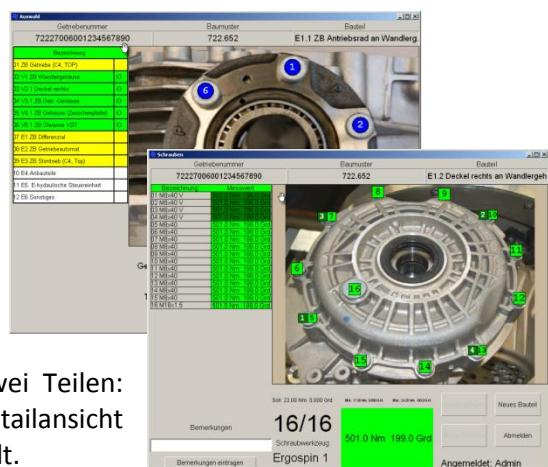

Die ww\_hh Software ist eine Komplettlösung zur Führung eines Arbeiters durch die nötigen Arbeitsschritte beim Zusammenbau von Bauteilen in der Bandfertigung. Der Hauptaspekt der Software ist der kontrollierte Drehmomentanzug, aber es werden auch andere Operationen wie Scannen oder Schraubfreigaben unterstützt.

Die Software ist perfekt auf das Arbeitsumfeld abgestimmt und besteht aus zwei Teilen:

- Die "Laufzeit"-Applikation für den Einsatz in der Werkstatt. Das Interface für den Arbeiter ist übersichtlich und einfach gehalten und ist für den Einsatz auf kleinen Bildschirmen und Touchscreens ausgelegt. Im wesentlichen besteht sie aus zwei Teilen: einer Übersicht, in der man Jobs auswählen kann und eine Detailansicht für jeden Job, die Informationen über jede Schraubstelle enthält.
- Die "Konfigurator"-Applikation, in der man die Jobs, Arbeitsschritte, Abläufe und andere Parameter der eigentlichen Arbeitsvorgänge definieren kann. Sie ist für eine Desktopumgebung mit großem Bildschirm und Maus entwickelt und unterstützt z.B. drag & drop Operationen, um ihre Handhabung damit zu vereinfachen.

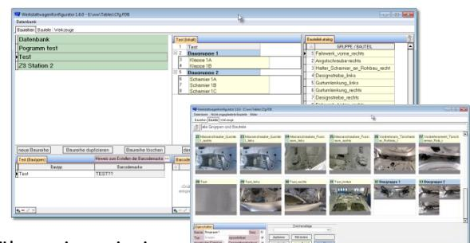

Die Applikationen können sowohl auf demselben PC, als auch auf zwei unterschiedlichen PCs (Werkstatt/Büro) installiert werden. Der Datenaustausch zwischen den Programmen erfolgt einfach über eine einzige Datei, die problemlos hin und her geschoben werden kann (und auch zur Versionierung oder als Backup verwendet werden kann).

# **1.2 Features**

Die Hauptmerkmale der Software sind:

- Unterstützt mehrere Drehmomentschlüssel: NEXO, ErgoSpin, Drehmomentschrauber, elektronische Drehmomentschlüssel (GWK)
- Bestätigung und Notizen von Hand sind möglich
- Vorgegebene oder freie Reihenfolge der Jobs, kann auch über den Barcode definiert werden
- Bearbeitung von Bauteilen kann pausiert und wieder aufgenommen werden, um z.B. in der Zwischenzeit etwas anderes zu erledigen und dann an dem Bauteil weiter machen. Die Datenbank speichert den Status und Fortschritt von jedem einzelnen Teil
- Unterstützt Voranzug, Endanzug und Nacharbeiten an einer einzelnen Schraube
- Baugruppen und Jobs werden unabhängig voneinander definiert so können Sie die selben Jobs/Schraubstellen bei anderen Baugruppen einfach wiederverwenden
- Unterstützt zusätzliche I/Os, z.B. Stecknussköcher, Positionsgeber, … (über Ethernet/Profibus/USB)
- Die Datenstruktur erlaubt einfache Änderung der Arbeitsabläufe Änderungen der Arbeitsabläufe oder Jobs werden bezogen auf jedes produzierte Produkt gespeichert. Bei jedem Produkt ist die entsprechende Definition gespeichert, die gültig war, als das Teil produziert wurde
- Mögliche Ausgabedatenformate: SQL Database, Excel, Text, XML
- Detailansicht zum Darstellen und Suchen von einzelnen Schraubanzügen mit individuell nach Kundenwunsch konfigurierbaren Datensätzen
- Schraubdaten enthalten Drehmomentkurven (für BOSCH SYS310/350)

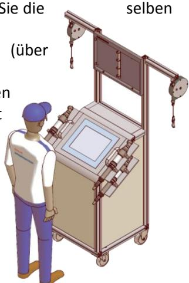

# **2 Installation**

Die folgenden Abschnitte beschreiben die einzelnen Schritte, die nötig sind, um die ww\_hh Software zu installieren.

Vor Starten der Installationsdatei:

- Überprüfen Sie unsere WEB-Seite auf neue Service Packs oder fixes für ww\_hh
- Überprüfen Sie die Versionshinweise auf Neuigkeiten
- Nehmen Sie Kontakt mit der IT-Abteilung auf, falls Sie weitere Hilfe benötigen

Bitte beachten Sie, dass es auch eine installationsfreie Version des Konfigurators gibt – diese ermöglicht den Betrieb der Software auf weiteren PCs, ohne dass Sie dafür Administratorberechtigung benötigen.

# **2.1 Installation der ww\_hh-Software**

#### **2.1.1 Entpacken**

Das Installationsprogramm für die ww\_hh-Software ist in einem .zip-Archiv enthalten. Das Archiv enthält die eigentliche .exe-Datei (ww\_hh-V1.x.x-setup.exe) sowie zusätzliche Dateien, die für die Installation benötigt werden. Wenn Sie das Archiv also entpacken, sollten Sie sicherstellen, dass die Ordnerstruktur des Archivs bestehen bleibt. Am besten entpackt man das Archiv in einem eigens dafür erstellten Ordner, welchen man nach Fertigstellung der Installation einfach löschen kann.

### **2.1.2 Ausführen des Installationsprogramms**

Die Installation der Software wird durch starten der Datei ww\_hh-V1.x.x-setup.exe gestartet. Nach der Ausführung der Datei führt das Installationsprogramm Sie Schritt für Schritt durch die Installation.

Der erste Schritt ist die Auswahl des Zielverzeichnisses (Installationsverzeichnis).

Achtung: Wegen der Virtualisierung des Dateisystems unter Windows 7 und Windows 8 ist es zwingend erforderlich, dass Sie das Programm **auf keinen Fall** im Standardverzeichnis für Programme von Windows (C:\Program files) installieren!

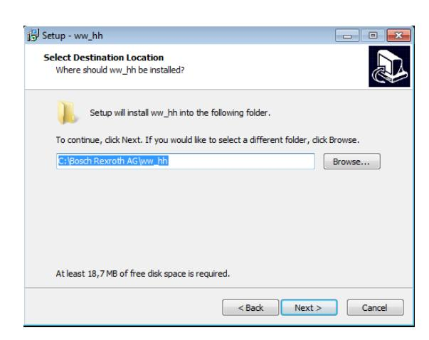

Nach der Auswahl des Zielpfades wird das Programm abfragen, welche Komponenten installiert werden sollen. Dafür bietet das Programm drei unterschiedliche Installionspakete:

- Operator PC Installation ("Komplettinstallation", inklusive der Laufzeitapplikation ("Monitor" und "Konfigurator")
- Desktop-/Büroinstallation (nur "Konfigurator").
- Minimalinstallation ("Monitor und Datenbankbrowser…").

Auf den PCs der Werker in der Produktionsumgebung empfehlen wir die "Komplettinstallation" (diese Installationsart ist auch die Standardauswahl im Setup Programm).

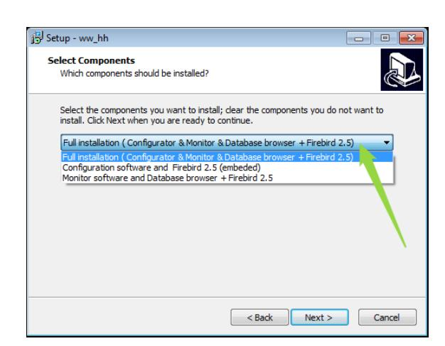

Auf der nächsten Seite können Sie aus diversen vorgefertigten Standardkonfigurationen auswählen, um Ihnen einen schnelleren und einfacheren Start zu ermöglichen. Wählen sie die Konfiguration aus, die Ihrer Arbeitsumgebung am ehesten entspricht:

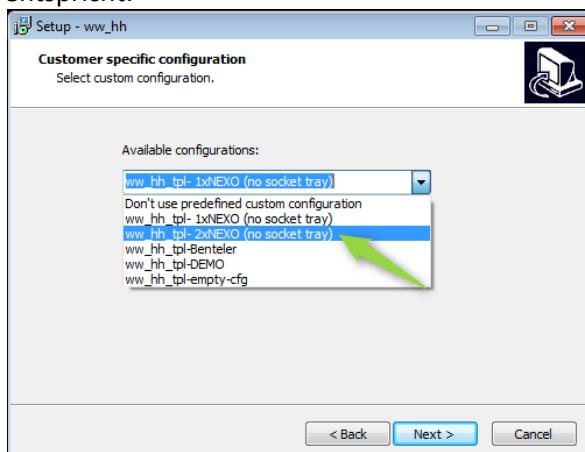

In der letzten Ansicht können Sie den Ordnernamen im Startmenü wählen und eine Verknüpfung auf dem Desktop hinzufügen. Folgen Sie einfach des Anweisungen des Installationsprogramm und ändern Sie diese Parameter nach Ihrem belieben.

In Kapitel 4 wird Beispielhaft die Einrichtung eines Arbeitsplatzes mit zwei Nexo Schraubern erklärt. Wählen Sie für diese Prozedur die hier links markierte Option.

### **2.2 Aktivierung der Software**

Um die Software zu benutzen und den vollen Funktionsumfang der erworbenen Lizenz entsprechend freizuschalten, muss zunächst die Aktivierung durchgeführt werden.

*Anmerkung*: Durch die Aktivierung werden die Lizenz und die Seriennummer der Software an den Computernamen gebunden. Jeder Lizenzschlüssel gilt nur für einen PC. Falls ein PC ausgetauscht werden muss (z.B. wegen einem Hardwaredefekt), kann die Software ohne erneute Aktivierung weiter benutzt werden, solang der Computername gleich bleibt (wie z.B. bei der Wiederherstellung aus einem Image/Backup). Wenn die Software jedoch auf ein komplett neues System mit einem anderen Computernamen installiert wird, muss sie auch wieder neu aktiviert werden.

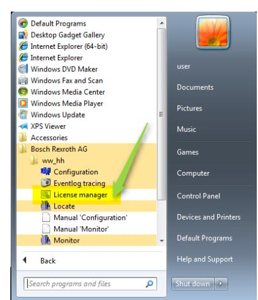

#### **2.2.1 Den Lizenzschlüssel anfordern**

Nach der Installation läuft die Software standardmäßig im Demo Modus.

Um sie zu aktivieren starten Sie bitte den Licensing Manager aus dem Startmenü (Standardpfad):

Start Alle Programme Bosch Rexroth AG ww\_hh License manager

Der Licensing Manager sieht so aus:

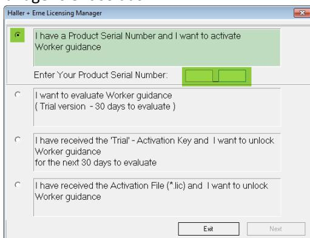

Wählen Sie die erste Option aus und geben Sie die Seriennummer ein, die Sie entweder auf der CD oder der Bestellbestätigung finden.

Auf der nächsten Seite geben Sie bitte Ihre Kontaktinformationen ein und drücken Sie auf den Knopf "Generate Registration Code" in der Mitte des Fensters:

Nun erstellt das Programm einen "Registration Code", welcher mit dem Knopf "Save to Clipboard" oder per copy & paste in eine E-Mail kopiert und entweder an [contact@haller-erne.de](mailto:contact@haller-erne.de) oder an [activation@haller](mailto:activation@haller-erne.de)[erne.de](mailto:activation@haller-erne.de) geschickt werden muss. Damit wird basierend auf Ihren eingegebenen Daten und der Seriennummer der Software ein Aktivierungsschlüssel erstellt, den wir Ihnen per E-Mail zuschicken.

Sie können den Licensing Manager vorerst schließen, da er erst wieder benötigt wird um die endgültige Freischaltung mit dem Aktivierungsschlüssel durchzuführen. Dieser Schritt wird im nächsten Kapitel erklärt.

#### **2.2.2 Aktivierung der Software**

Wenn Sie ihren Aktivierungsschlüssel erhalten haben, können Sie den Licensing Manager erneut starten, um die Unbegrenzte Nutzung der Software der erworbenen Lizenz entsprechend freizuschalten.

Um die Software zu aktivieren starten Sie bitte den Licensing Manager aus dem Startmenü (Standardpfad):

Start Bosch Rexroth AG ww\_hh License manager

Dadurch gelangen Sie wieder in den Hauptbildschirm des License managers:

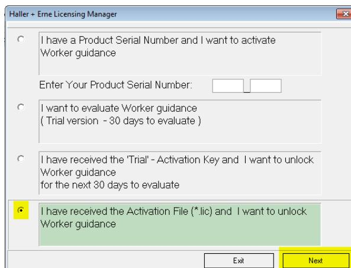

Wählen Sie nun wie oben gezeigt die vierte Option aus und drücken Sie auf "Next", um den Dateipfad für Ihre Lizenzdatei auszuwählen.

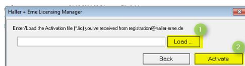

In dieser Ansicht können Sie die Lizenzdatei (\*.lic), die Sie von uns per E-Mail erhalten haben mit dem Knopf "Load" (❶) laden und mit dem Knopf "Activate" (❷) die den Aktivierungsvorgang abschliessen.

*Achtung:* Ein Neustart des Programms ist erforderlich, damit die Aktivierung funktioniert. Beenden Sie also die Anwendung und starten sie neu oder fahren Sie ihren PC runter und Starten Sie ihn neu.

#### **2.2.3 Ordnerstruktur**

Der nachfolgende Screenshot zeigt die Ordnerstruktur nachdem die Software in das Standardverzeichnis installiert wurde (<Installation>-Ordner = C:\Bosch Rexroth AG\ww\_hh):

Die Ordner und Unterordner heißen:

- <Installation>-folder: Enthält alle .exe-Dateien sowie zusätzlich benötigte Dateien.
- <Installation>\doc: Enthält die Dokumentationsdateien im PDF-Format.
- <Installation>\Tables: Enthält die Datenbank-Dateien, die das Programm benutzt.
- <Installation>\Tables\Bilder: Dies ist ein temporärer Ordner für Bilder, die das Programm benutzt.
- <Installation>\Tables\Templates: Enthält die Konfigurationsdateien des Programms.

Die installierten Programmteile (im Installationsordner) sind (je nach gewähltem Installationstyp müssen nicht alle davon vorhanden sein):

- Monitor.exe: Die Haupt-Laufzeitumgebung. Sie zeigt die grafische Oberfläche für Jobs und für die Kontrolle der Werkzeuge an. Diese Applikation wird auf den PCs in der Produktion benötigt.
- WWConfigurator.exe: Der Konfigurator erlaubt das Einrichten der Bauteile und Schraubstellen und deren Verknüpfung mit Drehmomentwerkzeugen, Barcodes, etc…. Diese Applikation kann auch nur auf einem PC im Büro ohne Verbindung zur Produktionshalle installiert werden, da die Konfigurationsdateien über Netzwerk oder USB-Stick an die einzelnen Arbeitsstationen übermittelt werden können. Eine detaillierte Anleitung dafür finden Sie in Kapitel 4.5.4.
- Locate.exe: Datenbank-Browser mit Zugang zu Daten von jedem Anzugsvorgang bei jeder Schraubstelle, Suchfunktion für Schraubergebnisse und der Möglichkeit, die Schraubdaten auszudrucken oder als Datei zu exportieren.
- ETWTraceViewer.exe: Diagnose-Applikation zum Sammeln von Trace-Daten der Software.

# **3 Konfiguration**

Die Konfiguration der Werkerführung-Software ist in drei Teile aufgeteilt:

# **3.1 Konfiguration der Arbeitsstationen**

Hier werden die Grundeinstellungen der Software sowie alle Hardware-bezogenen Einstellungen einer Arbeitsstation gemacht. Diese Konfigurationsdaten werden in einer Windows-.ini-Datei (normalerweise "station.ini") im Unterverzeichnis <Installation>\Tables\Templates abgelegt.

Weitere Informationen dazu finden Sie im Kapitel 4.4 (Beispielkonfiguration Schritt für Schritt) und im Kapitel 6 "Reference".

# **3.2 Konfiguration der Benutzeroberfläche**

Beinhaltet eine Datei mit Kundenspezifischen Begriffen und Einstellungen (Alias.txt), Support-Dateien in mehreren Sprachen und Vorgefertigte Layouts für die Ausgabe von Schraubergebnissen. Abgelegt im Unterverzeichnis <Installation>\Tables\Templates.

# **3.3 Baugruppen und Arbeitsabläufe einrichten**

Dieser Teil der Konfiguration definiert die einzelnen Arbeitsschritte sowie die Bauteile/Schraubstellen. Der Konfigurator bietet zur Eingabe und Anpassung dieser Daten eine grafische Oberfläche. Die Konfigurationsdatei, die von der Applikation erstellt wird ist ein vollständiges Datenpaket, welches die Jobs, Schraubstellen, Bauteile mit Beschreibung und auch die Bilder der Jobs enthält. Somit kann diese Konfiguration außerhalb der Produktionshalle im Büro gemacht werden und dann nur durch das Kopieren einer einzigen Datei auf den PC des Werkers übertragen werden. Es ist auch möglich, mehrere Versionen dieser Datei zu behalten, um zu Versionieren oder Änderungen zu verfolgen.

Die Bauteile und Jobs werden in einer grafischen Benutzeroberfläche eingerichtet. Mehr Informationen dazu stehen im Handbuch oder im Kapitel [4.5](#page-14-0)

# **4 Beispielkonfiguration Schritt für Schritt**

# **4.1 Übersicht**

In diesem Kapitel wird Beispielhaft Schritt für Schritt gezeigt, wie man eine Station mit zwei Nexo Schraubern einrichtet.

Die folgenden Schritte müssen dabei durchlaufen werden, um die Station zum Laufen zu bringen.

- Hard- und Softwarevoraussetzungen überprüfen
- Einstellung der Nexo-Schrauber vornehmen
- Die Systemparameter für die Nexo-Schrauber anpassen
- Definieren eines Bauteils mit Hilfe des Konfigurators
- Die Konfiguration an die Arbeitsstation übernehmen
- Funktionsprüfung durch Auswählen eines Teils und Ausführen einiger Schrauboperationen

# **4.2 Voraussetzungen**

Bitte überprüfen Sie, ob diese Bedingungen erfüllt sind, bevor Sie mit der Konfiguration beginnen:

- WLAN-Verbindung verfügbar und online
- PC und Nexo sind mit dem Drahtlosen Netzwerk verbunden
- ww\_hh Software ist installiert (siehe Kapitel [2.1\)](#page-4-1) und die Kundenkonfiguration "ww\_hh\_tpl-2xNEXO(no socket tray)" wurde ausgewählt.

# **4.3 Nexo Konfigurieren**

Um die Einstellungen eines Nexo Schraubers zu ändern, benutzen Sie bitte einen Web-Browser Ihrer Wahl und geben Sie die IP-Adresse des Schraubers in die Adresszeile des Browsers ein.

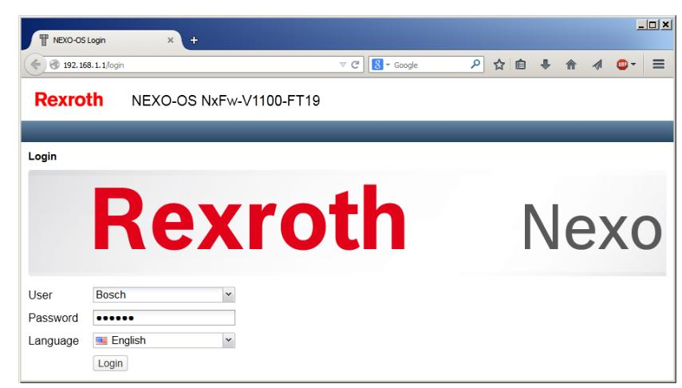

Die nachfolgende Anleitung basiert auf der Annahme, dass die folgenden IP-Adressen gültig sind:

- Nexo 1 hat die IP-Addresse <ip-nexo1> (e.g. <ip-nexo1> = 192.168.1.1)
- Nexo 2 hat die IP-Addresse <ip-nexo2> (e.g. <ip-nexo2> = 192.168.1.2)
- PC hat die IP-Addresse <ip-pc>

#### **4.3.1 Open Protocol aktivieren**

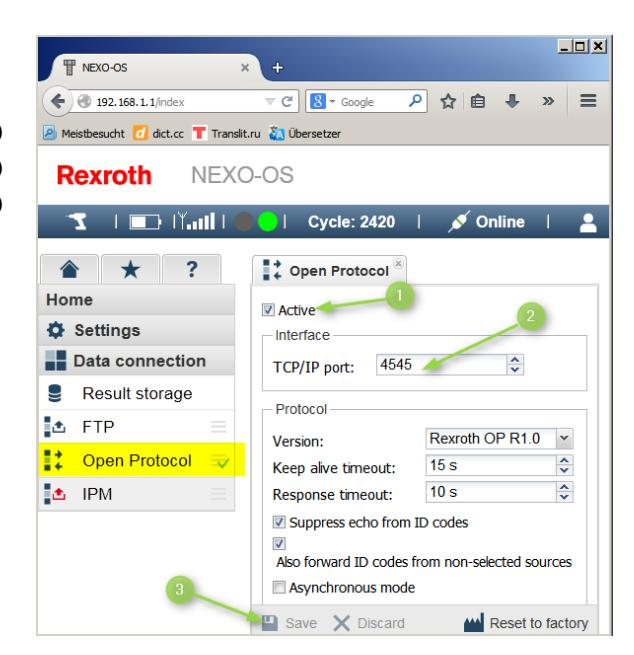

Wählen Sie Settings Data connection Open Protocol

- Das Kästchen "Active" muss aktiviert sein ❶
- Stellen Sie den TCP/IP Port auf 4545 ❷
- Einstellungen speichern ❸

#### **4.3.2 OK/NOK-Zähler zurücksetzen**

Wählen Sie Settings OK/NOK counter

- Leeren Sie die Anzeige
- Einstellungen speichern

#### **4.3.3 Das SPS-Signalmapping einrichten**

Wählen Sie Settings PLC signals

- Aktivieren Sie das Modul 'oprctl' ❶
- Stellen Sie die Eingangsignale des 'oprtcl' Moduls anhand folgender Tabelle ein: ❷

- Stellen Sie die Ausgangssignale anhand folgender Tabelle ein: ❸

- Einstellungen speichern. ❹

| 0.0 | ActEn |
|-----|-------|
| 2.0 | Prog0 |
| 2.1 | Prog1 |
| 2.2 | Prog2 |
| 2.3 | Prog3 |
| 2.4 | Prog4 |
| 2.5 | Prog5 |
| 2.6 | Prog6 |
| 2.7 | Prog7 |
| 3.0 | En    |

| 0.0 | CCwSel   |
|-----|----------|
| 0.1 | InCy     |
| 0.2 | StartBn  |
| 0.3 | ActEnAck |
| 0.4 | Rdy      |
| 0.5 | NF       |

#### **4.3.4 Schraubprogramme einrichten**

Um dieses Beispiel-Setup durchzuführen, müssen die folgenden Schraubprogramme eingerichtet sein:

- Prg. 0
- Prg. 13 (lösen)
- Prg. 47

Die Einrichtung von Schraubprogrammen wird detailliert in der Dokumentation der Nexo-Schrauber behandelt.

#### **4.4 Station Einrichten**

#### **4.4.1 Station Einrichten**

Nach der Installation und Aktivierung der Software müssen ein paar Grundlegende Einstellungen in der Konfigurationsdatei "station.ini" gemacht werden.

Um die Datei "station.ini" zu editieren, öffnen Sie sie mit einem Texteditor (z.B. Notepad). Die Datei befindet sich in <Installation>\tables\templates\station.ini (Standardpfad der <Installation> ist C:\Bosch Rexroth AG\ww\_hh). Sollte die Datei "station.ini" fehlen, wurde die Option "ww\_hh\_tpl-2xNEXO(no socket tray)" bei der Installation nicht ausgewählt. In diesem Fall deinstallieren Sie das Programm bitte, starten dann den Rechner neu und führen die Installation nun korrekt durch.

Auf den folgenden Screenshots sieht man die Datei "station.ini" in Notepad++ geöffnet:

Abschnitt GENERAL: Die Version der Konfigurationsdatei ist aktuell 101:

*[GENERAL] Version=101 MANUALOK=0 NOK\_STRATEGIE=0 QUICK\_PROCESSING=1 STATION=0 SHOW\_WARNING=0 CHECK\_LIMITS = 1;*

Abschnitt TOOL\_DLL: Nur der "OpenProtocol" Treiber ist aktiviert, alle anderen sind deaktiviert.

*[TOOL\_DLL] OPConn.dll=1*

Abschnitt PRINTER: Druckerausgabe deaktiviert

*[PRINTER]*

*ENABLED=0*

Abschnitt SERIAL: Falls Sie einen Barcodescanner zur Tastaturemulation verwenden, lassen Sie diesen Eintrag bitte deaktiviert. Ansonsten müssen Sie die Daten der COM-Schnittstelle eingeben (hier: COM4, Baudrate 38400, Parität: keine, Datenbits: 8). Profibus und serielle Kommunikation der Stecknussköcher muss deaktiviert werden.

*[SERIAL]*

*Barcode=COM4 38400,n,8*

Abschnitt KOECHER: Das Setzen dieser Zeile auf 1 deaktiviert den Stecknussköcher

*[KOECHER]*

*OHNE\_KOECHER = 1*

Abschnitt OPENPROTO: Die TCP Port-Nummer muss 4545 sein (siehe Kapitel [4.3.1\)](#page-11-0). Hier kann man die IP-Adressen der Nexo-Schrauber einstellen (zum Beispiel: <ip-nexo1> = 192.168.1.1 / <ip-nexo2> = 192.168.1.2)

*[OPENPROTO]*

*PORT=4545*

*CHANNEL\_01=192.168.2.1*

*CHANNEL\_02=192.168.2.2*

Abschnitt USER: Um Änderungen in der Stationskonfiguration durchführen zu können, muss hier wenigstens ein Benutzer mit Administratorrechten angegeben werden, in dem man den Wert (3) einstellt:

#### *[USER]*

*Bosch=Robert (3)*

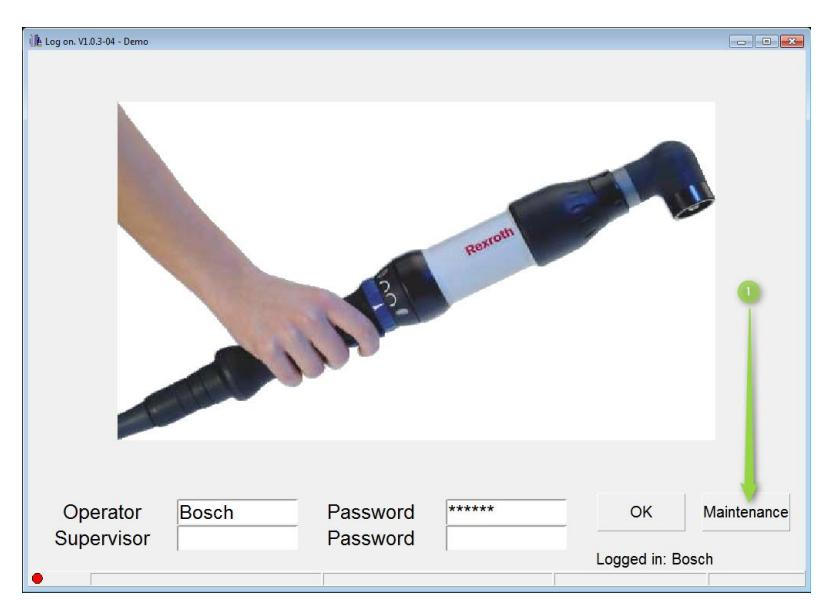

#### **4.4.2 Kundenspezifische Begriffe**

- Monitor-Software starten
- Als Administrator einloggen
- 'Maintenance' auswählen ❶
- Term Editor öffnen
- Begriffe ändern (siehe Bild unten)
- Änderungen speichern und Monitor-Software schließen

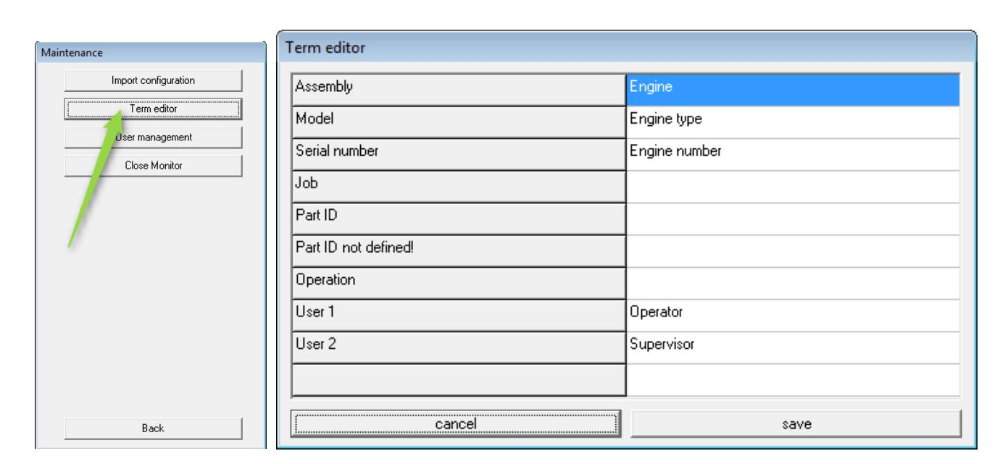

Hier kann man die Bezeichnungen, die in den Feldern "Assembly", "Model", "Serial Number" etc. erscheinen ändern, damit sie zu der entsprechenden Station passen. Zum Beispiel kann man die Voreinstellung "Engine" bei Assembly ändern, so dass Sie nun "Karosserie", "Vorderachse" oder "Getriebe" heißt.

# **4.5 Baugruppen und Arbeitsabläufe einrichten**

- Konfigurator starten (ww\_hh Configuration / WWKonfigurator.exe)
- Öffnen Sie die Beispielkonfiguration "Demo-2xNEXO.FDB" aus dem Ordner <Installation>\Tables (C:\Bosch Rexroth AG\ww\_hh\Tables\ Demo-2xNEXO.FDB)

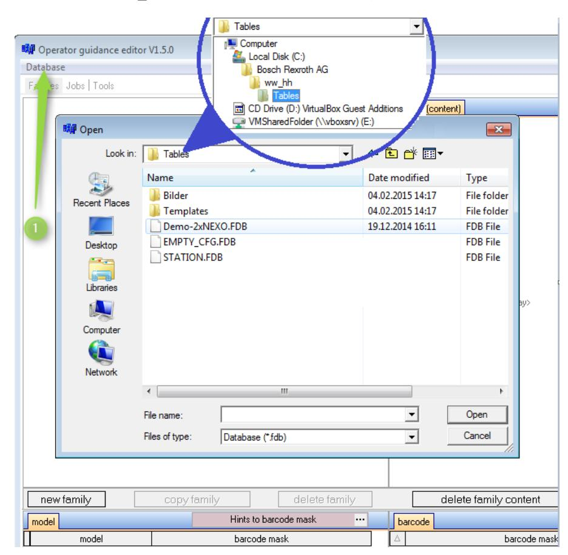

#### **4.5.1 Tool definition**

Gehen Sie auf den Tab "Tools". In diesem Beispiel sind zwei Werkzeuge eingerichtet:

- NEXO
- Von Hand

Zwei Werkzeuge vom Typ NEXO sind hier registriert (NEXO1 und NEXO2):

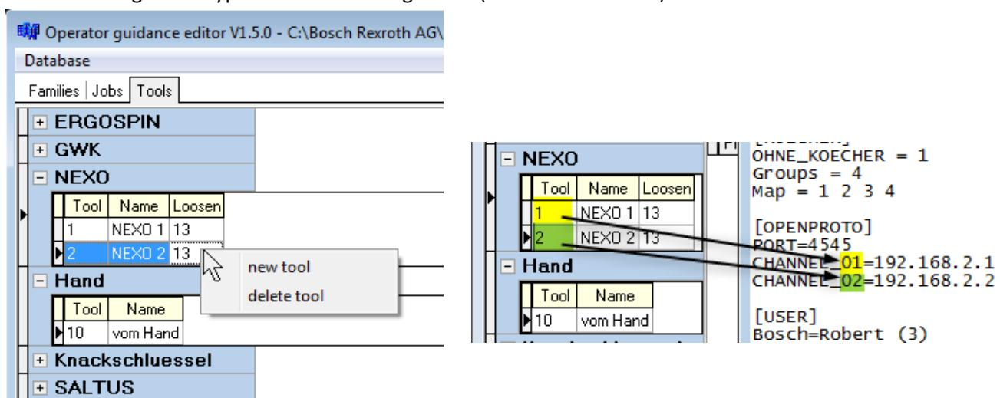

In dieser Ansicht (siehe Bild oben) sind folgende Operationen möglich:

- Werkzeugnummer ändern. Diese Nummer bezieht sich auf die Nummer aus der Konfiguration ([OPENPROTO])
- Werkzeugname ändern. Diesen Namen sieht der Werker später in seiner Monitor-Software.
- Ändern der Programmnummer fürs "lösen". Dieses Programm wird automatisch gestartet nach jeder NOK Verschraubung (falls 0-NOK Strategie ausgewählt wurde)
- Neues Werkzeug hinzufügen (Über ein Popup-Menü)
- Werkzeug löschen (Über ein Popup-Menü)

#### **4.5.2 Jobablauf einrichten**

Die folgenden Abschnitte beschreiben detailliert die Erstellung eines neuen Jobs und das Ändern seiner Eigenschaften im Konfigurator. (ww\_hh Configuration.exe).

#### *4.5.2.1 Neuen Job erstellen*

Gehen Sie auf den Tab "Jobs". Es werden bereits 3 vorgefertigte Jobs angezeigt.

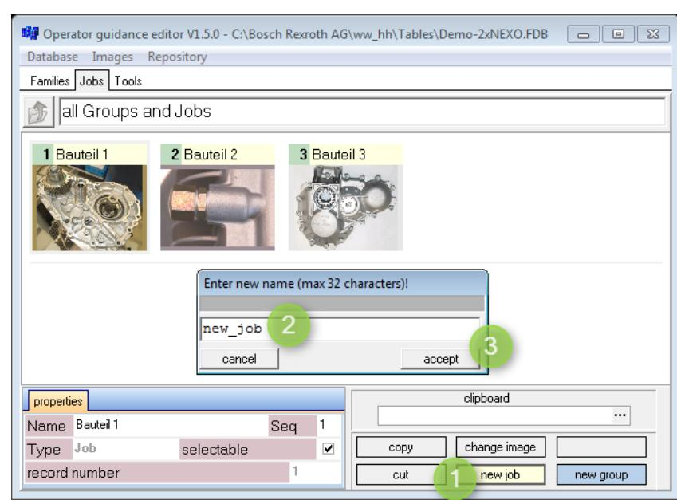

Um einen neuen Job zu erstellen:

- Drücken Sie den Knopf "new job" (siehe Bild oben) ❶
- Job-Namen eingeben ❷
- Neuen Job bestätigen ❸

### *4.5.2.2 Bild für den Job auswählen*

- Klicken Sie (wie unten im Bild) mit einem Rechtsklick auf den gewünschten Job ❶
- Wählen Sie im Dropdown-Menü die Option "change image" ❷
- Wählen Sie nun das gewünschte Bild aus ❸ (Unterstütze Formate: BMP, JPG, PNG) ❹

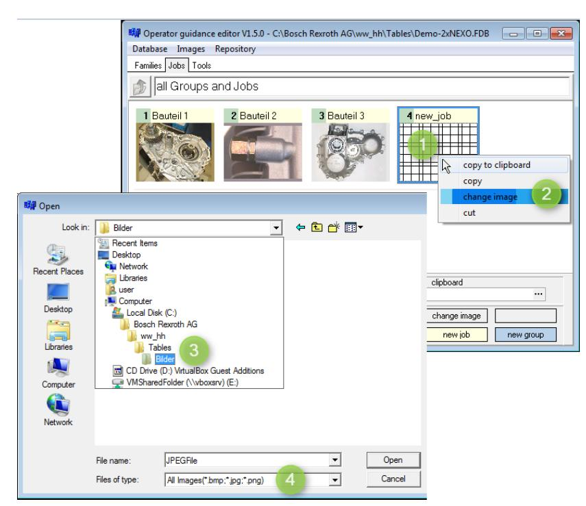

#### *4.5.2.3 Schraubstellen*

Jetzt können Sie einen Job im Tab "Jobs" auswählen und den Schraubstelleneditor durch einen Doppelklick auf das Bild öffnen. Die folgenden Screenshots zeigen das Hauptfenster des Schraubstelleneditors:

- Liste der Schraubstellen ❶
- Bild des Jobs mit Schraubstellen ❷
- Tabelle mit Schrauboperationen ❸
- Operationstabelle ❹
- Schraubstelleninformationen ❺

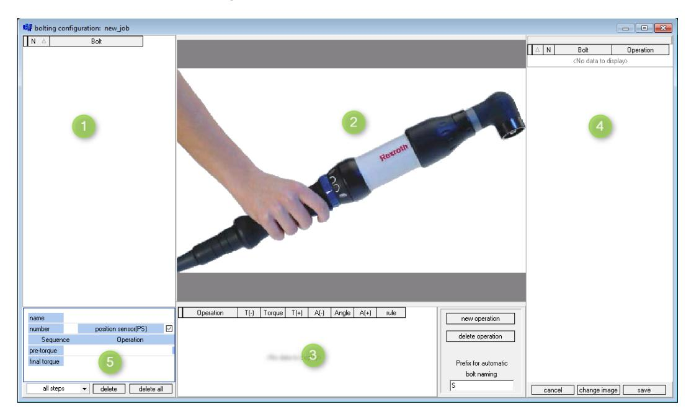

- Setzen Sie eine beliebige Anzahl von Schraubstellen per Pop-up-Menü oder Doppelklick in das Bild
- Sie können den Namen jeder Schraubstelle in den Tabelle links ändern

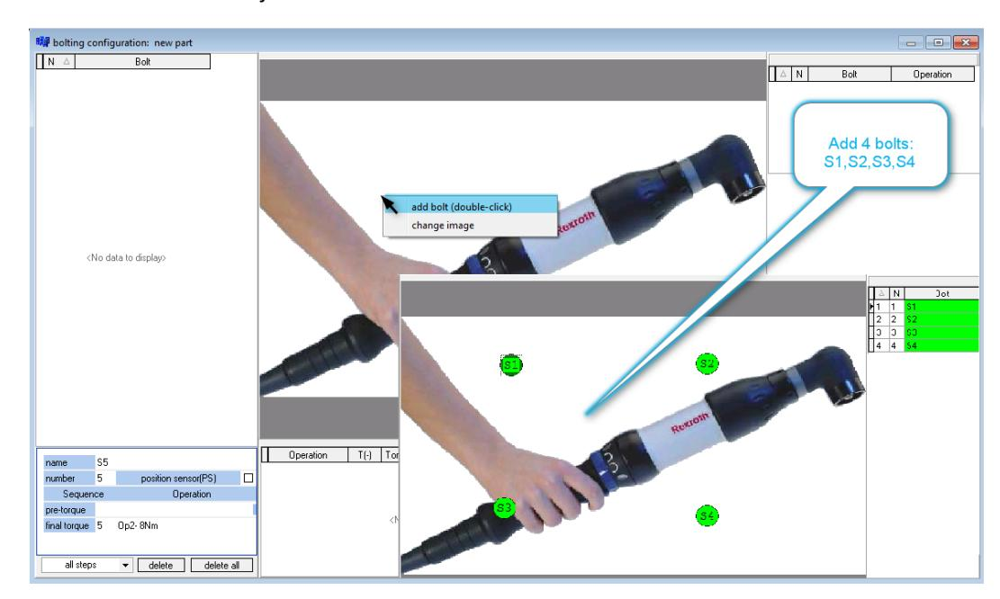

#### *4.5.2.4 Schrauboperationen*

Um Schrauboperationen zu definieren wird die Tabelle für Schrauboperationen am unteren Rand des Bildschirms verwendet. Folgen Sie bitte diesen Schritten (Bild unten):

- Drücken Sie auf den Knopf "new operation" ❶
- Geben Sie den gewünschten Wert und Toleranzen ein (nicht zwingend, siehe Parameter CHECK\_LIMITS in [4.4.1\)](#page-12-2) ❷
- Ändern Sie den Operationsname ❸

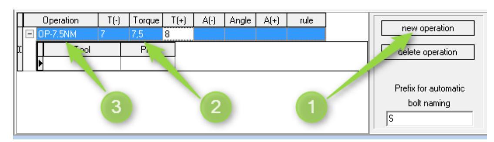

Werkzeug und Schrauboperation auswählen:

- Werkzeugauswahl aktivieren ❶
- Werkzeugtyp "NEXO" auswählen ❷
- Werkzeug NEXO 1 auswählen ❸
- Werkzeugauswahl bestätigen ❹
- Nummer des Schraubprogramms eingeben ❺

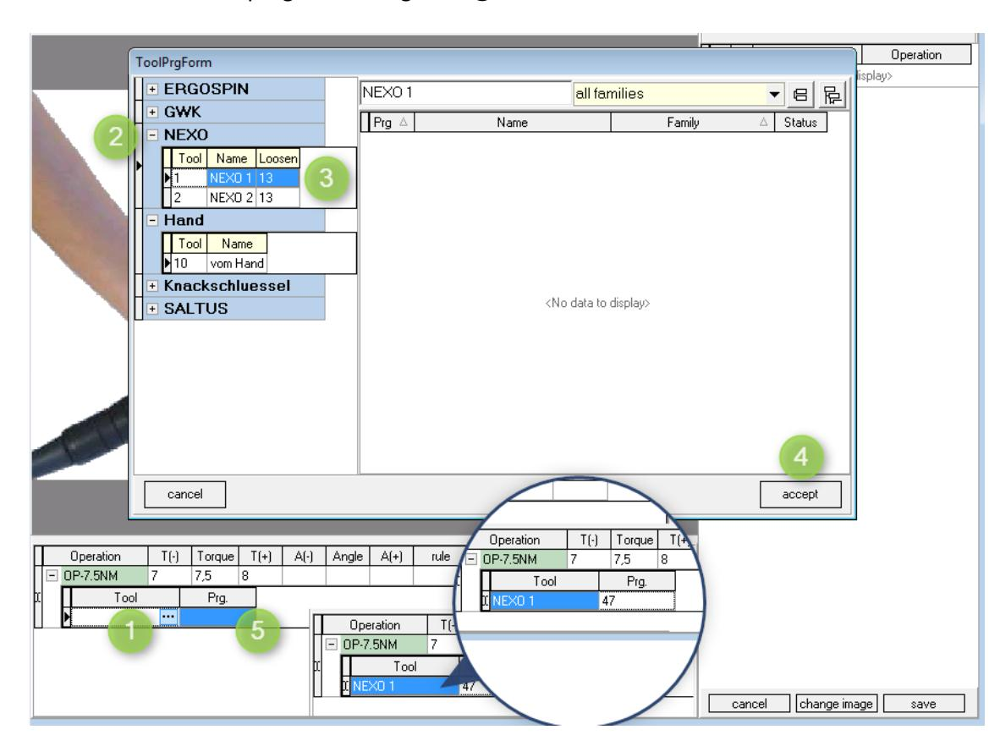

### *4.5.2.5 Zuweisen von Schrauboperationen zu den Schraubstellen*

- Wählen Sie eine Schraubstelle aus der Operationstabelle aus (Mehrfachauswahl möglich)
- Öffnen Sie das Pop-up-Menü per Rechtsklick ❶
- Klicken Sie auf "add operation" ❷
- Wählen Sie die gewünschte Schrauboperation aus ( hier: 'OP-7.5Nm') ❸
- Drücken sie auf "save" um die Einstellungen zu speichern

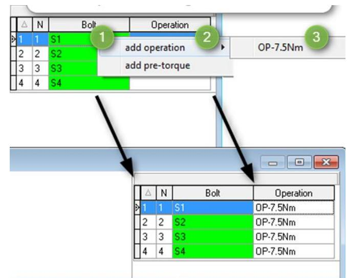

#### **4.5.3 Abläufe von Modellfamilien einstellen**

Alle Modelle mit identischen Schrauboperationen bilden eine "Modellfamilie" (hier: "Demo"). Die "Demo"-Familie hier enthält nur das eine Modell: "Demotyp"

Die folgenden Abschnitte beschreiben, wie man ein neues Modell erstellt und konfiguriert sowie das Hinzufügen zu einer Modellfamilie, das Ändern der Arbeitsabläufe in einer Familie und das Speichern der aktuellen Schrauboperationszuweisungen.

Der Tab "Families" ist in mehrere Teile unterteilt:

- Liste der Modellfamilien ❶
- Liste der Jobs in Ablaufreihenfolge ❷
- Job-Katalog ❸
- Liste der Modelle der ausgewählten Familie ❹
- Dem ausgewählten Job zugewiesene Barcodes ❺

#### *4.5.3.1 Neues Modell hinzufügen*

- Wählen Sie die gewünschte Familie aus der Liste der Modellfamilien aus ❶
- Wechseln Sie zur Liste der Modelle ❷
- Fügen Sie ein neues Modell mithilfe des Pop-up-Menüs oder des "+"-Symbols unten links hinzu ❸
- Modellname ❹ und zugehörige Barcodemaske ❺ ändern
- Für Informationen über das Format der Barcodemaske klicken Sie auf ❻

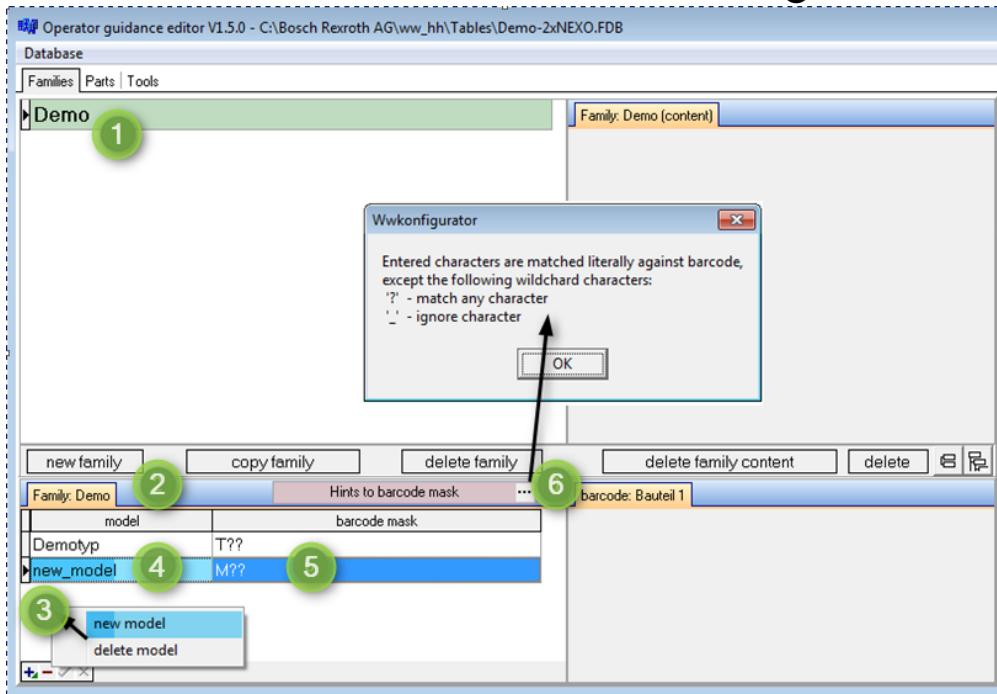

#### *4.5.3.2 Schrauboperationen definieren*

- Wählen Sie die gewünschte Modellfamilie aus der Liste aus
- Gehen Sie auf den "Job catalog" und wählen Sie den Job "new\_job" von vorher. Er sollte als viertes in der Liste der Jobs zu finden sein
- Fügen Sie den Job durch das Pop-up-Menü oder den Button "add to family" unten im Fenster zu der Ablaufsequenz hinzu

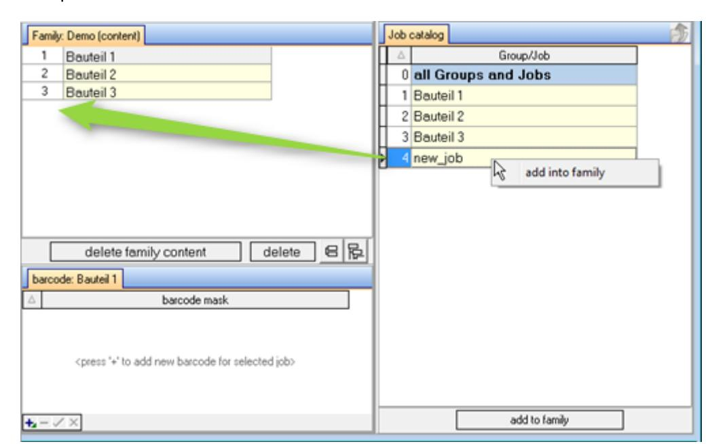

Jetzt befindet sich der Job "new\_job" am ende der Ablaufsequenz:

- Der Job kann per drag & drop in die gewünschte Position gebracht werden:

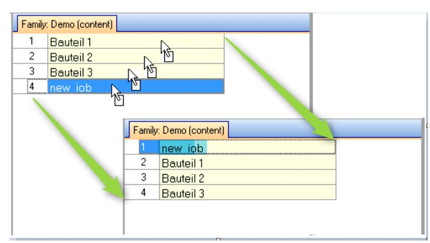

- Änderungen speichern (❶+❷):

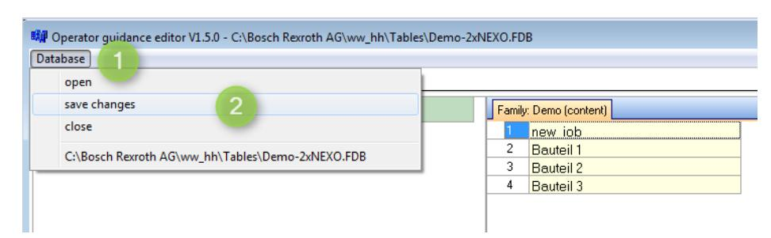

#### **4.5.4 Die Konfiguration importieren**

- Starten Sie die Monitor-Software
- Loggen Sie sich als Administrator ein (Benutzername: Bosch Passwort: Robert)
- Klicken Sie auf "Maintenance" ❶

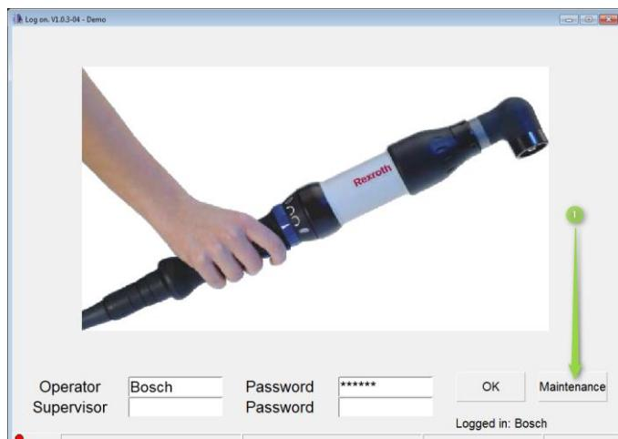

- Klicken Sie auf "Import configuration" ❷
- Wählen Sie "Demo-2xNEXO.FDB" ❸ und klicken Sie auf "Open" ❹
- Warten Sie, bis das Programm die Datei geladen hat ❺ Dies kann je nach Dateigrösse bis zu einer Minute dauern.

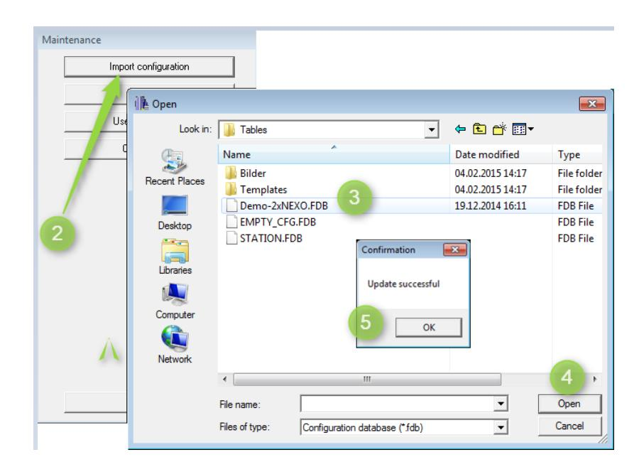

# **5 Funktionsprüfung**

- Starten Sie die Monitor-Software
- Loggen Sie sich als Operator ein
- Drücken Sie auf "OK". Das Bild unterhalb zeigt die Ansicht, nachdem sich ein Operator eingeloggt hat:

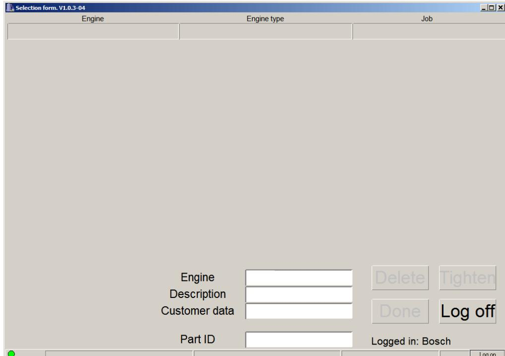

- Geben Sie eine beliebige Seriennummer wie "M01" ❷ für das Testmodel "new\_model" ein, das Sie vorher erstellt haben. Die eingegebene Seriennummer muss mit der Barcodemaske übereinstimmen, die Sie vorher eingegeben haben für das "new model" ❶ (Siehe [4.5.3.1\)](#page-20-0) Falls Sie keinen Barcodeleser zum einlesen der Seriennummer verwenden, können Sie diese auch per Tastatur eingeben. Dafür müssen Sie Ihre Eingabe danach mit Enter bestätigen.

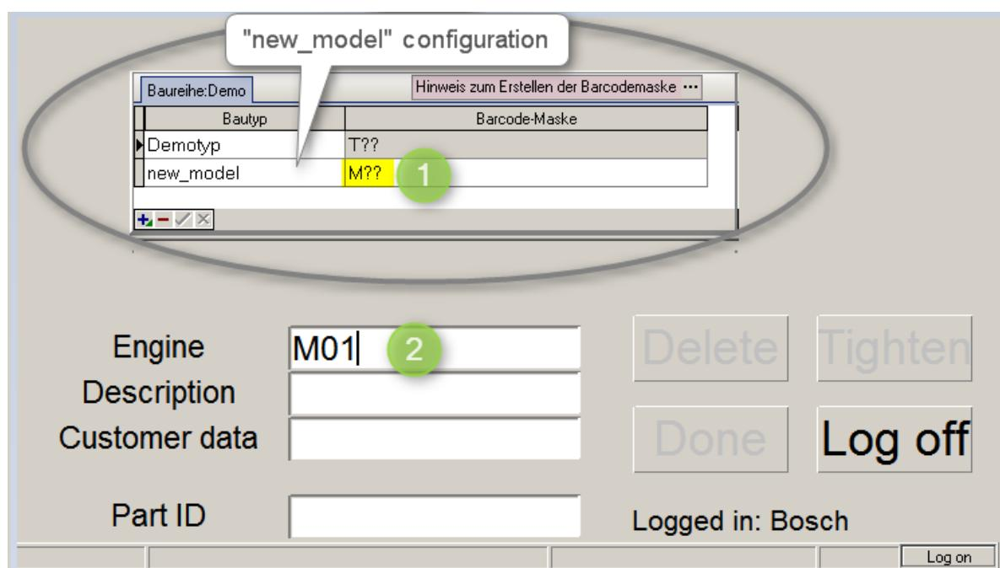

So sieht die Monitor-Software aus, wenn die Seriennummer akzeptiert wurde: Schraubstelle [1] ist momentan aktiv und gelb hinterlegt.

Der Nexo-Schrauber muss bereit zum Schrauben sein und sollte die folgenden Dinge auf dem Bildschirm anzeigen:

- ❶ WLAN aktiviert
- ❷ Freigabe erhalten
- ❸ Vorheriges Schraubergebnis war OK
- ❹ Starte Schraubprogramm 47

#### **5.1.1 OK Verschraubung**

Das Programm springt direkt zum ersten Job ("new\_job"), weil in der Station.ini "QUICK\_PROCESSING=1" aktiviert wurde (siehe [4.4.1\)](#page-12-2). Falls diese Option nicht aktiviert ist, erscheint folgende Anzeige und man muss auf den Knopf "Tighten" drücken um fortzufahren:

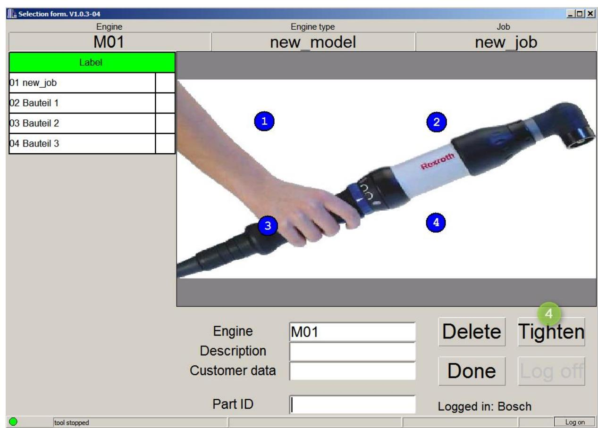

Nachdem die erste Schraube an Schraubstelle [1] erfolgreich angezogen wurde, zeigt der Nexo-Schrauber folgenden Bildschirm an:

Nachdem die erste Schraube an Schraubstelle [1] erfolgreich angezogen wurde, zeigt die Monitor-Software folgenden Bildschirm an:

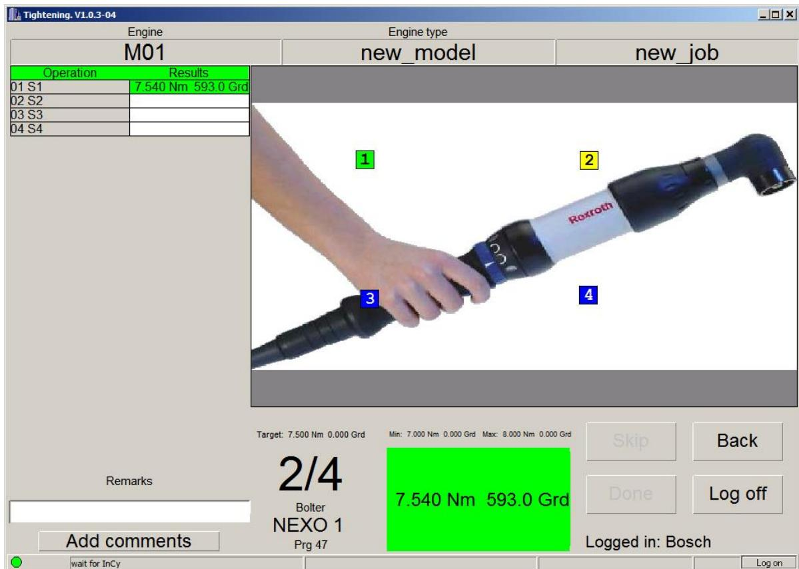

Nachdem alle vier Schrauben in "new\_job" erfolgreich angezogen wurden, springt das Programm weiter und startet den nächsten Job "Bauteil 1":

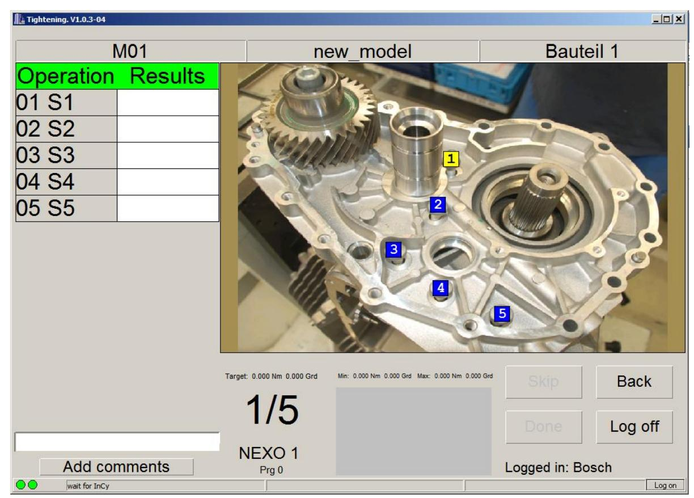

Danach geht es weiter mit "Bauteil 2" (dies ist ein Anzug von Hand):

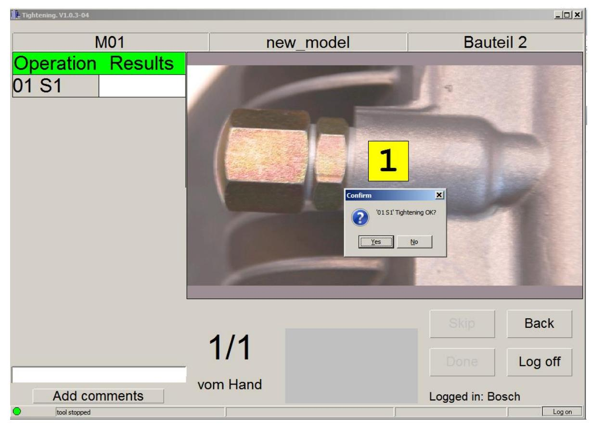

Falls Sie eine Operation von Hand durchführen, müssen Sie das Schraubergebnis auch manuell durch anklicken der Schraubstelle bestätigen. Nach der Bestätigung springt das Programm zum letzten Job "Bauteil 3". Der nachfolgende Screenshot zeigt den Bildschirm, bevor die letzte Schraube in "Bauteil 3" angezogen wurde:

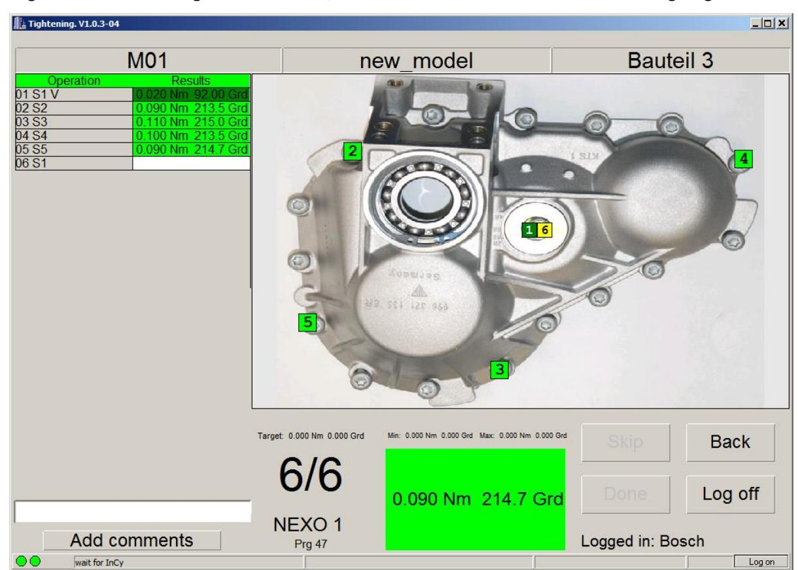

Falls der letzte Schraubanzug auch erfolgreich war, ist der Arbeitsablauf (erfolgreich) beendet und die Monitor-Software kehrt wieder in ihren Originalzustand zurück:

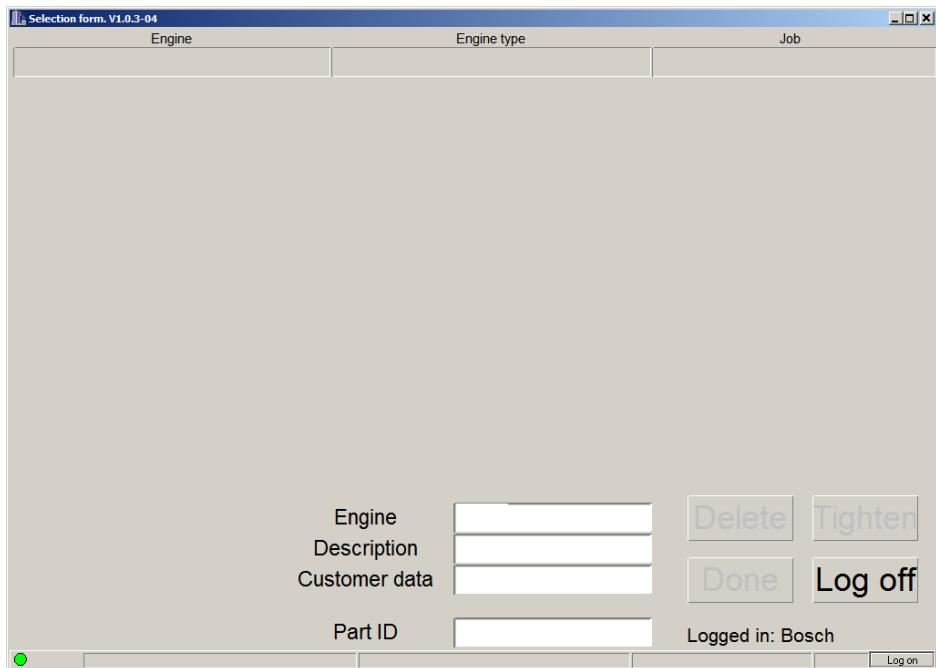

#### **5.1.2 Fehler beim Durchlauf**

Wenn der Anzugsvorgang in irgendeinem Job abgebrochen wurde, zeigt der Monitor wieder die Übersicht(Liste aller Jobs mit Status: grün – IO, gelb – unvollständig, rot - NIO). Die Anzugsequenz kann durch Drücken des Knopfes "Tighten" wieder gestartet werden. Das Programm springt dann automatisch zur ersten Schraubstelle, die noch nicht angezogen wurde.

Z.B. Abbruch beim Job "Bauteil 1":

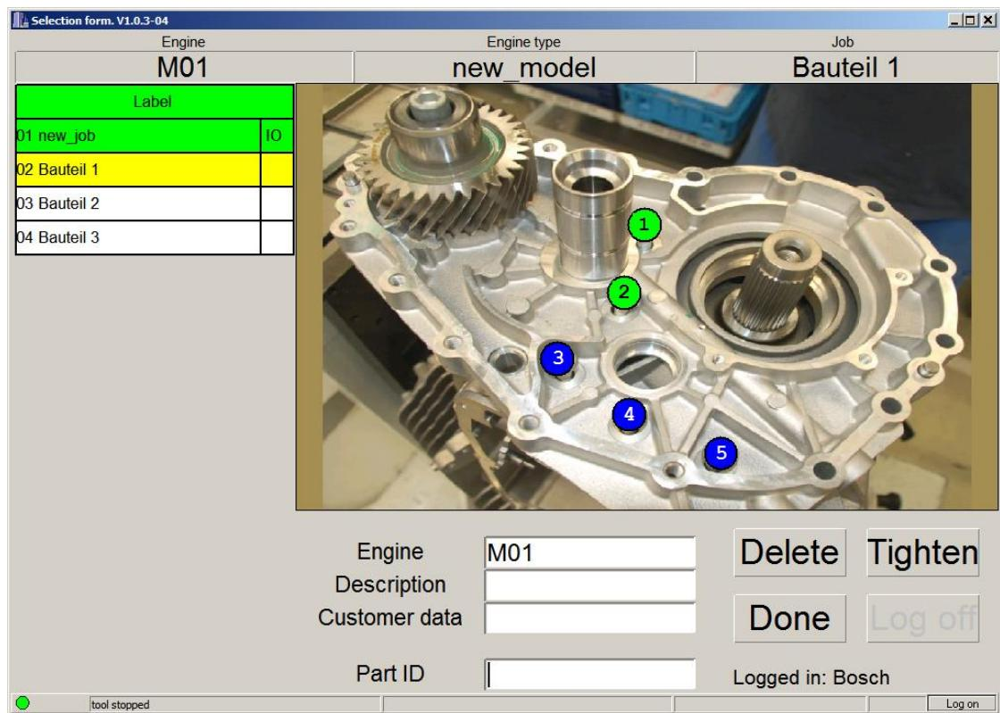

# Z.B. Abbruch beim Job "Bauteil 3":

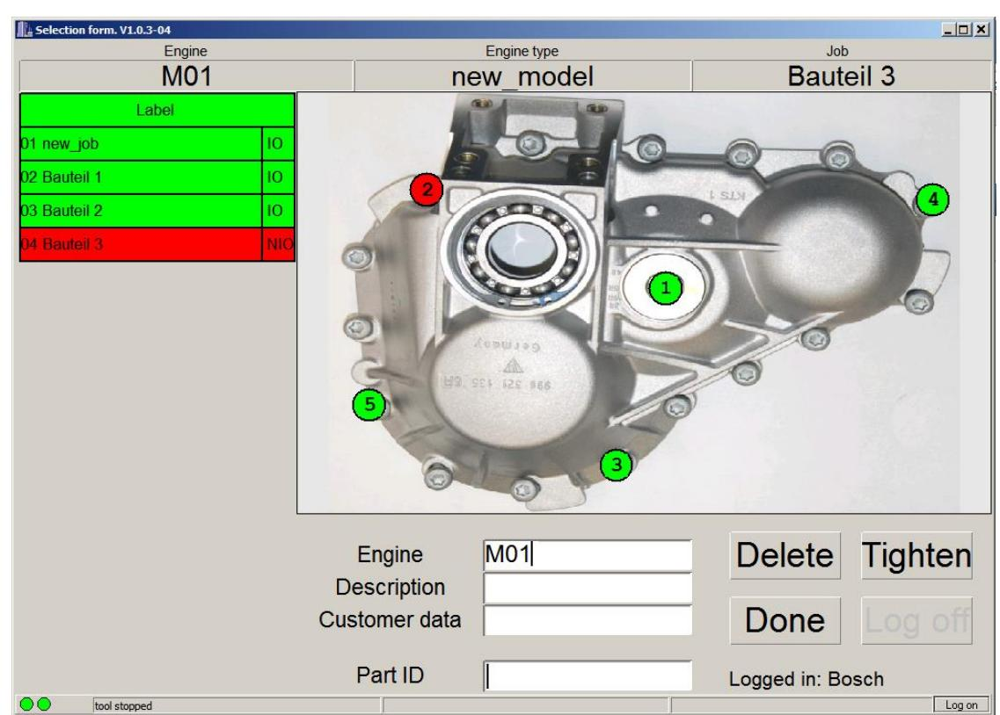

## **5.2 Jobergebnisse durchsuchen, exportieren und ausdrucken**

Alle Daten, die diese ganzen Vorgänge liefern, werden in einer lokalen Datenbank gespeichert. Das beinhaltet Schraubergebnisse, eingescannte Seriennummern und Operationen von Hand.

Um diese Daten zu untersuchen gibt es die Anwendung Locate.exe.

#### **5.2.1 Ergebnisse nach Job sortiert**

- Wählen Sie das gewünschte Modell aus der Liste "Engine type" ❶ aus
- Geben Sie des anzuzeigenden Zeitrahmen ein ❷
- Wählen Sie die gewünschte Seriennummer ❸
- Wählen Sie den Job ❹
- Die Tabelle unten im Bildschirm zeigt nun alle Schraubergebnisse für diesen Job an ❺

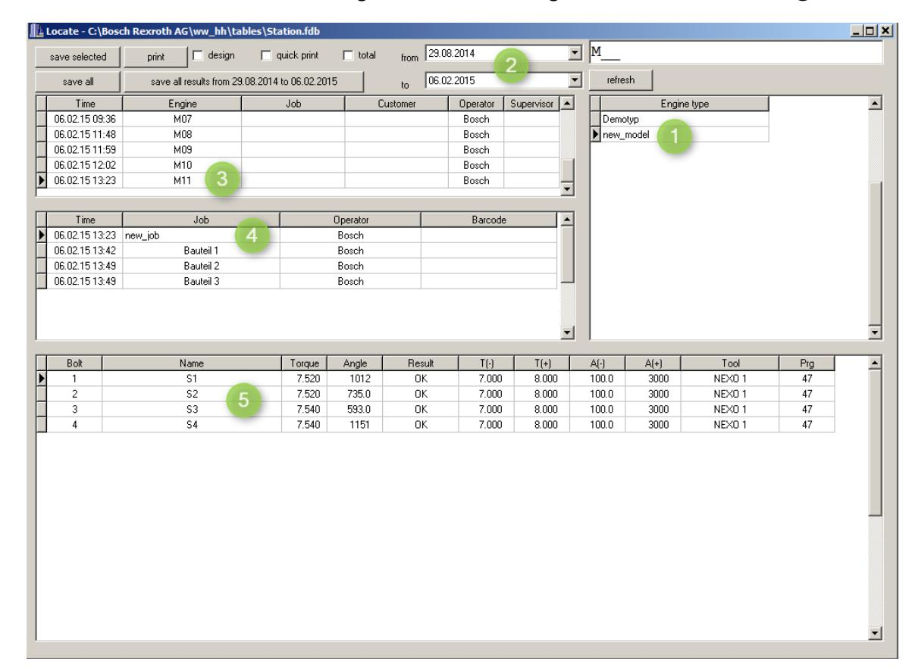

#### **5.2.2 Ergebnisse ungruppiert**

- Aktivieren Sie das Kästchen "total" ❶
- Wählen Sie die gewünschte Seriennummer ❷
- Die Tabelle unten im Bildschirm zeigt nun alle Schraubergebnisse für diese Baugruppe an ❸

# **6 Troubleshooting**

Die Monitor-Software hat eine eingebaute Diagnosefunktion, falls es Probleme gibt, die Werkzeuge zum Laufen zu kriegen. Falls die Kommunikation des Programms mit dem Werkzeug nicht funktioniert, oder dieses einen Fehler meldet, erscheint meistens ein Pop-up-Fenster, das dem Benutzer dieses Problem anzeigt.

Dieses Fenster kann z.B. so aussehen:

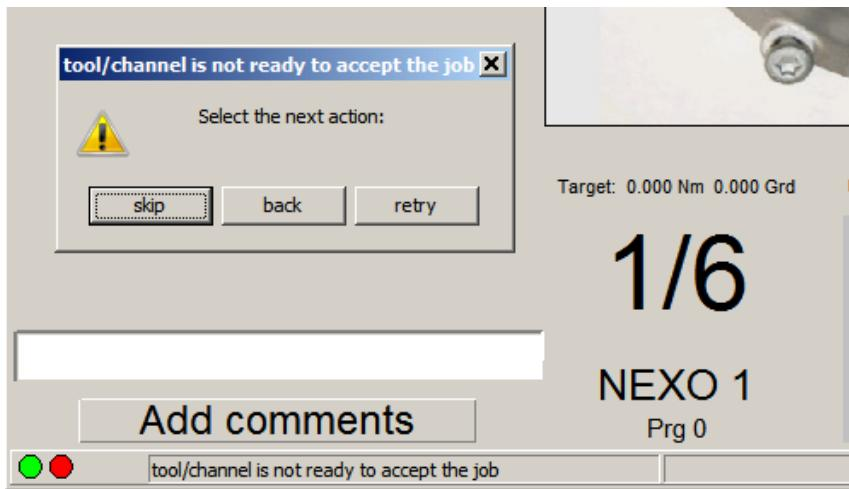

In diesem Fall kann der Schrauber den nächsten Job nicht akzeptieren, weshalb das Programm dem Benutzer dies anzeigt und ihn seinen nächsten Schritt auswählen lässt (Überspringen, Abbruch, Erneut versuchen). Falls das Problem von selbst behoben wird, beendet sich auch das Pop-up-Fenster von selbst. Manche Fehler müssen jedoch von Hand behoben werden und in diesem Fall kann es notwendig sein, auf "retry" zu drücken, um das Werkzeug wieder zu aktivieren.

Falls keine Fehlermeldung angezeigt wird, das Werkzeug aber trotzdem nicht funktioniert, prüfen Sie bitte:

- 1. Korrektes Werkzeug? Vielleicht hat das Programm ein anderes Werkzeug ausgewählt und Sie halten eventuell das falsche (im Moment deaktivierte) in den Händen.
- 2. Überprüfen Sie die Verbindungsinformationen des Werkzeugs auf dem Bildschirm: Der Verbindungsstatus des Werkzeugs wird unten links im Bild angezeigt. Es gibt pro Werkzeug genau einen Farbpunkt (grün = Verbindung OK , rot = Verbindung nicht OK). Durch anklicken der Farbpunkte werden weitere Informationen zu jeder Verbindung in einem neuen Fenster angezeigt.
- 3. Statusanzeige überprüfen: Die Statusanzeige zeigt den momentan aktiven Schritt im Signalaustausch mit dem Werkzeug an. Falls das Programm auf eine Eingabe vom Benutzer wartet, könnte dies das Werkzeug blockieren, z.B. wenn Sie die NIO-Bestätigung aktiviert haben, könnte es sein, dass das Programm auf die Betätigung des "NIO acknowledge button" wartet, bevor der Betrieb fortgeführt werden kann. Dasselbe gilt auch für den Schalter für die Drehrichtung – wenn der Schalter auf "Schraube öffnen" steht, muss man ihn erst in die Stellung "Schraube anziehen" bringen, damit der Schrauber wieder funktioniert.

# **7 Referenzen**

#### **7.1.1 Speicherorte der Konfigurationsdateien**

Auf dem nachfolgenden Screenshot sehen Sie die Ordnerstruktur nach Installation der Software (es wird der Ordner <Installation>>\Tables\Template angezeigt).

Die eigentliche Konfigurationsdatei hat den Pfad "…\tables\templates\station.ini" ❶. Der genaue Speicherort der Konfigurationsdatei wird durch den Zielordner, der während der Installation ausgewählt wurde bestimmt. In diesem Fall ist das:

C:\Bosch Rexroth AG\Werkstattwagen\tables\templates\station.ini

Die Benutzerspezifischen Begriffe sind in der Datei "alias.txt" ❷, die Berichtvorlagen in den "\*.fr3" Dateien ❸ abgelegt.

# **7.1.2 Die Stationskonfigurationsdatei**

Die Stationskonfigurationsdatei (station.ini) besteht aus mehreren Abschnitten, welche das gesamte Verhalten der Software sowie Stationsspezifische Einstellungen wie verbundene Werkzeuge oder Barcodeleser, Verbindungs- und Anzeigeeinstellungen.

Die Stationskonfigurationsdatei enthält die folgenden Abschnitte und Parameter.

ACHTUNG: Änderungen in der Datei werden nicht sofort von der Software erkannt. Die Konfigurationsdatei wird beim Start der Applikation ausgelesen, weshalb man die Monitor.exe erneut starten muss, damit die Änderungen aktiv werden!

# *7.1.2.1 Abschnitt [GENERAL]*

In diesem Abschnitt wird das allgemeine Verhalten des Programms festgelegt. Die Optionen sind folgende:

- Version: Interne Versionsnummer der Konfigurationsdatei. Dieser Wert wird verwendet, um die Übereinstimmung von Konfigurationsdatei und dem Programm zu prüfen. (muss 101 sein)
- MANUALOK: Dieser Wert bestimmt, ob es dem Werker erlaubt ist, Schraubanzüge auch manuell zu bestätigen (durch Rechtsklick auf die Schraube und dann auf "skip"). Die Berechtigung wird dafür auf jeden Fall benötigt. Mögliche Werte sind: o 0 = nicht erlaubt o 1 = erlaubt
- CHECK\_LIMITS: Diese Option legt fest, ob das Programm Plausibilitätsprüfungen der Sensorwerte beim Festziehen der Schrauben durchführt und eventuell einen Jobabbruch herbeiführt, wenn die Werte außerhalb der festgelegten Toleranzen sind. Manchmal sind diese Werte nämlich NIO, obwohl der Schrauber ein IO-Signal liefert. Mögliche Werte sind: o 0 = Plausibilitätscheck deaktiviert o 1 = Plausibilitätscheck aktiviert

- ABMELDEN: Diese Zeile bestimmt das Verhalten der Applikation bei Betätigung des "logoff"-Buttons. Wenn sie aktiviert ist, beendet sich das Programm sofort, wenn sie deaktviert ist, kehrt das Programm lediglich in den Login-Bildschirm zurück. Mögliche Werte sind: o 0 = deaktiviert (Programm wird nicht automatisch bei logoff geschlossen) o 1 = aktiviert
- NOK\_STRATEGIE (Standard = 0): Hier wird das Verhalten der Software bei einem NIO-Signal des Schraubers festgelegt. Folgende Optionen sind möglich: o 0 = Auf dieser Schraubstelle bleiben und automatisch ein Löseprogramm aktivieren. In diesem Fall aktiviert die Software ein vorher bestimmtes Löseprogramm (z.B. Prg 47), wenn sie ein NIO-Signal erhält. Somit kann der Werker eine Schraube direkt nachdem sie NIO verschraubt wurde wieder lösen ohne Löseprogramme freigeben zu müssen und ohne Betätigung des Drehrichtungsschalters. Dies trägt zur Prozesssicherheit bei. Bitte beachten Sie jedoch, dass der Werker (sollte es in der Konfigurationsdatei so eingestellt sein) die NIO-Verschraubung trotzdem quittieren muss, bevor er mit dem Lösen beginnen kann. Außerdem muss man im Konfigurator im Abschnitt "tool configuration" ein Löseprogramm für diesen Fall definieren. o 1 = Schraubstelle bei NIO-Signal überspringen. Bei dieser Option wird die Schraubstelle als NIO markiert und das Programm springt direkt zur nächsten Schraubstelle weiter. o 2 = Schraubstelle bleibt bei NIO-Signal aktiv. Durch diese Einstellung wird das Schraubprogramm zum Anziehen erneut aktiviert und der Werker kann versuchen, die Schraube nochmal festzuziehen. Das Programm springt erst bei einem IO-Signal zur nächsten Schraubstelle weiter.
- QUICK\_PROCESSING: Diese Option ermöglicht das direkte festziehen einer Schraube nach einscannen des Barcodes/Seriennummer. Wenn man die Option deaktiviert, wird das Werkzeug nicht automatisch aktiviert und man muss erst den Knopf "tighten" drücken, um zu schrauben. Außerdem muss dann zum Abschließen des Jobs auch der Knopf "finish" gedrückt werden. Mögliche Werte sind: o 0 = deaktiviert (Werker muss den Anfang und Ende des Jobs durch Knopfdruck bestätigen) o 1 = aktiviert
- STATION: Hier wird die Stationsnummer eingegeben. Falls Sie eine Einstellung für mehrere Stationen wünschen, bestimmt die Stationsnummer auch die relevanten Schraubstellen und Jobs für die jeweilige Station. Somit kann man mehrere Stationen über eine Datenbank laufen lassen. Mögliche Werte sind: o 0 = kein Setup mit mehreren Stationen (Die Konfigurationsdatei bestimmt den Zugriff auf Jobs und Schraubstellen) o Legitime Stationsnummer = Nummer dieser Station im Verbund.
- STATION\_NAME: Das ist der in der XML-Outputdatei festgehaltene Name dieser Station (Siehe Parameter "DIRECTORY" im Abschnitt [XML]).
- DBHost: (optional) Hier muss der Dateipfad für eine gemeinsame Datenbank angegeben werden, wenn Sie ein Setup mit mehreren Stationen über eine Datenbank laufen lassen möchten.
- PART\_CHOICE\_THROUGH\_BARCODE: (optional, Standard = 0): Wenn aktiviert, können einzelne Bauteile ausgewählt werden, indem man ihren Barcode einscannt. Das benötigt jedoch die Eingabe eines Barcodes für das Teil im Konfigurator. Mögliche Werte sind: o 0 = deaktiviert o 1 = aktiviert
- LANGUAGE: (optional) Hier kann man die Sprache der Software ändern, wenn sie eine andere Sprache als die des Betriebssystems wünschen. Im Moment werden folgende Sprachen unterstützt o LANGUAGE=en (Englisch) o LANGUAGE=de (Deutsch)
- REWORK: Hier wird das Verhalten der Applikation im Falle einer nötigen Nacharbeit bestimmt, wenn eine bereits abgearbeitete Seriennummer eingescannt wird. Diese Szenarien sind möglich: Szenario 1: Vorherigen Prozess fortführen (bisherige Schraubergebnisse überschreiben) Szenario 2: Neuen Prozess mit derselben Seriennummer anfangen (dadurch wird ein neuer Prozess in der Datenbank angelegt und die alten Schraubergebnisse bleiben erhalten)

Folgende Werte sind möglich:

o CONTINUE - immer Szenario 1 (Standardeinstellung) o ASK\_IF\_OK – Wenn der vorherige Durchlauf erfolgreich abgeschlossen wurde, wird der Benutzer gefragt, was zu tun ist, Ansonsten Szenario 1 o ASK - Immer Nachfragen

z.B.:

REWORK= ASK\_IF\_OK

### *7.1.2.2 Abschnitt [TOOL\_DLL]*

In diesem Abschnitt wird festgelegt, welche Werkzeuge verfügbar sind und welche Treiber dafür zu laden sind. Mögliche Werte sind:

- OPConn.dll=1: Die OpenProtocol DLL laden
- ProfiFTP.dll=1: Die System 350 Treiber laden (über Profibus, FTP und Curve Datenübertragung).

Anmerkung: Falls ein Eintrag fehlt oder der Wert auf 0 gesetzt wurde, ist der Treiber nicht aktiv.

#### *7.1.2.3 Abschnitt [XML]*

- DIRECTORY: Hier bestimmen Sie den Speicherort der Schraubergebnisse im XML-Format. z.B.:

DIRECTORY=C:\ww\_hh\XML

Wenn dieser Parameter fehlt oder freigelassen wird, wird die XML-Ausgabe deaktiviert.

Result\_OK / Result\_NOK / Result\_incomplete: Bestimmt, was im jeweiligen Fall (Ergebnis IO / Ergebnis NIO / Ergebnis unvollständig) mit der XML-Datei des gerade aktiven Jobs passiert:

Mögliche Werte sind:

o SKIP - Die XML-Datei nicht speichern (Standardeinstellung) o SAVE – Die XML-Datei immer speichern o ASK - Den Benutzer fragen, ob die XML-Datei gespeichert werden soll oder nicht

z.B.:

Result\_OK=SAVE

Result\_NOK=ASK

Result\_incomplete=SKIP

#### *7.1.2.4 Abschnitt [CHART]*

Hier können Sie das Erscheinungsbild der Drehmomentkurven bestimmen, die in den Berichten enthalten sind. Wird in Verbindung mit dem ProfiFTP.dll Werkzeugtreiber verwendet (siehe oben). Mögliche Werte sind:

- Width: Bestimmt die Breite des Diagramms in Pixeln.
- Height: Bestimmt die Höhe des Diagramms in Pixeln.
- MaxAngle: Bestimmt den maximal dargestellten Drehwinkel. Der Drehwinkel wird "von hinten her" berechnet, also können kleinere Werte eventuell untergehen.
- CrvRoot: Zielordner für die Dateien mit Drehmomentkurven (im BS350 \*.crv Format).

#### *7.1.2.5 Abschnitt [PRINTER]*

Dieser Abschnitt verändert das Druckverhalten für die Ergebnisberichte am Ende eines Arbeitsschrittes. Folgende Optionen können dabei eingestellt werden:

- ENABLED: Bestimmt, ob am Ende des Arbeitsschrittes automatisch ein Ausdruck gemacht wird. Mögliche Werte sind: o 0 = kein automatisches Drucken (Bitte beachten Sie, dass mit der Applikation locate.exe später immer noch ein Bericht/Ausdruck angefertigt werden kann) o 1 = automatisches Drucken am Ende des Prozesses
- Template: Name der zu verwendenden Vorlage für den Bericht/Ausdrucks. Der Ordner in denen die Formatvorlagen für die Berichte abgelegt sein müssen heisst <Installdir>\tables\templates.
- Mode: Was soll mit dem Bericht/Ausdruck geschehen? Mögliche Werte sind: o 0 = Ausdruck mit dem Standarddrucker machen

#### o 1 = Den Bericht in einer PDF-Datei speichern

#### *7.1.2.6 Abschnitt [SERIAL]*

In diesem Abschnitt müssen Sie die Bezeichnungen der seriellen Schnittstellen eintragen, die die Applikation verwendet. Folgende Einstellungen müssen gemacht werden:

- Profibus: Der serielle Port für die Profibus-Verbindung. Hiermit wird normalerweise das 300/350 System über einen USB Profibus-Adapter gesteuert. Eine mögliche Eingabe wäre z.B. "500000,e,8|halbduplex" für ein 500kBit Profibus Master Setup.
- Barcode: Die Schnittstelle des angeschlossenen Barcodescanners (falls Sie einen verwenden).
- Koecher: Bestimmt die serielle Schnittstelle zum Anschluss eines Haller + Erne MSTKN Stecknussköchers. Dieser wird meistens über einen USB Serielladapter angeschlossen. Falls Sie einen Haller + Erne MSTKN Stecknussköcher anschliessen möchten, muss dieser Wert auf "115200,e,8|halbduplex" gestellt werden!

Die Einträge haben folgendes Format:

<type>=COM<port> <parameters>

#### z.B.: Profibus=COM8 115200,e,8|halbduplex

Wobei:

- <type> einer der Treibertypen ist (e.g. Profibus, Barcode, Koecher, …)
- <port> die Nummer der seriellen Schnittstelle ist, z.B. 9 für COM9
- <parameters> ist ein String aus Parametern, der von dem Windowsbefehl "mode" dazu verwendet wird, Baudrate, Parität, Handshake und andere Einstellungen zu lesen, z.B. "115200,e,8|halbduplex"

#### *7.1.2.7 Abschnitt [OPENPROTO]*

In diesem Abschnitt werden die Einstellungen für den OpenProtocol Treiber gemacht. Diese Optionen sind folgende:

- PORT: TCP/IP Port, der für die OpenProtocol Kommunication verwendet wird (normalerweise 4545).
- CHANNEL\_<tool>: Hierdurch weisen Sie einem physikalischen Werkzeug einen logischen Wert zu. In der Konfigurationsdatenbank ist jedes Werkzeug mit einem logischen Wert verknüpft. Die Zeile "CHANNEL\_<tool>=<parameters>" verbindet die logische Nummer <tool> aus der Konfiguration mit einem tatsächlichen Werkzeug, das über OpenProtocol mit den Eigenschaften <parameters> verbunden ist.

Beispielhafte Anwendung der Zeile CHANNEL\_<tool>:

[OPENPROTO] PORT=4545 CHANNEL\_01=192.168.2.2 CHANNEL\_02=192.168.2.5

Im Beispiel werden zwei OpenProtocol-Werkzeuge (Nexo-Schrauber) verbunden:

- (logisch) Werkzeug 01 befindet sich unter IP Adresse 192.168.2.2 (mit Port 4545)
- (logisch) Werkzeug 02 befindet sich unter IP Adresse 192.168.2.5 (mit Port 4545)

Wenn in der Konfiguration also hinterlegt ist, dass eine Schraube mit Werkzeug Nr. 2 festgezogen werden soll, dann weiss das Programm nun, dass es mit IP-Adresse 192.168.2.5 kommunizieren soll.

### *7.1.2.8 Abschnitt [KOECHER]*

Dieser Abschnitt bestimmt die Treiberparameter der Stecknussköcher. Die Optionen sind:

- OHNE\_KOECHER: Der Wert "0" aktiviert den Stecknussköcher. Bei "1" wird der Treiber deaktiviert.
- Groups: Bestimmt, wieviele Steckplätze verwendet werden.
- Map: Bestimmt die Verknüpfung zwischen physikalischen und logischen Sockelnummern. Wenn Sie also z.B. eine 1:1-Übersetzung wünschen, geben Sie hier bei einem 4-fach Stecknussköcher einfach "1 2 3 4 " ein.
- IP: (optional) Bestimmt die IP-Adresse, falls der Stecknussköcher über WLAN betrieben wird.
- PORT: (optional) Bestimmt die Portnummer, falls der Stecknussköcher über WLAN betrieben wird (Standard = 502)

#### *7.1.2.9 Abschnitt [USER]*

In diesem Abschnitt werden alle Benutzer aufgelistet und deren Nutzungsrechte für die Software bestimmt. Es gibt 3 Zugangslevels:

- 1 = Operator: Ein Operator darf einen Ablauf starten, Schrauben anziehen und den Prozess beendet. Er darf manuell keine Schraube lösen (wenn es nicht von der NIO-Strategie erlaubt wird) und er darf auch keine Schraubergebnisse aus der Datenbank löschen.
- 2 = Supervisor: Der Supervisor darf zusätzlich zum Operator von Hand einen Löseprozess starten und auch Schraubergebnisse aus der Datenbank löschen. Das Löschen von Schraubergebnissen führt jedoch immer dazu, dass das Bauteil / die Schraubstelle wieder als "nicht festgezogen" markiert wird.
- 3 = Administrator: Als Administrator darf man eine neue Konfiguration erstellen und in das Programm implementieren. Der Administrator muss dafür die Definitionen für Schrauben/Bauteile und Jobs im Konfigurator festlegen bzw ändern.

In diesem Abschnitt stehen alle Usernamen mit zugehörigem Passwort und Level des Zugangs in der folgenden Form:

<Benutzername>=<Passwort> (<Level>)

e.g.

Bosch=Robert (3)

Diese Zeile beschreibt einen Benutzer mit dem Namen "Bosch", dem Passwort "Robert" und dem Level 3 (Administrator).

WICHTIG: Bei Namen \*UND\* Passwort bitte unbedingt die Groß- und Kleinschreibung beachten!