Haller + Erne GmbH

# ww\_hh - Installation and Configuration Guide

ww\_hh operator guidance system, document revision R05

# **Document revisions**

R01 2014-08-14 he Initial revision (english) R02 2015-02-06 ic Syncrhonized to new software release R03 2015-02-09 he Released R03 R05 2016-06-22 ic Released R05

# **Content**

| 1     | Software Overview..........................................................................................................................................              | 1                                                                                                                                                        |
|-------|--------------------------------------------------------------------------------------------------------------------------------------------------------------------------|----------------------------------------------------------------------------------------------------------------------------------------------------------|
| 1.1   | Overview                                                                                                                                                                 | 1                                                                                                                                                        |
| 1.2   | Features                                                                                                                                                                 | 1                                                                                                                                                        |
| 2     | Installation                                                                                                                                                             | 2                                                                                                                                                        |
| 2.1   | Installing ww_hh                                                                                                                                                         | 2                                                                                                                                                        |
| 2.1.1 | Unpacking.......................................................................................................................................................         | 2                                                                                                                                                        |
| 2.1.2 | Running the installer                                                                                                                                                    | 2                                                                                                                                                        |
| 2.2   | Software Activation.................................................................................................................................................     | 3                                                                                                                                                        |
| 2.2.1 | Request an activation key                                                                                                                                                | 3                                                                                                                                                        |
| 2.2.2 | Activate the software                                                                                                                                                    | 4                                                                                                                                                        |
| 2.2.3 | Folder structure..............................................................................................................................................           | 5                                                                                                                                                        |
| 3     | Configuration                                                                                                                                                            | 6                                                                                                                                                        |
| 3.1   | Station configuration                                                                                                                                                    | 6                                                                                                                                                        |
| 3.2   | User interface configuration                                                                                                                                             | 6                                                                                                                                                        |
| 3.3   | Assembly and job process configuration                                                                                                                                   | 6                                                                                                                                                        |
| 4     | Example configuration walkthrough...............................................................................................................                         | 7                                                                                                                                                        |
| 4.1   | Overview                                                                                                                                                                 | 7                                                                                                                                                        |
| 4.2   | Prerequisites........................................................................................................................................................... | 7                                                                                                                                                        |
| 4.3   | Nexo configuration..................................................................................................................................................     | 7                                                                                                                                                        |
| 4.3.1 | Enable Open Protocol.....................................................................................................................................                | 8                                                                                                                                                        |
| 4.3.2 | Clear OK/NOK counter table                                                                                                                                               | 8                                                                                                                                                        |
| 4.3.3 | Set up the PLC Signal mapping                                                                                                                                            | 8                                                                                                                                                        |
| 4.3.4 | Tightening program configuration                                                                                                                                         | 9                                                                                                                                                        |
| 4.4   | Station configuration                                                                                                                                                    | 9                                                                                                                                                        |
| 4.4.1 | Station configuration......................................................................................................................................              | 9                                                                                                                                                        |
| 4.4.2 | Customized terms definition                                                                                                                                              | 10                                                                                                                                                       |
| 4.5   | Assembly and job process configuration                                                                                                                                   | 11                                                                                                                                                       |
| 4.5.1 | Tool definition                                                                                                                                                          | 12                                                                                                                                                       |
| 4.5.2 | Job process configuration                                                                                                                                                | 13                                                                                                                                                       |
| 4.5.3 | Define process for a model family................................................................................................................                        | 16                                                                                                                                                       |
| 4.5.4 | Import the configuration..............................................................................................................................                   | 18                                                                                                                                                       |
| 4.6   | Test rundowns                                                                                                                                                            | 20                                                                                                                                                       |
| 4.6.1 | Doing a successful rundown.........................................................................................................................                      | 22                                                                                                                                                       |
| 4.6.2 | Errors during a rundown                                                                                                                                                  | 26                                                                                                                                                       |
| 4.7   | Browse, search, export and print job results........................................................................................................                     | 27                                                                                                                                                       |
| 4.7.1 | Results grouped by job.................................................................................................................................                  | 27                                                                                                                                                       |
| 4.7.2 | Ungrouped results........................................................................................................................................                | 28                                                                                                                                                       |
| 5     | Troubleshooting............................................................................................................................................29            |                                                                                                                                                          |
| 6     | Reference                                                                                                                                                                | ......................................................................................................................................................30 |
| 6.1.1 | Configuration file locations                                                                                                                                             | 30                                                                                                                                                       |
| 6.1.2 | Station configuration file..............................................................................................................................                 | 30                                                                                                                                                       |

# **1 Software Overview**

# **1.1 Overview**

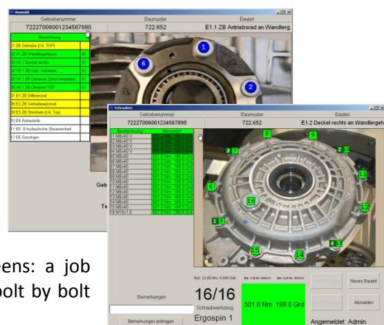

The ww\_hh software is an all-in-one solution for guiding an operator through the process steps needed when assembling parts in a production line. The main focus of the software is tightening operations, but it also supports other tools and manual operations like scanning or acknowledges.

The software is optimized for use in a production environment – it consists of two applications:

- The "runtime" application for use on the shop floor. This provides an easy to use and clearly visible interface for the operator – optimized for small screens and touch panel usage. The runtime application mainly consists of two screens: a job overview to see and choose jobs and a job detail view with bolt by bolt information for each rundown.
- The "configuration" application for defining the jobs, steps, workflows and other parameters of the actual process. This is a standard desktop application which uses larger screens and drag & drop mouse operations to set things up easily in a standard PC environment.

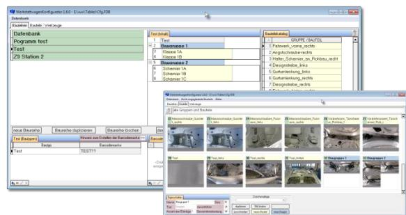

Both applications may live on the same PC, but may also be installed on different computers (one on the shop floor, one in the office). Data can be exchanged easily by copying a single file (can also be used for versioning/backups).

# **1.2 Features**

The major features of the software are:

- Support for multiple tightening tools: NEXO, ErgoSpin, tightening aggregates, electronic wrenches
- Manual confirmations and notes
- Fixed or free sequence of jobs, optionally selectable by barcode
- Stop and restart processing of units allows partially manufacturing, switch units and continuing later where you left off. The built-in database keeps track of every manufactured part and its state.
- Supports pre-tightening, final-tightening and post-process tightening operations on a single bolt
- Hierarchical assembly/job definition allows easy reuse of jobs/parts in different assemblies
- Support for additional I/O, e.g. socket trays, position sensors, … (over Ethernet/Profibus/USB)
- The internal data model supports change tracking of workflows changes in the workflow or job definitions stick to the individual unit. Each produced part is correctly connected to the workflow/job definition which was valid at the time of producing the part.
- Built-in XML data output
- Report viewer for searching and viewing rundown data, with usercustomizable reports
- Report data also includes tightening curves (for System 350 tools)

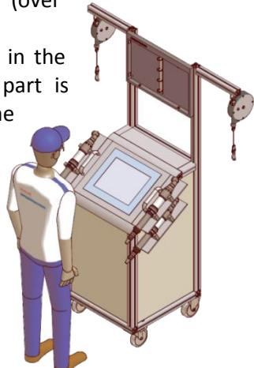

# **2 Installation**

Installing ww\_hh requires the steps outlined in the following sections.

Before starting the installation:

- Check Sales & Support for new service packs and fixes for ww\_hh
- Check Release notes for news
- Contact customers IT department for support

Please note that there is also a portable installation package of the configuration editor – this allows installing and running the configuration software on additional desktop PC's without the need for administrative privileges.

# **2.1 Installing ww\_hh**

#### **2.1.1 Unpacking**

The installer for the ww\_hh software is distributed in a zipped archive format. The archive contains the actual installer executable (ww\_hh-V1.x.x-setup.exe) as well as additional files used by the setup process. When unpacking the archive, make sure to keep the subdirectory structure of the archive – best practice is to unpack the installer archive into a newly created folder (can be removed after the installation).

#### **2.1.2 Running the installer**

The software installation is started by executing the ww\_hh-V1.x.x-setup.exe installation program. After startup, the installation program will lead you through the installation step by step.

First step is to select the target directory (installation directory).

Warning: Because of Windows 7 and Windows 8 file system virtualization, make sure to **not install** the software in the standard Windows program files (C:\Program files) folder!

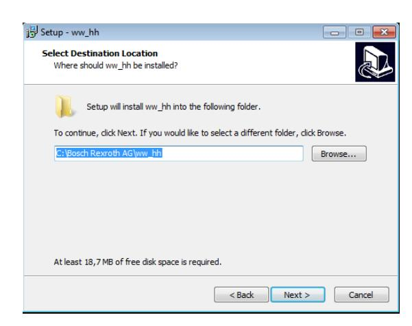

After choosing the target directory, the installer will ask for the components to be installed.

The installer basically provides two different installation modes:

- Operator PC installation ("full installation", including the application runtime ("monitor" with optional configuration application))
- Desktop/Office installation (configuration application only).
- Minimal operator PC installation ("Monitor software and Database browser…").

For an installation on the production line (on the Operator PC), the "full installation" (which is also the default installation type) is recommended.

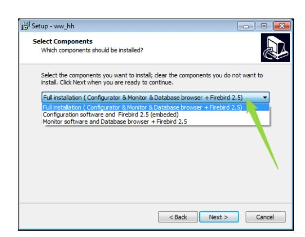

The next page allows choosing from a set of default configurations to get started quickly. Please choose the configuration from the dropdown which best matches your requirement:

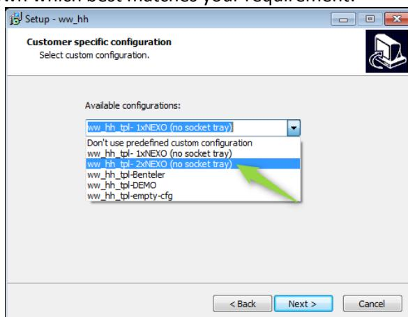

The final steps allow to choose a start menu group and to create a desktop shortcut. Please follow the dialogues and change the parameters as you like.

# **2.2 Software Activation**

Use of the software requires activation to enable all functions according to the purchased license.

*Note*: The software activation binds the software license and the software serial number to the computer name. An activation key is only valid for one computer. When replacing a computer (e.g. in case of a hardware defect), the software can be used without re-activation in case the computer name stays the same (as e.g. with an image backup/restore). Installing the software on a new system with a different computer name requires re-activation.

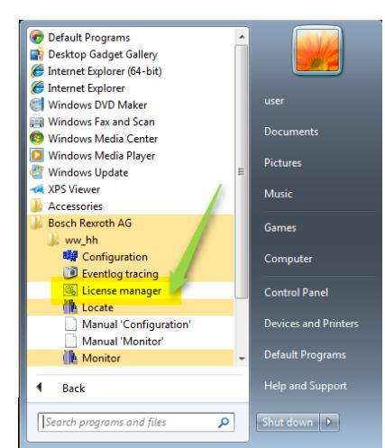

#### **2.2.1 Request an activation key**

After installation, the software runs in demo mode by default.

To activate the software, please start the software license manager from the start menu (default path):

Start All Programs Bosch Rexroth AG ww\_hh License manager

This starts the license manager:

Please see chapter [4](#page-9-0) for a sample walkthrough to configure a station with two Nexo tools. To follow the given procedure, choose the indicated selection here.

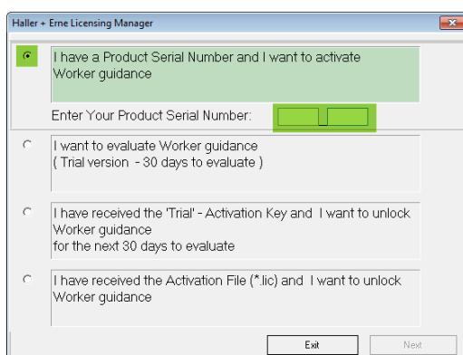

Check the first entry and enter your product serial number (from the CD cover or the purchase order receipt). Then click "Next".

In the following page, enter your license contact details and click the "Generate Registration Code" button in the middle:

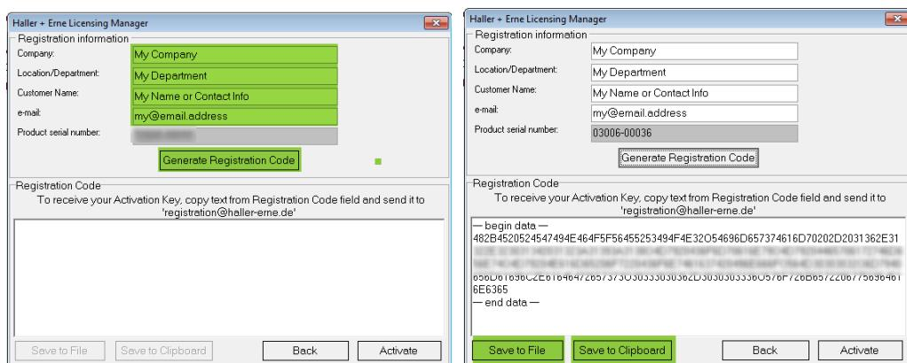

Then use the "Save to Clipboard" button or copy & paste the "Registration Code". Put the text into an email and send it to [contact@haller-erne.de](mailto:contact@haller-erne.de) or [activation@haller-erne.de](mailto:activation@haller-erne.de) to request an activation key based on the licensing information and serial number of the software. Your activation key will be emailed to you.

Close the license manager for now – the software license is not yet activated, but it requires starting the license manager again to finally unlock licensed mode. Please see the next chapter on how to proceed.

# **2.2.2 Activate the software**

After you have received the activation key, start the license manager again to activate the software for unlimited use according to your purchased license.

To activate the software, please start the license manager from the start menu (default path):

Start Bosch Rexroth AG Werkerführung License manager

This will bring up the license managers main screen again.

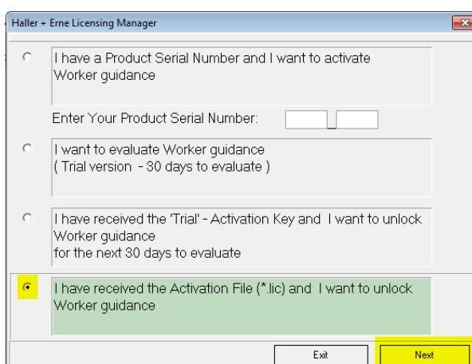

Now select the fourth option and click next (as shown above) to choose correct the licensing file:

In this screen, you can load (❶) the activation file (\*.lic) you received from us by email and click the "Activate" button (❷) to finalize the activation process.

*Note*: Restarting the software is required for the activation to become active. So either close and restart the application or reboot your computer.

#### **2.2.3 Folder structure**

The following screenshot shows the directory structure after installing the software into the default installation directory (<installation>-folder = C:\Bosch Rexroth AG\ww\_hh):

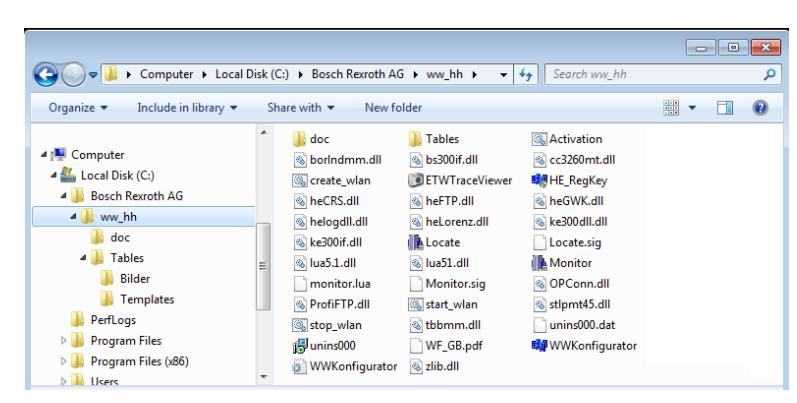

The main folders are:

- <installation>-folder: This contains all program executables as well as supporting files.
- <installation>\doc: Contains the documentation files in PDF format.
- <installation>\Tables: Contains the database files used by the software.
- <installation>\Tables\Bilder: This is a temporary folder for pictures used by the application.
- <installation>\Tables\Template: Contains configuration files for the application.

The installed applications (in the <installation>-folder) are (depending on the installation options not all may get installed):

- Monitor.exe: Main runtime application. This is responsible for showing the user GUI for jobs and controlling the tools. This application is required on the production line PC to control the tools.
- WWConfigurator.exe: Configuration application. This allows to setup the parts and bolt and associate tightening tools, barcodes, … This software can also be installed on an office PC not connected to the workstation itself to allow configuration of the jobs. The database file can be transferred to the workstation by usb-stick or network. For detailed information see section 4.5.4.
- Locate.exe: Database browser to access rundown data, search for rundown results, printout and export rundown data.
- ETWTraceViewer.exe: Diagnostic application to collect software trace data.

# **3 Configuration**

The configuration of the operator guidance software is split into three areas:

# **3.1 Station configuration**

This manages the basic software settings and all hardware-related configuration for a given station. The station configuration is contained in a Windows ini-file (normally "station.ini") in the <installation>\Tables\Template directory.

For more info see the Example configuration walkthrough in chapter [4.](#page-9-0)4 or the configuration file reference in chapte[r 6.](#page-32-0)

# **3.2 User interface configuration**

This contains the customized terms file (Alias.txt), multi-language support files and result report templates in the <installation>\Tables\Template directory.

# **3.3 Assembly and job process configuration**

This configuration is used to describe the process steps and bolt/part definitions. The configuration editor provides a graphical user interface to edit this configuration. The configuration file created by the configuration application is a self-contained archive which contains the job, bolt, part descriptions including the job pictures. So it can be used "off line" to configure the jobs and transported to the Operator PC on the line by simply copying a file. You can also keep multiple versions of the files to track changes.

Parts and jobs are configured using the graphical editor. For more information, please see the manual or the Example configuration walkthrough in chapter [4.](#page-9-0)5.

# **4 Example configuration walkthrough**

# **4.1 Overview**

The sample configuration walkthrough will set up a worker guidance system using two Nexo tools. The following steps are needed to get the system up and running:

- Check prerequisites
- Modify the Nexo tool settings
- Modify the system configuration for the Nexo tools
- Create a part definition using the configuration editor
- Import the configuration into the runtime
- Test everything by selecting a part and doing a few rundowns

# **4.2 Prerequisites**

Please check if these prerequisites are met before beginning the configuration:

- WLAN infrastructure is up and running
- PC and Nexo is connected to the wireless network
- ww\_hh software is installed (see chapter [2.1\)](#page-4-1) with the customer configuration "ww\_hh\_tpl-2xNEXO(no socket tray)" selected.

# **4.3 Nexo configuration**

To modify a NEXO configuration please login using your available Web-Browser and known NEXO IP address by typing the ip-address into the address bar of your browser.

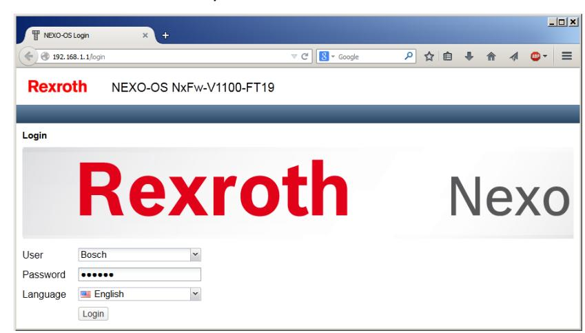

The description below assumes the following network addresses:

- Nexo 1 has the IP address <ip-nexo1> (e.g. <ip-nexo1> = 192.168.1.1)
- Nexo 2 has the IP address <ip-nexo2> (e.g. <ip-nexo2> = 192.168.1.2)
- PC has the IP address <ip-pc>

#### **4.3.1 Enable Open Protocol**

Select Settings Data connection Open Protocol

- The checkbox "Active" must be checked ❶ - Set TCP/IP port to 4545 ❷ - Save settings ❸

#### **4.3.2 Clear OK/NOK counter table**

Select settings OK/NOK counter

- Clear table
- Save settings

#### **4.3.3 Set up the PLC Signal mapping**

#### Select Settings PLC signals

- Activate 'oprctl' module ❶
- Set input signals on 'oprtcl' module according to the following chart: ❷

- Set output signals according to the following chart: ❸

- Save settings. ❹

| 0.0 | ActEn |
|-----|-------|
| 2.0 | Prog0 |
| 2.1 | Prog1 |
| 2.2 | Prog2 |
| 2.3 | Prog3 |
| 2.4 | Prog4 |
| 2.5 | Prog5 |
| 2.6 | Prog6 |
| 2.7 | Prog7 |
| 3.0 | En    |

| 0.0 | CCwSel   |
|-----|----------|
| 0.1 | InCy     |
| 0.2 | StartBn  |
| 0.3 | ActEnAck |
| 0.4 | Rdy      |
| 0.5 | NF       |

#### **4.3.4 Tightening program configuration**

To complete this example setup routine, you need to have the following tightening programs configured:

- Prg. 0
- Prg. 13 (loosen)
- Prg. 47

See the NEXO Documentation for more info on how to set up tightening programs.

# **4.4 Station configuration**

### **4.4.1 Station configuration**

After installing and activating the software, some basic changes in the station configuration file "station.ini" are required.

To edit the "station.ini" file, open it using a text editor (notepad). The file can be found in <installation>\tables\templates\station.ini (default <installation> is C:\Bosch Rexroth AG\ww\_hh). If the file "station.ini" is missing, then the custom configuration "ww\_hh\_tpl-2xNEXO(no socket tray)" was not selected during setup. In that case, please uninstall, reboot and reinstall again.

The following screenshots show the "station.ini" file opened in Notepad++:

Section GENERAL: The actual version of the configuration is 101:

*[GENERAL] Version=101 MANUALOK=0 NOK\_STRATEGIE=0 QUICK\_PROCESSING=1 STATION=0 SHOW\_WARNING=0 CHECK\_LIMITS = 1;*

Section TOOL\_DLL: Only "OpenProtocol" tool driver is enabled, all others are disabled.

*[TOOL\_DLL] OPConn.dll=1*

Section PRINTER: Printer output disabled

*[PRINTER]*

*ENABLED=0*

Section SERIAL: If you are using a barcode scanner set to keyboard emulation mode, leave this entry disabled. Otherwise you have to configure the COM port used (here: COM4, Baudrate 38400, Parity: none, Data bits: 8). Profibus and socket tray serial communication settings have to be disabled.

*[SERIAL]*

*Barcode=COM4 38400,n,8*

Section KOECHER: set this option to 1 to disable the socket tray.

*[KOECHER]*

*OHNE\_KOECHER = 1*

Section OPENPROTO: set TCP port number to 4545 (see chapter [4.3.1\)](#page-10-0). Here you can configure the actual NEXO tool IP addresses (for example: <ip-nexo1> = 192.168.1.1 / <ip-nexo2> = 192.168.1.2)

*[OPENPROTO]*

*PORT=4545*

*CHANNEL\_01=192.168.2.1*

*CHANNEL\_02=192.168.2.2*

Section USER: to perform changes in station configuration, at least one user with administrative rights must be assigned here by adding the value (3):

*[USER]*

*Bosch=Robert (3)*

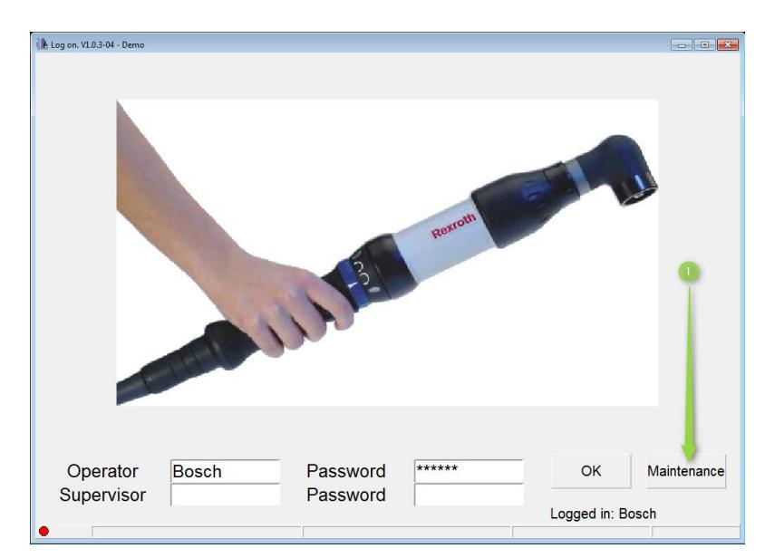

#### **4.4.2 Customized terms definition**

- Start MONITOR Software
- Log in as administrator
- Open 'Maintenance' function ❶
- Open Term Editor
- Edit term table (see image below)
- Save changes and close MONITOR software

Here you can change the denomination of the assembly, model, serial number etc. to match the station. For example, you can replace the predefined "Engine"-term, with "Vehicle body", "Axle" or "Gearbox ".

# **4.5 Assembly and job process configuration**

- Start Configuration software (ww\_hh Configuration / WWKonfigurator.exe)
- Open sample configuration Database "Demo-2xNEXO.FDB" located in the folder <installation>\Tables (C:\Bosch Rexroth AG\ww\_hh\Tables\ Demo-2xNEXO.FDB)

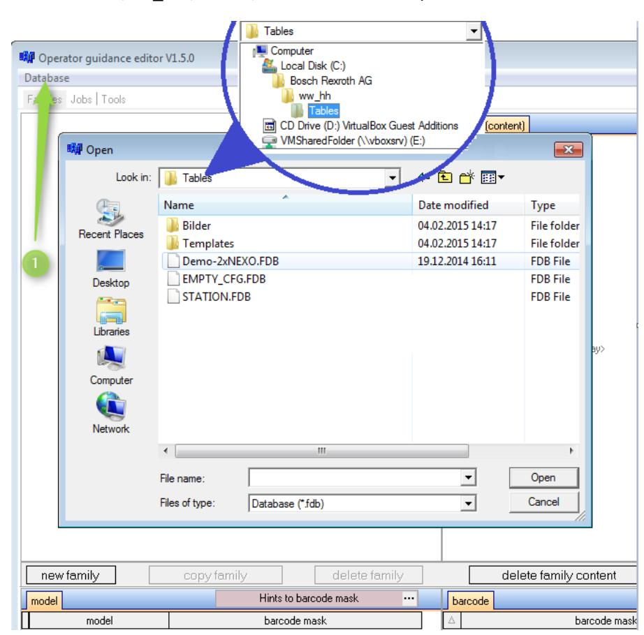

#### **4.5.1 Tool definition**

Switch to the tab "Tools". Two tool types are configured in this sample:

- NEXO type (NEXO)
- Manual operation (Hand)

Two tools of type NEXO are registered here (NEXO1 and NEXO2):

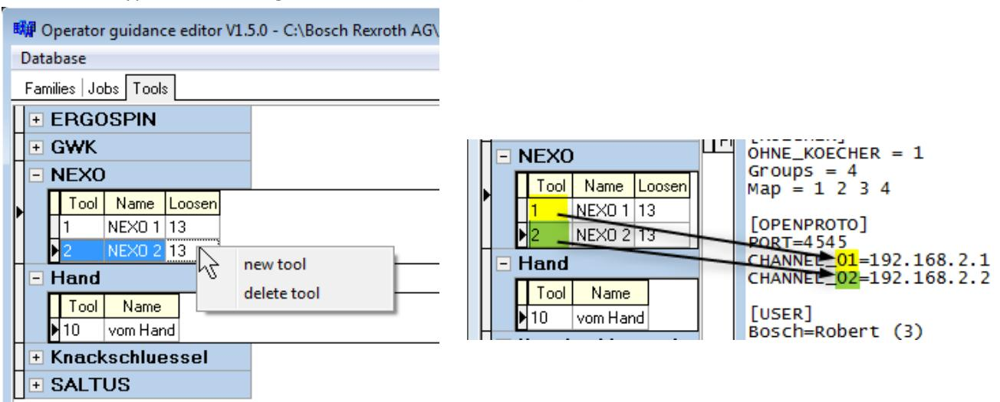

Possible operations on this table (see image above) are:

- Change tool number. This number relates to the number used in the configuration ([OPENPROTO])
- Change tool name. This name is what the worker sees in the MONITOR Software as tool identification.
- Change "Loosen" tightening program number. This program will be started automatically after each NOK bolting (if 0-NOK Strategy is selected)
- Add new tool (by calling popup menu)
- Delete tool (by calling popup menu)

#### **4.5.2 Job process configuration**

The following subsections describe in detail how to create a new job and edit its properties in the Configuration Software (ww\_hh Configuration.exe).

#### *4.5.2.1 New job creation*

Switch to the tab "Jobs". There are 3 predefined jobs already listed there.

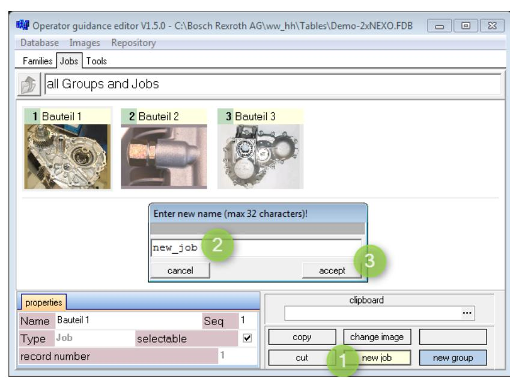

To create a new job:

- Press the button "new job" (see image above) ❶
- Enter job name ❷
- Confirm new job creation ❸

#### *4.5.2.2 Job image selection*

- Open pop-up menu by right-clicking the job (see image below) ❶
- Select the menu item 'change image' ❷
- Choose the desired image file from file directory ❸ (allowed formats: BMP, JPG, PNG) ❹

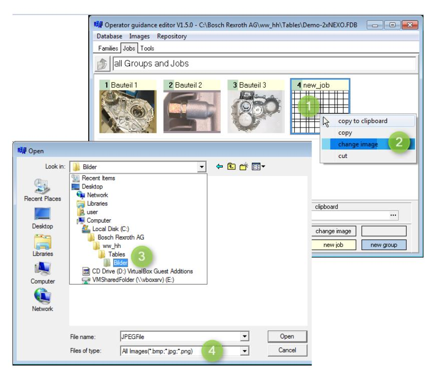

#### *4.5.2.3 Bolt positions*

Now you can select a job in the "Jobs" tab and open the bolting configuration editor by double clicking on the object image. The following screenshots show the bolting configuration editor after start:

- Bolt table ❶
- Job picture with bolt positions ❷
- Tightening operation table ❸
- Operation assignment table ❹
- Bolt info panel ❺

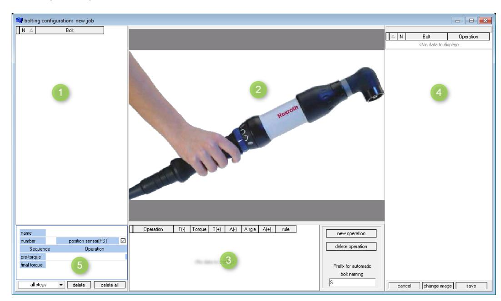

- Place a desired number of bolt positions in the job picture by using the pop-up menu or by mouse double-click
- You can edit the bolt names in the "bolt table" on the left

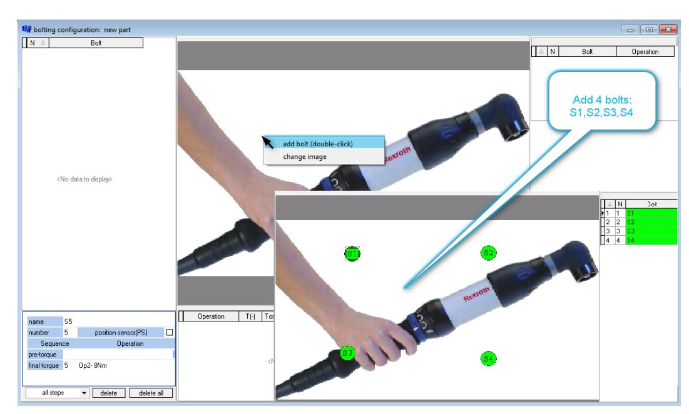

#### *4.5.2.4 Tightening operations*

To add tightening operations, the tightening operation table on the bottom of the screen is used. Please follow these steps (image below):

- Press the button "new operation" ❶
- Enter target values and limits (not mandatory, see parameter CHECK\_LIMITS in [4.4.1\)](#page-11-2) ❷
- Edit operation name ❸

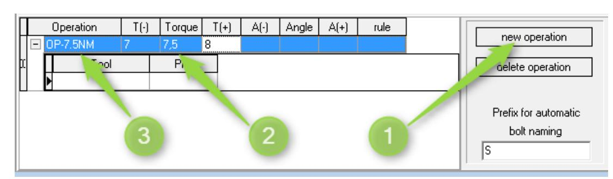

To select tool and tightening program:

- Activate tool selection ❶
- Select NEXO tool type ❷
- Select NEXO 1 tool ❸
- Accept tool selection ❹
- Enter tightening program number ❺

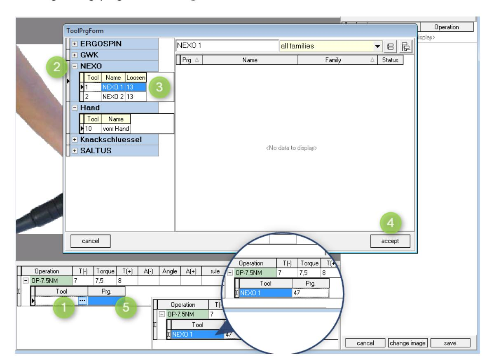

#### *4.5.2.5 Assigning bolt positions to tightening operations*

- Select a bolt position listed in the "Operation assignment table" (multiple selections allowed)
- Open popup menu (by right-clicking) ❶
- Select "add operation" ❷
- Select desired operation for current bolt position ( here: 'OP-7.5Nm') ❸
- Press button "save" to save part process configuration

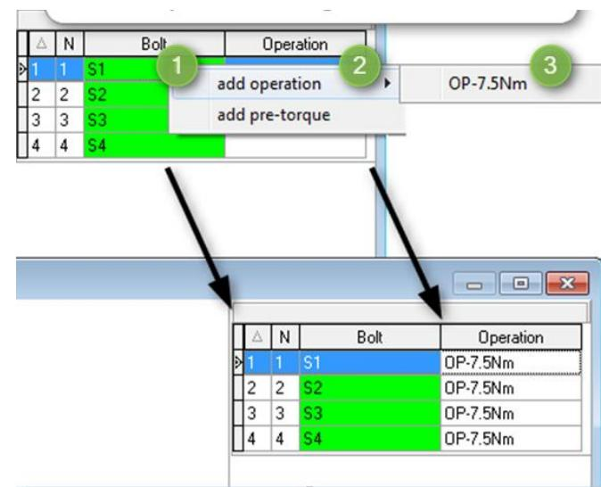

#### **4.5.3 Define process for a model family**

All models with identical tightening processes form a single "model family" (here: "Demo").

The "Demo" family here only contains one model: "Demotyp"

The following subsections will explain how to create and configure a new model and add it to a model family, modify the process order in a family and edit and save the current tightening process configuration.

The tab "Families" is divided into several parts:

- List of model families ❶
- List of jobs in process order ❷
- Job catalog ❸
- List of models for a selected family ❹
- Barcodes assigned to selected job ❺

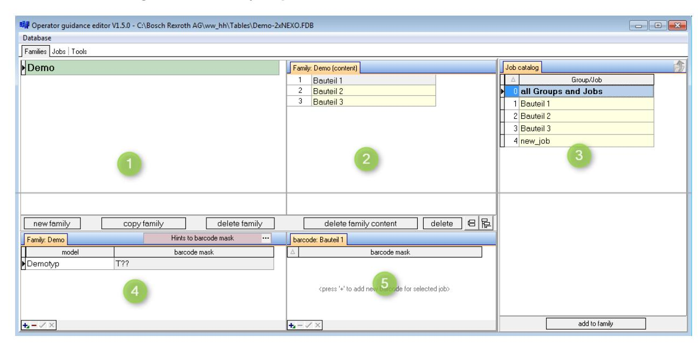

#### *4.5.3.1 Add new model*

- Select the desired family in the list of model families ❶
- Switch to the list of models ❷
- Add new model using pop-up menu(or button '+' in the left/bottom corner of the table) ❸
- Edit model name ❹ and related barcode mask ❺
- For information on the format of the barcode mask, click ❻

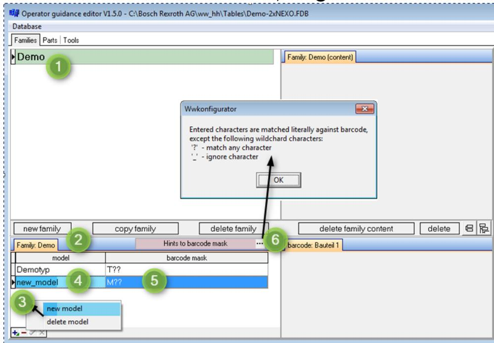

#### *4.5.3.2 Tightening process definition*

- Select the desired family in the list of model families
- Go to the "Job catalog" and select the job "new\_job" you created earlier. It should be the fourth job in the list of jobs.
- Add the job to the process sequence to its left by using the pop-up menu (or button "add to family" at the bottom of the screen)

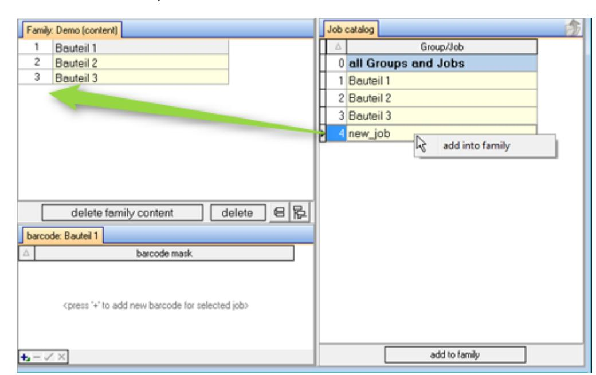

The job "new\_job" is now located at the end of the process sequence:

- You can move the job into the desired position by drag and drop:

- save current tightening process configuration (❶+❷):

#### **4.5.4 Import the configuration**

- Launch MONITOR Software
- Login as administrator (user name: Bosch password: Robert)
- Open the 'Maintenance' function ❶

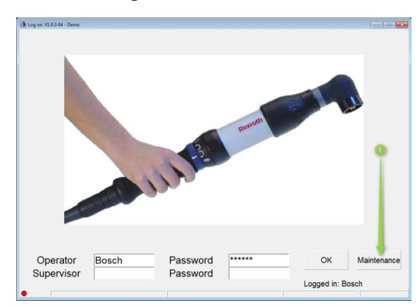

- Press "Import configuration" ❷
- Select Demo-2xNEXO.FDB ❸ and press "Open" ❹
- Wait for the program to confirm the update. ❺ It can take up to 1 minute depending on the size of the configuration file.

### **4.6 Test rundowns**

- Start MONITOR Software
- Log in as Operator
- Press OK button. The following screenshots show the user interface when the operator is logged on:

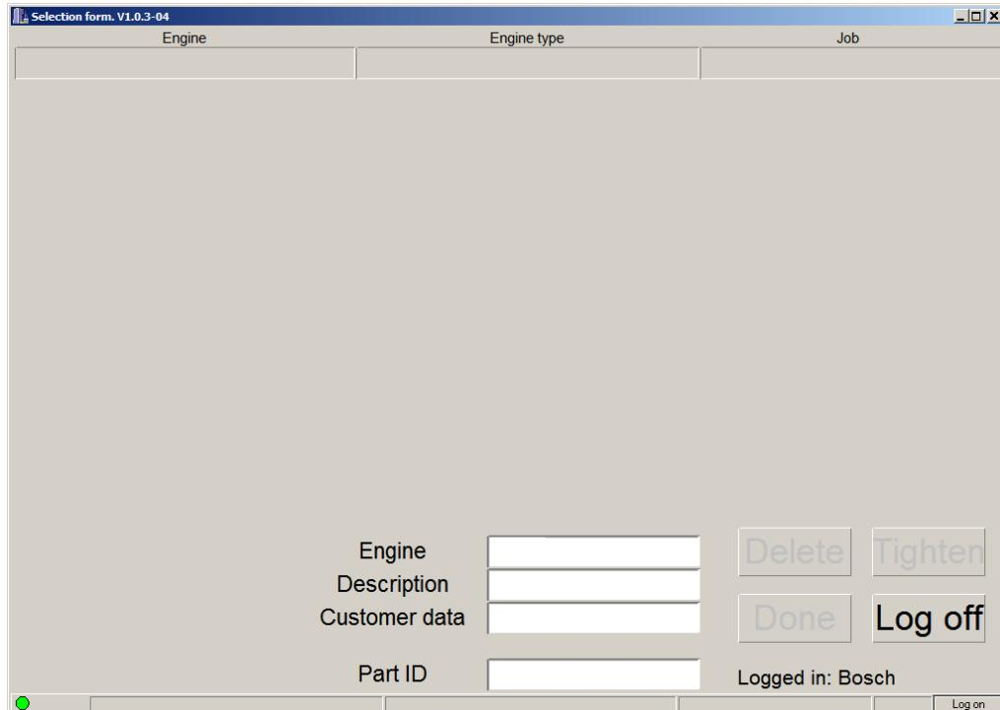

- Enter any engine serial number like "M01" ❷ for the test model "new\_model" you created earlier. The entered serial number has to correspond to the barcode mask defined in the configuration for "new model" ❶ (See [4.5.3.1\)](#page-19-0) If you are not using a barcode reader to enter the serial number, you can do it manually by keyboard,

but you have to confirm your entry by pressing Return/Enter.

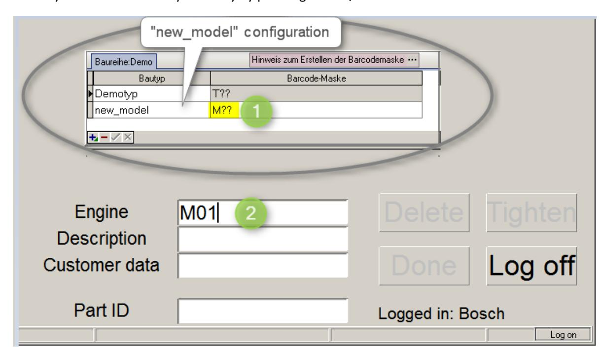

The Monitor looks like this after the engine serial number was successfully accepted: Bolt position [1] is highlighted as currently active position.

NEXO Bolter has to be ready for screwing and should display the following screen now:

- ❶ WLAN active
- ❷ start released
- ❸ previous result was OK
- ❹ starting tightening program 47

#### **4.6.1 Doing a successful rundown**

The program directly jumps to the first job ("new\_job"), because of setting "QUICK\_PROCESSING=1" in the Station.ini file (see [4.4.1\)](#page-11-2). If this setting is disabled the following screen appears and you have to press the button "Tighten" to continue):

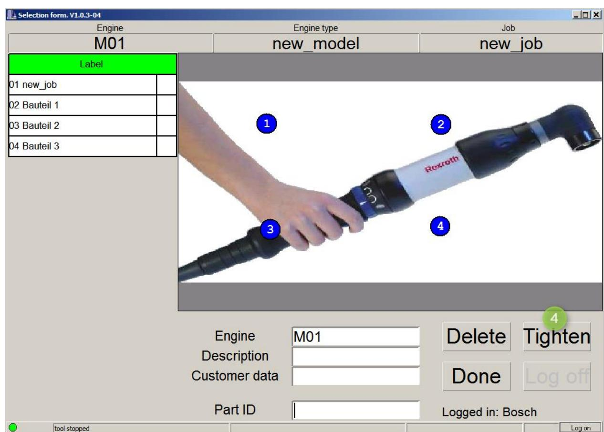

After successful tightening the first bolt at bolt position [1], the Nexo-bolter shows:

After successful tightening the first bolt at bolt position [1], the Monitor software looks like this:

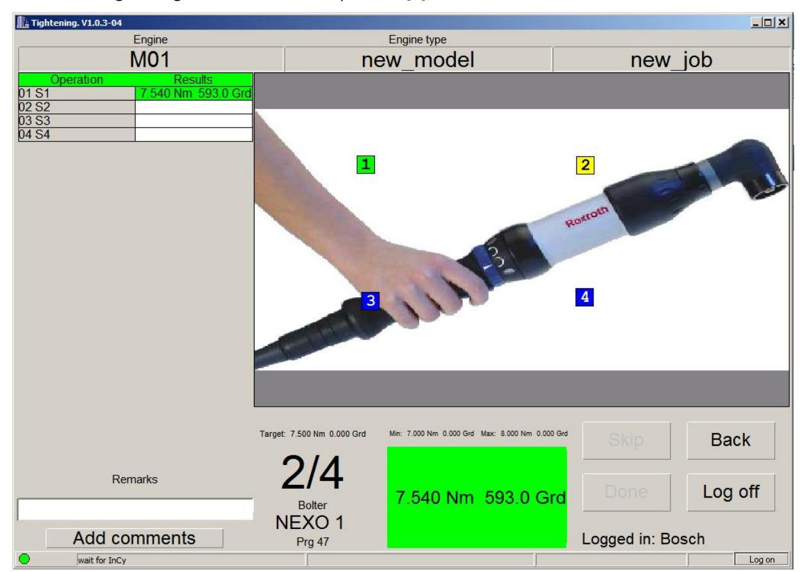

After all four bolts in "new\_job" have been successfully tightened, the program goes on to the next job "Bauteil 1":

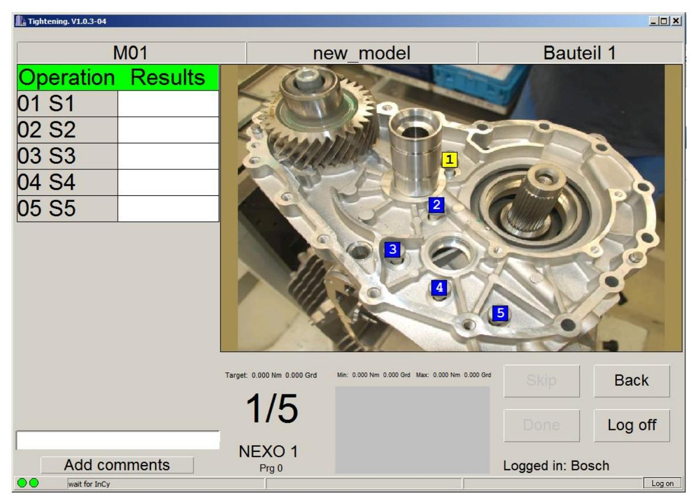

Then it goes on to the job "Bauteil 2" (this is a manual operation):

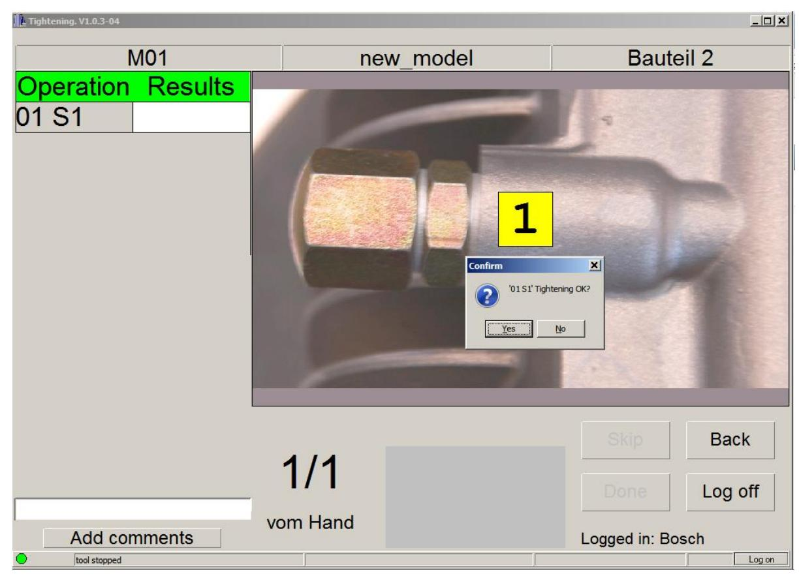

When doing a manual operation, you have to confirm the tightening result manually by clicking on the bolt position. After the confirmation, the program will jump to the last job "Bauteil 3".The following screenshot shows the screen before the last tightening operation in job "Bauteil 3" is completed:

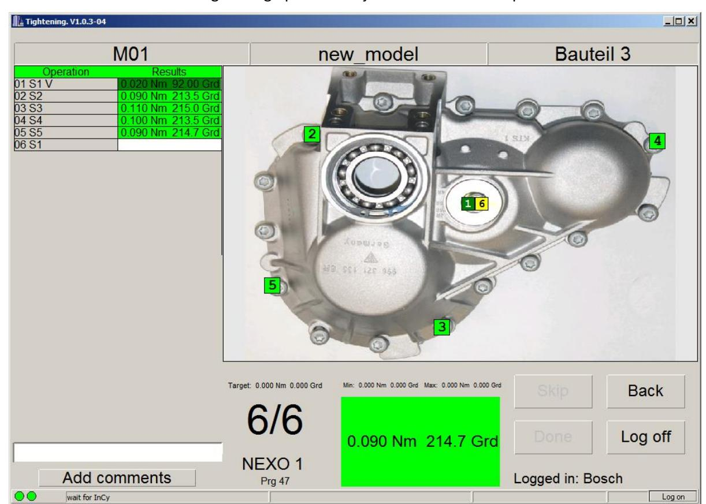

If the last tightening operation was successful too, the process is completed and the MONITOR software returns to its original state:

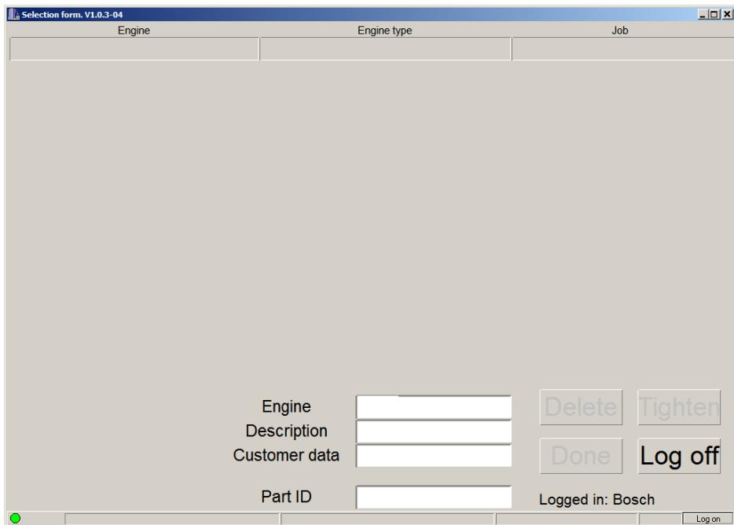

#### **4.6.2 Errors during a rundown**

If the tightening process was aborted in any job, the monitor shows the overview screen (list of all jobs with their status: green – OK, yellow – incomplete, red - NOK). You can restart the tightening sequence by pressing the button "Tighten" now and the program will automatically jump to the first bolt that is not tightened yet. E.g. aborted on job "Bauteil 1":

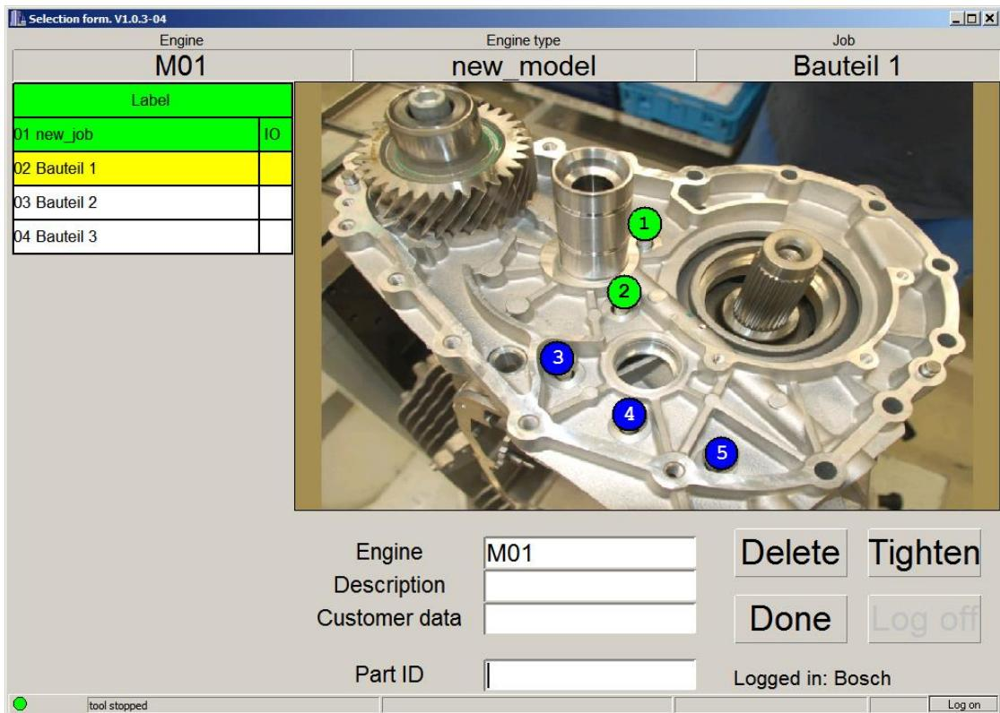

#### E.g. aborted on job "Bauteil 3":

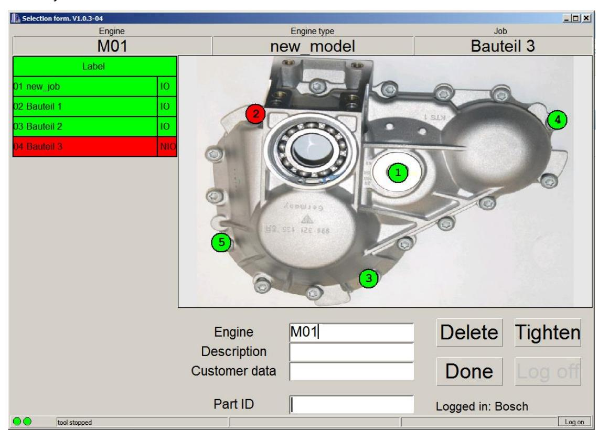

#### **4.7 Browse, search, export and print job results**

All data received from the processes is recorded into a local database. This includes rundown results, scanned IDs and manual operations.

To look into this data, start Locate.exe.

#### **4.7.1 Results grouped by job**

- Select the desired model from the list "Engine type" ❶
- Define the time period you wish to display ❷
- Select desired engine serial number ❸
- Select job ❹
- The table at bottom shows all tightening results for the selected job ❺

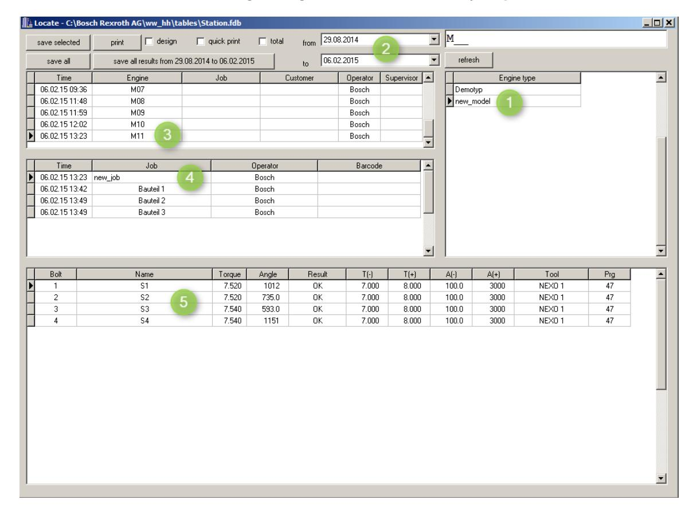

#### **4.7.2 Ungrouped results**

- Enable checkbox "total" ❶
- Select desired engine serial number ❷
- The table at the bottom shows all tightening results for the selected part ❸

# **5 Troubleshooting**

The Monitor application has built-in diagnostic functions to help diagnosis in case of problems getting the tools running. If the application cannot talk to the tool or the tool reports some error, then usually there will be a pop-up message informing the user of this condition.

Here is a sample screenshot:

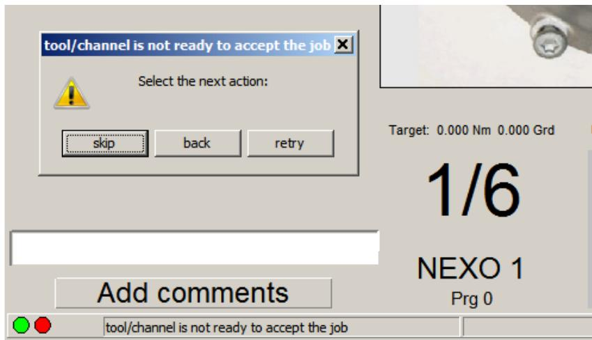

In this case, the tool is able to accept the next job – so the system informs the user and allows him to choose the next step (repeat, abort, skip). If the problem which triggered the pop-up message is resolved automatically, the pop-up message will close automatically. However, some errors need to be resolved manually (see below), in this case you might need to hit the retry button to re-enable the tool again.

If there is no popup on the screen and the tool still does not work, check the following:

- 1. Correct tool? The application might have another tool enabled – so you might simply be looking at the wrong (currently not active) tool.
- 2. Check the tool connection information in the GUI: The state of the tool connection is displayed in the bottom left corner of the UI. There is one indicator per connected tool (green = connection OK , red = connection not OK). To get additional information on each connection, click the indicators. This opens a new window with detailed information on each tool connection.
- 3. Check the status bar: The status bar shows the current internal step in the signal exchange with the tool. If the application waits for some user interaction, then this might block the tool from running, e.g. if NOK acknowledge is enabled, then the system might wait for the operator to hit the "NOK acknowledge button" before the operation can continue. Other similar states occur for the Cw/Ccw switch – if the switch is in Ccw position, then the tool cannot operate before it is brought back into the Cw position.

# **6 Reference**

#### **6.1.1 Configuration file locations**

The following screenshot shows the directory structure after installation of the software (the <installation>>\Tables\Template folder is shown).

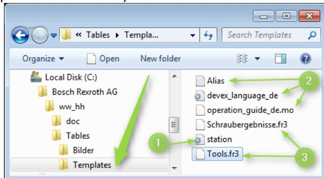

The actual configuration is located in "…\tables\templates\station.ini" file (1). The location is relative to the <installation> folder, so in the sample setup, the station configuration file can be found in:

c:\Bosch Rexroth AG\Werkstattwagen\tables\templates\station.ini

The customized terms table is located in "alias.txt" file (2), report templates in "\*.fr3" files (3).

# **6.1.2 Station configuration file**

The actual configuration file (station.ini) consists of a few sections which defines the overall behavior of the software as well as station specific configuration like tool and barcode connections, port and interface settings. The station configuration file contains the following sections and parameters.

NOTE: Changes to the configuration file are not immediately reflected in the software. The configuration file is read once after starting the application, so any changes require restarting the monitor.exe application!

### *6.1.2.1 Section [GENERAL]*

This section defines the general application behavior. The section contains the following keys:

- Version: Internal version number of the configuration file. Used to check compatibility between the configuration file and the application (must be set to 101)
- MANUALOK: this defines whether manual acknowledge of (tightening) operations is allowed by the user (by clicking on the bolt symbol in the runtime and choosing "skip"). The proper privilege is required in any case. Allowed values are: o 0 = not allowed o 1 = allowed
- CHECK\_LIMITS: this defines whether the plausibility definitions from the configuration are checked. If enabled, then plausibility violations (i.e. rundown results outside the plausibility limits) will stop the job process and force the rundown result to NOK even if the tool reported OK. Allowed values are: o 0 = disabled o 1 = enabled
- ABMELDEN: this defines the application behavior in case the logoff button is pressed. If enabled, then the application immediately quits after logoff, else the application returns to the login screen and awaits a new logon. Allowed values are: o 0 = disabled (do not close the application after logoff) o 1 = enabled

- NOK\_STRATEGIE (default = 0): this defines the global behavior for NOK rundowns. The following options are available: o 0 = stay on bolt and automatically select a loosening program after a NOK rundown. In this case the application automatically selects a configured loosen tightening program (e.g. prg #47) after a NOK rundown. This allows the operator to immediately loosen a bolt after a NOK rundown without the need to enable CCW operations (and without the operator switching the CW/CCW switch to CCW) – thus increasing the process security. Note that the operator still needs to acknowledge the NOK rundown (if enabled in the tools configuration) before he can start the loosening operation. Note also that the program used for the loosening operation must be defined in the "tool configuration" section of the configuration editor. o 1 = skip bolt after a NOK rundown. In this case the current bolt is marked NOK and the job continues immediately with the next bolt. o 2 = stay on bolt after NOK rundown. In this case the job re-enables the tool after a rundown, but stays on the current bolt. The next is only automatically selected after a OK rundown.
- QUICK\_PROCESSING: If enabled, then after scanning a serial number, the tool gets enabled immediately. If not enabled, then the operator must manually press the "tighten" button to start a job and enable the tool for the first bolt. He also must press the "finish" button to finalize the process. Allowed values are: o 0 = disabled (operator must press a button to start and finalize processing) o 1 = enabled
- STATION: This defines the station number. If a multi-station setup is used, the station number defines the actual jobs and bolts relevant for the current station. This allows keeping a central configuration database with all operations for multiple stations. Allowed values are: o 0 = no multi-station operation or rework station (access to all jobs and bolts defined in the configuration) o Valid station number: station number for this installation.
- STATION\_NAME: This defines the station name used in XML output file (see parameter DIRECTORY in section [XML])
- DBHost: (optional) This defines path to remote Database location (active if some common Database is used for multiple-stations setup)
- PART\_CHOICE\_THROUGH\_BARCODE: (optional, default = 0): If enabled, the (sub-)parts can be selected by scanning a part barcode. Note that this requires configuring a bacrcode for a part in the configuration. Allowed values are: o 0 = disabled o 1 = enabled
- LANGUAGE: (optional) this defines language of software interface if it differs from OS language setting. Currently supported languages: o LANGUAGE=en o LANGUAGE=de
- REWORK: This defines application behavior in case of rework (it is entered already processed serial number). Two scenarios are implemented: Scenario 1: continue previous processing (overwrite previous results) Scenario 2: start new processing with the same serial number (new instance in Database) The following keys are available: o CONTINUE - always Scenario 1 (default) o ASK\_IF\_OK - if previous processing was completed successfully then ask user what to do, else Scenario 1 o ASK - always ask user e.g.: REWORK= ASK\_IF\_OK

#### *6.1.2.2 Section [TOOL\_DLL]*

This section defines which tool types are available and which tool drivers to load.

Available keys are:

- OPConn.dll=1: load the OpenProtocol tool DLL.
- ProfiFTP.dll=1: load the System 350 tool driver (using Profibus, FTP and Curve data transmission).

Note: if an entry is missing or its value is set to 0, then the tool driver is not available.

#### *6.1.2.3 Section [XML]*

- DIRECTORY: this defines the destination folder for part tightening results saved in XML format.

e.g.:

DIRECTORY=C:\ww\_hh\XML

If parameter is missing or empty, then XML output is disabled.

Result\_OK / Result\_NOK / Result\_incomplete: define behavior of XML output driver accordingly to the OK/NOK/incomplete part tightening result.

The following keys are available:

o SKIP - do not save XML result file (default)

o SAVE - always save XML result file

o ASK - ask user if XML result file has to be written or not

e.g.:

Result\_OK=SAVE

Result\_NOK=ASK

Result\_incomplete=SKIP

#### *6.1.2.4 Section [CHART]*

This section defines how charts (tightening graphs) are generated for the print reports. This is used in combination with the ProfiFTP.dll tool driver (see above). The following keys are available:

- Width: defines the charts width in pixels.
- Height: defines the charts height in pixels.
- MaxAngle: defines the maximum angle range to be printed. The angle range is calculated "from the end", so lower angle values are eventually cut off.
- CrvRoot: Target folder to store the curve data files (in BS350 \*.crv format).

## *6.1.2.5 Section [PRINTER]*

This section defines the behavior for the report printout at the end of a process. The following keys are available:

- ENABLED: Defines whether a printout is generated automatically at the end of a process. Allowed values are: o 0 = no automatic printout (note that using the Locate.exe application a report/printout can always be generated later) o 1 = automatically print at the end of a process
- Template: Name of the report template to use for generating printouts/reports. The folder used to search for report templates is <installdir>\tables\templates.
- Mode: Mode for generating aprintout/report. The following values are allowed: o 0 = generate a printout (using the system default printer) o 1 = generate a PDF file with the report

#### *6.1.2.6 Section [SERIAL]*

This section defines the serial ports used by the application. The following keys are available:

- Profibus: defines the serial port used for the Profibus connection. This is usually used to control the Tightening System 300/350 over a USB Profibus adapter. A standard parameter would be "500000,e,8|halbduplex" for a 500kBit Profibus master setup.
- Barcode: defines the serial port used for a barcode scanner (if any).

- Koecher: defines the serial port used for connecting a Haller + Erne MSTKN socket tray (usually connected over a USB serial adapter). For a Haller + Erne Socket tray using the USB Serial cable, the parameters must be set to "115200,e,8|halbduplex"

Each entry has the following format:

<type>=COM<port> <parameters>

e.g.: Profibus=COM8 115200,e,8|halbduplex

- Where:
  - <type> is one of the driver types (e.g. Profibus, Barcode, Koecher, …)
  - <port> is the serial port number, e.g. 9 for COM9
  - <parameters> is a parameter string as used by the windows "mode" command to specify the baud rate, parity, handshake and other parameters, e.g. "115200,e,8|halbduplex"

#### *6.1.2.7 Section [OPENPROTO]*

This section defines the parameter used for the OpenProtocol tool driver. The following keys are available:

- PORT: TCP/IP port to use for OpenProtocol communication (usually 4545).
- CHANNEL\_<tool>: This defines a physical to logical tool mapping. The configuration database lists all tools with a logical tool number. The "CHANNEL\_<tool>=<parameters>" key maps the given logical <tool> from the configuration to a physical tool connected over OpenProtocol with the given <parameters>.

Example use for the CHANNEL\_<tool> key:

[OPENPROTO] PORT=4545 CHANNEL\_01=192.168.2.2 CHANNEL\_02=192.168.2.5

The example defines two OpenProtocol tools (NEXOs) with the following parameters:

- (logical) Tool 01 is at IP address 192.168.2.2 (using Port 4545)
- (logical) Tool 02 is at IP address 192.168.2.5 (using Port 4545)

So if the configuration defines a bolt which is tightened using tool 2, then the runtime knows that it needs to talk to the IP address 192.168.2.5.

#### *6.1.2.8 Section [KOECHER]*

This section defines the socket tray driver parameters. The following keys are available:

- OHNE\_KOECHER: If set to "0" enables the socket tray. If set to "1" disables the socket tray driver.
- Groups: defines the number of sockets used.
- Map: defines the socket number mapping. Usually (for a 1:1 mapping between physical and logical socket number) it is simply 1 2 3 4 (i.e. a sequence of logical socket numbers, in this case a 4-socket tray).
- IP: (optional) defines IP address in case of wireless connection to socket tray
- PORT: (optional) defines port number in case of wireless connection to socket tray (default = 502)

#### *6.1.2.9 Section [USER]*

This section defines the list of users allowed to use the software and their privileges. Basically three privileges are available:

- 1 = Operator: An operator is allowed to start a process, tighten and finish the process. An operator is not allowed to manually loosen a bolt (if the NOK strategy does not allow it) or to delete rundown results from the database.

- 2 = Supervisor: A supervisor is additionally allowed to manually start a loosening rundown and to delete data from the database. Deleting data from the database always resets the bolt/part state to untightened!
- 3 = Administrator: An administrator is allowed to import new configuration into the runtime. Therefore an administrator is required to update job/part/bolt definitions using the configuration editor.

The section contains a list of users and their password (as well as the privilege level) in the following form: <username>=<password> (<privilege>)

e.g. Bosch=Robert (3)

This defines a user "Bosch" with a password "Robert" and a privilege level of 3 (Administrator).

NOTE: username \*and\* password are case sensitive!