# Haller + Erne GmbH

## **heOGS - Tool configuration notes Application Note**

HEI-71-206 Version R19

## **Version history**

| Version | History                                                        | Author | Date       |
|---------|----------------------------------------------------------------|--------|------------|
| 1.0     | First release                                                  | he     | 2016-12-05 |
| 1.1     | Added step category information                                |        |            |
|         |                                                                | he     | 2016-12-15 |
| R05     | Added BOSCH EXAConnecT II                                      |        |            |
|         |                                                                | he     | 2017-03-15 |
| R07     | Added Nexo barcode scanner configuration                       | ic     | 2017-05-18 |
| R08     | Added Batch counter configuration                              | he     | 2017-05-30 |
| R09     | Added ID- Code (“Mode”) configuration for Nexo                 | he     | 2017-07-05 |
| R10     | Fixed CS351 configuration (chapte r 2.2)                       |        |            |
|         |                                                                | he     | 2017-07-05 |
|         |                                                                | rb     | 2017-12-06 |
| R13     | Added Pick2Light setup                                         |        |            |
|         | Added SCS Freedom 3 configuration                              |        |            |
|         |                                                                | he     | 2018-05-28 |
| R14     | Updated OpenProtocol driver configuration                      | ic     | 2018-06-22 |
| R15     | Added info for Jäger positioning system (I/O over CS351/IM24V) | he     | 2018-11-09 |
| R16     | Added info for barcode tool                                    |        |            |
|         |                                                                | ic, he | 2019-01-23 |
| R17     | Added Multi-Interface socket tray                              |        |            |
|         |                                                                | he     | 2019-08-14 |
| R18     | Added Ergospin PLC settings for CS351                          | il     | 2020-08-11 |
| R19     | Added SCS Freedom 4 configuration info                         | he     | 2020-08-20 |

# **About this document**

This document contains best practice information for setting up tools connected to the heOGS operator guidance software.

## **Table of Contents**

| 1     | Rexroth Nexo _______________________________________________________________________6    |
|-------|------------------------------------------------------------------------------------------|
| 1.1   | Tool configuration________________________________________________________________6      |
| 1.1.1 | System configuration__________________________________________________________6          |
| 1.1.2 | WLAN configuration __________________________________________________________8           |
| 1.1.3 | Open Protocol configuration ____________________________________________________8        |
| 1.1.4 | Barcode Scanner ____________________________________________________________10           |
| 1.1.5 | Data output configuration_____________________________________________________12         |
| 1.1.6 | Tightening program setup _____________________________________________________14         |
| 1.1.7 | Setup for manual acknowledge _________________________________________________15         |
| 1.1.8 | Diagnostics_________________________________________________________________15           |
| 1.2   | heOGS configuration_____________________________________________________________16       |
| 1.2.1 | Driver Setup________________________________________________________________16           |
| 1.2.2 | Driver Configuration _________________________________________________________16         |
| 2     | Rexroth CS351 with OpenProtocol _____________________________________________________17  |
| 2.1   | Tool configuration_______________________________________________________________17      |
| 2.1.1 | System configuration_________________________________________________________17          |
| 2.1.2 | Open Protocol configuration ___________________________________________________18        |
| 2.1.3 | Data output configuration_____________________________________________________21         |
| 2.1.4 | Tightening program setup _____________________________________________________21         |
| 2.1.5 | Diagnostics_________________________________________________________________21           |
| 2.2   | heOGS configuration_____________________________________________________________22       |
| 2.2.1 | Driver Setup________________________________________________________________22           |
| 2.2.2 | Driver Configuration _________________________________________________________22         |
| 3     | Rexroth KE350 Applications ___________________________________________________________23 |
| 3.1   | Tool configuration_______________________________________________________________23      |
| 3.1.1 | System configuration_________________________________________________________23          |
| 3.1.2 | Open Protocol configuration ___________________________________________________24        |
| 3.1.3 | Data output configuration_____________________________________________________25         |
| 3.1.4 | Tightening program setup _____________________________________________________25         |
| 3.1.5 | Diagnostics_________________________________________________________________25           |
| 3.2   | heOGS configuration_____________________________________________________________25       |
| 3.2.1 | Driver Setup________________________________________________________________25           |
| 3.2.2 | Driver Configuration _________________________________________________________26         |
| 4     | Crane TCI Multi_____________________________________________________________________28   |
| 4.1   | Crane TCI Multi configuration______________________________________________________28    |
| 4.1.1 | Communication settings ______________________________________________________28          |
| 4.1.2 | Tightening program configuration_______________________________________________28        |
| 4.1.3 | Data output configuration_____________________________________________________29         |
| 4.2   | heOGS configuration_____________________________________________________________29       |
| 4.2.1 | Driver Setup________________________________________________________________29           |
| 4.2.2 | Driver Configuration _________________________________________________________30         |
| 5     | GWK electronic torque wrench ________________________________________________________31  |
| 5.1   | GWK configuration ______________________________________________________________31       |
| 5.1.1 | Communication settings ______________________________________________________31          |
| 5.1.2 | Tightening program configuration_______________________________________________31        |
| 5.1.3 | Data output configuration_____________________________________________________31         |
| 5.2   | heOGS configuration_____________________________________________________________31       |
| 5.2.1 | Driver Setup________________________________________________________________31           |
| 5.2.2 | Driver Configuration _________________________________________________________32         |
| 6     | SCS Freedom 3/4 torque wrenches ______________________________________________________33 |
| 6.1   | Wrench configuration____________________________________________________________33       |

| 6.1.1 |                           | Communication settings ______________________________________________________33      |
|-------|---------------------------|--------------------------------------------------------------------------------------|
| 6.1.2 |                           | Tightening program configuration_______________________________________________34    |
| 6.1.3 |                           | Data output configuration_____________________________________________________35     |
| 6.2   |                           | heOGS configuration_____________________________________________________________35   |
| 6.2.1 |                           | Driver Setup________________________________________________________________35       |
| 6.2.2 |                           | Driver Configuration _________________________________________________________36     |
| 6.2.3 |                           | OGS editor tool registration and usage ___________________________________________36 |
| 6.3   | Firewall configuration    | ____________________________________________________________37                       |
| 7     | BOSCH EXAConnecT II       | _______________________________________________________________38                    |
| 7.1   | EXAConnecT configuration  | ________________________________________________________38                           |
| 7.1.1 |                           | Communication settings ______________________________________________________38      |
| 7.1.2 |                           | Tightening program configuration_______________________________________________39    |
| 7.1.3 |                           | Data output configuration_____________________________________________________39     |
| 7.2   |                           | heOGS configuration_____________________________________________________________40   |
| 7.2.1 |                           | Driver Setup________________________________________________________________40       |
| 7.2.2 |                           | Driver Configuration _________________________________________________________40     |
| 8     | MSTKN socket trays        | _________________________________________________________________41                  |
| 8.1   | General                   | _______________________________________________________________________41            |
| 8.2   | Wireless socket trays     | ____________________________________________________________42                       |
| 8.2.1 | Overview                  | __________________________________________________________________42                 |
| 8.2.2 | Notes                     | _____________________________________________________________________42              |
| 8.2.3 |                           | IP address & port number _____________________________________________________42     |
| 8.2.4 | Grouping                  | __________________________________________________________________43                 |
| 8.2.5 |                           | Group to Channel____________________________________________________________44       |
| 8.3   | Ethernet socket trays     | ____________________________________________________________45                       |
| 8.3.1 | Overview                  | __________________________________________________________________45                 |
| 8.3.2 | Notes                     | _____________________________________________________________________45              |
| 8.3.3 | Grouping                  | __________________________________________________________________45                 |
| 8.3.4 |                           | Group to Channel____________________________________________________________45       |
| 8.4   | Serial socket trays (USB) | __________________________________________________________46                         |
| 8.4.1 | Overview                  | __________________________________________________________________46                 |
| 8.4.2 | Notes                     | _____________________________________________________________________46              |
| 8.4.3 |                           | Serial parameters____________________________________________________________46      |
| 8.4.4 |                           | Configuring multiple trays _____________________________________________________47   |
| 8.4.5 |                           | Changing the socket mapping __________________________________________________48     |
| 8.4.6 | Grouping                  | __________________________________________________________________49                 |
| 8.4.7 |                           | Group to Channel____________________________________________________________50       |
| 9     | Manual Operation          | __________________________________________________________________51                 |
| 9.1   |                           | GUI popup_____________________________________________________________________51     |
| 9.1.1 |                           | Configure GUI popup_________________________________________________________51       |
| 9.1.2 |                           | Display of GUI popup_________________________________________________________51      |
| 9.1.3 |                           | Data output configuration_____________________________________________________52     |
| 9.2   | KEY input                 | ______________________________________________________________________52             |
| 9.2.1 | Check Database            | _____________________________________________________________52                      |
| 9.2.2 | Update Database           | ____________________________________________________________53                       |
| 9.2.3 |                           | Configure KEY input __________________________________________________________55     |
| 9.2.4 |                           | Display of KEY input __________________________________________________________56    |
| 9.2.5 |                           | Data output configuration_____________________________________________________56     |
| 9.3   | TOOL acknowledge          | ______________________________________________________________57                     |
| 9.3.1 |                           | Configure TOOL acknowledge __________________________________________________57      |
| 9.3.2 |                           | Display of TOOL acknowledge __________________________________________________58     |
| 9.3.3 |                           | Data output configuration_____________________________________________________60     |
| 10    | Modbus Tool Interface     | _____________________________________________________________61                      |

| 10.1   |                          | heOGS GUI___________________________________________________________________61         |
|--------|--------------------------|----------------------------------------------------------------------------------------|
| 10.2   | heOGS configuration      | ___________________________________________________________61                          |
| 10.2.1 |                          | Station configuration_________________________________________________________61       |
| 10.2.2 |                          | Workflow Editor_____________________________________________________________62         |
| 11     | Euchner EKS RFID key     | ______________________________________________________________64                       |
| 11.1   | heOGS configuration      | ___________________________________________________________64                          |
| 11.1.1 |                          | Station configuration_________________________________________________________64       |
| 12     | Jäger positioning system | ___________________________________________________________65                          |
| 12.1   |                          | System configuration___________________________________________________________65      |
| 12.2   | heOGS configuration      | ___________________________________________________________66                          |
| 12.2.1 |                          | Driver configuration__________________________________________________________66       |
| 12.2.2 |                          | Workflow editor configuration _________________________________________________66      |
| 12.2.3 | Workflow setup           | _____________________________________________________________67                        |
| 12.2.4 |                          | LUA configuration notes ______________________________________________________67       |
| 13     | Barcode entry            | ____________________________________________________________________68                 |
| 13.1   | Barcode tool             | _________________________________________________________________68                    |
| 13.1.1 |                          | Station configuration_________________________________________________________68       |
| 13.1.2 |                          | Workflow editor_____________________________________________________________68         |
| 13.1.3 | Usage                    | _____________________________________________________________________70                |
| 13.1.4 |                          | Data output configuration_____________________________________________________72       |
| 14     | Custom (LUA) tool        | ________________________________________________________________73                     |
| 14.1   | Overview                 | ____________________________________________________________________73                 |
| 14.1.1 |                          | Station configuration_________________________________________________________73       |
| 14.1.2 | LUA scripts              | _________________________________________________________________74                    |
| 14.1.3 |                          | Workflow editor_____________________________________________________________75         |
| 14.2   |                          | Custom tool with onscreen input _________________________________________________76    |
| 14.2.1 |                          | Station configuration_________________________________________________________76       |
| 14.2.2 |                          | Workflow editor_____________________________________________________________76         |
| 14.2.3 | Usage                    | _____________________________________________________________________77                |
| 14.2.4 |                          | Data output configuration_____________________________________________________77       |
| 14.3   | Sylvac BLE devices       | _____________________________________________________________77                        |
| 14.3.1 | Overview                 | __________________________________________________________________77                   |
| 14.3.2 |                          | Device configuration _________________________________________________________78       |
| 14.3.3 |                          | Station configuration_________________________________________________________79       |
| 14.3.4 |                          | Workflow editor_____________________________________________________________80         |
| 14.3.5 | Usage                    | _____________________________________________________________________80                |
| 14.3.6 |                          | Data output configuration_____________________________________________________81       |
| 15     |                          | Additional configuration____________________________________________________________82 |
| 15.1   |                          | FTP output driver______________________________________________________________82      |
| 15.1.1 | Overview                 | __________________________________________________________________82                   |
| 15.1.2 |                          | Station info channel 99 _______________________________________________________83      |
| 15.2   |                          | Pick2Light configuration ________________________________________________________83    |
| 15.2.1 |                          | Driver Setup________________________________________________________________83         |
| 15.2.2 |                          | Driver Configuration _________________________________________________________84       |
| 15.2.3 |                          | Editor Configuration _________________________________________________________84       |
| 15.3   | Barcode scanner          | ______________________________________________________________86                       |
| 15.4   |                          | User configuration_____________________________________________________________86      |
| 15.4.1 |                          | RFID reader logon/logoff ______________________________________________________86      |

# 1 Rexroth Nexo

The Nexo tool uses the open protocol interface to communicate with the heOGS software. In addition, data output can be enabled to send information out to the data collection package (Sys3xxGateway, QTrans or QualityR).

Nexo system requirements:

- Nexo Firmware >= V1300, recommended is >= V1300SP1

## **1.1 Tool configuration**

#### **1.1.1 System configuration**

#### **1.1.1.1 Operation mode and ID-Code configuration**

The Operation mode must be set to automatic (to allow controlling the tool through heOGS) and the ID code source must be set to "Open Protocol". In case multiple operation modes (columns) are defined (from firmware V1300 upwards), the correct column (with "automatic" operation mode) needs to be active.

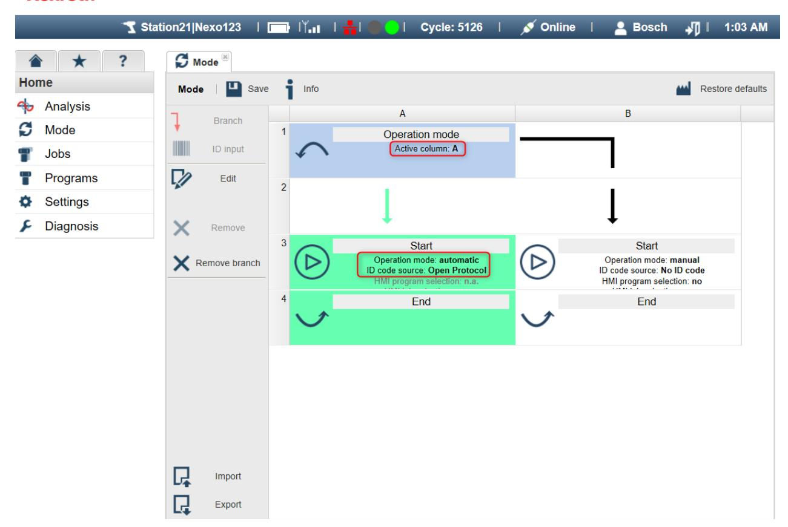

Typically, the ID code is sent to the tool through OpenProtocol. To make the tool accept these ID-codes and tag the results accordingly, please change the "Mode" settings as follows:

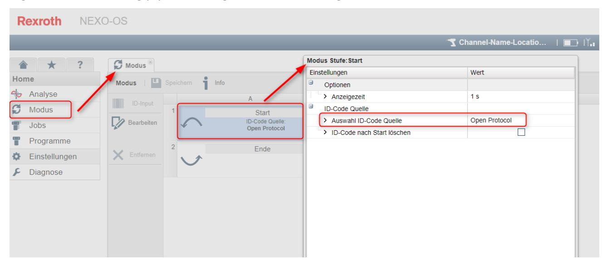

(double click the "Start"-step and change the ID-Code source to "OpenProtocol").

#### **1.1.1.2 Location information**

The system information is primarily used to setup location information for the tool. Make sure to setup at least a meaningful channel name and a unique channel number per station in the "configuration" settings:

Channel name: Nexo channel name is used to send station and channel name to the data collecting software (see chapter [1.1.5\)](#page-11-0). Station name and channel name are separated by | (pipe character):

*Station\_Name|Channel\_Name* - both Station and Channel name configured

*|Channel\_Name* - no station name is reported (i.e. the IP address is used by default), the name given is used as channel name only.

*Station\_Name|* **-** the name given is used as station name only, channel name Is built as ChRack.Slot (Ch00.1)

*Name* - if the pipe character is missing, then Station and Channel names are equal

#### **1.1.1.3 Performance optimizations**

To optimize performance on the tools end, reduce the default number of tightening results stored in the "Result storage" settings:

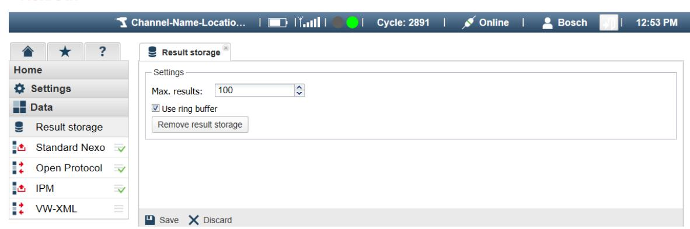

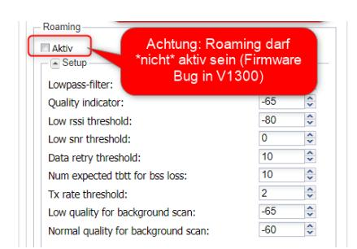

#### **1.1.2 WLAN configuration**

In Nexo Firmware < V1400 roaming does not work reliably. Therefore, it is required to disable roaming for Firmware versions < V1400 in Settings → WLAN:

#### **1.1.3 Open Protocol configuration**

#### **1.1.3.1 Setup and enable Open Protocol**

The Open Protocol driver should be set up as follows:

**Important**: For firmware >= V1300SP1 the setting "Drop Enable when disconnected" should be set to "at once" (which actually means "immediately") to ensure guaranteed control over the tool from the heOGS software under all circumstances.

#### **1.1.3.2 Setup PLC signals**

To allow controlling the tool correctly, the PLC signals should be set up as follows:

#### **Important**:

- Never assign signal "En" to opctrl input 3.0 this may enable the tool without control of the heOGS software.
- Never assign signal "En" to tool input 0.2 this will enable the tool without control of the heOGS software.
- Always assign signal "CcwIgnore" to opctrl input 0.1. This is used as a workaround to problems in the OpenProtocol network protocol – it prevents the operator from loosening if the network connection to the tool gets lost.

#### **1.1.4 Barcode Scanner**

Some Nexo models provide a built-in barcode scanner. This barcode scanner can be used instead of or in combination with any other ID-Code source. Using the Nexo scanner, it is therefore possible to start a workflow, select jobs or do other scan operations inside a workflow.

Please see the Nexo system manual for detailed information about how to use and configure the scanner. The following section shows a simple setup which allows to user to trigger the Nexo builtin scanner by pressing a button below the Nexo display.

#### **1.1.4.1 Configure Nexo to forward scanned barcodes to OGS**

To use the Nexo built-in barcode scanner instead of an external scanner to start an OGS job, Nexo must be set to forward scanned barcodes to OGS. To make this work, the mode start steps ID-Code source must be set to "Open Protocol" and an additional ID-Input step is required with ID-Code source set to Nexo scanner as shown on the right.

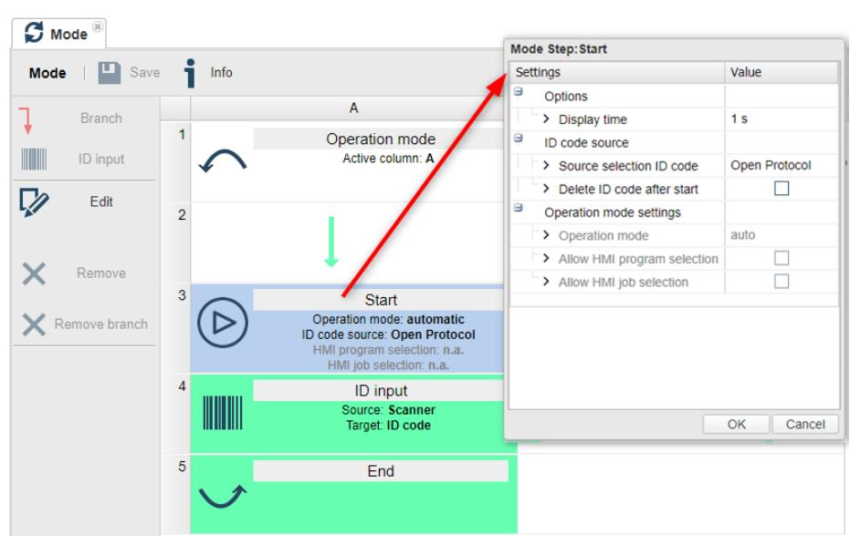

The Settings for the ID input step should be as shown on the right – this will enable scanning by setting the CW/CCW-Switch to the middle position (as long as the PLC assignment table is also setup correctly – see below, chapter [1.1.4.2\)](#page-10-0).

To make the OpenProtocol driver correctly forward the ID-Code, check that the OpenProtocol settings (Settings → Data → OpenProtocol) are as follows (make sure to allow "also forward ID codes from non-selected sources):

#### **1.1.4.2 Configure Nexo to scan at a button press**

Enable the barcode scanner here:

To enable scanning through the buttons below the Nexo display, assign the ActScan signal accordingly:

Note the following assignments:

- Tool 0.4: left button below display
- Tool 0.5: middle button below display
- Tool 0.6: right button below display

The tool will show the mapped signals, if the CW/CCW switch is set to the idle (middle) position (see screenshot on the right, note that here the signals ManOp, ActScan and CntRes are assigned to the 0.4, 0.5 and 0.6 tool inputs).

#### **1.1.4.3 Configure heOGS**

To enable barcodes from the tool, change the options in the heOGS tool driver (in station.ini) as follows:

Please also see chapter [1.2](#page-15-0) for more information on the tool driver settings.

#### **1.1.5 Data output configuration**

To send data out to a central QTrans/Sys3xxGateway/QualityR server, typically the following options are possible:

- 1. Use the "Standard Nexo" data output with the FTP transfer option (preferred). By default transmits all step data and tightening curves, but sometimes causes troubles with the network infrastructure (firewall transversal).
- 2. Use the "IPM" data output. By default reports "last step" data and curves.

The "Standard Nexo" data output with FTP transfer is the preferred option, if FTP is not allowed/supported (due to firewalling/natting), then use the "IPM" data instead.

Data reported to Sys3xxGateway will use the following mapping by default:

- Nexo IP address-->Default Sys3xxGateway station name
- Nexo channel name --> if non-empty is used as Sys3xxGateway station name
- Nexo channel number --> Sys3xxGateway channel number
- Tightening program name --> Used as operation name (QWX)

**Warning**: only enable a single data output, else you will see double-data set on the servers end!

#### **1.1.5.1 Configure Standard Nexo FTP**

Configure the FTP data output as follows (User, Password and Directory are ignored for QTrans, Sys3xxGateway and QualityR, but might be needed for 3rd party servers):

To make sure all data is correctly sent out to the server, check the "Data" (button on the bottom toolbar) contains the following (typically everything should be checked):

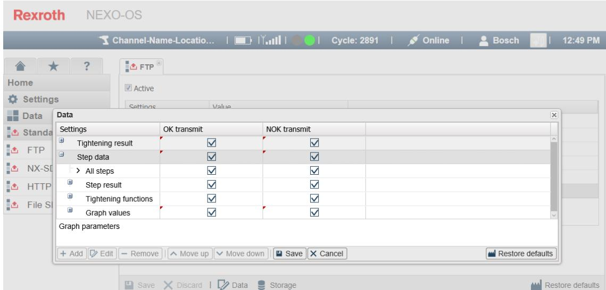

Notes:

- Step data output: The tool should be set to send out all data (as described above). However, by default only the last step data is actually processed by QTrans/Sys3xxGateway/QualityR.
- To send enable additional step data, change the step category to a non-zero value for each step you want to see in the result data.

#### **1.1.5.2 Configure IPM**

**NOTE**: The preferred data output is "Standard Nexo FTP" (see above). Make sure to only enable a single data output, else you will see double-data set on the servers end!

IPM should be configured as follows (change the IP-Address to match the servers IP and modify the ID-Code mask to include as much characters as needed):

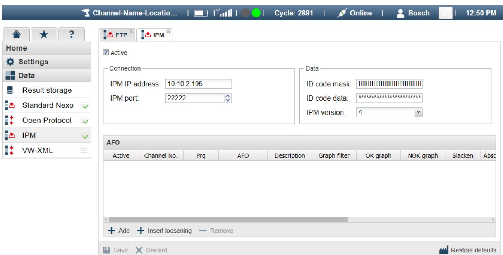

- Step data output: by default, only the final step data is sent out.
- To enable multi-step data output for IPM, AFOs need to be added (see the Nexo manual).

#### **1.1.6 Tightening program setup**

By default, only the last step data is recorded in the data collection package. Note that the various data output protocols behave differently regarding to the amount of data sent:

- OpenProtocol (heOGS) always sends out final angle and torque values.
- Nexo Standard (FTP) only sends out data values if monitoring is active in the tightening program \*and\* the data output setting allows for sending out this data (enabled accordingly for angle/torque actual, limit, …)

Regarding data from multiple steps there are also setup requirements:

- OpenProtocol: only supports final step data.
- Nexo Standard (FTP): Two requirements must be met: o Enable step output in the driver configuration o Change the step category in the tightening program setup to non-zero

Here is a screenshot on how to setup the tightening program correctly to enable data output for angle and torque for the Pre-Torque step:

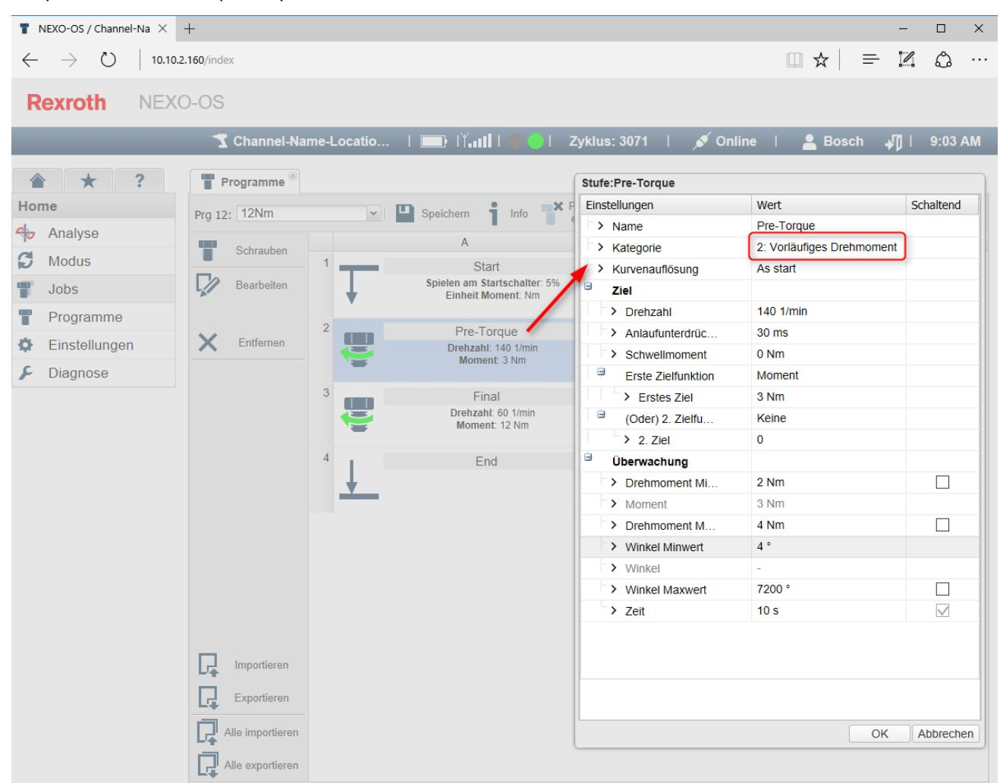

- Monitoring Angle is enabled and a minimum and maximum angle is given
- Monitoring Torque is enabled and a minimum and maximum torque is given

#### **1.1.7 Setup for manual acknowledge**

To use the tool as "manual acknowledge" input (see chapter [9.3\)](#page-56-0), the tightening program should be setup similar to the following (simple wait step without the tool actually turning). An OK will then generated whenever the operator holds the tool button for more than the given waiting time.

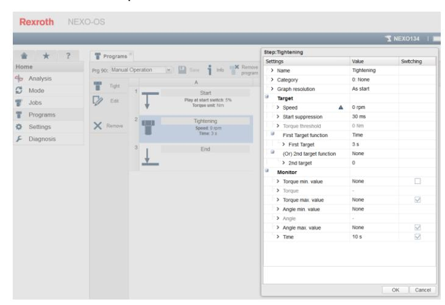

#### **1.1.8 Diagnostics**

To get more detailed diagnostics, the relevant pages must be enabled in the user permissions:

## **1.2 heOGS configuration**

#### **1.2.1 Driver Setup**

Rexroth Nexo uses the OPConn.dll tool driver. To enable this driver, please make sure to setup the section [TOOL\_DLL] as follows:

#### **1.2.2 Driver Configuration**

The heOGS tool driver is configured in the station.ini file as follows (make sure to set the ….\_TYPE parameter to NEXO):

To use the builtin barcode scanner with Nexo, please see chapte[r 1.1.4.3\)](#page-11-1)

# 2 Rexroth CS351 with OpenProtocol

The CS351 system uses the open protocol interface to communicate with the heOGS software. In addition, data output can be enabled to send information out to the data collection package (Sys3xxGateway, QTrans or QualityR).

CS351 system requirements:

- CS351 Firmware >= V2.400

Note: this is an updated recommendation, using the "simple" OpenProtocol enable commands (not ActEn).

## **2.1 Tool configuration**

## **2.1.1 System configuration**

#### **2.1.1.1 Location information**

The system information is primarily used to setup location information for the tool. Make sure to setup at least a meaningful channel name in the Administration → Location Names settings:

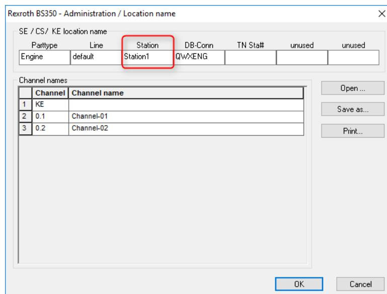

used for data output (see chapter [2.1.3\)](#page-20-0) as follows:

- field 1: assembly type (engine, transmission, ...)
- field 2: line name
- field 3: station name
- field 4: database alias (important for Sys3xxGateway)
- field 5: *not used*
- field 6: *not used*
- field 7: *not used*

#### **2.1.1.2 Setup Batch Counters (OK/NOK Counters)**

To make sure the OpenProtocol interface correctly runs single rundowns, setup OK/NOK counters (under System → OK/NOK counter configuration) as follows:

#### **2.1.2 Open Protocol configuration**

#### **2.1.2.1 Setup and enable Open Protocol**

The Open Protocol driver (under System → Tightening Cell Data → Open Protocol) should be set up as follows:

#### **2.1.2.2 Setup ID Code source**

#### The ID Code

source (under System → Tightening Cell Data → ID Code) should be set up as follows:

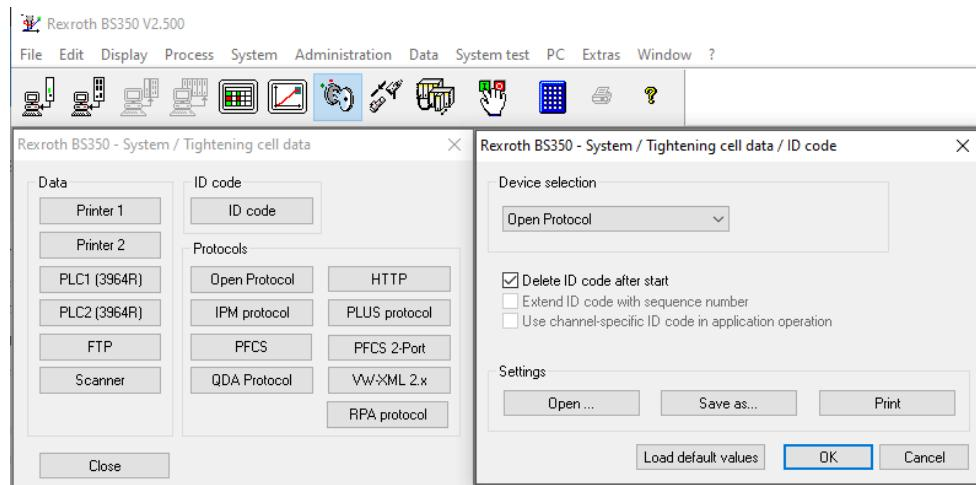

#### **2.1.2.3 Setup PLC signals**

To allow controlling the tool correctly, the PLC signals should be set up as follows (System → SE/CS PLC) assignment table:

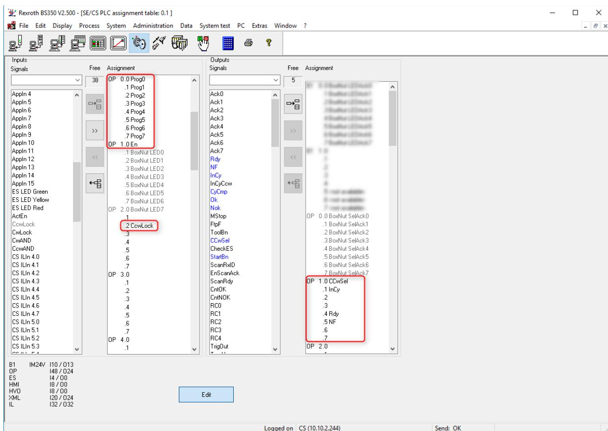

#### **2.1.2.4 Setup Ergospin PLC signals**

#### **2.1.2.5 Setup PLC signals for use with IM24V**

OpenProtocol supports connecting 8 userdefined I/O-signals (8 inputs, 8 outputs). This can be used to e.g. connect an external positioning system to the OGS software.

The following setup shows an example use – note that the Signals AppInX and AppOutX are a virtual bridge, i.e. the status of the AppInX signal is automatically reflected in the AppOutX status. This is used to route between the OpenProtocol signals and the actual hardware signals.

The user defined signals are available as follows:

- 8 output signals: In the "Inputs" section of the PLC assignment table, at module OP 3.0-3.7. These signals are written by OGS.
- 8 input signals: In the "Outputs" section of the PLC assignment table, at module OP 2.0-2.7. These signals are read by OGS.

The sample setup below connects the in- and outputs to an IM24V card at slot B1.

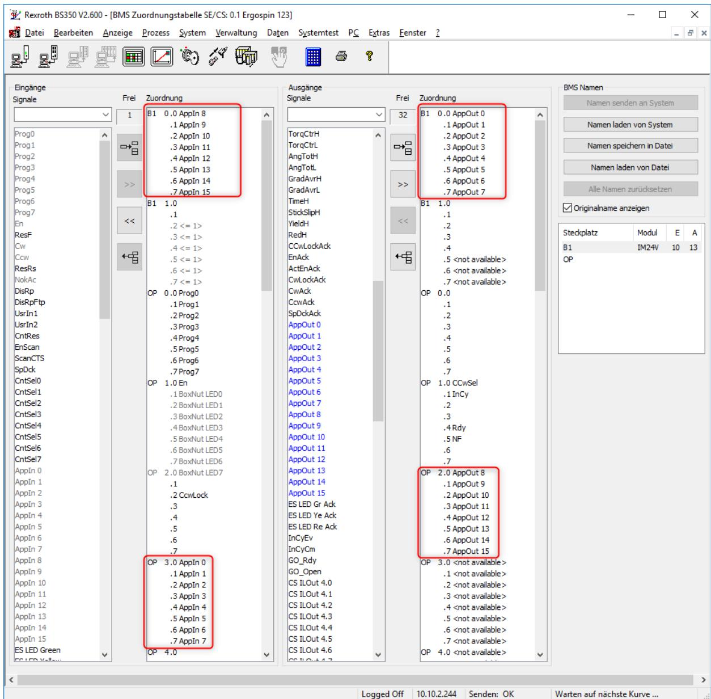

#### **2.1.3 Data output configuration**

Data reported to Sys3xxGateway will use the following mapping by default:

- CS351 IP address-->Default Sys3xxGateway station name
- CS351 channel name --> if non-empty is used as Sys3xxGateway station name
- CS351 channel number --> Sys3xxGateway channel number
- CS351 location names (see chapter [2.1.1.1\)](#page-16-3):
- Tightening program name --> Used as operation name (QWX)

#### **2.1.4 Tightening program setup**

Tbd.

# **2.2 heOGS configuration**

### **2.2.1 Driver Setup**

Rexroth Nexo uses the OPConn.dll tool driver. To enable this driver, please make sure to setup the section [TOOL\_DLL] as follows:

#### **2.2.2 Driver Configuration**

The heOGS tool driver is configured in the station.ini file as follows (make sure to set the …\_TYPE parameter to CS351):

# 3 Rexroth KE350 Applications

The KE350 system uses the "Ford" open protocol interface to communicate with the heOGS software. The "Ford" open protocol interface allows running tightening applications, i.e. multi-spindle tools. However, only a single "application" is supported, i.e. a single KE can only control a single (possibly multi-spindle) tool.

In addition, data output can be enabled to send information out to the data collection package (Sys3xx-Gateway, QTrans or QualityR).

KE350 system requirements:

- CS351 Firmware >= V2.400

Notes:

- This uses the "Ford multispindle" MIDs.
- Only a single application can be controlled, so this is typically used for a multi-spindle aggregate/tool. For each tool a single KE \*must\* be used, it is \*not\* possible to control multiple tools at the same time independently!

## **3.1 Tool configuration**

#### **3.1.1 System configuration**

#### **3.1.1.1 Location information**

The system information is primarily used to setup location information for the tool(s). Make sure to setup at least a meaningful channel name in the Administration → Location Names settings:

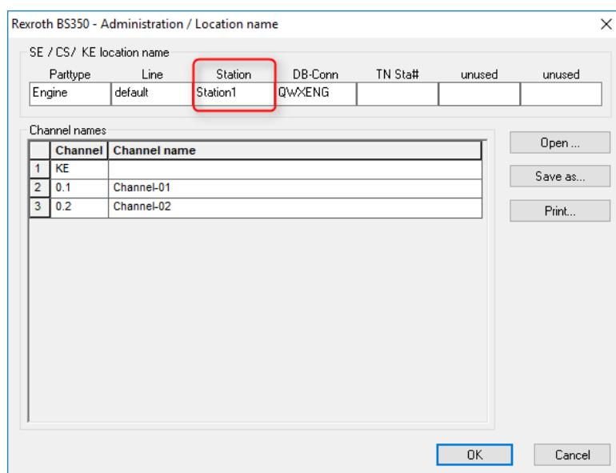

#### **3.1.1.2 Setup tightening applications and programs**

Tbd.

#### **3.1.2 Open Protocol configuration**

#### **3.1.2.1 Setup and enable Open Protocol**

The Open Protocol driver (under System → Tightening Cell Data → Open Protocol) should be set up as follows:

Please make sure to check "Auto-disable application", this will ensure the tightening system disables the application after each rundown automatically.

Notes:

- For special cases (then also requires IndraLogic code running in the KE350) the "Forward I/O signals to IL" can be used. Control can then be chained – the IL gets controlled by the heOGS software, but can itself control the tightening system.

#### **3.1.2.2 Setup PLC signals**

To allow controlling the tool correctly, the PLC signals should be set up as follows (System → SE/CS PLC assignment table:

Make sure to set FO1 Disable to OP 5.1!

#### **3.1.3 Data output configuration**

Tbd.

#### **3.1.4 Tightening program setup**

Tbd.

### **3.1.5 Diagnostics**

In case there is no response from the tool or it indicates disconnect, check the System 350 Error log under System test → SE/CS error list…

## **3.2 heOGS configuration**

### **3.2.1 Driver Setup**

Rexroth KE350 uses the OPConn.dll tool driver. To enable this driver, please make sure to setup the section [TOOL\_DLL] as follows:

#### **3.2.2 Driver Configuration**

The heOGS tool driver is configured in the station.ini file as follows:

Nicht korrekt

# 4 Crane TCI Multi

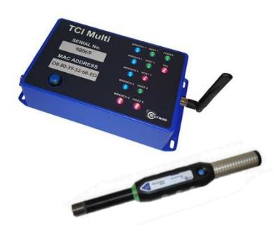

The TCI Multi is a RF Ethernet gateway for use with the Crane WrenchStar Multi electronic torque wrenches. It uses the open protocol interface to communicate with the heOGS software. In addition, data output can be enabled to send information out to the data collection package (Sys3xxGateway, QTrans or QualityR).

## **4.1 Crane TCI Multi configuration**

The TCI Multi is configured through the Crane TCI Multi web page.

The sections below show the web pages for Firmware V: 184-2.05 / 162-5.0.

### **4.1.1 Communication settings**

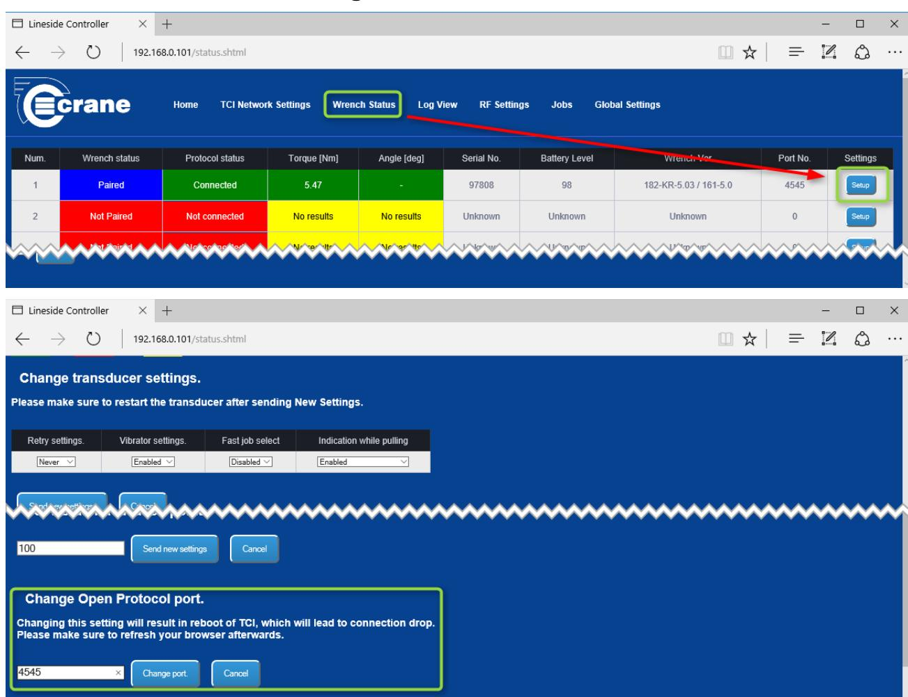

## **4.1.2 Tightening program configuration**

Performance: set batch count to 0!

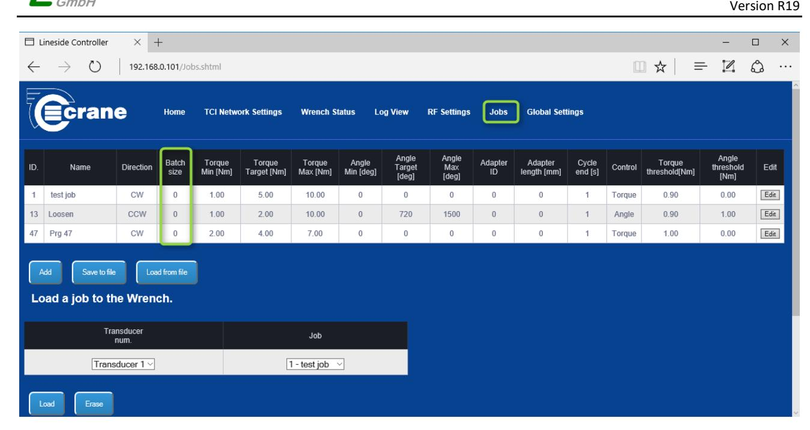

#### **4.1.3 Data output configuration**

In Firmware V: 184-2.05 / 162-5.0 not yet available.

Data output is implemented through the heOGS ftp client driver, see chapter [15.1.](#page-81-1)

# **4.2 heOGS configuration**

#### **4.2.1 Driver Setup**

Rexroth Crane TCI Multi uses the OPConn.dll tool driver. To enable this driver, please make sure to setup the section [TOOL\_DLL] as follows:

#### **4.2.2 Driver Configuration**

The heOGS tool driver is configured in the station.ini file as follows (make sure to set the …\_TYPE parameter to CRANE):

# 5 GWK electronic torque wrench

The GWK Operator+ is an electronic torque wrench with builtin WiFi communications. It uses a special communication protocol to communicate with the heOGS software. It does not provide its own data output, but rundown results and curves can be transmitted by heOGS to the data collection package (Sys3xxGateway, QTrans or QualityR).

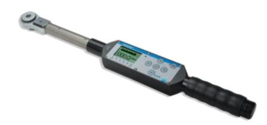

The device features an on-screen display to view enable state and rundown information.

## **5.1 GWK configuration**

The tool settings are configured through a programming cable and a Windows based configuration software (ConnectBlue/uBlox "Serial Port Monitor").

#### **5.1.1 Communication settings**

Use uBlox to configure the tool. Note that the configuration differs between firmware versions. See the GWK reference manual for more info.

Basically the following settings are required to communicate with the heOGS software:

- Enable "TCP Server" mode
- Set the "listening port number" to the same number as defined in the heOGS settings.ini file (see below)

#### **5.1.2 Tightening program configuration**

Tightening programs are defined in station.ini and downloaded to the tool. See below for more info.

#### **5.1.3 Data output configuration**

The GWK tool is not able to directly send out runtime result data to an FTP server. However OPG provides this feature – please see chapter [15.1](#page-81-1) for more info.

# **5.2 heOGS configuration**

#### **5.2.1 Driver Setup**

GWK tools use the heGWK.dll tool driver. To enable this driver, please make sure to setup the section [TOOL\_DLL] as follows:

#### **5.2.2 Driver Configuration**

The heOGS tool driver is configured in the station.ini file as follows:

Note that the settings.ini also configured the tightening parameters for the tool. The following parameters are available:

- name: Descriptive name, will be shown on the tool when a tightening program is started
- Target: Defines the tightening mode. Allowed values are: o A: Angle controlled mode. Target value is angle. Note that in this mode T= (i.e. the target torque parameter) **must** be set to zero. o T: Torque controlled mode: Target value is torque. Note that in this mode A= (i.e. the target angle parameter) **must** be set to zero.
- Snug: Snug torque to start angle counting
- Loosen: Torque threshold to detect a loosen operation
- CW or CCW: Intended operation direction.
- A-, A+: lower and upper angle limit for OK-status
- T-, T+: lower and upper torque limit for OK-status
- A, T: Target values for angle, torque. Note that only one of these might be non-zero.
- Curve: If given, then the result angle/torque curve will be collected and sent out through the data channel (if configured).

# 6 SCS Freedom3/4 torque wrenches

The SCS Freedom3 and Freedom4 are Wifi connected electronic torque wrenches. They uses a special communication protocol to communicate with the heOGS software. It does not provide its own data output, but rundown results and curves can be transmitted by heOGS to the data collection package (Sys3xxGateway, QTrans or QualityR).

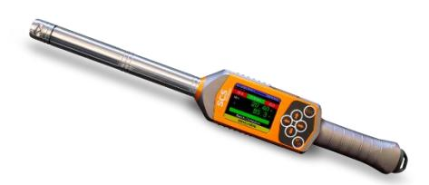

The device features an on-screen touch display to access status and parameters.

## **6.1 Wrench configuration**

All settings can be edited through the on-screen display of the device.

**Important**: Communication with the SCS tool is linked by the tool serial number (see screenshot below). Changing tools will require not only changing the Wifi parameters, but also the heOPG settings (change tool serial serial number in settings.ini)!

#### **6.1.1 Communication settings**

Global settings (Menu "Setup", default password 1247):

- Server-Client Mode: CLIENT
- Must work online: checked
- Radio Type: Wifi
- Wait NOK Confirm: unchecked
- Comm. Fail strategy: Warn & Disable

Radio settings (Menu "Radio Setup", default password 7421):

- WIFI Host: Enter the IP address of the PC running heOGS
- WIFI Remote Port: Port number for the tool as setup in heOGS settings.ini (see below). By default it is using 3456. Note: even if multiple wrenches are used with a single station, only one port is used.

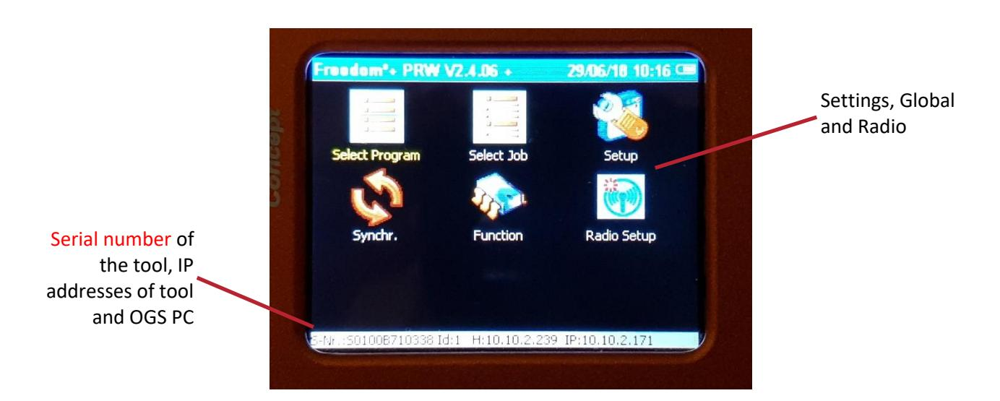

#### **6.1.2 Tightening program configuration**

Tightening programs must be defined through the SCS software SQnet+. To do so, a few steps are required:

- 1. Create a new test definition (each program/pset is represented as test):

- 2. Select a program/PSet:

- 3. Setup the parameters:

- 4. Create a route through the "route management" function:

- 5. Add the previously configured tests to the list. Note that the PSet/Program number used to select a tightening parameter set selects the line number in the route list (Point and External ID are irrelevant):

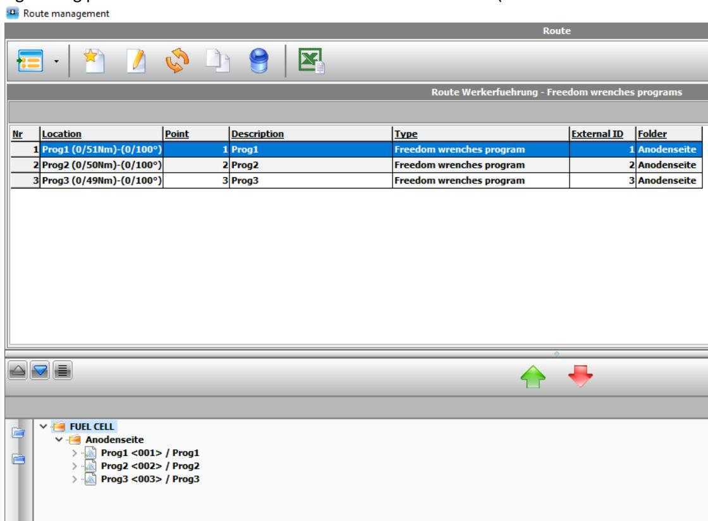

**Important**: make sure to set the programs batch count to 1 when creating programs for the tool!

#### **6.1.3 Data output configuration**

The SCS tools are not able to directly send out runtime result data to an FTP server. However, OGS provides this feature – please see section [15.1](#page-81-1) for more info.

## **6.2 heOGS configuration**

#### **6.2.1 Driver Setup**

SCS tools use the heFreedom3.dll tool driver (for both Freedom3 and Freedom4 ). To enable this driver, please make sure to setup the section [TOOL\_DLL] as follows:

#### **6.2.2 Driver Configuration**

The heOGS tool driver is configured in the station.ini file as follows:

The tools are identified by their serial numbers (that's how the SCS tools work), so you have to read out the serial number of the device and enter it into the station.ini configuration to map it to a OGS tool number (channel number).

#### **6.2.3 OGS editor tool registration and usage**

To use a tool in the OGS editor, you must register it first. To do so, use the tools tab in the editor and add a new tool under the Torque wrenches (GWK) category:

Then add the PSet names and number on the right (so you can choose later when assigning the tool to tasks and operations).

To use the tool, create a new operation and select it. Then choose one of the previously defined PSets:

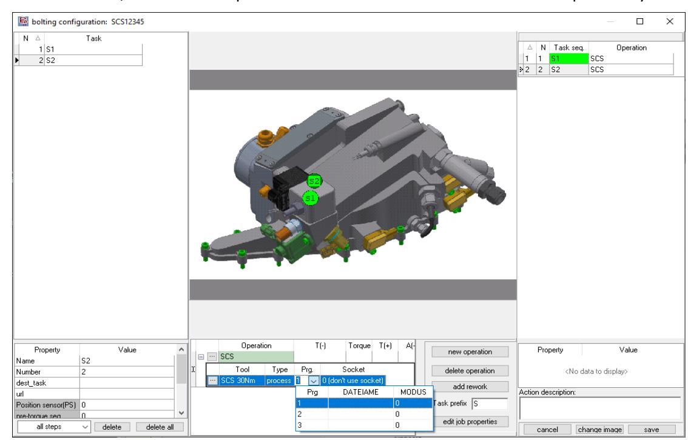

## **6.3 Firewall configuration**

SCS tools use TCP connections and actively connect to the PC (PC is acting as "server", the SCS tool as "client"). From the PC's point of view, SCS tools use "incoming" connections which are normally blocked by the Windows firewall.

To allow the SCS tools to communicate with the PC, a firewall exception must be added to the Windows Firewall. The following options are possible:

- Allow all traffic for the Monitor.exe application (e.g. allow OGS runtime to accept all traffic)
- Allow incoming TCP connections for the TCP port used by the SCS tools (see chapte[r 6.2.2,](#page-35-0) listening PORT setting)

# 7 BOSCH EXAConnecT II

The EXAConnecT II is a Bluetooth Ethernet gateway for use with the BOSCH BT-EXACT 6 bluetooth battery production tools. It uses the open protocol interface to communicate with the heOGS software. In addition, data output can be enabled to send information out to the data collection package (Sys3xxGateway, QTrans or QualityR).

## **7.1 EXAConnecT configuration**

The Bluetooth access point and Ethernet gateway is configured through the EXAConnecT II web page (java applet).

### **7.1.1 Communication settings**

To make heOGS work with the BT-EXACT tools connected to the EXAConnecT II, use the following settings:

- Database Mode: ATLAS OPEN
- Mode settings: define a port number for each BT-EXACT tool (4545 is the default port used by heOGS)

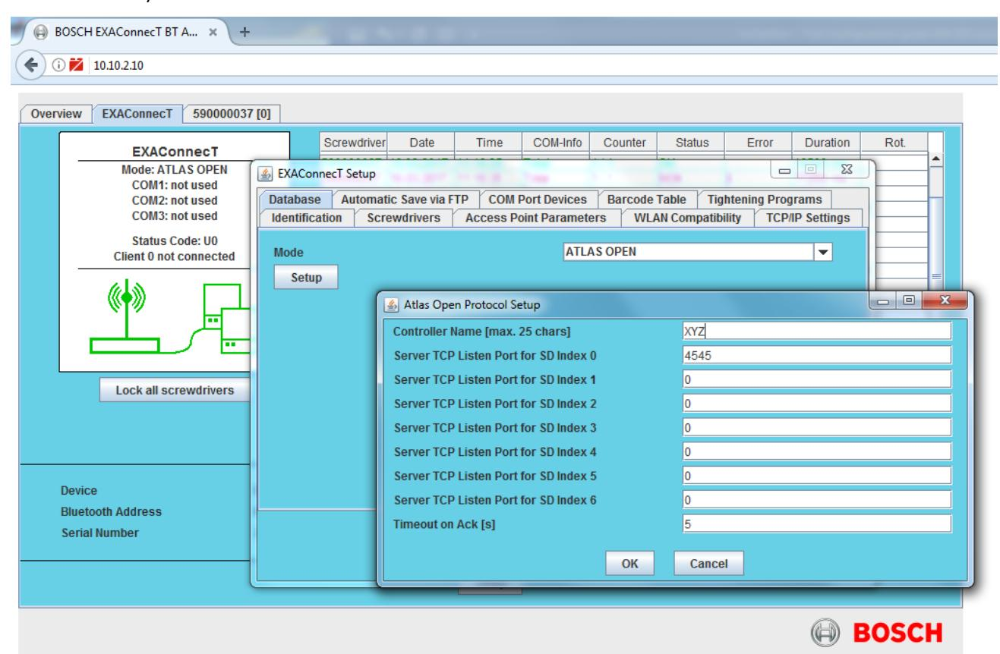

#### **7.1.2 Tightening program configuration**

Setup the tightening programs according to your requirement in the EXAConnecT GUI:

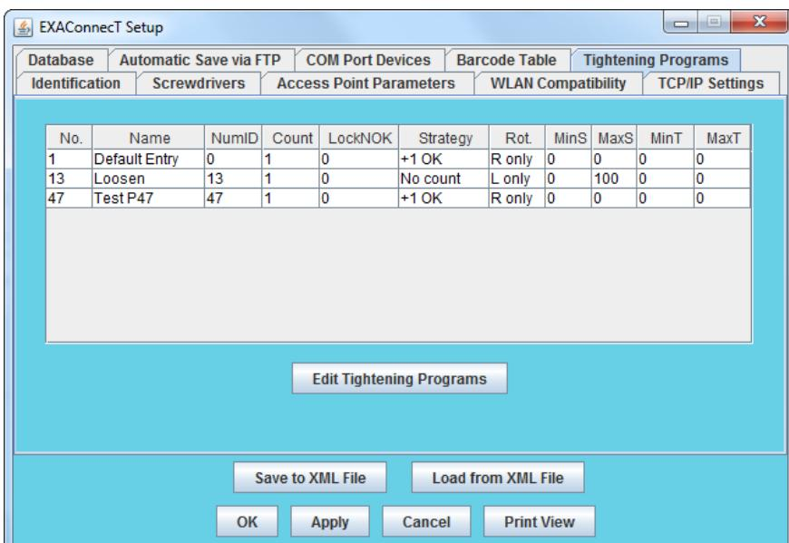

#### **7.1.3 Data output configuration**

Data output is implemented through the heOGS ftp client driver, see chapter [15.1.](#page-81-1)

To send data out to a central QTrans/Sys3xxGateway/QualityR server, enable the FTP data output of the EXAConnecT gateway as follows:

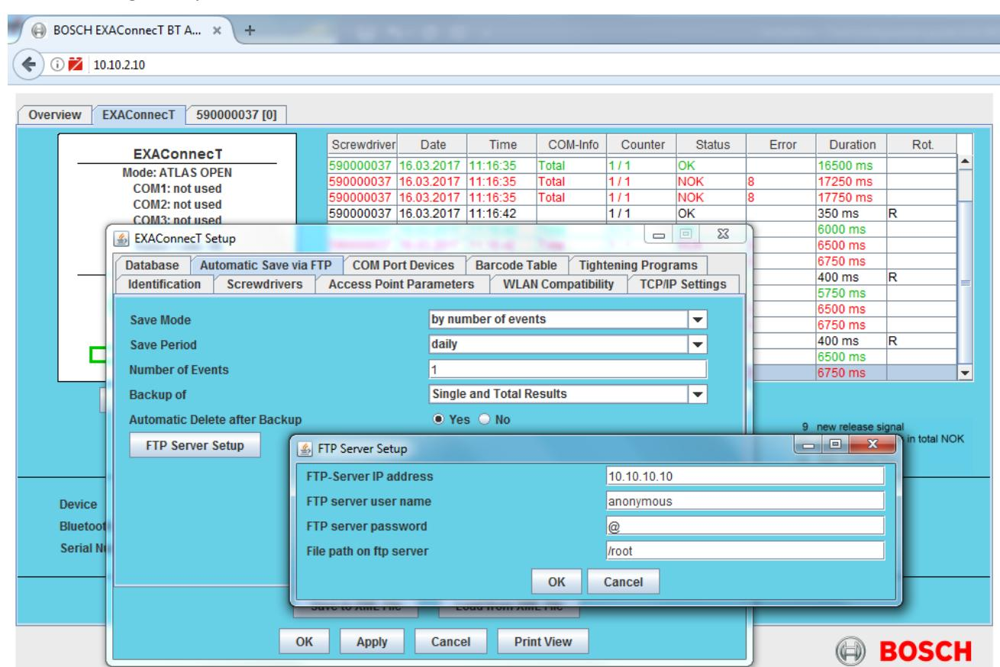

## **7.2 heOGS configuration**

#### **7.2.1 Driver Setup**

Bosch EXAConnectT II uses the tool driver. To enable this driver, please make sure to setup the section [TOOL\_DLL] as follows:

### **7.2.2 Driver Configuration**

The heOGS tool driver is configured in the station.ini file as follows:

# 8 MSTKN socket trays

The MSTKN socket trays are available with different interfaces. Depending on the interface, the setup is a bit different.

## **8.1 General**

There is a special section in each station.ini to configure socket trays to be used with the Operator Guidance. The configuration of each parameter is described in detail in the following sections.

Please see the screenshot below for an example configuration of the socket tray section. This is a basic configuration for one MSTKN-H-S24-HM-ETH-M12 socket tray.

In this section, the following keys can be used:

- **ENABLED** (int, default = 0): *all types, mandatory* Enable or disable the socket tray. If set to non-zero, then the socket tray driver is enabled.
- **Groups** (list of int, default = 4): *all types, mandatory*

This option allows you to divide the sockets available at one station into groups, so one tool from each group can be removed from the sockets without causing a "false pick" error. This can be helpful in some scenarios, e.g. when two workers are using the same socket tray.

As grouping works differently for serial trays than for wireless or Ethernet trays, there is a special section for serial trays [\(8.4.3\)](#page-45-3) and one section is for wireless and Ethernet trays [\(8.2.3\)](#page-41-3).

- **Map** (list of int, default = 1 2 3 4 (...)) *only Serial, optional*

This parameter allows remapping socket numbers (e.g. to renumber from right to left). As this option is only available for serial (USB) socket trays, please see the corresponding chapter [0](#page-46-1) in the "Serial socket trays (USB)" section.

- **Group\_to\_Channel** (list of int, default = *none*): *all types, optional*

This parameter works in combination with the "Groups" parameter. This allows assigning tool channels to the socket groups that were defined by the "Groups" parameter. By default (missing), a single group is defined automatically and all channels are associated with it.

As grouping works differently for serial trays than for wireless or Ethernet trays, there is a special section for serial trays [\(8.4.7\)](#page-49-0) and for Wireless and Ethernet trays [\(0\)](#page-43-1).

- **IP** (IP address)**, PORT** (int): *only Ethernet & wireless, mandatory*

Only used for wireless and Ethernet trays, see chapter [8.2.3.](#page-41-3)

Serial trays (USB) use the connection defined in the [SERIAL] section, see [8.4.3.](#page-45-3)

## **8.2 Wireless socket trays**

#### **8.2.1 Overview**

This is the most basic configuration required to get a MSTKN-H-S14-HM-WLAN socket tray running:

#### **8.2.2 Notes**

Only a single wireless main module (-S14/-S24/-P14/-T18) is allowed. If you need more than 8 sockets, then add (an) extension module(s).

## **8.2.3 IP address & port number**

- **IP** (IP address): Please enter the IP address of the socket tray that you want to use. The IP address of Ethernet socket trays can be read (and changed) with the free tool "Anybus IPconfig" by HMS. The IP address of Wireless socket trays can be read (and changed) with the free "MSTKN WLAN Configurator" available at the Google Play Store.
- **PORT** (int): Please enter the port you want to use for communicating with the socket tray. *Careful: Port 5003 is the only port that will work for wireless socket trays. Assigning any other port number is telling the operator guidance software that it's dealing with an Ethernet socket tray.*

#### **8.2.4 Grouping**

Grouping works similarly for all socket tray chains that begin with a main module. All combinations of groups are possible. Just check how many sockets are connected to the Ethernet or Wireless module and split them up as you wish.

Please see the following examples to understand how the sockets of this chain of MSTKN could be grouped.

Ethernet and Wireless modules are exchanged in the examples as it makes no difference which main module is used – at least in terms of how the grouping feature works.

#### **Example MSTKN chain:**

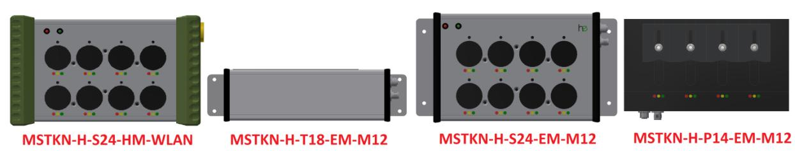

#### **Syntax:**

Groups = <no. of sockets grp 1> | <no. of sockets grp 2> |<no. of sockets grp 3> ...

#### **Example 1:**

Groups = 28 (or not defined at all) **OK, One group with 28 sockets**

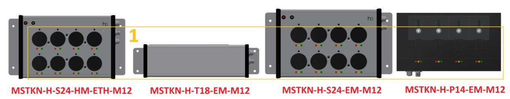

#### **Example 2:**

#### Groups = 6 | 12 | 5 | 5 **OK, Four groups with 6, 12, 5 and 5 sockets**

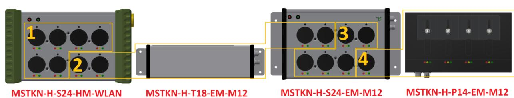

#### **Example 3:**

Groups = 8 | 11 | 5 | 1 | 3 **OK, Five groups with 8, 11, 5, 1 and 3 sockets**

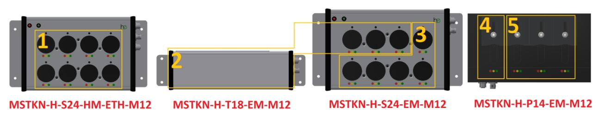

#### **Example 4:**

Groups = **4 4** | 11 | 5 | 1 | 3 **ERROR, it makes no sense to use this syntax for non-serial socket trays. Syntax should be like in Example 3. (Only 1 number per group)**

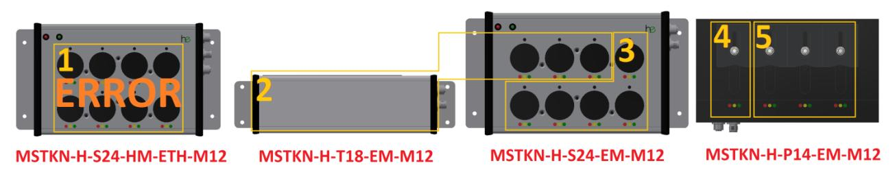

#### **8.2.5 Group to Channel**

The "Group\_to\_Channel" parameter allows you to assign tools to the socket groups that you created. The syntax is similar to the "Group" syntax. Just list all the numbers of the channels that you want to assign to group 1 with a space in between, then write a | and start listing the channel numbers for group 2 etc. Leading zeros in the channel numbers can be left out.

#### **Please see the following example to understand the syntax:**

This is the group assignment from the last "Grouping" example:

This "Group\_to\_Channel" assignment assigns the tool channels to the groups as follows:

## **8.3 Ethernet socket trays**

#### **8.3.1 Overview**

This is the most basic configuration required to get a MSTKN-H-S14-HM-ETH-M12 socket tray running:

### **8.3.2 Notes**

Only a single Ethernet socket tray (-S14/-S24/-P14/-T18) is allowed. If you need more than 8 sockets, then add an extension module.

#### **8.3.3 Grouping**

Grouping works similarly for Ethernet and Wireless socket trays. Please see section [8.2.4.](#page-42-0)

#### **8.3.4 Group to Channel**

The Group\_to\_Channel parameter works similarly for Ethernet and Wireless socket trays. Please see section [8.2.5.](#page-43-0)

## **8.4 Serial socket trays (USB)**

When configuring a serial socket tray, the procedure slightly differs from the Ethernet or Wireless tray configuration.

#### **8.4.1 Overview**

This is the most basic configuration required to get a MSTKN-H-S14-EM-M12 socket tray running:

#### **8.4.2 Notes**

The serial trays require two settings in station.ini and the installation of a special USB driver:

- Configure the serial port under [SERIAL] (see [8.4.7\)](#page-49-0)
- Configure the settings under [SocketTray] (se[e 8.1\)](#page-40-1)
- Install the FTDI driver. The serial trays are connected through the H+E "USB -> M12 Programming Cable" (order no. 222252) which requires a driver from <http://www.ftdichip.com/> . The driver is also contained on the CD that came with your socket tray.

**WARNING**: If using an 8-way tray (type -S24-), then it needs to be configured as two trays having 4 sockets each (see below on how to configure multiple trays).

### **8.4.3 Serial parameters**

The serial socket trays are connected via a special USB cable. The serial communication parameters need to be defined in the [SERIAL] section of the station.ini file. Please see the screenshot below for an example configuration.

- **COM8** Number of the serial port
- **115200** Baud rate
- **e** Parity (e=even, n=none)
- **8** Data Bits
- **|halbduplex** Half Duplex communication, completely leave out this parameter for full duplex

#### **8.4.4 Configuring multiple trays**

When more than 8 sockets are needed on a station, it is necessary to chain two (or more) serial trays together. To have several serial MSTKN work in a chain, you need to configure their internal addresses to tell the master (Monitor software) which socket tray is which. Please follow the steps below to make sure everything is configured correctly.

- Picture the MSTKN chain that you want to create. For example (left to right):

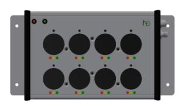

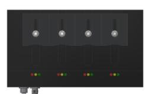

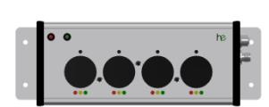

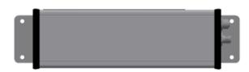

- Every sensor board in these devices has an internal address that tells the master with which board it is communicating right now. When the socket trays are shipped, they are configured to be used standalone and out-of-the-box, so their board addresses will most likely be assigned like this:

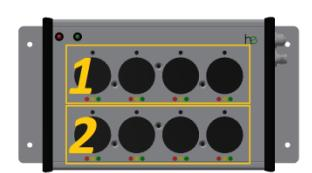

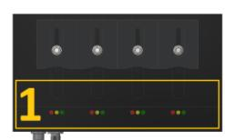

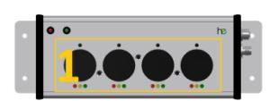

- To read and change the board addresses, please connect a socket tray to a computer using the H+E "USB -> M12 Programming Cable" (order no. 222252) and start the "MSTKN-HM-Config.exe" that can be found on the CD that came with your socket trays and follow these steps:

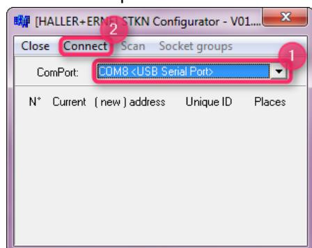

1.) Set the correct COM-Port used by your "USB -> M12

Programming Cable"

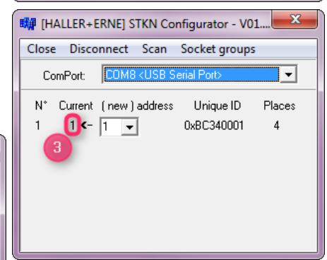

2.) Click "Connect"

3.) The address in the column "Current" is the one thats

currently active on your MSTKN. In this example, the address

read is "1".

4.) If you wish to change the address, simply choose the desired

address from the dropdown that says

"( new ) address"

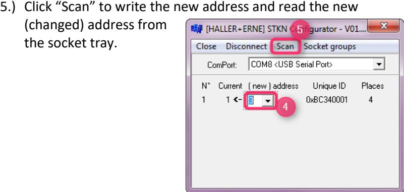

(changed) address from

the socket tray.

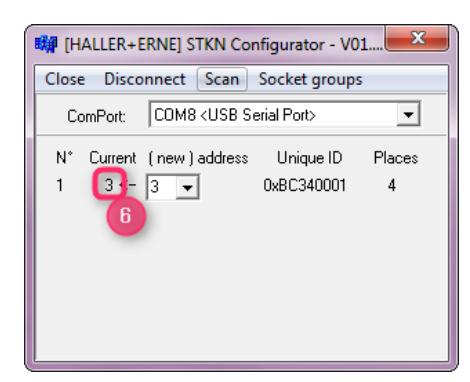

6.) The new address (3) has been correctly adapted by the socket tray.

- To configure the example MSTKN chain correctly, this procedure would have to be repeated until the devices have the following addresses:

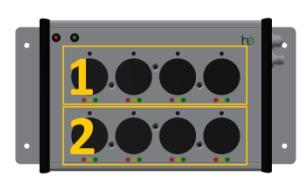

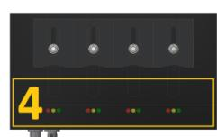

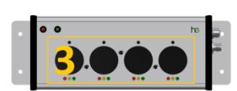

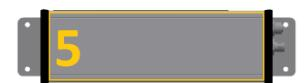

- Now the chain of serial socket trays is ready to use with Monitor. The (default) addresses of their sockets would now be:

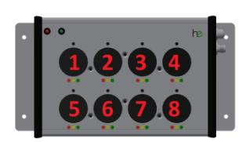

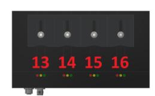

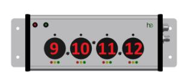

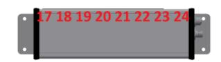

#### **8.4.5 Changing the socket mapping**

The configuration in the station.ini makes it possible to change the mapping of the sockets of serial trays.

The screenshots below show a standard configuration for a MSTKN-H-S24-EM-M12 module. Please note the parameter "Map = 1 2 3 4 5 6 7 8" on the left hand side which makes it possible to map a different number to each socket. The default configuration is *1 2 3 4 5 6 7 8*. This is the standard mapping that is used, even if the Map parameter is uncommented and the MSTKN sockets are assigned as in the picture to the right. Any mapping is possible, as long as all available socket numbers are in the list and you put a space between every

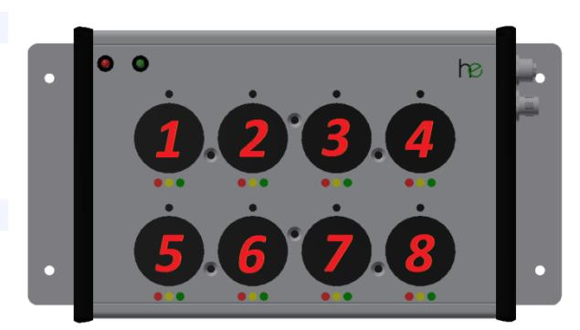

number! **E.g.:** If you configure "Map = 3 1 2 4" for a tray with 8 sockets, the software will not recognize your settings and use the default mapping.

#### **8.4.6 Grouping**

*Serial trays*: For chains of serial trays of types S14 and P14 it is only possible to divide the available sockets into groups of 4. The S24 trays have to be assigned as if they were two S14 trays with 4 sockets each. The T18 trays are the only ones that cannot be logically divided into groups of 4. They have to be seen as a unit of 8 sockets. Writing a | between two numbers divides them into two groups.

Please see the following examples to understand the syntax:

#### **Example 1:**

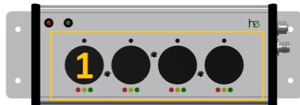

Groups = 4

**One S14(1x4 sockets) as 1 group of 4 sockets**

#### **Example 2:**

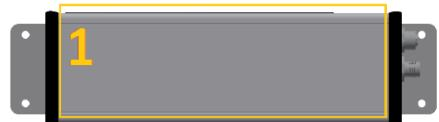

Groups = 8

**One T18 (1x8 sockets) as 1 group of 8 sockets**

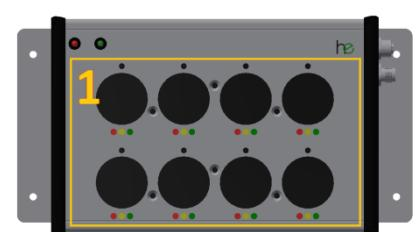

#### **Example 3:**

Groups = 4 4

**One S24 (2x4 sockets) as 1 group of 8 sockets**

#### **Example 4:**

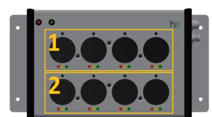

Groups = 4 | 4

**One S24 (2x4 sockets) as 2 groups of 4 sockets each**

*OR*

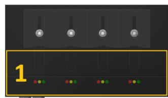

Groups = 4 | 4

**Two S14 or P14 (2x4 sockets) as 2 groups of 4 sockets each**

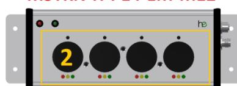

#### **Final Example:**

This chain of 5 different types of MSTKN gets the following group assignment:

Group = 4 | 4 8 | 4 4 | 4 4

The devices' sockets are now grouped as displayed in the picture below.

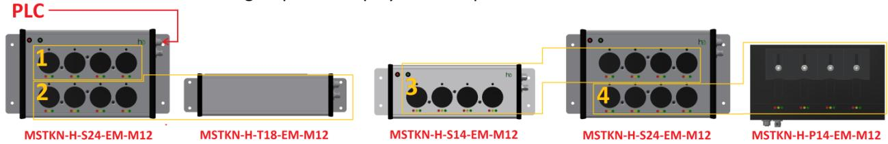

### **8.4.7 Group to Channel**

The "Group\_to\_Channel" parameter allows you to assign tools to the socket groups that you created. The syntax is similar to the "Group" syntax. Just list all the numbers of the channels that you want to assign to group 1 with a space in between, then write a | and start listing the channel numbers for group 2 etc. Leading zeros in the channel numbers can be left out.

#### **Please see the following example to understand the syntax:**

This is the group assignment from the last "Grouping" example:

Group\_to\_Channel = 1 | 3 4 | 2 | 5

This "Group\_to\_Channel" assignment assigns the tool channels to the groups as follows:

# 9 Manual Operation

Currently, three different manual input/acknowledge tools available. The following sections describe how to setup and use them.

## **9.1 GUI popup**

Shows a popup with custom text and waits for manual user input. With this tool type, a mouse or touchscreen is needed to click the "OK" button in the popup menu.

### **9.1.1 Configure GUI popup**

Open the tab 'Tools" and add a new tool with type "by hand". This tool can be used in the job/operation configuration exactly as other tools like NEXO, Torque Wrench etc.

In the second step, this tool can be used in a job/operation definition (see screenshot below). Please note the bottom right window "Action description" (green box in screenshot below): Here, the custom message to be shown can be configured. This message will be displayed in the popup itself and in the bottom of the GUI.

#### **9.1.2 Display of GUI popup**

The message entered as "Action description" will be displayed in both the popup and the "Current Action" field in the GUI:

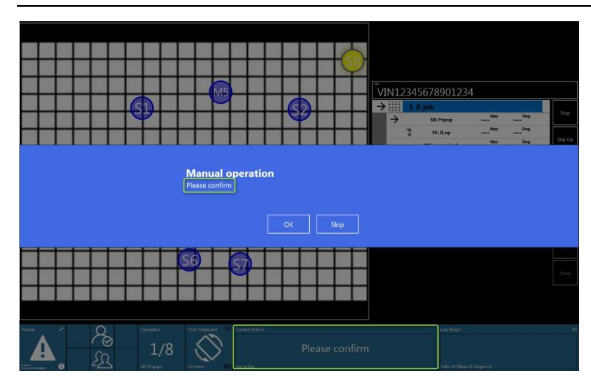

#### **9.1.3 Data output configuration**

The "GUI popup" tool is not able to directly send out runtime result data to an FTP server. However OPG provides this feature – please see section... for more info.

Data output is implemented through the heOGS ftp client driver, see chapter [15.1.](#page-81-1)

## **9.2 KEY input**

Shows a custom text at the bottom of the screen and waits for manual user input. With this tool type, either a mouse, a keyboard or a touchscreen is needed to click the "OK" button in the popup menu.

### **9.2.1 Check Database**

Please check if your database contains a tool type "KEY INPUT":

- Open configuration database in "heOpCfg.exe".
- Open the tab 'Tools" and check a tool type "KEY INPUT":

- If this type is already available, please skip the following section (9.2.2).

#### **9.2.2 Update Database**

**WARNING!!!** To update the configuration database for using of tool type "KEY INPUT" You need a "*heOpCfg.exe*" equal or greater than version 1.1.7-4 and an SQL script "*Manual acknowledge.sql*".

- Start "*heOpCfg.exe*" from the working directory with parameter /Admin:

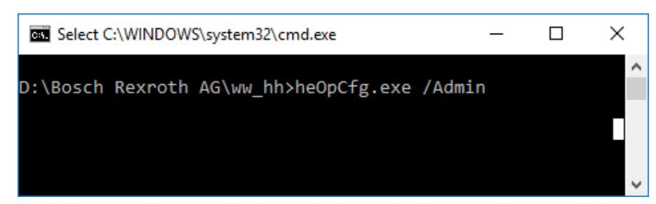

- Open database and select 'SQL Script' in main menu. This menu Item is available only after starting "*heOpCfg.exe*" with parameter **/Admin**:

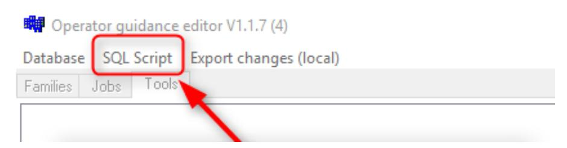

- Press the 'Script' button and select "*Manual acknowledge.sql*" file in Open Dialog:

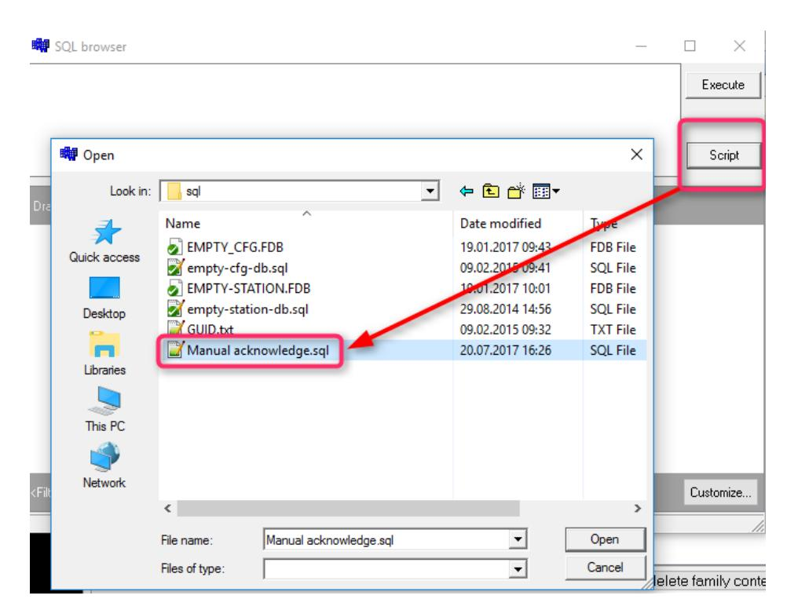

- After successful script execution, the following message appears:

- To accept the changes, please close the application and start it again without "/Admin" parameter.

#### **9.2.3 Configure KEY input**

- Open the tab "Jobs" and add the "KEY input" tool type to an operation. You can configure a custom message to be displayed in the GUI when configuring this tool (green box). This tool can be used for job configuration exactly as other conventional tools like NEXO, Torque Wrench or Ergospin, but without the input of a program number (this field has to be empty), like in the sample below (red box):

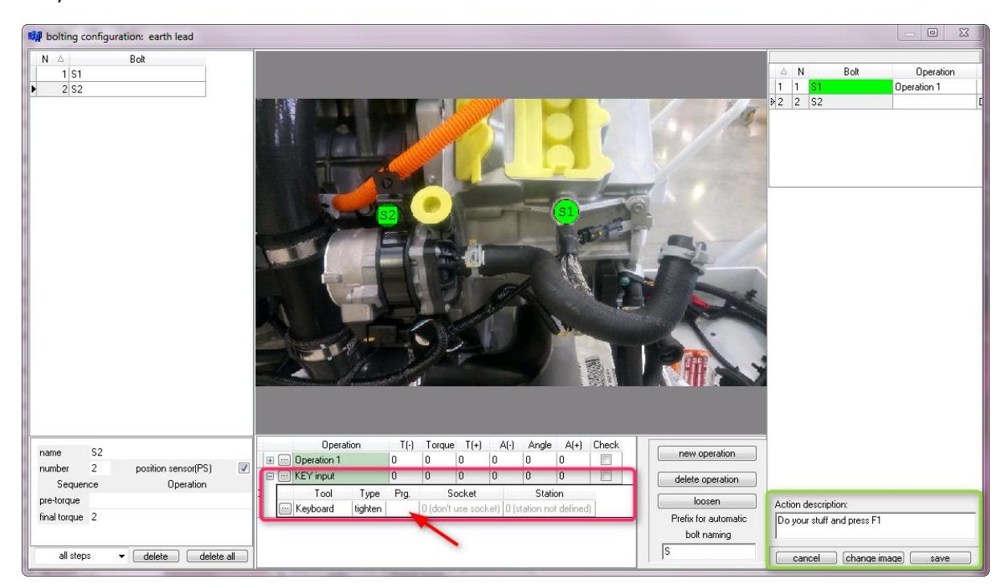

The screenshot below shows an example configuration for the "KEY input" tool.

- Tool (Channel) number: 3
- Tool name: ACK
- OK Code: 112 (key code for F1 on keyboard)
- NOK Code: 113 (key code for F2 on keyboard)

Some key codes are:

| Key | Code | Key            | Code | Key   | Code |
|-----|------|----------------|------|-------|------|
| F3  | 114  | F4             | 115  | F5    | 116  |
| ESC | 27   | Enter (Return) | 13   | Space | 32   |

For a full list of key codes please check:

#### **9.2.4 Display of KEY input**

The screenshot below shows how a "KEY input" tool type is displayed in the GUI.

If a mouse or touchscreen is available, it is also possible to use the buttons on the right hand side to input OK or NOK (red box). Please also note the custom message displayed at the bottom of the screen (green box):

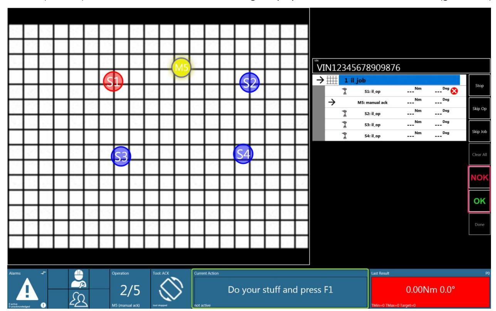

#### **9.2.5 Data output configuration**

The "GUI popup" tool is not able to directly send out runtime result data to an FTP server. However OPG provides this feature – please see section... for more info.

Data output is implemented through the heOGS ftp client driver, see chapter [15.1.](#page-81-1)

## **9.3 TOOL acknowledge**

Shows a popup with custom text and waits for manual user input. This tool type is similar to the "GUI popup", except you don't need a mouse or touchscreen to confirm the operation, because a button on the worker's tool (like Bosch Rexroth Nexo) can be configured as "OK" button. The worker simply has to hold this button down until the rundown is accepted as "OK".

#### **9.3.1 Configure TOOL acknowledge**

- Open the tab "Jobs" and add a new job with the tool type for which you want to configure the tool acknowledge operation. For this example, we will use a Rexroth Nexo.

- Open the station.ini and find the [GENERAL] section. Here can you disable the popup for the TOOL acknowledge operation. Setting the "DISABLE\_MANUALOP\_POPUP=" to "1" will disable the popup, setting it to "0" will enable the popup.

- Then scroll down in the station.ini and find the [OPENPROTO] section. Then find the channel of the tool that you want to configure. In this example, the Rexroth Nexo that we want to configure is on channel 02. Now you can select a program number which will turn the operation into a "TOOL acknowledge" when used. Simply add the line:

CHANNEL\_02\_MANUAL\_OPPRG=<program number>

- After selecting the desired tool in the HeOpCfg.exe's "Jobs" tab, please input the channel number that you specified in the station.ini before. (e.g. 98)

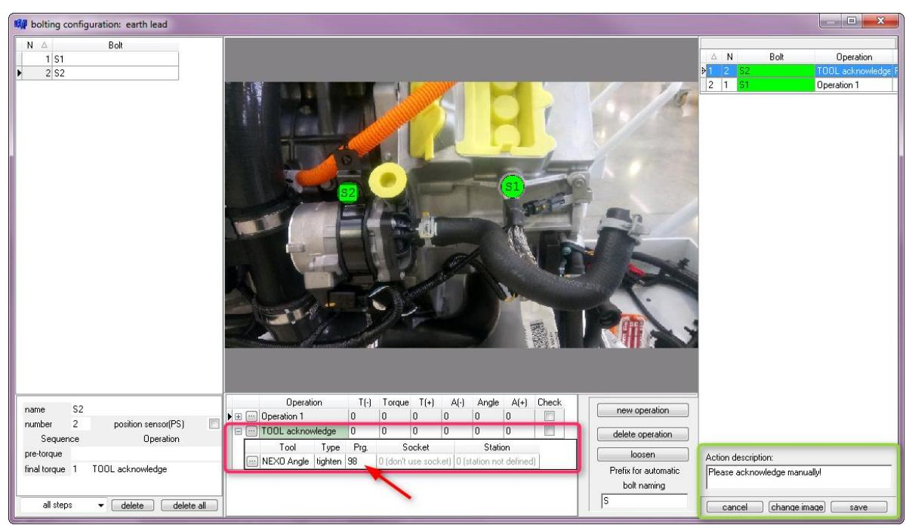

#### **9.3.2 Display of TOOL acknowledge**

The screenshot below shows how the TOOL acknowledge is displayed in GUI with popup disabled. The "Action description" is only displayed in the "Current Action" box at the bottom of the screen.

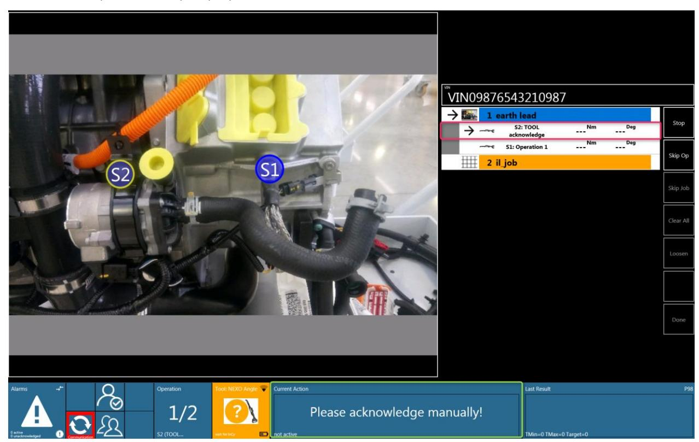

The screenshot below shows how the TOOL acknowledge is displayed in GUI with popup enabled. The "Action description" is displayed in both the "Current Action" box and in the popup window.

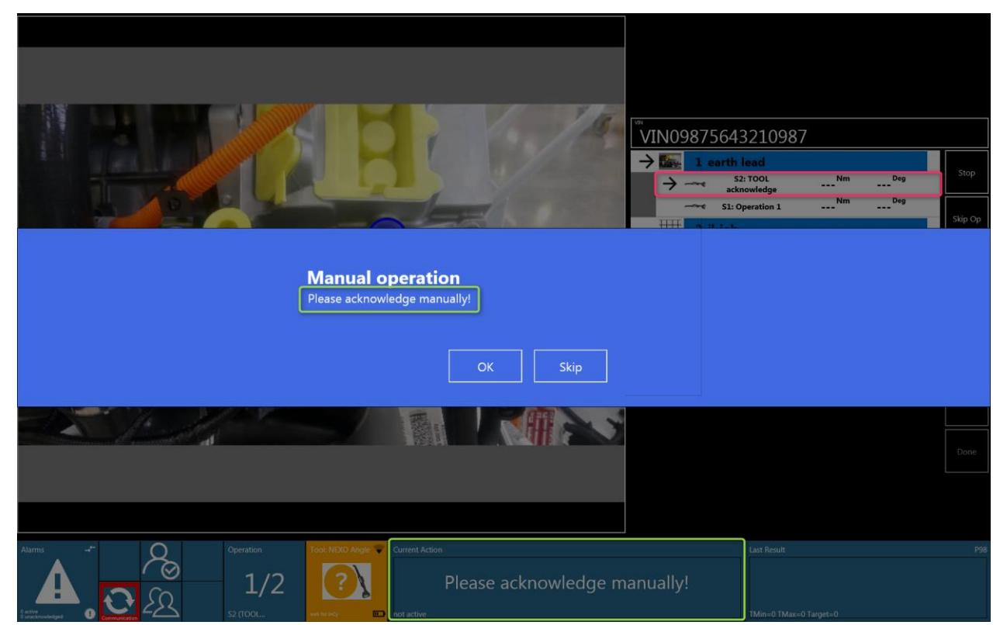

The screenshot below shows what a successful rundown with "TOOL acknowledge" looks like. The operator guidance system will create a dummy result and the operation is sent to the database as a successful rundown with that dummy value.

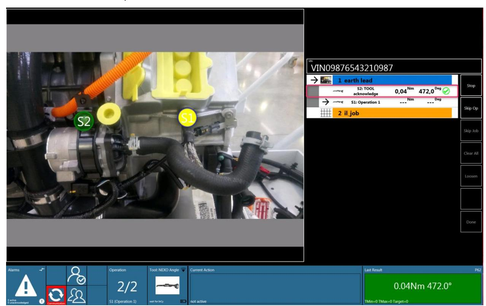

#### **9.3.3 Data output configuration**

The "GUI popup" tool is not able to directly send out runtime result data to an FTP server. However OPG provides this feature – please see section... for more info.

Data output is implemented through the heOGS ftp client driver, see chapter [15.1.](#page-81-1)

# 10 Modbus Tool Interface

The Modbus Tool Interface allows interfacing 3rd party hardware with the OGS system.

The Modbus communication Protocol and the register layout of the modbus tool interface (MBToolCli) is described a[t https://gogs.haller-erne.de/he/heOpGui/wiki/MBToolCli+-+Modbus+Tool+interface.](https://gogs.haller-erne.de/he/heOpGui/wiki/MBToolCli+-+Modbus+Tool+interface)

## **10.1heOGS GUI**

If the Modbus Tool Interface is configured, 3rd party hardware is integrated seamlessly into the OGS interface as shown in the following screenshots:

Result list in OGS screen (note the "Pa" and "°C" units):

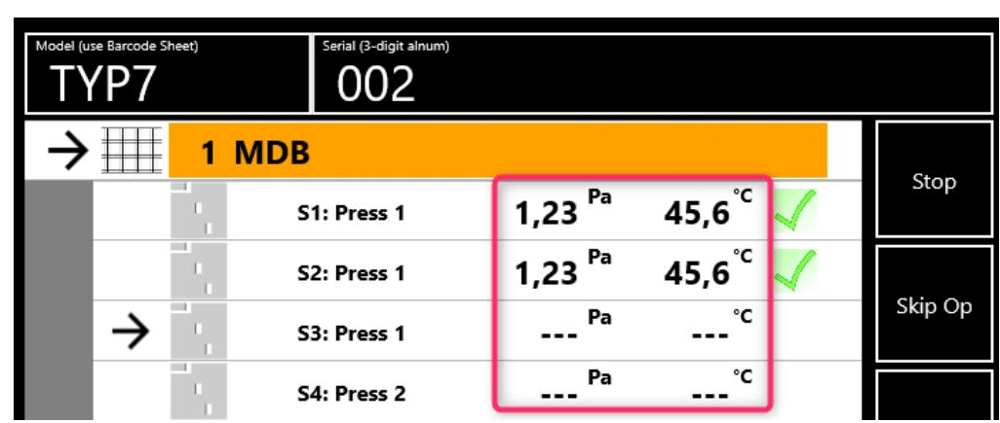

Last result detail view:

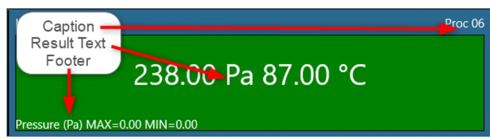

# **10.2heOGS configuration**

## **10.2.1 Station configuration**

#### **10.2.1.1 Driver setup**

The custom Modbus tool is implemented in the MBToolCli.dll tool driver. To enable the tool driver, add it to the [TOOL.DLL] section in station.ini as follows:

#### **10.2.1.2 Add a tool**

Add Modbus tool Channel number into [CHANNELS] section:

*Use channel number as configured in the workflow editor (see below)*

#### **10.2.1.3 Tool configuration**

The tool parameters are set up in the [ModbusTool] section in station.ini. See [https://gogs.haller](https://gogs.haller-erne.de/he/heOpGui/wiki/MBToolCli+-+Modbus+Tool+interface)[erne.de/he/heOpGui/wiki/MBToolCli+-+Modbus+Tool+interface](https://gogs.haller-erne.de/he/heOpGui/wiki/MBToolCli+-+Modbus+Tool+interface) for all settings.

#### **10.2.1.4 Configuring units and data output**

The tool visuals and data output is defined in the modbus\_gui.lua file in the custom folder. To make this available, import the modbus\_gui.lua from the config.lua (or from the monitor.lua) file as follows:

LUA script "modbus\_gui" is necessary to present tool specific measurement values on the OGS GUI and in output JSON file.

Although the Modbus Result Data Registers contain 6 measurement values, but only the first two can be shown in OGS GUI on the place of Torque and Angle accordingly. JSON output, against that, contains a full value set.

Lua script implements the following functions:

- provides data mapping from Modbus Result Data Registers to JSON data structure.
- provides tool specific measurement units to show two first measurement values in Result View
- provides tool specific scale factors to show two first measurement values in Result View.

#### **10.2.2 Workflow Editor**

The workflow editor supports the Modbus Tool Interface starting from version V1.1.8-1.

#### **10.2.2.1 One-time configuration: prepare database**

To make the Modbus tool work, the configuration database must be set up correctly. The configuration database is upgraded automatically to include the "Modbus Tools" tool category if opened using the heOpCfg.exe >= V1.1.8-1.

To verify that the database supports the barcode tool, open it, then switch to the "Tools" tab and look for the tool type "MODBUS TOOLS":

As with other tools, add a new tool of this type to use it in an operation and add it to a job/task.

#### **10.2.2.2 Create an operation to use the Modbus tool**

If you want to pass parameters to the Modbus tool, then define these in the operation as follows (note that currently the measurement units are not shown correctly in the heOpCfg):

# 11 Euchner EKS RFID key

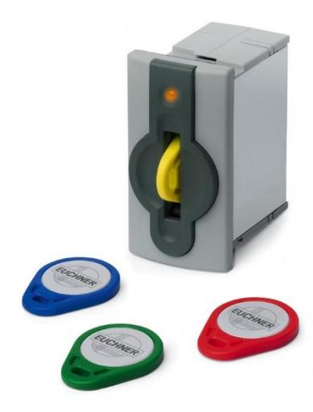

The Euchner key allows using RFID tokens to logon to the OGS system. Supported are EKS readers providing USB or serial interfaces.

The Euchner key reader is configured and used similar to a barcode scanner by the OGS system. Each incoming message (token inserted, token removed, etc.) is routed through the barcode.lua barcode handler. By default, the messages are then forwarded to the user\_manager.lua user management.

# **11.1heOGS configuration**

## **11.1.1 Station configuration**

#### **11.1.1.1 Configure heOGS – station.ini**

The Euchner key reader is configured in the [SERIAL] section in station.ini similar to a barcode reader. The name of the entry must be set to "Euchner" to automatically make the OGS system detect the hardware and select the correct communication protocol.

See the screenshot below for an example:

#### **11.1.1.2 Setup users and access rights**

The users are setup as default, just using the corresponding key IDs (in station.ini):

Note that detailed user rights (mapping between user level and allowed actions) can be set through user\_manager.lua.

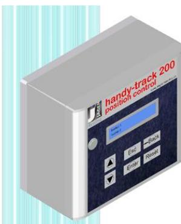

# 12 Jäger positioning system

The Jäger positioning system "HandyTrack 200" is used to locate exact positions on a part. The mounted tool is only enabled, if the operator moves the tool to the correct position.

heOGS supports using the HandyTrack system similar to a socket tray. The socket number (configured in the workflow) is used as a position number for the HandyTrack. The HandyTrack uses this number to pull out a 3Dposition from its configuration and returns an "In Position" signal if the tool is within the configured position. heOGS uses this signal to enable the tool, so overall an operation can only be started, if the tool is in the correct operating position.

NOTE: Positioning system support is available starting with V2.0.6.5 of heOGS.

# **12.1System configuration**

The HandyTrack provides a 24V I/O interface. heOGS supports connecting to the HandyTrack using a CS351 over OpenProtocol with an IM24V card.

The PLC assignment table in the CS351 box should be set up as follows:

Here the following signals are set up:

- IM24V B1 I0.0: connected to the "InPosition" signal output of the HandyTrack.
- IM24V B1 Q0.0-0.7: connected to the position number input ("Job number" in HandyTrack terms)

Note that the driver automatically switches the position number back to 0 whenever a new task is started, so the HandyTrack always sees a change in its job number.

See also chapter [2.1.2.5](#page-19-0) for more information.

## **12.2heOGS configuration**

#### **12.2.1 Driver configuration**

The HandyTrack positioning system works in conjunction with the Rexroth CS351 tool. See chapter [2.2](#page-21-0) for more information about the generic setup.

To correctly map the IM24 I/O signals to the internal processing, the EXTERNAL\_IO\_OFFSET must be set to 7 (this basically maps OpenProtocol signal 3.0-3.7 as position number), see the following screenshot:

Note that the offset is 7 (bits), as the CS351 OpenProtocol implementation assigns the first externally controllable signal to OP2.1 (and internally signals 2.1-2.7 are used for tool control, see Nexo interface).

#### **12.2.2 Workflow editor configuration**

To enable the positioning mode in the heOpCfg workflow editor, the following settings must be configured in heOpCfg.ini:

**NOTE**: Positioning system support in the workflow editor is available for heOpCfg.exe starting with V1.2.0.0.

#### **12.2.3 Workflow setup**

To enable the HandyTrack positioning, one must enable the position option in the job screen and add the position number (as defined in the HandyTrack settings) into the "PS" column next to the bolt definition:

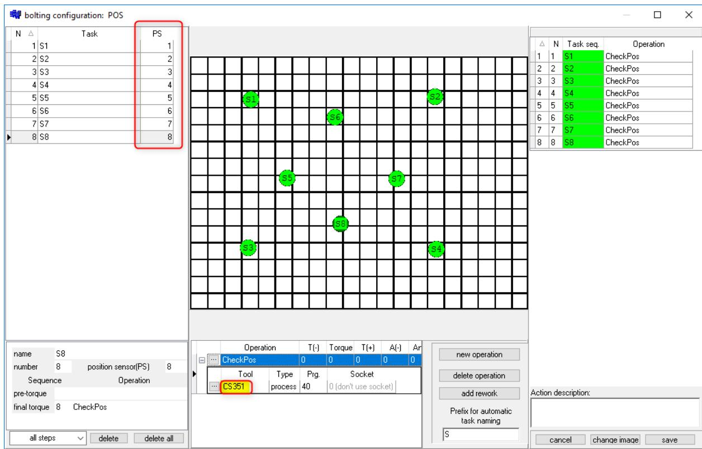

**NOTE**: To disable positioning for a specific bolt, set the "PS" column value to zero.

#### **12.2.4 LUA configuration notes**

TBD.

# 13 Barcode entry

There are three main areas in the system where barcode input gets processed:

- Workflow start
- Job selection and start
- Barcode tool

This section describes the "Barcode tool" configuration and use.

## **13.1Barcode tool**

The Barcode tool allows adding a scanning action similar to a tightening action in the normal workflow. If the task with a scanning action is reached, then the operator is required to scan (or enter) a barcode.

**NOTE**: The barcode tool is available starting with version >= V2.1.

### **13.1.1 Station configuration**

#### **13.1.1.1 Configure heOGS – station.ini**

Usually, no additional configuration in station.ini is required, as the barcode tool uses the globally defined scanner.

The barcode scanners serial communication parameters are defined in the [SERIAL] section of the station.ini file. The entry "Barcode" defines the parameters used, see the screenshot below for an example:

#### **13.1.2 Workflow editor**

#### **13.1.2.1 One-time configuration: heOpCfg.ini**

To enable editing the barcode masks, a new custom property is added to the action properties.

Please check, if the entry "barcode mask=string" in Section [ACTION PROPERTY NAMES] in heOpCfg.ini is available. If not, then add it (see screenshot on the right for an example).

#### **13.1.2.2 One-time configuration: prepare database**

To make the barcode tool work, the configuration database must be set up correctly. The configuration database is upgraded automatically to include the "BARCODE" tool if opened using the heOpCfg.exe >= V1.2.0-1.

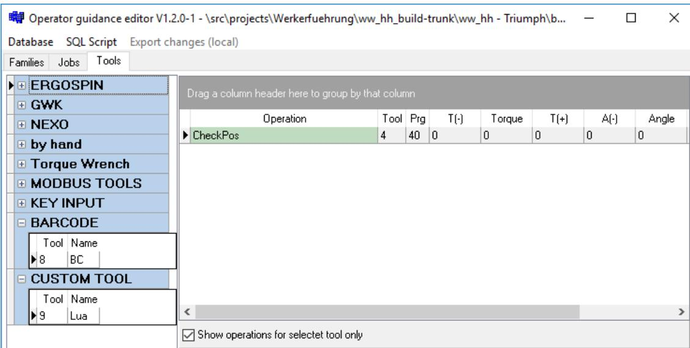

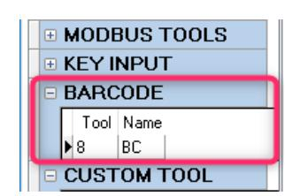

#### **13.1.2.3 Create a new tool for barcode input**

Open the tab "Tools" and add a new tool in the section "BARCODE". This tool can be used in the job/operation configuration exactly as other tools like NEXO, Torque Wrench etc.

#### **13.1.2.4 Create a task for barcode input**

To add a task in the workflow job, open the job editor and add a new task. Then add a new operation which uses the barcode tool (Tool "BC", see screenshot below). Finally assign the operation to the task.

The screenshot on the right shows how to enter the barcode mask. Allowed values for the barcode mask are:

- ?: Wildchard character. Matches exactly one character but does not care about its value
- Other characters: exact match required

Note also that the action description can be set. The description will be displayed in the barcode popup (if enabled) and in the task bar in the operator main GUI.

In addition to setting the barcode mask for barcode validation, more complex validations can be setup through a custom LUA function. The relevant function is BarCode\_GetActionBarcode(), usually located in "barcode.lua".

#### **13.1.3 Usage**

#### **13.1.3.1 General usage and manual input**

If a barcode tool gets active, the display looks similar to the following screenshot:

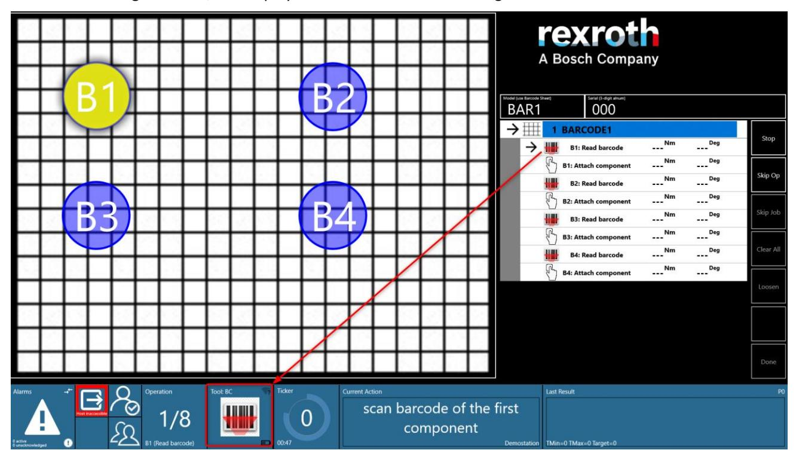

Note that the barcode tool supports manual input by clicking the tool icon in the taskbar.

This will then show the keyboard input popup as follows (note that you can also bring up the on-screen keyboard by clicking the keyboard icon):

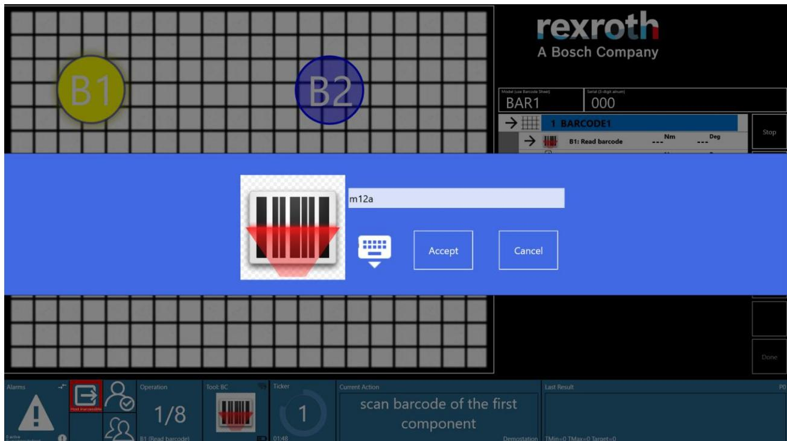

#### **13.1.3.2 Scanned barcode result display**

If a valid barcode was scanned, the workflow continues to the next step and the "Last Result" shows the previously scanned barcode (on green background):

If an invalid barcode was scanned, the workflow does not continue, but stays in the current task. The falsely scanned barcode is displayed in the "Last Result" box (with a red background). The operator is required to scan again:

#### **13.1.4 Data output configuration**

Data output is implemented through the heOGS ftp client driver, see chapter [15.1.](#page-81-1) Data is transmitted as "event" data to the database.

#### **13.1.4.1 Configuration in station.ini**

The barcode tool uses the INFO\_CHANNEL to send data to the server. See chapter [15.1.2](#page-82-0) on how to configure this.

#### **13.1.4.2 Data mapping using Sys3xxGateway/SQL server**

Barcode data is available in on the SQL server in the [report].[events] table:

# 14 Custom (LUA) tool

## **14.1Overview**

The "custom tool" provides an interface between the workflow configuration, the monitor GUI/runtime and custom code. The idea is to provide a generic interface to add custom tools and/or behaviors to the heOGS system.

#### **14.1.1 Station configuration**

#### **14.1.1.1 Driver Setup**

The custom LUA tool is implemented in the LuaTool.dll tool driver. The tool driver properties are defined on the [LuaTool.dll] section in the station.ini file.

Adding a custom tool requires the following:

- Add a new channel in the [CHANNELS] section. The channel number (left to the = sign) must match the tool ID defined in the workflow editor (see below). The "tool name" (right to the = sign) links the parameters to the channel.
- Add a new tool parameter section ["tool name"]. The "tool name" must match a "tool name" defined in the [CHANNELS] section. In this section, the following keys are required:
  - 1. DRIVER=LuaTool: The DRIVER key must be equal to "LuaTool". This basically links the tool to the [LuaTool.dll] driver.
  - 2. ToolType: This is a custom text, which is passed to the LUA script code during initialization of the tool. This can be used to implement a set of "custom tool" classes, e.g. a "Press" and a "Meter". Multiple tool-instances can then reference a single LUA script driver.

Note that this section may contain other keys/values which define the tools behavior.

The following screenshot shows a typical setup for a tool (ids = 8 and 9, tool names = "LuaTool\_A" and "LuaTool\_XYZ", both of ToolType "MyCustomLuaTool"):

#### **14.1.1.2 Driver Parameters**

The driver parameters are set in the [LuaTool.dll] section.

#### **14.1.1.3 Tool Parameters**

- DRIVER=LuaTool: The DRIVER key must be equal to "LuaTool". This basically links the tool to the [LuaTool.dll] driver.
- ToolType: This is a custom text, which is passed to the LUA script code during initialization of the tool. This is typically used to implement a set of "custom tool" classes, e.g. a "Press" and a "Meter". Multiple tool-instances can then reference a single LUA script driver. Please see the following sections (starting with chapter [14.2\)](#page-75-0) for specific tool implementations.

#### **14.1.2 LUA scripts**

#### **14.1.2.1 Overview**

The actual "custom tool" behavior is implemented through a LUA script. A typical custom tool implementation consists of the following files:

| File name                    | Notes                                                                                           |
|------------------------------|-------------------------------------------------------------------------------------------------|
| lualib/lua_tool.lua          | Interface between the OGS system and the custom LUA tool implementations. Do not change!        |
| <custom>/lua_tool_<tool>.lua | The custom tool implementation. This file interfaces between the lualib/lua_tool.lua and should |
| <custom>/<tool>_driver.lua   | Not specifically required, but recommended to factor out communication specifics related to the |
| <custom>/config.lua          | OGS standard file to load customer specific data/code. The <custom>/lua_tool_<tool>.lua must be |

There might be more files needed depending on the actual tool, e.g. for the Sylvac BLE caliper interface, a Bluetooth LE library is needed (luabluegiga.dll, placed into the installation folder), se[e 14.3.](#page-76-2)

#### **14.1.2.2 OGS data view**

The LUA tool implementation may present the onscreen values shown in a flexible way. To do so, the following functions should be implemented in the LUA script tool interface:

- *function <lua\_tool>.get\_tool\_units(tool)*: Returns two strings to indicate the primary measurement units (e.g. 'Nm', '°'). These units are used to render the process view list result values (in the right pane).
- *function <lua\_tool>.get\_tool\_result\_string(tool)*: Returns a string shown in the bottom right result pane (as result text, large font, centered). Typically, this returns a formatted string in the format "xxNm yy°".
- *function <lua\_tool>.get\_footer\_string(tool)*: Returns a string shown in the bottom right result pane (as limit values, small text in the bottom line). Typically, this shows a string indicating the lower/upper limits.

#### **14.1.2.3 FTP/JSON data output**

The LUA tool implementation may present the onscreen values shown in a flexible way. To do so, the following functions should be implemented in the LUA script tool interface:

- *function <lua\_tool>.default\_get\_tags(tool)*: Returns the system number (se[e https://gogs.haller](https://gogs.haller-erne.de/he/heOpGui/wiki/Data+output+format+-+Sys3xxGateway+custom+units)[erne.de/he/heOpGui/wiki/Data+output+format+-+Sys3xxGateway+custom+units\)](https://gogs.haller-erne.de/he/heOpGui/wiki/Data+output+format+-+Sys3xxGateway+custom+units) and an array of tags (max. 6) for each measurement returned, so that Sys3xxGateway/QualityR can correctly identify the data types.
- *(optional) <lua\_tool>.JsonFmt*: If this variable is non-nil, then it is used as a JSON template to generate the JSON file. See the lualib/json\_ftp.lua for more details.

#### **14.1.2.4 TODO: more detailed description of the LUA interface.**

#### **14.1.3 Workflow editor**

#### **14.1.3.1 One-time configuration: heOpCfg.ini**

The custom tools usually require additional parameters in the workflow editor. These parameters must currently be added to the heOpCfg.ini, so the GUI is able to present them for editing by the user.

All properties must be added into section [ACTION PROPERTY NAMES] in heOpCfg.ini.

Note that the properties should match the required properties in the LUA tool implementation.

#### **14.1.3.2 One-time configuration: prepare database**

To make the custom tool work, the configuration database must be set up correctly. The configuration database is upgraded automatically to include the "CUSTOM TOOL" tool if opened using the heOpCfg.exe >= V1.2.0-1.

To verify that the database supports the "custom" tool, open it, then switch to the "Tools" tab and look for the tool type "CUSTOM TOOL":

#### **14.1.3.3 Create a new custom tool**

Open the tab "Tools" and add a new tool in the section "CUSTOM TOOL". This tool can be used in the job/operation configuration exactly as other tools like NEXO, Torque Wrench etc.

**NOTE**: A custom tool requires a supporting LUA script for its functionality!

**NOTE**: Running heOpCfg with the admin switch allows changing the tool custom fields!

**NOTE**: The mapping between a specific tool type is done in station.ini (not in heOpCfg)

## **14.2Custom tool with onscreen input**

#### **14.2.1 Station configuration**

See chapte[r 14.1.1](#page-72-2) on how to setup a custom tool in station.ini.

#### **14.2.2 Workflow editor**

See chapte[r 14.1.3](#page-74-0) on how to setup a custom tool in station.ini.

#### **14.2.3 Usage**

## **14.2.4 Data output configuration**

See Modbus tool.

# **14.3Sylvac BLE devices**

### **14.3.1 Overview**

The provided implementation for the Sylvac BLE devices use the Sylvac Bluetooth Smart Dongle (see <https://www.sylvac.ch/download-en/softwares/drivers-and-firmwares> for drivers and firmware updates) to communicate with the Sylvac meters. The dongle is actually a brand labeled SiLabs Bluegiga BLED112 and emulates a serial COM port interface.

The following files are required to use the Sylvac BLE devices:

- ble\_sylvac\_driver.lua (usually placed in the <custom> folder). This implements the interface between the generic custom OGS LUA tool driver and the Sylvac devices – on a logical level.
- lua\_tool\_ble\_sylvac.lua (usually placed in the <custom> folder). This implements the caliper communication and handles tool connection and data readout over Bluetooth using the bluegiga dongle.
- LuaBluegiga.dll (usually placed in the software installation folder). This implements the low-level LUA interface for the BLED112 dongle.

The Sylvac devices only measure a single value, this is mapped to the first measurement in OGS (including minimum and maximum values), which is sometimes indicated as the "Torque" value. For the caliper (or other distance/length measurements), OGS uses the following measurements type codes (see [14.3.3](#page-78-0) to [14.3.6](#page-80-0) for more information):

- LM: length measurement (in millimeters)

- LM+: upper length limit. The upper limit is configured through heOpCfg. The tool uses the T+ specification limit parameter in the heOpCfg operation settings.
- LM-: lower length limit. The lower limit is configured heOpCfg. The tool uses the T- specification limit parameter in the heOpCfg operation settings.

NOTE: As the OK/NOK-limits are bound to the operation, different limits require setting up a different operation, it is not possible to define limits independent of the operation!

#### **14.3.2 Device configuration**

#### **14.3.2.1 S-CalEVO Caliper**

To enable Bluetooth on the device, follow the procedure outlined below:

- 1. Choose the Bluetooth "PAIRED" profile as follows (SIMPLE will also work for the "old" hardware revision, but "new" hardware should use PAIRED):
  - 1. Click and hold the "mode" button for > 2s, then click the "mode button" again (you should now see "bt Cfg" on the display)
  - 2. Click the "set" button until the display shows "PAIR". Then click the "data" button (on the top right) to activate the profile
- 2. Enable Bluetooth:
  - 1. Click the "mode" button on the tool until "bt" is shown in the display.
  - 2. Click the "set" button once. The display should now change to "On"
  - 3. Click the "mode" button again to accept. The display should change back to the main display, but should now show a Bluetooth icon (in the top-right corner). The icon will blink until a connection is established, then will show a steady Bluetooth icon.

To transmit a meter reading to the OGS system, click the top-right button. If no Bluetooth connection to the OGS system is active, an error message will be shown on the tools display.

To readout the MAC address (the unique tool identifier used by OGS to connect to the tool), see the usage sheet or run a Bluetooth LE scan on the laptop (Bluetooth Smart Software and SDK can be downloaded from the SiLabs site a[t https://www.silabs.com/products/wireless/bluetooth/bluetooth-low](https://www.silabs.com/products/wireless/bluetooth/bluetooth-low-energy-modules/bled112-bluetooth-smart-dongle)[energy-modules/bled112-bluetooth-smart-dongle\)](https://www.silabs.com/products/wireless/bluetooth/bluetooth-low-energy-modules/bled112-bluetooth-smart-dongle).

For more information, see the usage sheet at [https://www.sylvac.ch/download-en/manuals/instruction-for](https://www.sylvac.ch/download-en/manuals/instruction-for-use-caliper-s-cal-evo-smart/download)[use-caliper-s-cal-evo-smart/download.](https://www.sylvac.ch/download-en/manuals/instruction-for-use-caliper-s-cal-evo-smart/download)

#### **Troubleshooting**:

If the meter shows the error message "no Data" after clicking the "data" button, then either the device is not connected (you can verify this with the blinking Bluetooth icon on the device) or it is not correctly paired. If the connection is correctly established (steady Bluetooth icon), then check the ETWTraceviewer log (set level to "all" and filter for file "ble\_sylvac\_driver.lua" and the "LuaBluegiga.cpp" files).

In the log (see below), look for the lines following the "ble\_evt\_connection\_status" line:

- Check, the "flags" parameter in the "ble\_evt\_connection\_status"-line:
  - 1. If flags=3 then the connection is established and encrypted (correct)
  - 2. If flags=5 then the connection is established but not yet connected. It is expected, that the driver now requests an encrypted connection (indicated by a line reading "ble\_rsp\_sm\_encrypt\_start" line)
- After the "ble\_rsp\_sm\_encrypt\_start", one of the following should occur:
  - 1. "ble\_evt\_sm\_bond\_status" → successfully started the encryption, it is expected, that another "ble\_evt\_connection\_status" will follow (with flags=5)

#### 2. "ble\_evt\_bond\_failed" → error. The error code indicates the reason for the problem (see below)

Here is a sample screenshot of a correctly bonded, paired and encrypted connection:

Typical error codes reported are:

- 518 (0x0206): Pairing failed because of missing PIN, or authentication failed because of missing Key. The most likely reason is that the Caliper was reset and therefore the pairing key was deleted in the caliper. The BLE dongle still remembers the key in its pairing/bonding setup. To fix this issue, the "delete bonding" command should be executed on the BLE dongle (Command in hex: 00 01 05 02 <handle>). The <handle> is the bonding handle as shown in the "ble\_evt\_connection\_status", parameter "bond\_handle". Newer versions of the driver try to reset this automatically, but might require a disconnect/reconnect of the tool.
- 1027 (0x0403): The attribute cannot be written (write permitted): The most likely reason is that the connection is not secured. Make sure to set the parameter BLE\_ENCRYPT in the station.ini file as follows:

### **14.3.3 Station configuration**

See chapte[r 14.1.1](#page-72-2) on how to generally setup a custom tool in station.ini. The default Sylvac BLE tool LUA implementation (see files listed above) defines the following parameters:

- DRIVER: must be set to heLuaTool
- TYPE: must be set to BLE\_SYLVAC

- BLE\_PORT: Serial port used to communicate with the SYLVAC Bluetooth Smart Dongle (in the form "COM17")

- BLE\_MAC: Bluetooth MAC address of the meter in hexadecimal format (e.g. 12:34:56:78:90:AB). See [14.3.2.1](#page-77-1) on how to get the device MAC address
- BLE\_ENCRYPT (default = 0): Set to 1 for BLE devices requiring encrypted communication (like the "new" Sylvac tools in PAIRED mode)
- BLE\_MAC\_TYPE (default = 1): Set to the correct Bluetooth address type for the device. Allowed values are: 0 = Public, 1 = Random (default)

Here is the relevant part of station.ini:

To load the scripts (see [14.1.2](#page-73-0) and [14.3.1](#page-76-3) for the list of files and their locations) correctly, the following entry must be added to the <custom>/config.lua file:

### **14.3.4 Workflow editor**

See chapte[r 14.1.3](#page-74-0) on how to generally setup a custom tool in station.ini. Note that the Sylvac BLE tool does not use any additional properties, so changing the heOpCfg.ini is not required.

#### **14.3.5 Usage**

To use the SYLVAC BLE tool, complete the one-time configuration (as outlined in chapters [14.3.3](#page-78-0) an[d 14.3.4\)](#page-79-0). Then follow (as with the other tools) these steps:

- Add an operation and choose the previously defined tool. You should use a speaking name for the operation (e.g. 5mm +/-1)
- Setup the specification limits for a good measurement in the newly created operation. Use the T+ and Tfields to enter the upper and lower limit.

- Finally add a task and assign the previously created operation.

Here is a sample setup:

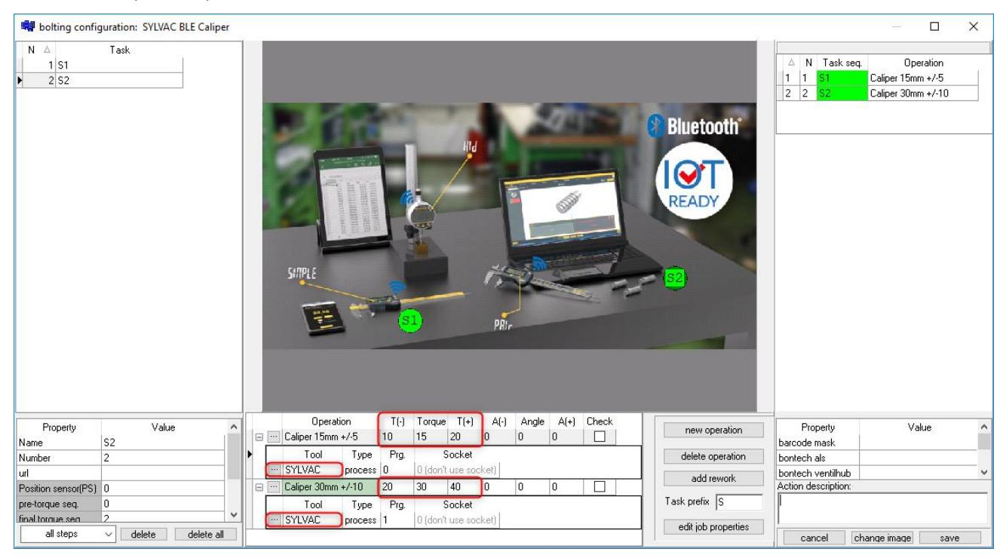

After saving the database, the SYLVAC tools can be used similar to other tools.

#### NOTES:

- The SYLVAC tools do not support "enable" tool.
- If the tool goes to sleep, it sometimes does not reconnect automatically. To reconnect the tool, follow the procedure:
  - 1. Click the "mode" button on the tool until "bt" is shown in the display.
  - 2. Click the "set" button once. The display should now change to "On"
  - 3. Click the "mode" button again to accept. The display should change back to the main display, but should now show a Bluetooth icon (in the top-right corner). The icon will blink until a connection is established, then will show a steady Bluetooth icon.
- Se[e 14.3.2.1](#page-77-1) on how to get the device MAC address

#### **14.3.6 Data output configuration**

For the basic configuration, see the Modbus tool.

Note that the following measurements type codes are used:

- LM: length measurement (in millimeters)
- LM+: upper length limit (in millimeters)
- LM-: lower length limit (in millimeters)

To make this work with the Sys3xxGateway software, the type codes must be added to the Sys3xxGateway configuration and to the server database. Please see the wiki page at [https://gogs.haller](https://gogs.haller-erne.de/he/heOpGui/wiki/Data+output+format+-+Sys3xxGateway+custom+units)[erne.de/he/heOpGui/wiki/Data+output+format+-+Sys3xxGateway+custom+units](https://gogs.haller-erne.de/he/heOpGui/wiki/Data+output+format+-+Sys3xxGateway+custom+units) for more information.

# 15 Additional configuration

## **15.1FTP output driver**

#### **15.1.1 Overview**

Some tools (e.g. GWK electronic torque wrench) cannot send FTP telegrams by themselves and some operations are done completely without a tool (e.g. GUI popup). For these cases, heOGS can act as an FTP client and send the FTP telegrams to the server.

In this section, the following keys can be used:

- **ENABLED** (int): Enable or disable the FTP. If set to non-zero, then the FTP driver is enabled.
- **HostIP** (ip address): IP address of the FTP server.
- **HostPort** (int): The port used for FTP on the FTP server. It is usually 21.
- **Username** (string): The username to log into the FTP server. If you are using Sys3xxGateway, this has to be "sys3xx".
- **Password** (string): The password to log into the FTP server. If you are using Sys3xxGateway, this has to be "sys3xx".
- **Directory** (string): Defines a directory on the client side that is used as an intermediate buffer for the FTP telegrams.
- **TargetFolderOnHost** (string): Optional, Defines a directory on the server side that is used to store the FTP telegrams. This option is not needed (and thus should not be configured) when using Sys3xxGateway.
- **Channel info**: The channel info uses an JSON encoded string to define channel properties. Syntax:

**CHANNEL\_***<CHANNELNUMBER>***\_INFO={ "IP":** *"TOOL IP"***, "ChannelName":** *"EXAMPLE-CHANNEL"***, "location name": [***"OGS\_Demo"***,** *""***,** *"STATION NAME"***,** *""***,** *""***,** *""***,** *""]* **}**

This information has to be provided for the FTP server to build a correct FTP telegram:

o **CHANNEL\_***<CHANNELNUMBER>***\_INFO:**  Enter the channel number here (e.g. **CHANNEL\_02\_INFO**) o **"IP":** *"TOOL IP"*

Enter the IP address of the tool that sent the result. This IP address will be used to replace the IP address of the machine that is running HeOGS, because this is the IP address that will be in the header of the FTP telegram, but the final database entry should contain the real IP address of the tool that sent the result.

o **"ChannelName":** *"EXAMPLE-CHANNEL"*

Enter the channel name here (e.g. **"ChannelName":** *"OGS-CRANE "*)

o **"location name": [***"OGS\_Demo"***,** *""***,** *"STATION NAME"***,** *""***,** *""***,** *""***,** *""***]**

#### **15.1.2 Station info channel 99**

The station info channel provides station specific info (logon/logoff and takt times). It is active by default, but the settings can be overridden through the station.ini file.

Default settings are:

- Channel name: "INFO\_CHANNEL"
- Station name (location[3]): station name, as defined in the [GENERAL] section.

To override (e.g. the station name), add a line similar to the following:

**CHANNEL\_99\_INFO={ "location name": [***""***,** *""***,** *"MyStationName"***,** *""***,** *""***,** *""***,** *""]* **}**

## **15.2Pick2Light configuration**

#### **15.2.1 Driver Setup**

Pick2Light requires the Modbus driver. To enable this driver, please make sure to setup the section [TOOL\_DLL] as follows:

#### **15.2.2 Driver Configuration**

The modbus tool driver is configured in the station.ini file as follows:

#### **15.2.3 Editor Configuration**

The Pick2Light driver/tool is not available in the heOpCfg editor by default. To enable it, follow the steps described below.

#### **15.2.3.1 Enable Level 1 configuration**

To allow Pick2Light configuration, the editor must be set to Level 1 configuration. See the following screenshot on how to enable configuration level 1 in heOpCfg.ini (located in the installation directory of heOpCfg.exe):

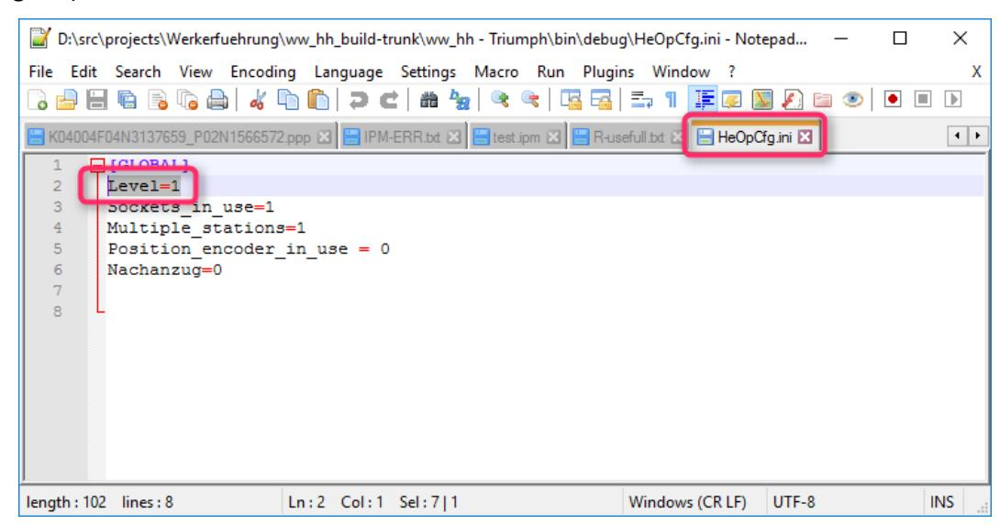

#### **15.2.3.2 Add and configure the Pick2Light tool**

The Pick2Light tool is simply added as a new Tool under the "NEXO" category. See the following screenshot:

## **15.3Barcode scanner**

To use a barcode scanner with heOGS, please uncomment the following line in the station.ini:

serial port

CRLF

Please make sure to set the serial connection parameters to the one used by your barcode scanner.

## **15.4User configuration**

Adding users to a station is done in the [USER] section of the station.ini. The syntax is as documented in the screenshot below:

<username>=<password>,<userlevel(optional; default = 1)>,<RFID-Code(optional, see sectio[n 15.4.1\)](#page-85-2)>

The user in the screenshot was created for demonstration purposes with the following parameters:

1.) Username: TESTUSER 2.) Password: testpassword 3.) Userlevel: 1 4.) RFID-Code: U40203ABCDE 5.) Autologon is activated for this user. If autologon is available and a non-empty username is given, then an operator with the given username is logged on automatically when HeOGS starts. The userlevel of the autologon user is always 1.

### **15.4.1 RFID reader logon/logoff**

The RFID-Codes are defined per user as shown in chapte[r 15.4.](#page-85-1) The activation of the RFID-Reader is done in the serial section. Simply add a line with the serial connection parameters, e.g.:

NOTE: Using an RFID reader for logon/logoff also requires modifying the code in barcode.lua to setup tag user lookup.