# Haller + Erne GmbH

# **Operator Guidance System Workflow Editor**

### **Benutzerhandbuch**

HEI-71-209 Revision R04

# **Versionsgeschichte**

| Revision | Geschichte                                             | Autor | Datum      |
|----------|--------------------------------------------------------|-------|------------|
| R01      | Erster Entwurf des Editor-Benutzerhandbuchs heOGS V2.1 | se    | 2019-11-21 |
| R02      | Erste Veröffentlichung für heOGS V2.1                  | he    | 2019-11-29 |
| R03      | Abschnitt "Referenz" hinzugefügt                       | he    | 2019-12-13 |
| R04      | Aktualisiert für V3.1, Server-Modus hinzugefügt, Job  |       |            |
|          |                                                        | he    | 2024-08-21 |

# **Über dieses Dokument**

Dieses Dokument beschreibt die Verwendung des Editors zur Konfiguration und Bearbeitung von Workflows für heOGS.

# **Inhaltsübersicht**

| 1 1.1 1.2 2 2.1 2.2 3 3.1 3.2 3.3 | Einführung Übersicht_______________________________________________________________________4 Szenarien_______________________________________________________________________5 Installation und Konfiguration Anforderungen Installation der Software___________________________________________________________5 Schnellstart_________________________________________________________________________6 Starten der Software______________________________________________________________6 Werkzeuge verwalten Jobs bearbeiten__________________________________________________________________8 | _________________________________________________________________________4 __________________________________________________________5 __________________________________________________________________5 _____________________________________________________________7 |
|-----------------------------------|-----------------------------------------------------------------------------------------------------------------------------------------------------------------------------------------------------------------------------------------------------------------------------------------------------------------------------------------------------------------------------------------------------------------------------------------------------------------------------------------------------------------------------------------------------------------------------------------------------|---------------------------------------------------------------------------------------------------------------------------------------------------------------------------------------------------------------------------------------------------------------------------|
| 3.3.1                             |                                                                                                                                                                                                                                                                                                                                                                                                                                                                                                                                                                                                     | Job-Katalog__________________________________________________________________________ 8                                                                                                                                                                                   |
| 3.3.2                             | Job-Editor                                                                                                                                                                                                                                                                                                                                                                                                                                                                                                                                                                                          | 9                                                                                                                                                                                                                                                                         |
| 3.4                               | Arbeitsabläufe bearbeiten                                                                                                                                                                                                                                                                                                                                                                                                                                                                                                                                                                           | ________________________________________________________13                                                                                                                                                                                                                |
| 3.5                               | Barcodes                                                                                                                                                                                                                                                                                                                                                                                                                                                                                                                                                                                            | ______________________________________________________________________15                                                                                                                                                                                                  |
| 3.6                               | Workflows in die Runtime übertragen                                                                                                                                                                                                                                                                                                                                                                                                                                                                                                                                                                 | _______________________________________________16                                                                                                                                                                                                                         |
| 4                                 | Referenz                                                                                                                                                                                                                                                                                                                                                                                                                                                                                                                                                                                            | __________________________________________________________________________18                                                                                                                                                                                              |
| 4.1                               | Bedingungen                                                                                                                                                                                                                                                                                                                                                                                                                                                                                                                                                                                         | ___________________________________________________________________18                                                                                                                                                                                                     |
| 4.2                               | Benutzeroberfläche des Editors                                                                                                                                                                                                                                                                                                                                                                                                                                                                                                                                                                      | ____________________________________________________19                                                                                                                                                                                                                    |
| 4.2.1                             | Übersicht                                                                                                                                                                                                                                                                                                                                                                                                                                                                                                                                                                                           | 19                                                                                                                                                                                                                                                                        |
| 4.2.2                             | Registerkarte Familien                                                                                                                                                                                                                                                                                                                                                                                                                                                                                                                                                                              | 20                                                                                                                                                                                                                                                                        |
| 4.2.3                             | Registerkarte Jobs                                                                                                                                                                                                                                                                                                                                                                                                                                                                                                                                                                                  | 23                                                                                                                                                                                                                                                                        |
| 4.2.4                             | Registerkarte Tools                                                                                                                                                                                                                                                                                                                                                                                                                                                                                                                                                                                 | 28                                                                                                                                                                                                                                                                        |
| 4.2.5                             | Job Editor                                                                                                                                                                                                                                                                                                                                                                                                                                                                                                                                                                                          | 30                                                                                                                                                                                                                                                                        |
| 4.2.6                             | Datenbank-Einstellungen______________________________________________________________                                                                                                                                                                                                                                                                                                                                                                                                                                                                                                               | 33                                                                                                                                                                                                                                                                        |
| 4.2.7                             | Changelog__________________________________________________________________________                                                                                                                                                                                                                                                                                                                                                                                                                                                                                                                 | 34                                                                                                                                                                                                                                                                        |
| 4.2.8                             | Admin-Modus_______________________________________________________________________                                                                                                                                                                                                                                                                                                                                                                                                                                                                                                                  | 34                                                                                                                                                                                                                                                                        |
| 4.3                               | Server-Modus                                                                                                                                                                                                                                                                                                                                                                                                                                                                                                                                                                                        | __________________________________________________________________34                                                                                                                                                                                                      |
| 4.3.1                             | Übersicht                                                                                                                                                                                                                                                                                                                                                                                                                                                                                                                                                                                           | 34                                                                                                                                                                                                                                                                        |
| 4.3.2                             | Editor-Rollen________________________________________________________________________                                                                                                                                                                                                                                                                                                                                                                                                                                                                                                               | 35                                                                                                                                                                                                                                                                        |
| 4.3.3                             | Versionierung                                                                                                                                                                                                                                                                                                                                                                                                                                                                                                                                                                                       | 37                                                                                                                                                                                                                                                                        |
| 4.3.4                             | Explizites Sperren____________________________________________________________________                                                                                                                                                                                                                                                                                                                                                                                                                                                                                                              | 38                                                                                                                                                                                                                                                                        |
| 4.3.5                             | Active Directory-Zugangskontrolle                                                                                                                                                                                                                                                                                                                                                                                                                                                                                                                                                                   | 38                                                                                                                                                                                                                                                                        |
| 4.3.6                             | Datenbank-Shortcuts                                                                                                                                                                                                                                                                                                                                                                                                                                                                                                                                                                                 | 39                                                                                                                                                                                                                                                                        |
| 4.4                               | Konfiguration                                                                                                                                                                                                                                                                                                                                                                                                                                                                                                                                                                                       | __________________________________________________________________40                                                                                                                                                                                                      |
| 4.4.1                             | Übersicht                                                                                                                                                                                                                                                                                                                                                                                                                                                                                                                                                                                           | 40                                                                                                                                                                                                                                                                        |
| 4.4.2                             | Abschnitte zur Konfiguration___________________________________________________________                                                                                                                                                                                                                                                                                                                                                                                                                                                                                                             | 40                                                                                                                                                                                                                                                                        |
| 5                                 | Verwaltung der Daten                                                                                                                                                                                                                                                                                                                                                                                                                                                                                                                                                                                | _______________________________________________________________44                                                                                                                                                                                                         |
| 5.1                               | Übersicht______________________________________________________________________44                                                                                                                                                                                                                                                                                                                                                                                                                                                                                                                   |                                                                                                                                                                                                                                                                           |
| 5.2                               | Einstellungen___________________________________________________________________44                                                                                                                                                                                                                                                                                                                                                                                                                                                                                                                  |                                                                                                                                                                                                                                                                           |
| 5.2.1                             | Standalone / Demo-Einrichtung                                                                                                                                                                                                                                                                                                                                                                                                                                                                                                                                                                       | 44                                                                                                                                                                                                                                                                        |
| 5.2.2                             | Pro Station konfigurieren______________________________________________________________                                                                                                                                                                                                                                                                                                                                                                                                                                                                                                             | 45                                                                                                                                                                                                                                                                        |
| 5.2.3                             | Gemeinsame Konfiguration mit mehreren Stationen                                                                                                                                                                                                                                                                                                                                                                                                                                                                                                                                                     | 45                                                                                                                                                                                                                                                                        |
| 5.2.4                             | Zentrale Datenbank                                                                                                                                                                                                                                                                                                                                                                                                                                                                                                                                                                                  | 46                                                                                                                                                                                                                                                                        |
| 5.3                               | heOpImp                                                                                                                                                                                                                                                                                                                                                                                                                                                                                                                                                                                             | ______________________________________________________________________46                                                                                                                                                                                                  |
| 5.3.1                             | Übersicht                                                                                                                                                                                                                                                                                                                                                                                                                                                                                                                                                                                           | 46                                                                                                                                                                                                                                                                        |
| 5.3.2                             | Lokale/Server-Datenbanken synchronisieren______________________________________________                                                                                                                                                                                                                                                                                                                                                                                                                                                                                                             | 47                                                                                                                                                                                                                                                                        |
| 5.4                               | Zugangskontrolle und Sicherheit                                                                                                                                                                                                                                                                                                                                                                                                                                                                                                                                                                     | ___________________________________________________50                                                                                                                                                                                                                     |
| 5.4.1                             | Übersicht                                                                                                                                                                                                                                                                                                                                                                                                                                                                                                                                                                                           | 50                                                                                                                                                                                                                                                                        |
| 5.4.2                             | Fernzugriff auf den Server                                                                                                                                                                                                                                                                                                                                                                                                                                                                                                                                                                          | 50                                                                                                                                                                                                                                                                        |

# 1 Einführung

Dieses Dokument beschreibt die Verwendung des heOGS-Editors zum Erstellen und Verwaltung von Workflows. Der heOGS-Editor verfügt über die folgenden Hauptfunktionen:

- Grafischer Editor zum Erstellen und Bearbeiten von Arbeitsabläufen einschließlich Modellvarianten und zugehörigen Barcodes
- Wiederverwendung von Jobs und Operationen zur schnellen Erstellung mehrerer Aufgaben oder Modellvarianten
- Speicherung von Daten in einer einzigen Datei zur Vereinfachung der Datenverwaltung (Sicherung und Versionierung)
- Unterstützung von Standardwerkzeugen (Scannen, Schrauben, Pick-2-Light, manuelle Vorgänge und Anweisungen) und benutzerdefinierten Werkzeugen (einschließlich benutzerdefinierter Eigenschaften, die über die GUI bearbeitet werden).
- Ermöglicht die Konfiguration von mehrstufigen Prozessen (z.B. Voranzug/Endanzug) mit unterschiedlichen Sequenzen und aufgabenspezifischen Nacharbeitsprozessen
- Logische Trennung der Workflow-Konfiguration von der Stations-/Werkzeugkonfiguration (für Line Balancing und Migrationsszenarien)

Die heOpMon-Workstation-Software, die auf dem Stations-PC läuft und den eigentlichen Prozess und die Werkzeuge steuert, wird hier nicht beschrieben; Einzelheiten finden Sie im heOpMon-Handbuch.

# **1.1 Übersicht**

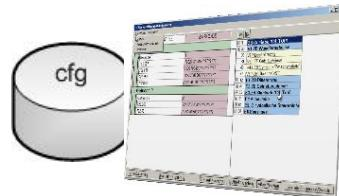

Die heOGS-Software besteht hauptsächlich aus zwei Komponenten:

- heOGS-Editor ("heOpCfg"): Anwendung zum Erstellen und Verwalten von Arbeitsabläufen. Die heOpCfg-Anwendung ist eine Standard-Windows-GUI-Anwendung und benötigt Maus und Tastatur zur Bedienung.
- heOGS-Runtime ("heOpMon"): Anwendung, die auf einem Bedienerarbeitsplatz in der Produktionslinie läuft, um Prozesse und an den Arbeitsplatz angeschlossene Steuerungswerkzeuge zu visualisieren. Die heOpMon-Anwendung ist für die Verwendung auf einem Touchscreen im Vollbildmodus optimiert und verwendet normalerweise keine Maus und Tastatur. Sie versucht, Interaktionen zu minimieren und konzentriert sich auf eine gut sichtbare GUI, die auch aus der Ferne gelesen werden kann.

Beide Komponenten verwenden ihre eigene Datenbankdatei, um Informationen zu speichern:

- heOpCfg-Editor-Datendatei ("cfg"): speichert alle Informationen über konfigurierte Workflows (wie z.B. Job-Bilder, Workflow-Varianten, Aufgaben und Aktionsdefinitionen sowie Operationsverknüpfungen zu Werkzeugen) für einen einzelnen oder auch für mehrere Bedienerarbeitsplätze. In dieser Datendatei werden nur die "aktuellen" Workflow-Definitionen gespeichert, keine historischen Daten und keine historischen Workflows.
- heOpMon-Runtimedatendatei ("Daten"): speichert alle Informationen über die Workflows einer einzelnen Station und die historischen Workflow-Ergebnisdaten. Da diese Datendatei Workflow-Ergebnisdaten enthält, ermöglicht sie den Zugriff auf zuvor bearbeitete Teile und deren Status für "Pick up where you left"-Prozesse. Damit dies funktioniert, werden in der Datendatei auch historische Workflow-Definitionen gespeichert, selbst wenn sich die Workflow-Konfiguration zwischenzeitlich geändert hat.

Beachten Sie, dass nur heOpMon eine Lizenz benötigt, um verwendet zu werden. heOpCfg kann auf einer beliebigen Anzahl von zusätzlichen PCs installiert werden, ohne dass eine Lizenz erforderlich ist.

## **1.2 Szenarien**

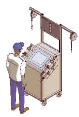

Da die heOGS-Software in zwei Anwendungen aufgeteilt ist, kann man mehrere Betriebsszenarien realisieren, indem man wählt, wo die Software installiert wird, wo die Datendateien aufbewahrt werden und wie die Daten zwischen dem heOpCfg-Editor und der heOpMon-Runtimeumgebung ausgetauscht werden.

Siehe Kapitel [5.2](#page-43-2) für weitere Informationen zu den typischen Einsatzszenarien.

# 2 Installation und Konfiguration

# **2.1 Anforderungen**

Die Software wird unter jeder aktuellen Windows-Version (>= Windows 10, 64bit) unterstützt.

# **2.2 Installation der Software**

Der heOGS-Editor (heOpCfg) wird als Bestandteil des Standard heOGS-Installers installiert (oder kann auch mit dem Standalone-Installer - in diesem Fall sogar ohne Admin-Rechte - installiert werden). Der Installer kann durch Ausführen der heOGS-V<Version>-setup.exe gestartet werden.

Nach der Auswahl der Installationssprache und des Zielordners fragt das Installationsprogramm nach den zu installierenden Komponenten. Um nur den heOpCfg-Editor zu installieren, wählen Sie wie folgt "Configurator & Firebird 4.0 (embedded))":

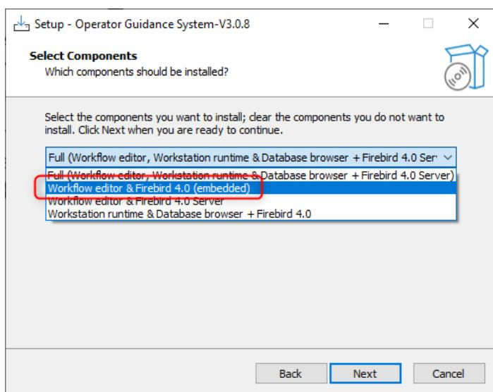

Klicken Sie auf "Weiter", bis die Software endgültig installiert ist.

Standardmäßig wird die Software unter "C:\Program Files (x86)\Haller+Erne GmbH\OGS 3.0" installiert und ist im Startmenü unter "Operator Guidance System" finden.

# 3 Schnellstart

Dieser Abschnitt beschreibt die Verwendung des heOGS-Editors anhand der mitgelieferten Demo-Konfiguration. Er zeigt die grundlegenden Operationen und typischen Verfahren zum Erstellen und Ändern von Workflows. Das folgende Kapite[l 4](#page-17-0) bietet dann eine vollständige Referenz für die Verwendung der Software und aller ihrer Funktionen.

# **3.1 Starten der Software**

Starten Sie den Editor durch Auswahl von Start→ Operator Guidance System → Workflow Editor. Daraufhin wird der Hauptbildschirm des Editors angezeigt (ohne dass eine Konfigurationsdatei geladen ist):

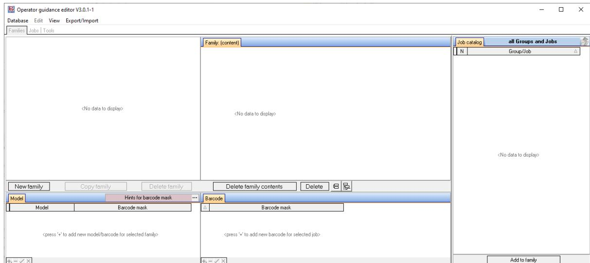

Um die Demo-Datenbank zu öffnen, verwenden Sie das Menü Datenbank→ Öffnen... und wählen Sie die Konfigurationsdatei (demo.fdc, standardmäßig unter C:\OGS-Projects\Demo). Beachten Sie, dass der Editor die zuletzt geöffneten Dateien speichert und sie im Menü Datenbank→ Wieder öffnen zur Verfügung stellt, so dass Sie schnell auf eine zuvor verwendete Datei zugreifen können. Nach dem Öffnen einer Datei aktiviert der Editor die Registerkarte "Familien", auf der eine Liste aller konfigurierten Arbeitsabläufe angezeigt wird:

- : Zeigt die Liste der konfigurierten Modelle ("Familien"). Sie können hier Modelle hinzufügen/löschen oder zugehörige Barcodes ändern.
- : Zeigt die Liste der Jobs (Bilder) an, die für das ausgewählte Modell definiert sind (ausgewählt unter ). Sie können hier die Jobs für den aktuellen Workflow hinzufügen, löschen und neu anordnen. Den Jobs können hier auch Barcodes zugewiesen werden (z.B. um einen Job nach Barcode auszuwählen). Beachten Sie, dass die hier eingegebenen Barcodes modellabhängig sind, so dass identische Jobs für jedes Modell unterschiedliche Barcodes verwenden können.) Durch einen Doppelklick auf einen Job können Sie direkt den Job-Editor öffnen (siehe Kapitel [3.3](#page-7-0) und das Referenzkapite[l 4.2.5\)](#page-29-0).
- : Zeigt den Job-Katalog an. In diesem Fenster werden alle dem System bekannten Jobs aufgelistet. Beachten Sie, dass sich dieser Bereich ähnlich wie der Windows-Dateibrowser verhält, d.h. Sie können eine Job-Gruppe ("Unterordner") durch Doppelklick öffnen und auch eine Ebene höher gehen, indem Sie das Symbol verwenden (auf der obersten Ebene "alle Gruppen und Jobs" ausgegraut).

Die Registerkarte "Jobs" bietet hauptsächlich einen Einblick in den Job-Katalog mit zusätzlichen Funktionen zum Erstellen, Bearbeiten und Verwalten von Jobs (siehe Kapite[l 3.3](#page-7-0) und das Referenzkapitel [4.2.3\)](#page-22-0).

Die Registerkarte "Werkzeuge" verwaltet die Werkzeuge (siehe Kapitel [3.2](#page-6-0) und die Referenz in Kapitel [4.2.4\)](#page-27-0).

# **3.2 Werkzeuge verwalten**

Der erste Schritt bei der Erstellung von Prozessbeschreibungen besteht in der Regel darin, die verwendeten Werkzeuge zu definieren. Wählen Sie dazu die Registerkarte "Werkzeuge". Die Anzeige ändert sich wie folgt:

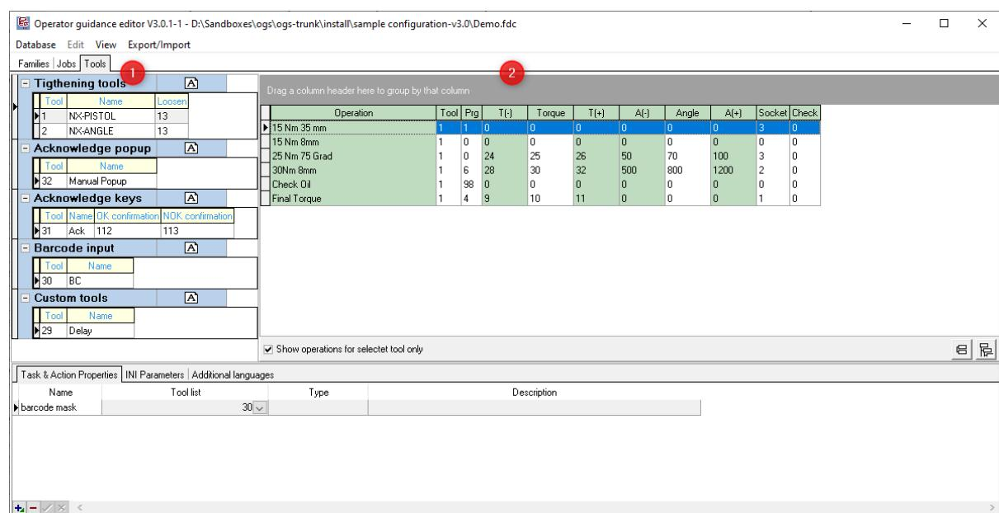

Auf der linken Seite () sehen Sie die Werkzeuge gruppiert nach Funktionalität. Beachten Sie, dass die Werkzeuge nur durch ihre Werkzeugnummer referenziert werden, was (zumindest bis zu einem gewissen Grad) die Zuordnung eines in der Workflow-Konfiguration definierten "logischen" Werkzeugs zu einem "physischen" Werkzeug auf der Workstation ermöglicht. Auf der rechten Seite () sehen Sie eine Liste der bekannten Operationen, die für das Werkzeug definiert sind - beachten Sie, dass diese je nach Art des Werkzeugs unterschiedlich angezeigt werden kann. Der untere Bereich zeigt die benutzerdefinierten Werkzeugeigenschaften (siehe Kapitel [4.2.4\)](#page-27-0) für weitere Details.

Sie können nun z.B. damit beginnen, ein neues "Anzugswerkzeug" hinzuzufügen. Klicken Sie dazu mit der rechten Maustaste in den Bereich innerhalb der Gruppe "Anziehwerkzeuge" und wählen Sie dann "Neues Werkzeug" aus dem Kontextmenü. Dadurch wird eine Zeile innerhalb der Werkzeuggruppe hinzugefügt und automatisch die nächste unbenutzte Werkzeugnummer zugewiesen (Sie können diese natürlich ändern). Je nach Werkzeugtyp sollten Sie nun die erforderlichen Parameter eingeben (in der Regel den Werkzeugnamen, bei Anziehwerkzeugen zusätzlich die Nummer des automatischen Löseprogramms).

Das war's, um ein neues Werkzeug hinzuzufügen und es für die Verwendung in Workflows und Jobs verfügbar zu machen. Natürlich können Sie hier auch Werkzeuge löschen und bearbeiten. Klicken Sie sich durch die bereits konfigurierten Werkzeuge und beachten Sie die Liste der Operationen im rechten Fensterbereich () - so erhalten Sie schnell einen Überblick über die bereits zugewiesenen Operationen für jedes Werkzeug. Um die vollständige Liste zu erhalten, kann das Kontrollkästchen "Nur Operationen für ausgewähltes Werkzeug anzeigen" deaktiviert werden, um alle in der aktuellen Datenbank definierten Operationen zu sehen.

# **3.3 Jobs bearbeiten**

### **3.3.1 Job-Katalog**

Nachdem wir die Werkzeuge überprüft haben, wechseln wir zur Registerkarte "Jobs". Auf dieser Registerkarte wird der Job-Katalog angezeigt, d.h. die Liste aller im System definierten Jobs. Die Registerkarte zeigt eine explorerähnliche Ansicht () der im Katalog definierten Jobs (gelbe Kopfzeile) und Jobgruppen (blaue Kopfzeile). Im unteren Bereich () werden die Eigenschaften des aktuell ausgewählten Jobs sowie einige Aktionsschaltflächen angezeigt:

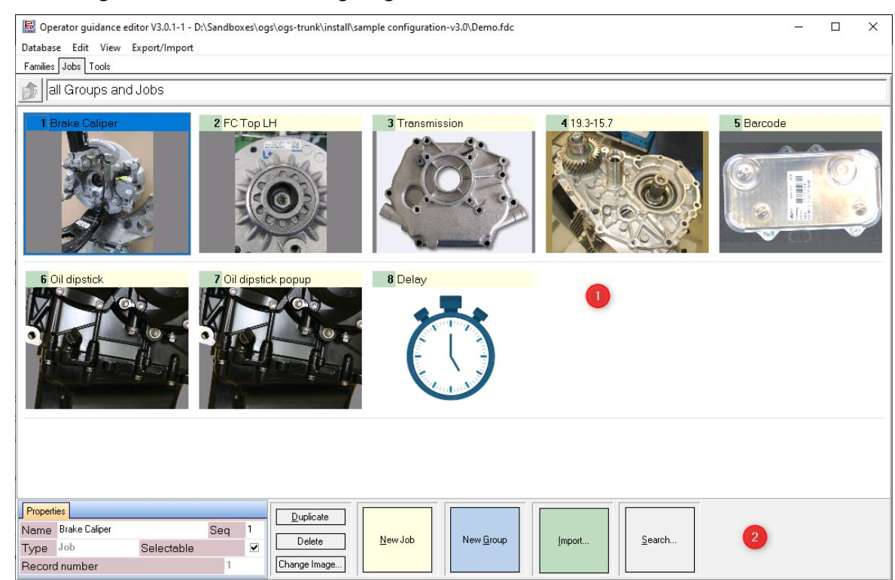

Der Job-Katalog ermöglicht die Verwaltung von Jobs, z.B. die Organisation von Jobs in Gruppen ("Unterordnern"), Copy & Paste, Linking (Wiederverwendung von verknüpften Job-Klonen) und den Massenimport bestehender Grafikdateien (Menüpunkt "Bilder"). Siehe die Job-Katalog-Referenz in Kapitel [4.2.3](#page-22-0) für weitere Details.

Schlüsselprinzipien für die Definition und Verwendung von Jobs:

- Job-Namen müssen eindeutig sein. Um Verwechslungen zu vermeiden und die Wiederverwendung von Jobs zu erleichtern, muss der Job-Name (per Definition) eindeutig sein. Wenn Sie eine Kopie eines Jobs erstellen, wird in der Regel ein neuer Name zugewiesen und die Kopie verhält sich wie eine völlig unabhängige Kopie des ursprünglichen Jobs. Sie können auch verknüpfte Kopien erstellen, die Änderungen weitergeben, aber diese haben dann denselben Namen.
- Jedem Job wird ein Job-Bild zugewiesen (verwenden Sie ein Bildformat von 4:3, um den Bildschirm des Bedienerarbeitsplatzes perfekt auszufüllen). Sie können den Aufgaben später zusätzlich URLs zuweisen, so dass auf dem Bedienerbildschirm zugehörige Informationen aus einer html-Datei oder sogar

dynamische Daten aus Ihrem PDM- oder ERP-System angezeigt werden (3D-Ansichten, pdf-Anleitungsblätter, ...).

- Überlegen Sie sich, wie viele Jobs Sie für einen Workflow definieren und welche Aufgaben Sie jedem Job zuweisen. Da ein Job in der Regel als Bild auf dem Bildschirm des Bedieners angezeigt wird, sollten Sie die Aufgaben logisch gruppieren, damit der Bediener die Aufgaben eindeutig identifizieren kann. Beachten Sie auch, dass ein Job der Schlüssel für die Wiederverwendbarkeit von Aufgaben über mehrere Modelle hinweg ist. Stellen Sie daher sicher, dass Sie wiederverwendbare Teile Ihrer Prozesse in separate Jobs einteilen.

Durch einen Doppelklick auf einen Job im Job-Katalog können Sie den Job-Editor öffnen (beachten Sie, dass Sie den Job-Editor auch durch einen Doppelklick auf einen Job auf der Registerkarte "Familien" öffnen können).

Legen wir einen neuen Job an, indem wir auf die Schaltfläche "Neuer Job" im unteren Bereich des Job-Editors klicken und im Popup-Fenster einen Namen eingeben. Dadurch wird ein neuer Job mit dem angegebenen Namen erstellt, dem jedoch kein Bild zugeordnet ist. Doppelklicken Sie auf den neu erstellten Job, um den Job-Editor zu öffnen (siehe nächster Abschnitt zur Verwendung des Job-Editors).

HINWEIS: Anstatt einen Job manuell zu erstellen und seinen Namen einzugeben, können Sie auch den Image-Browser verwenden (siehe Kapite[l 4.2.3.6\)](#page-26-0) in der Seitenleiste verwenden, um einen Job aus einer Liste von Bildern aus dem Dateisystem hinzuzufügen. Sie können dann einfach eine Bilddatei per Drag & Drop ziehen, und ein neuer Job wird mit dem Bildnamen und dem Bildinhalt erstellt.

### **3.3.2 Job-Editor**

#### **3.3.2.1 Übersicht**

Um einen Job zu öffnen (entweder über die Registerkarte "Familien" oder die Registerkarte "Jobs"), doppelklicken Sie auf das Job-Bild (oder den Namen). Nach dem Öffnen des Job-Editors sieht das Fenster wie folgt aus:

- Die Bildansicht hier wird das Bild des Jobs/Teils angezeigt. Doppelklicken Sie, um Aufgaben hinzuzufügen, klicken Sie mit der rechten Maustaste, um das Bild zu ändern. Klicken Sie auf eine Aufgabe, um sie auszuwählen (durch Klicken auf den Kreis, der die Aufgabe darstellt). Beachten Sie, dass das Erstellen einer neuen Aufgabe immer auch eine zugehörige Aktion erzeugt (in ).
- Die Liste der für diesen Job definierten Aufgaben. Kann zum Auswählen (Klicken) und Bearbeiten von Aufgaben verwendet werden.
- Die Aufgabeneigenschaften. Beachten Sie, dass sich die Aufgabeneigenschaften auf die aktuell ausgewählte Aufgabe beziehen.
- Die im aktuell bearbeiteten Job definierten/verwendeten Operationen.
- Die Liste der für den Job definierten Aktionen. Beachten Sie, dass diese Liste die tatsächliche Reihenfolge der Arbeiten festlegt, die der Bediener bei der Ausführung des Jobs durchlaufen muss. Verwenden Sie Drag & Drop, um Aktionen neu anzuordnen, und klicken Sie mit der rechten Maustaste, um Vorgänge zuzuweisen (von ). Beachten Sie, dass jede Aktion immer mit einer einzigen Aufgabe verknüpft ist , aber eine Aufgabe kann mehrere Aktionen haben (z. B. Vorspannen, Endspannen und Kontrolle). Abgesehen davon muss jede Aktion \*einem\* Vorgang zugeordnet sein, sonst können Sie den Auftrag nicht speichern.
- Aktionseigenschaften für die ausgewählte Aktion (in ). Ermöglicht das Hinzufügen einer Aktionsbeschreibung und das Festlegen zusätzlicher aktionsbezogener Eigenschaften (abhängig von der zugewiesenen Aktion).

#### **3.3.2.2 Aufgaben, Vorgänge und Aktionen hinzufügen**

Wenn Sie einen neuen Job hinzufügen, gehen Sie in der Regel wie folgt vor:

- 1. Laden Sie ein Bild. Klicken Sie dazu mit der rechten Maustaste auf eine beliebige Stelle in der Bildansicht () und wählen Sie ein Bild aus.
- 2. Fügen Sie Aufgaben hinzu, in der Regel durch Doppelklick auf die Stelle auf dem Bild, an der die Aufgabe erledigt werden soll (als visueller Hinweis für den Bediener). Verwenden Sie <Umschalt>-Klick oder <Strg>-Klick, um die Größe der Kreise zu ändern, klicken und ziehen Sie, um die Indikatoren neu zu positionieren. Um die Namen zu ändern, bearbeiten Sie sie in .
- 3. Wählen Sie Vorgänge aus oder erstellen Sie welche (in ). Um aus den vorhandenen Vorgängen auszuwählen, klicken Sie auf die Schaltfläche "Neuer Vorgang" und klicken Sie auf die Ellipse ("...") links neben dem Vorgangsnamen, dann wählen Sie das Werkzeug und den Vorgang. Um einen neuen Vorgang hinzuzufügen, geben Sie den Namen und andere Details ein und wählen Sie ein Werkzeug aus, indem Sie auf die Schaltfläche mit dem Auslassungszeichen ("...") unter dem Vorgangsnamen klicken.
- 4. Abschließend ordnen Sie die Aktionen (in ) einem der zuvor definierten Vorgänge zu. Damit wird festgelegt, welches Werkzeug und welche Parameter (d. h. der "Prozess") für eine bestimmte Aufgabe verwendet werden sollen. Klicken Sie dazu mit der rechten Maustaste auf eine Aktion (oder <Shift>- Klick oder <ctrl>-Klick, um eine Reihe von Aktionen auszuwählen) und klicken Sie mit der rechten Maustaste - wählen Sie dann "Operation hinzufügen" aus dem Kontextmenü und wählen Sie die richtige Operation.

Um die obigen Schritte nachzuvollziehen, sehen Sie hier das Ergebnis nach Schritt 1: Laden eines Bildes:

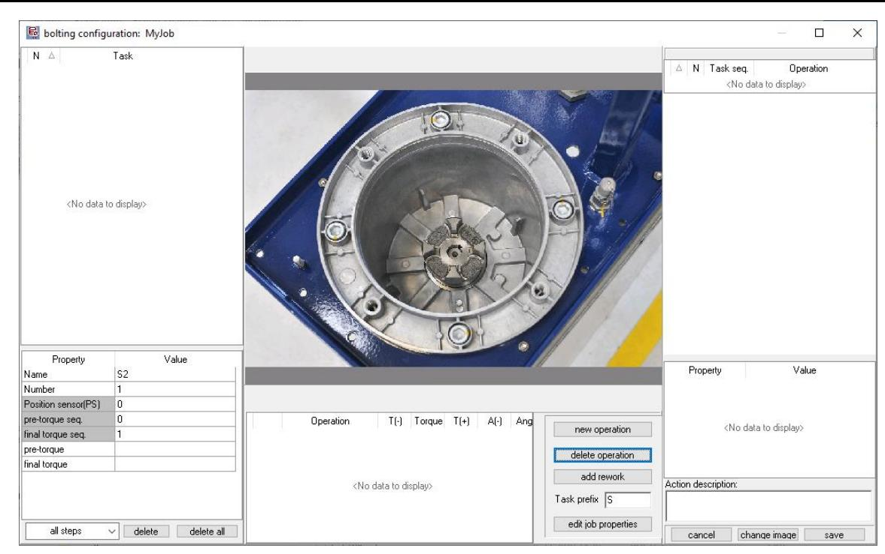

In Schritt 2 werden die Aufgaben durch Doppelklick auf die im Bild sichtbaren Schrauben hinzugefügt (wodurch automatisch S1 - S4 entstehen). Eine weitere Aufgabe wurde unten rechts hinzugefügt, um eine manuelle Aktionsanzeige zu erstellen (S5, aber in der Aufgabenliste in T1 umbenannt ):

In Schritt 3 (Vorgang hinzufügen/erstellen in ) wurde ein bereits vorhandener Vorgang wie folgt gewählt: zuerst wird die Schaltfläche "neuer Vorgang" angeklickt - dadurch wird der neue "Vorgang 1" ohne weitere Parameter hinzugefügt (vom Typ Prozess, aber ohne zugewiesenes Werkzeug):

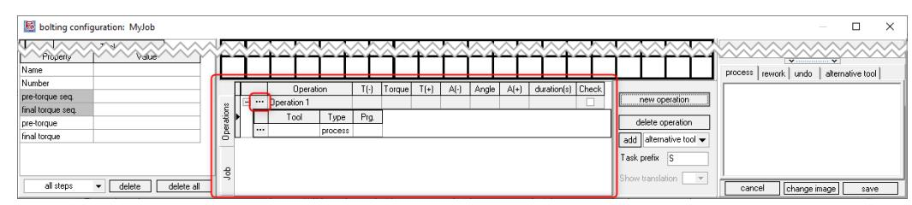

Durch Anklicken der Ellipsenschaltfläche links neben dem Namen "Operation 1" wurde das Operationsauswahlfenster geöffnet und das Werkzeug "NX-Pistole" mit der Operation "15 Nm 8mm" ausgewählt:

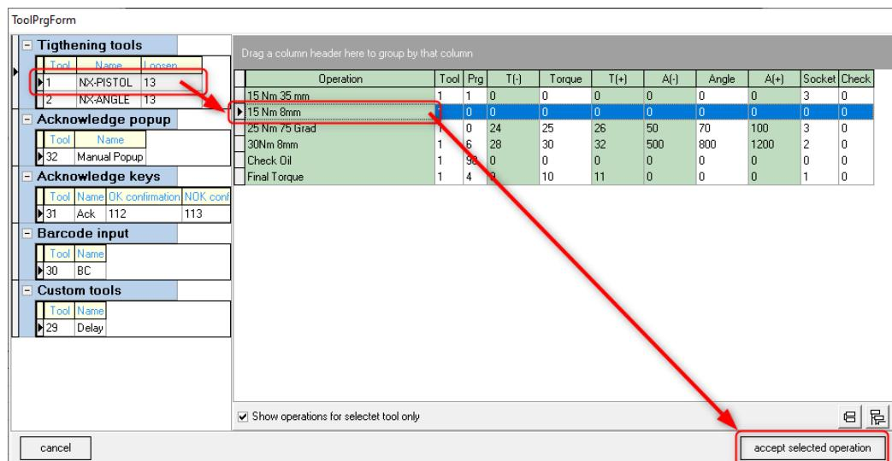

Dies führt dann dazu, dass die Operation "15 Nm 8mm" korrekt hinzugefügt wird. Dieser Schritt wird wiederholt, um eine weitere Operation hinzuzufügen, diesmal mit dem Werkzeug "Ack" und der Operation "Manual Op", so dass nun zwei Operationen verfügbar sind:

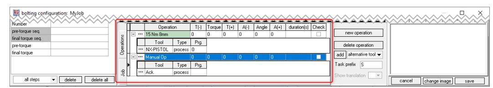

In Schritt 4 werden diese Operationen nun den Aktionen zugewiesen, indem Sie mit der rechten Maustaste auf die Aktionen klicken und aus dem Kontextmenü auswählen:

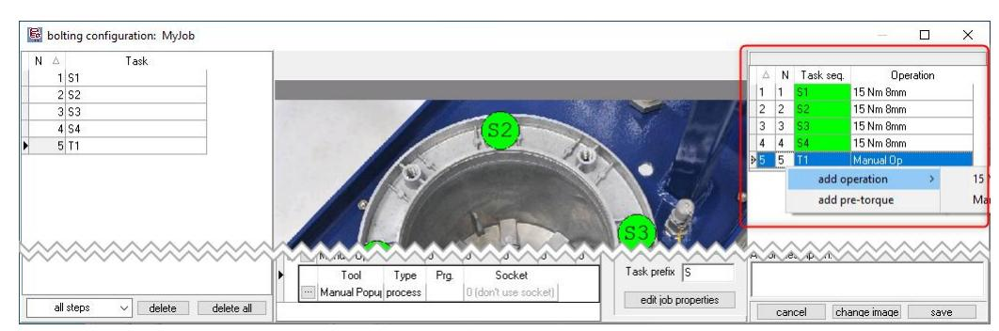

Um dem Bediener mehr Informationen zur Verfügung zu stellen, sollte die Beschreibung des Aktionstextes für alle Aktionen angegeben werden, die etwas mehr Informationen benötigen (insbesondere die manuellen Vorgänge):

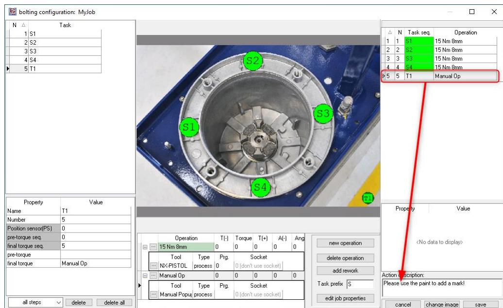

Klicken Sie abschließend auf die Schaltfläche "Speichern", um zum Job-Katalog zurückzukehren. Beachten Sie, dass der zuvor erstellte Job "Mein Job" nun auch eine aktualisierte Miniaturansicht zeigt:

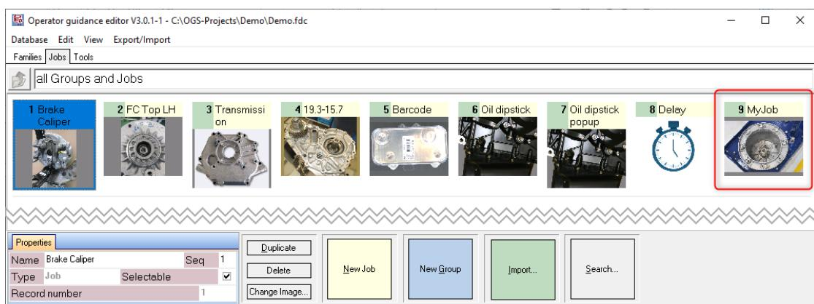

# **3.4 Arbeitsabläufe bearbeiten**

Nachdem die Jobs definiert sind, besteht der nächste (letzte) Schritt darin, die Workflows einzurichten. Ein Workflow ist eine Abfolge von Jobs für eine bestimmte Produktvariante, die in der durch einen oder mehrere Barcodes identifizierten Station gebaut wird. Beachten Sie, dass mehrere Produktmodelle denselben Workflow in einer bestimmten Station nutzen können - solange dieselben Arbeitsschritte (Jobs) in der Station (Produktfamilie) ausgeführt werden, kann ein einziger Workflow verwendet werden (der von verschiedenen Modellen genutzt wird - Minimierung der Anzahl der Konfigurationen), selbst wenn jedes Modell einen anderen Barcode verwendet (siehe Kapitel [3.5](#page-14-0) unten für weitere Informationen über die Barcode-Verarbeitung).

Um Workflows zu erstellen/bearbeiten, wählen Sie die Registerkarte "Familien" (siehe auch Kapite[l 3.1](#page-5-1) für einen Überblick und Kapitel [4.2.2](#page-19-0) für die Referenz):

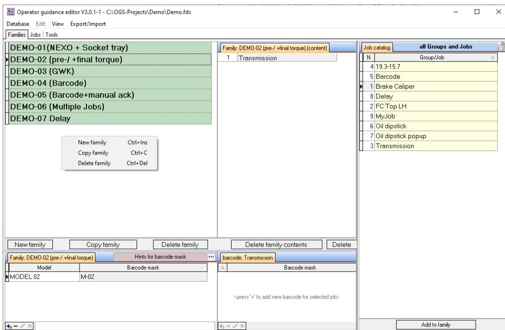

Um eine neue Familie zu erstellen, klicken Sie mit der rechten Maustaste auf die leere Stelle im linken Fensterbereich und wählen Sie "Neue Familie" aus dem Kontextmenü (oder verwenden Sie die Tastatur und geben Sie <ctrl>-<ins> ein) - dadurch wird ein neuer Eintrag mit dem Namen "New Family 6" in der Liste der Familien erstellt.

Sie können auf den Titel klicken und den Namen bearbeiten (z. B. in "Demo-08 (My Workflow)" ändern):

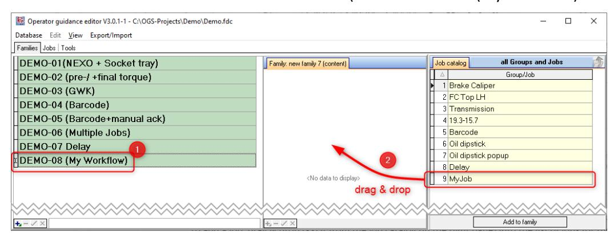

Wenn der neu hinzugefügte Workflow ausgewählt ist (), wird im mittleren Bereich die (leere) Liste der zugehörigen Jobs angezeigt. Um einen Job hinzuzufügen, ziehen Sie ihn per Drag & Drop () aus dem Job-Katalog (im rechten Fensterbereich) in die Liste der Jobs für den Workflow (im mittleren Fensterbereich). Fügen wir den zuvor erstellten "Mein Job" und zwei oder drei weitere hinzu. Um die Reihenfolge der Jobs zu ändern, klicken und ziehen Sie:

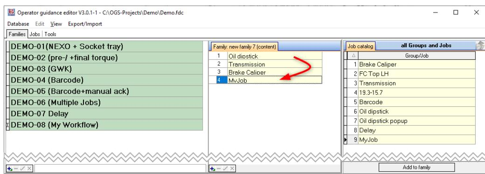

Nun ist der neue Workflow eingerichtet - um ihn tatsächlich an der Bedienstation (über heOpMon) zu starten, müssen Barcodes zugewiesen werden (siehe nächstes Kapitel).

# **3.5 Barcodes**

Barcodes werden an verschiedenen Stellen in heOGS verwendet, z.B.:

- Wählen Sie einen Arbeitsablauf (siehe unten).
- Eindeutige Identifizierung eines Teils (für Rückverfolgbarkeit, Nacharbeit und Fortsetzen, wo Sie aufgehört haben)
- Zwischen Jobs in einem Workflow springen (Job auswählen)
- Validierung und Aufzeichnung der Barcodes von montierten Teilen während des Prozesses

Beachten Sie, dass der Begriff "Barcode" als Oberbegriff für alle eingehenden Identifizierungsdaten verwendet wird - unabhängig davon, ob es sich um einen 1D- oder 2D-Barcode handelt, der von einem Barcode-Lesegerät gelesen wird, um eine von einem anderen System (SignalR, MQTT, ...) gesendete Identifizierung, die von einem RFID-Lesegerät gelesen oder manuell eingegeben wird (über die Tastatur oder die Bildschirmtastatur). Beachten Sie, dass jede Quelle sogar unterschiedlich verarbeitet werden kann, z. B. einen einzigen Barcode scannen, aber zwei Felder auf dem Bildschirm für die manuelle Anzeige/Eingabe der Barcodes haben.

Das Starten eines Arbeitsablaufs an der Bedienstation (durch heOpMon) erfordert immer das Lesen eines oder mehrerer Barcodes als ersten Schritt. Die heOpMon-Software dekodiert dann diese Informationen und extrahiert hauptsächlich die folgenden Informationen:

- Kennung des Arbeitsablaufs ("<Typ>"). In der Demo-Einrichtung ist dies ein 4-stelliger Code.
- Seriennummer des Teils ("<serial>"). In der Demo-Einrichtung ist dies ein 3-stelliger Code.

Standardmäßig verkettet die Software diese (als <Typ><Serie>) und verwendet die kombinierte Zeichenfolge, um den Arbeitsablauf in der Konfiguration zu suchen. Das Demo-Setup verwendet jedoch nur den <Typ>-Code.

Die Barcodes für einen Arbeitsablauf werden im unteren linken Fensterbereich definiert (siehe Screenshot unten). Für jeden Workflow kann eine Liste von Modellen und eine zugehörige Barcode-Maske hinzugefügt werden (durch Klicken auf das kleine "+"-Zeichen oder über das Rechtsklick-Kontextmenü):

Der Wert der Modellspalte wird als Beschreibung verwendet, die Barcodemaske wird zum Abgleich eines gescannten Barcodes verwendet, um den zugehörigen Arbeitsablauf zu finden. Standardmäßig wird die Barcodemaske zeichenweise mit den Sonderzeichen '?' (als Platzhalter für ein beliebiges Zeichen) und '\_' (als Platzhalter, der ein beliebiges Zeichen ignoriert) abgeglichen.

Wie oben beschrieben, verwendet das Demo-Setup einen vierstelligen <Typ>-Code und einen dreistelligen <Serien>-Code, wobei nur <Typ> für eine Übereinstimmung verwendet wird, so dass die folgenden Barcodes übereinstimmen:

| <Typ> | <Seriennummer> | Übereinstimmung?                                                         |                |
|-------|----------------|--------------------------------------------------------------------------|----------------|
| M-01  | 000            | Entspricht Barcode-Maske "M-01"                                          | → "MODELL 01"  |
| M-01  | 001            | Entspricht Barcode-Maske "M-01"                                          | → "MODELL 01"  |
| M-0   | 0001           | Wird nicht übereinstimmen, da <Typ> 4-stellig und <Serie> 3-stellig sein |                |
| F-01  | XYZ            | Entspricht Barcode-Maske "F-01"                                          | → "MODELL 01F" |
| ABCD  | 123            | Keine Übereinstimmung in einem Arbeitsablauf gefunden                    |                |
| XX01  | 000            | Entspricht Barcode-Maske "XX??"                                          | → "MODELL XX"  |
| XX02  | 123            | Entspricht Barcode-Maske "XX??"                                          | → "MODELL XX"  |

Beachten Sie, dass das System so konfiguriert werden kann, dass es nicht nur mit Codes fester Länge übereinstimmt, sondern auch Trennzeichen verwendet werden können oder eine komplexe Verarbeitung möglich ist (durch LUA-Programmierskripte).

Wählen Sie zunächst den neu hinzugefügten Workflow "DEMO-08" aus und fügen Sie eine Barcode-Maske hinzu, die mit dem <Typ> "M-08" übereinstimmt (der Workflow "DEMO-xy" verwendet in der Demo konventionsgemäß eine "M-xy"-Maske) - "M-08???". Verwenden Sie die kleine Schaltfläche + (), um einen neuen Barcode hinzuzufügen, und geben Sie Folgendes ein:

Bitte beachten Sie, dass Sie das Suchfeld () verwenden können, um nach Familien anhand eines Barcodes zu suchen!

# **3.6 Workflows in die Runtime übertragen**

Um die konfigurierten Workflows (Jobs, Aufgaben & Aktionen) auf der Workstation des Operators zu nutzen, muss die Konfiguration gespeichert und in die heOpMon Runtime übertragen werden. Siehe dazu Kapitel [1.1](#page-3-1) um einen Überblick über die beteiligten Dateien zu erhalten.

Für das Demo-Setup (bei dem alles auf demselben PC installiert ist), gehen Sie wie folgt vor:

- 1. Speichern Sie die Workflow-Konfiguration: Verwenden Sie das heOpCfg-Hauptmenü Datenbank→ Änderungen speichern, um alle Änderungen in der aktuell geöffneten Konfigurationsdatenbank ("cfg") zu speichern. Dies aktiviert dann automatisch den Hauptmenüpunkt "Änderungen exportieren (lokal)".
- 2. Klicken Sie auf den Hauptmenüpunkt heOpCfg "Änderungen exportieren (lokal)". Dadurch wird die Anwendung heOpImp gestartet (siehe Kapitel [5.3\)](#page-45-1), die Workflow-Informationen aus der

Datenbankdatei "cfg" in die Datenbankdatei "data" der Station überträgt. Nach dem Start der Anwendung wird sofort nach der Zieldatenbankdatei "station.fds" ("data") gefragt. Diese befindet sich standardmäßig ebenfalls im "custom folder" der Demo-Installation:

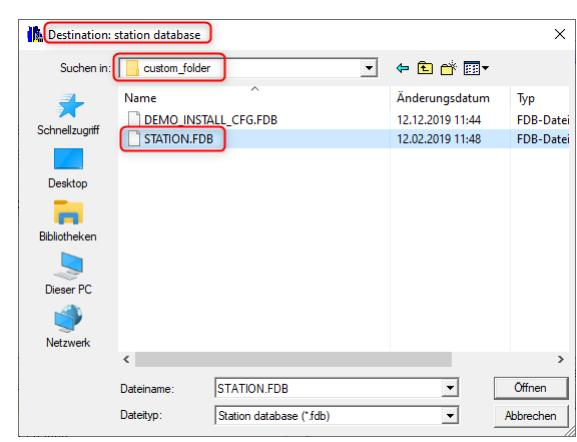

- 3. Nachdem Sie auf "Öffnen" geklickt haben, werden die Workflows übertragen. Wenn alles wie erwartet funktioniert hat, wird die folgende Meldung angezeigt:

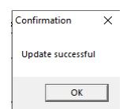

Möglicherweise werden Sie Folgendes sehen:

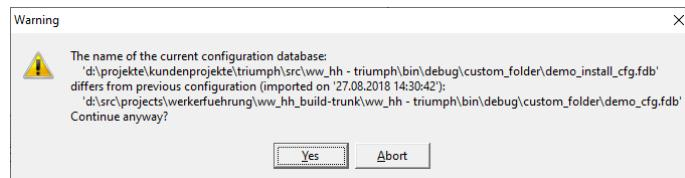

Die Konfigurationsdatenbank "cfg" behält die zugehörige Stationsdatei "data" im Auge - wenn sich der Ordner ändert, in dem die Dateien zuvor gespeichert waren, wird die Meldung angezeigt, um den Benutzer darauf aufmerksam zu machen und ihm die Möglichkeit zu geben, zu überprüfen, ob er in die richtige Datei schreibt.

Die Workflow-Konfiguration "cfg" wird nun korrekt in die Stationskonfigurationsdatei "data" übertragen. Wenn die heOpMon-Runtime gestartet wird, übernimmt sie die neue Konfiguration.

Einige weitere Anmerkungen/Hinweise:

- Sie können immer sehen, welche Konfigurationsdatenbankdatei ("cfg") Sie gerade in heOpCfg bearbeiten, indem Sie die Fensterüberschrift von heOpCfg betrachten.
- Da für die "cfg"-Datei nur eine einzige Datei verwendet wird, können Sie den Windows Explorer zum Kopieren/Verschieben der Datei verwenden. Dies ist sehr praktisch, um Änderungen zu versionieren oder Backups zu erstellen.
- Bei der Konfiguration mehrerer Stationen empfiehlt es sich, die geänderte "cfg"-Datei auf den Zielarbeitsplatz zu kopieren und dann den heOpImp-Transferprozess dort auszuführen. Da die "Daten"- Datei auf dem Zielarbeitsplatz nicht nur die Workflow-Definitionen, sondern auch historische Arbeits- /Betriebsergebnisdaten enthält, wird dadurch sichergestellt, dass der Importprozess immer die aktuellste Stations-"Daten"-Datei verwendet.

# 4 Referenz

# **4.1 Bedingungen**

Die wichtigsten Begriffe in heOGS sind:

- Workflow: definiert die vollständigen Informationen darüber, wie etwas in einer Station hergestellt wird. Ein Workflow besteht aus einer Reihe von Jobs. Beachten Sie, dass einem Job workflowspezifische Eigenschaften hinzugefügt werden können, so dass ein Job in verschiedenen Workflows wiederverwendet werden kann (z. B. Barcodes zur Auswahl eines Jobs). In der Regel gibt es einen Workflow für jedes in der Station hergestellte Produktmodell.
- Job: Definiert einen (wiederverwendbaren) Satz von Aufgaben und Aktionen mit einem angehängten Job-Bild (in der Regel eine bestimmte Ansicht des Teils). Ein Job entspricht in der Regel einem klassischen Blatt Papier eines Arbeitsplans und soll dem Bediener leicht nachvollziehbare Schritt-für-Schritt-Anweisungen (grafisch und textlich) liefern. Zur besseren Handhabbarkeit können Jobs im Job-Editor hierarchisch organisiert (gruppiert) und wiederverwendet werden (als beliebige Klone oder als unabhängige Kopien). Auf dem Bedienerbildschirm ist die Reihenfolge der Jobs immer flach, d.h. der Bedienerbildschirm zeigt eine lineare Liste von aufeinanderfolgenden Jobs.
- Aufgabe (Task): Eine Aufgabe definiert: o eine grafische Anzeige, wo auf dem Teil (auf dem Job-Bild) einige Arbeiten durchgeführt werden müssen o eine Reihe von Aktionen (siehe unten) im Zusammenhang mit dieser Aufgabe Bei den meisten Prozessen wird eine Aufgabe 1:1 auf eine Aktion abgebildet. Es gibt jedoch Fälle, in denen mehrere Aktionen erforderlich sind, um eine Aufgabe zu erledigen. So kann es z. B. beim Anziehen einen Schritt vor dem Anziehen und einen Schritt nach dem Anziehen geben - beide werden an derselben physischen Schraube am Teil ausgeführt und sind miteinander verbunden (z. B. ist Aufgabe/Schraube in Ordnung nur wahr, wenn beide in Ordnung sind). Daher werden beide einer einzigen Aufgabe zugeordnet (und visuell durch ein einziges Objekt im Job-Bild angezeigt).
- Aktion: definiert einen einzelnen Arbeitsschritt, der vom Bediener ausgeführt wird. Aktionen beinhalten eine Beschreibung, die dem Bediener zeigt, was zu tun ist. Die Aktion ist immer mit einem Werkzeug (und bestimmten Parametern, z. B. Barcode-Scanner + Barcode-Gültigkeitsmaske oder Schraubwerkzeug + Parametersatz + Muffe) verbunden. Dies geschieht indirekt durch die Zuweisung eines Vorgangs (siehe unten) zu der Aktion und ermöglicht so die Minimierung des Konfigurationsaufwands für mehrere Aktionen mit demselben Werkzeug/Parametern (z.B. mehrere Schrauben mit demselben Drehmoment/Satz anziehen).
- Aktionstyp (Schritttyp): Wird verwendet, wenn einer Aufgabe mehrere Aktionen zugeordnet sind verfügbar sind Vor-, End- und Nach-Aktions-Typen. In der Regel wird nur die letzte Aktionsart verwendet, für das Anziehen vor dem Anziehen und nach dem Anziehen (z.B. eine Kontrolle mit einem Schraubenschlüssel nach dem endgültigen Anziehen eines DC-Werkzeugs)
- Werkzeug: definiert ein Werkzeug. Werkzeuge können physische Werkzeuge (wie Schraubwerkzeuge, elektronische Schraubenschlüssel, ...), virtuelle Werkzeuge (wie Bildschirmmeldungen/Quittungen) oder benutzerdefinierte Werkzeuge (implementiert durch LUA-Skripting) sein. Werkzeuge werden durch ihre Werkzeugnummer (manchmal auch als Kanalnummer bezeichnet) identifiziert. Beachten Sie, dass theoretisch (innerhalb von Grenzen) im Workflow definierte Werkzeuge durch andere Werkzeuge in der tatsächlichen Arbeitsstation ersetzt werden können (die Werkzeugverbindungsparameter werden nicht in der heOpCfg, sondern in der Konfigurationsdatei station.ini in der Stations-Runtime definiert).

- Vorgang: definiert eine (wiederverwendbare) Art von Arbeit, die mit einem Werkzeug und einem zugehörigen Parametersatz ausgeführt wird. Z.B. für das Anziehen definiert ein Vorgang das zu verwendende Werkzeug, einen Parametersatz und schließlich die Steckdose. Der Name der Operation wird auf dem Bedienerbildschirm angezeigt und sollte die Art der Arbeit angeben - z. B. "8Nm+30° M6". Die für ein Werkzeug definierten Operationen werden vom heOpCfg-Editor verfolgt und können leicht wiederverwendet werden - um die Anzahl der Parametersätze und Varianten auf der Werkzeugseite zu minimieren und den Umfang der Konfiguration im Workflow-Editor zu verringern.

# **4.2 Benutzeroberfläche des Editors**

### **4.2.1 Übersicht**

Die Benutzeroberfläche besteht aus den folgenden Hauptbereichen:

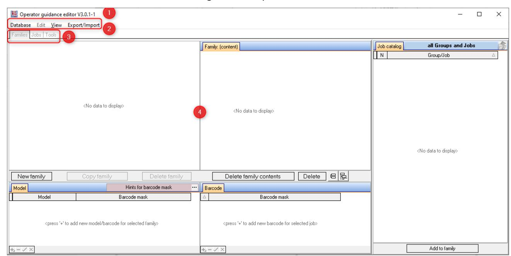

- Titelleiste von Windows. Zeigt den Namen und die Version der Anwendung sowie den Pfad zur aktuell bearbeiteten Konfigurationsdatei an.
- Hauptmenü. Das Hauptmenü der Anwendung hängt von der gerade aktiven Registerkarte ab die folgenden Menüpunkte sind verfügbar: o Datenbank: Ermöglicht das Öffnen und Speichern von Konfigurationsdateien. Das Datenbankmenü enthält auch eine Liste der zuvor geöffneten Dateien, damit Sie eine kürzlich vorgenommene Konfiguration schnell wieder öffnen können. o Änderungen exportieren (lokal): Ein Shortcut zum Exportieren der Datenkonfiguration in eine Stationsdatenbankdatei (siehe [3.6\)](#page-15-0). Beachten Sie, dass dieser Menüpunkt nur aktiviert ist, wenn zuvor Datenbank→ Änderungen speichern ausgeführt wurde. o Jobs verteilen: Ermöglicht das Verschieben von Jobs aus der aktuell geöffneten Konfiguration in eine andere Konfigurationsdatenbankdatei. Dies ermöglicht z.B. die Neuverteilung von Jobs. Siehe Kapitel [4.2.3](#page-22-0) für weitere Details.

- o Bilder (nur für die Registerkarte "Jobs" sichtbar): Öffnet die Seitenleiste des Bildbrowsers, um das schnelle Hinzufügen neuer Jobs per Drag & Drop aus einer Explorer-ähnlichen Dateisystemansicht von Bilddateien zu ermöglichen. Sieh[e 4.2.3](#page-22-0) für weitere Informationen. o Repository (nur für die Registerkarte "Jobs" sichtbar): Öffnet die Repository-Seitenleiste zur Verwaltung von Ausschneide- und Einfügevorgängen (oder Verschiebungen) im Job-Katalog. Sieh[e 4.2.3](#page-22-0) für weitere Informationen.
- Registerkarten: Wählt eine der Hauptansichten aus. Verfügbar sind: o Familien: Zur Verwaltung und Bearbeitung von Workflows (sieh[e 4.2.2\)](#page-19-0) o Jobs: Um Jobs zu verwalten und zu bearbeiten (siehe [4.2.3\)](#page-22-0) o Werkzeuge: Zum Verwalten und Bearbeiten von Werkzeugen (siehe [4.2.4\)](#page-27-0)
- Inhaltsbereich der Registerkarte. Die hier angezeigten Informationen hängen von der aktuell ausgewählten Registerkarte ab (). Siehe unten für weitere Informationen.

### **4.2.2 Registerkarte Familien**

#### **4.2.2.1 Übersicht**

Die Registerkarte "Familien" besteht aus den folgenden drei Fenstern:

- Bereich Familien: Die obere Ansicht zeigt eine Liste von Workflows, die untere Ansicht zeigt eine Liste von Barcodes, die für den aktuell ausgewählten Workflow definiert sind.
- Workflow-Sequenzfenster: Die obere Ansicht zeigt eine Liste der Jobs, die dem aktuell ausgewählten Workflow unter zugeordnet sind (beachten Sie, dass der Name des aktuell ausgewählten Workflows in der Kopfzeile angezeigt wird). Die untere Ansicht zeigt eine Liste der Barcodes, die für den aktuell ausgewählten Job definiert wurden.
- Job-Katalog-Fenster: In diesem Fenster werden alle Jobs aufgelistet, die in der aktuellen Datenbankdatei definiert sind.

### **4.2.2.2 Bereich "Familien**

Der Bereich "Familien" () zeigt in der oberen Ansicht eine Liste von Arbeitsabläufen. Die untere Ansicht zeigt eine Liste von Barcodes, die für den aktuell ausgewählten Arbeitsablauf definiert sind.

In der Liste der Workflows (obere Ansicht) sind die folgenden Operationen möglich:

- Auswählen eines Workflows. Durch Anklicken in der Liste der Arbeitsabläufe wird ein Arbeitsablauf ausgewählt. Der ausgewählte Workflow wird durch ein kleines Dreieck links neben dem Workflow-Namen angezeigt. Durch Ändern des ausgewählten Workflows wird die Liste der zugehörigen Barcodes (untere Ansicht des Bereichs "Familien" ) und der Workflow-Bereich () aktualisiert.
- Ändern eines Workflow-Namens: Workflow-Namen können "inline" bearbeitet werden, indem Sie auf den Workflow-Namen klicken und ihn über die Tastatur eingeben.
- Neue Familie (Workflow): Ein neuer Arbeitsablauf kann hinzugefügt werden, indem man auf die Schaltfläche "Neue Familie" klickt, die Funktion aus dem Kontextmenü der rechten Maustaste auswählt oder die Taste <ctrl><ins> drückt.
- Familie löschen (Workflow): Ein Workflow kann gelöscht werden, indem man auf die Schaltfläche "Familie löschen" klickt, die Funktion aus dem Kontextmenü der rechten Maustaste auswählt oder die Taste <ctrl><del> drückt.
- Familie kopieren (Workflow): Ein Workflow kann kopiert werden, indem man auf die Schaltfläche "Familie kopieren" klickt, die Funktion aus dem Kontextmenü der rechten Maustaste auswählt oder die Taste <ctrl><c> drückt.

In der Liste der Workflow-Barcodes (untere Ansicht) sind die folgenden Operationen möglich:

- Hinzufügen eines neuen Modells/Barcodes: Ein neuer Barcode kann durch Anklicken der kleinen Schaltfläche in der unteren Leiste oder durch Auswahl der Funktion im Kontextmenü mit der rechten Maustaste hinzugefügt werden.
- Löschen eines Modells/Barcodes: Ein Barcode kann gelöscht werden, indem Sie auf die kleine Schaltfläche in der unteren Leiste klicken oder die Funktion aus dem Kontextmenü der rechten Maustaste auswählen.
- Zeigen Sie den Hinweis auf die Barcode-Maske an, indem Sie auf die Ellipsen-Schaltfläche in der oberen rechten Ecke klicken.
- Ändern Sie den Modell-/Barcode-Namen, indem Sie auf den Namen klicken und ihn "inline" bearbeiten.
- Ändern Sie die Barcode-Maske, indem Sie auf den Text klicken und ihn inline bearbeiten. Siehe Kapitel [3.5](#page-14-0) für weitere Informationen über den Barcodeabgleich und die Bearbeitung.
- Suchen Sie nach einer Familie, indem Sie einen Barcode in die Suchleiste (Eingabefeld unten rechts) eingeben - beachten Sie, dass dies einen globalen Parameter erfordert, um das Suchfeld zu aktivieren (sieh[e 4.4.2\)](#page-39-2).

#### **4.2.2.3 Arbeitsablauf-Fenster**

Der Bereich "Workflow-Sequenz" () zeigt eine Liste der Jobs, die dem aktuell ausgewählten Workflow zugeordnet sind. Die untere Ansicht zeigt eine Liste der für den ausgewählten Job definierten Barcodes.

Beachten Sie, dass die Liste Jobs und Jobgruppen enthält (Jobs sind gelb hinterlegt, Gruppen blau). Die Liste besteht aus zwei Spalten, wobei die erste Spalte die Sequenznummer und die zweite den Namen des Jobs/der Gruppe enthält.

Die obere Ansicht zeigt die folgenden Informationen und ermöglicht die folgenden Aktionen:

- Die Überschrift zeigt den Namen des aktuell ausgewählten Workflows (aus dem Bereich "Familien" in )
- Hinzufügen von Jobs zum Workflow aus dem Job-Katalog (durch Ziehen und Ablegen, sieh[e 4.2.2.4](#page-21-0) unten)
- Löschen Sie alle Jobs aus dem Workflow, indem Sie auf die Schaltfläche "Familieninhalt löschen" klicken.
- Entfernen Sie einen einzelnen Job aus dem Workflow, indem Sie auf die Schaltfläche "Löschen" klicken oder "Löschen" aus dem Kontextmenü der rechten Maustaste wählen
- Neuordnung der Jobs/Auftragsgruppen durch Ziehen und Ablegen mit der Maus
- Öffnen/Schließen Sie Gruppen von Jobs, indem Sie auf das +/- Zeichen neben der Gruppe klicken. Um alle zu schließen/zu öffnen, können Sie die Schaltflächen verwenden.
- Wählen Sie den aktuellen Job/die aktuelle Gruppe aus, indem Sie auf eine Zeile klicken. Daraufhin werden die zugehörigen Barcodes in der unteren Ansicht angezeigt.
- Doppelklicken Sie auf eine Zeile, um den Job-Editor zu öffnen (wenn Sie auf eine Job-Zeile doppelklicken), oder schalten Sie den komprimierten/expandierten Status einer Gruppe um (wenn Sie auf eine Gruppenzeile doppelklicken)

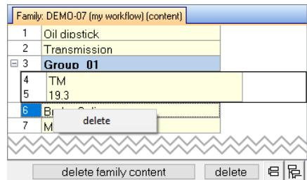

Die untere Ansicht zeigt die zugehörigen Barcodes des aktuell ausgewählten Jobs und ermöglicht dessen Bearbeitung (ähnlich wie bei den Workflow-Barcodes, siehe [4.2.2.2\)](#page-19-1). Beachten Sie, dass die Job-Barcodes keinen Namen haben, sondern nur eine Liste von Barcode-Masken (dieselben Platzhalterzeichen wie bei den Workflow-Barcodes sind erlaubt).

Die Job-Barcodes werden im Kontext des Workflows gespeichert, so dass dieselben Jobs für verschiedene Workflows (wieder)verwendet werden können, auch wenn jeder Workflow unterschiedliche Barcodes für denselben Job verwendet.

HINWEIS: Der typische Anwendungsfall ist die Auswahl eines Jobs durch Scannen eines zugehörigen Barcodes. Dadurch kann der Bediener die Job-Reihenfolge anstelle der (standardmäßigen) Reihenfolge auswählen.

#### **4.2.2.4 Job-Katalog-Fenster**

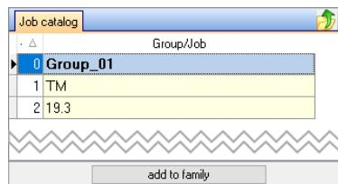

Das Job-Katalogfenster () listet alle in der aktuellen Datenbankdatei definierten Jobs und Job-Gruppen in einer dem Windows Explorer ähnlichen Liste auf. Job-Gruppen kann man sich als "Ordner" vorstellen (mit blauer Hintergrundfarbe), Jobs als "Dateien" (mit gelber Hintergrundfarbe).

Der Job-Katalog wird verwendet, um die Jobs für einen Workflow auszuwählen. Wenn der aktuelle Arbeitsablauf ausgewählt ist, kann ein Job in den aktuellen Arbeitsablauf eingefügt werden, indem man auf die Schaltfläche "Zur Familie hinzufügen" klickt oder einen Eintrag mit der Maus aus dem Auftragskatalogfenster () in das Arbeitsablauffenster () zieht.

Um im Job-Katalog zu navigieren, stehen Ihnen die folgenden Operationen zur Verfügung:

- Durch Doppelklick auf eine Job-Gruppe ("Ordner") wird die Gruppe aufgeschlüsselt und der Inhalt der Gruppe aufgelistet. Beachten Sie, dass in der ersten Zeile immer der Name der "aktuellen" Auftragsgruppe angezeigt wird - auf der Stammebene ist dies "alle Gruppen und Jobs".
- Um eine Ebene zurückzugehen, klicken Sie auf den Pfeil nach oben ( ) in der oberen rechten Ecke. Auf der Stammebene ist die Schaltfläche ausgegraut.

### **4.2.3 Registerkarte Jobs**

#### **4.2.3.1 Übersicht**

Die Registerkarte "Jobs" zeigt den Job-Katalog-Editor. Er ermöglicht die Verwaltung aller im System definierten Jobs. Die Registerkarte enthält die folgenden Abschnitte:

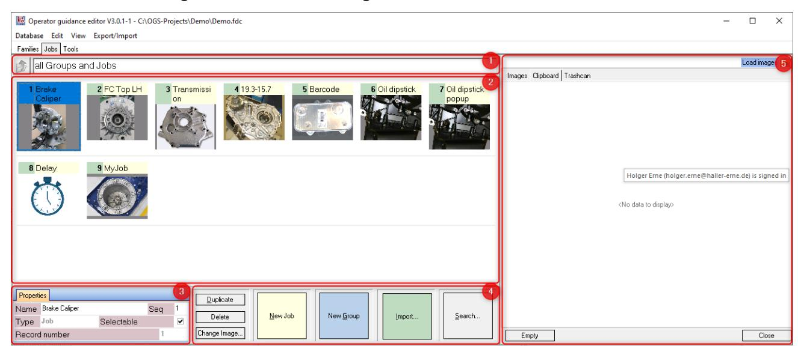

- Navigator: Zeigt den aktuellen Gruppennamen ("Ordner") und den Pfeil nach oben ( ), um eine Ebene höher zu gehen (ausgegraut, wenn die aktuelle Ebene die Stammebene ist (mit dem Namen "alle Gruppen und Jobs")).
- Job-Liste: Zeigt die Jobs auf der aktuellen Ordner-(Gruppen-)Ebene an. Jeder Job wird mit einer Miniaturansicht des Jobbildes, einer Kopfzeile mit dem Jobnamen und der Positionsnummer aufgelistet. Jobs werden mit gelber Hintergrundfarbe angezeigt, Gruppen mit blauer Hintergrundfarbe.

HINWEIS: Die Sequenznummer definiert den Job-Auftrag, wenn eine Gruppe zu einem Workflow hinzugefügt wird.

- Artikeleigenschaften: Zeigt die Eigenschaften des aktuell ausgewählten Elements an und ermöglicht dessen Bearbeitung.
- Aktionen-Panel: bietet Schaltflächen mit häufig verwendeten Operationen sowie Zugriff auf die Zwischenablage (siehe auch [4.2.3.2](#page-23-0) für Informationen zum Kopieren, Verschieben und Verknüpfen von Jobs).
- Seitenleiste mit Bildbetrachter und Repository-Browser (sieh[e 4.2.3.6\)](#page-26-0)

Siehe auch Kapitel [3.3](#page-7-0) un[d 3.3.1](#page-7-1) für allgemeine Informationen über Jobs und den Job-Katalog.

In dieser Ansicht sind folgende Funktionen verfügbar:

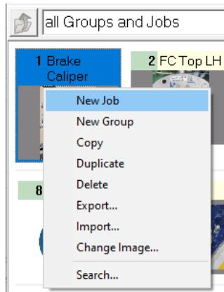

- Bearbeiten Sie einen Job im Job-Editor durch Doppelklick auf einen Job in der Liste (siehe [3.3](#page-7-0) und [4.2.5\)](#page-29-0).
- Navigieren Sie in der Job-/Gruppenhierarchie, indem Sie auf eine Gruppe doppelklicken (um sie aufzuschlüsseln) oder indem Sie auf den Pfeil nach oben ( ) klicken, um eine Ebene höher zu gehen.
- Ändern Sie den Namen eines Jobs/einer Gruppe, indem Sie auf die Elementkachel klicken und den Text "inline" bearbeiten oder indem Sie die Namenseigenschaft des aktuell ausgewählten Elements im Elementeigenschaftenfenster ändern ().
- Ändern Sie die Reihenfolge der Elemente durch Ziehen und Ablegen eines Elements innerhalb der Liste.

- Ändern der Vorschaugröße durch Klicken und Ziehen der Trennlinie zwischen zwei Elementen.
- Kopieren Sie einen Job/eine Gruppe in die Zwischenablage, indem Sie die Funktion aus dem Kontextmenü der rechten Maustaste auswählen. Dies ermöglicht das Kopieren/Verschieben oder Verknüpfen von Jobs, siehe [4.2.3.2.](#page-23-0)
- Kopieren Sie einen Job, indem Sie auf die Schaltfläche "Kopieren" im Aktionen-Panel () klicken oder die Funktion aus dem Kontextmenü der rechten Maustaste auswählen. Beachten Sie, dass dann direkt nach einem neuen Job-Namen gefragt wird, da dies eine vollständige Kopie zur Erstellung eines unabhängigen Klons ausführt.
- Ändern Sie das Bild für einen Job/eine Gruppe, indem Sie auf die Schaltfläche "Bild ändern" in der Aktionsleiste () klicken oder die Funktion aus dem Kontextmenü der rechten Maustaste auswählen
- Sie können einen Job oder eine Gruppe ausschneiden (löschen), indem Sie auf die Schaltfläche "Ausschneiden" in der Aktionsleiste () klicken oder die Funktion aus dem Kontextmenü der rechten Maustaste auswählen. Beachten Sie, dass dadurch das Element ohne weitere Ankündigung direkt gelöscht wird.
- Legen Sie einen neuen (leeren) Job an, indem Sie auf die Schaltfläche "Neuer Job" in der Aktionsleiste () klicken oder eine Bilddatei aus dem Bildbrowser (Registerkarte "Bilder" in der Seitenleiste ()) ziehen und ablegen.
- Erstellen Sie eine neue (leere) Gruppe, indem Sie auf die Schaltfläche "Neue Gruppe" in der Aktionsleiste klicken ()
- Einfügen eines zuvor kopierten Objekts aus der Zwischenablage als unabhängige Kopie oder als verknüpfter Klon durch Klicken auf die Ellipsen-Schaltfläche neben dem Bearbeitungsfeld für die Zwischenablage im Aktionsfenster (, siehe [4.2.3.2\)](#page-23-0).

#### **4.2.3.2 Kopieren und Verknüpfen von Jobs**

Jobs können leicht in verschiedenen Arbeitsabläufen wiederverwendet werden (siehe [3.4](#page-12-0) un[d 4.2.2\)](#page-19-0). Manchmal ist es jedoch zweckmäßig, eine Job-Definition zu kopieren, um einen neuen Job auf der Grundlage eines alten zu erstellen (z. B. für ein geändertes Teil), oder einen Job in verschiedenen Gruppen wiederzuverwenden, indem von mehreren Stellen aus auf einen Job verwiesen wird (bei komplexen Anwendungen). Es gibt also im Wesentlichen zwei Vorgänge:

- Kopieren eines Jobs: Es wird eine Kopie eines bestehenden Jobs erstellt, die mit dem Originaljob identisch ist (außer dass sie einen anderen Namen hat), aber keine Abhängigkeiten zum Originaljob hat.
- Erstellen eines Verweises auf einen Job (Erstellen eines verknüpften Klons): Dadurch wird ein Job-Verweis mit genau demselben Namen in einer anderen Job-Gruppe erstellt. Auf den ersten Blick sieht es so aus, als ob es sich um eine einfache Kopie handelt, aber wenn Parameter geändert werden, werden auch die Parameter aller anderen Instanzen dieses Jobs geändert.

HINWEIS: Wie in Kapite[l 3.3](#page-7-0) ("Grundlegende Prinzipien zur Definition und Verwendung von Jobs") beschrieben, ist ein Job-Name im System eindeutig. Daher wird bei der Erstellung einer Job-Referenz einfach derselbe Job-Name in die Job-Kataloghierarchie eingefügt. Um eine Job-Kopie zu erstellen, muss ein neuer Name angelegt werden, der dann eine unabhängige Kopie ist.

Um einen Job schnell zu kopieren, gehen Sie wie folgt vor:

- 1. Wählen Sie den zu kopierenden Source Job aus. Klicken Sie auf die Schaltfläche "Duplizieren" im Aktionen-Panel () oder wählen Sie die Funktion "Duplizieren" aus dem Rechtsklick-Kontextmenü (oder dem Hauptmenü Bearbeiten).
- 2. Geben Sie einen neuen Namen in das Popup-Fenster ein und klicken Sie auf die Schaltfläche "Akzeptieren".

Um eine Referenz (einen verknüpften Klon) oder eine Kopie an einem anderen Ort im Job-Katalog zu erstellen, gehen Sie wie folgt vor:

- 1. Markieren Sie den zu kopierenden Job und klicken Sie mit der rechten Maustaste, um das Kontextmenü zu öffnen. Wählen Sie die Funktion "Kopieren". Beachten Sie, dass in der Zwischenablage nun der Name des Jobs angezeigt wird:

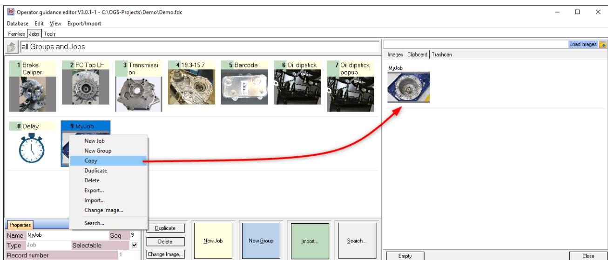

- 2. Navigieren Sie zu der Stelle, an der Sie eine Kopie oder einen Verweis einfügen möchten. Klicken Sie dann mit der rechten Maustaste auf den Job in der Zwischenablage und wählen Sie die Operation ("Verschieben" oder "Kopieren"):

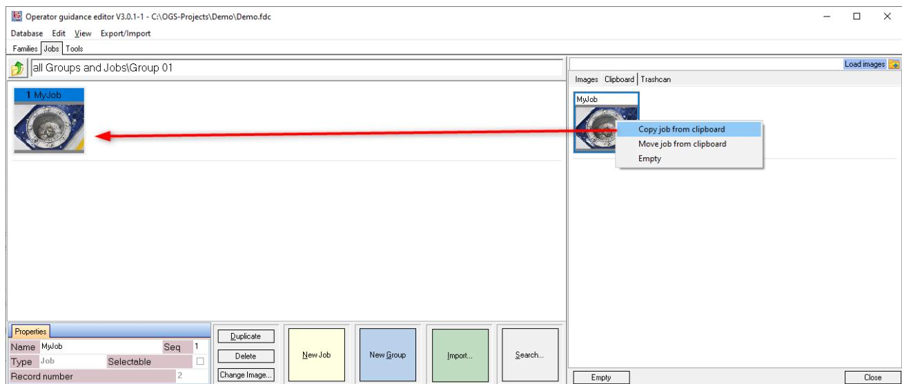

Wenn "Verschieben" gewählt wurde, wird der Job automatisch aus der Zwischenablage entfernt.

#### **4.2.3.3 Umzugsjobs**

Es gibt keinen direkten "Job verschieben"-Befehl. Um einen Job an einen anderen Ort im Job-Katalog zu verschieben, erstellen Sie eine Job-Referenz (verknüpfter Klon) des Jobs (in die Zwischenablage kopieren oder löschen und in den Mülleimer verschieben) und löschen Sie die Quelle (sieh[e 4.2.3.2](#page-23-0) oben).

### **4.2.3.4 Kopieren, Verschieben und Verknüpfen von Gruppen**

Gruppen können auf die gleiche Weise wie Jobs kopiert werden (klicken Sie mit der rechten Maustaste und wählen Sie "Kopieren" oder "In die Zwischenablage kopieren" und verwenden Sie die Zwischenablage, um

sie an einer anderen Stelle einzufügen). Da Gruppen jedoch in der Regel mehr als einen Job enthalten, reicht eine einfache Umbenennung nicht aus, so dass das System den Kopierdialog wie folgt anzeigt:

Auf diese Weise können Sie für jeden Job eine der folgenden Optionen auswählen:

| kopieren. akzeptieren | Verhalten                                                                |
|-----------------------|--------------------------------------------------------------------------|
|                     | (Standard) Eine Referenz erstellen (ein verknüpfter Klon mit demselben   |
|                     | Erstellen Sie eine unabhängige Kopie (mit geändertem Namen). Beachten    |
|                     | Den Job nicht in die Zielgruppe kopieren. Verwenden Sie diese Option, um |

Beachten Sie, dass es (wie bei den Jobs) keine "Verschiebe"-Operation gibt. Verwenden Sie "Referenz" am Ziel und löschen Sie anschließend die Quelle.

#### **4.2.3.5 Löschen von Gruppen / Mülleimer**

Die Repository-Seitenleiste (Registerkarte "Papierkorb" in der Seitenleiste ) behandelt einen Sonderfall beim Löschen von Gruppen (Aktion "Ausschneiden" bei Gruppen): Um verwaiste Jobs zu vermeiden, werden standardmäßig nur Referenzlinks zu Jobs gelöscht. Alle "vollständigen" Jobs werden stattdessen in den Mülleimer verschoben.

Die gelöschten (verwaisten) Jobs können dann wiederhergestellt werden, indem man sie aus dem Mülleimer zurück in den Job-Katalog zieht:

#### **4.2.3.6 Bild-Browser**

Die Seitenleiste des Bildbrowsers (Registerkarte "Bilder" in der Seitenleiste) ermöglicht die schnelle Erstellung einer großen Anzahl von Jobs durch Ziehen und Ablegen von Job-Bildern aus einem Ordner mit Bildern auf der Festplatte.

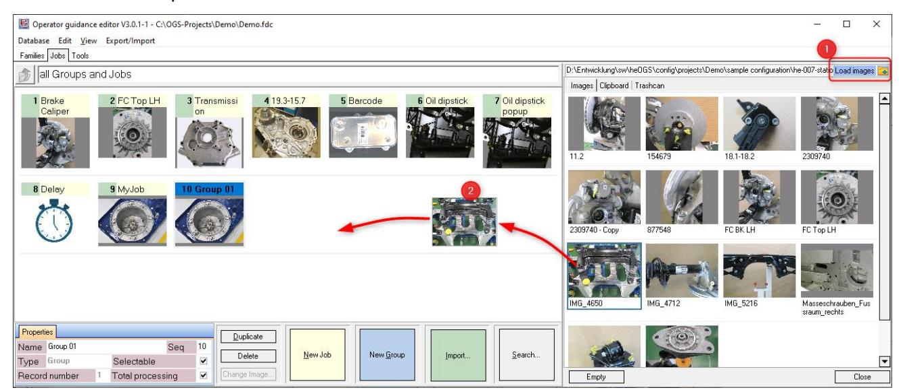

Wählen Sie dazu den Menüpunkt "Bilder", um die Seitenleiste des Bildbrowsers zu öffnen, und klicken Sie auf die Schaltfläche "Bilder laden" (). Wählen Sie im Verzeichnisauswahldialog den Ordner aus, der die Teilbilder enthält (beachten Sie, dass Sie für optimale Ergebnisse das Bildformat 4:3 verwenden sollten). Nach dem Schließen des Dialogs lädt die Seitenleiste alle im Ordner gefundenen Bilddateien. Nun können Sie per Drag & Drop eine Bilddatei () in den Katalog ziehen.

#### ANMERKUNGEN:

- Die Größe der Vorschaubilder kann durch Ziehen des weißen Trennstrichs zwischen den Bildern geändert werden.
- Der neu erstellte Job wird automatisch nach der gezogenen Datei benannt.

### **4.2.3.7 Zusätzliche Hinweise**

#### Job- und Gruppenbilder:

- Automatisch generierte Ersatzbilder: o Neu erstellte Jobs und Gruppen werden mit einem Standardbild versehen o Wenn einer Gruppe kein Bild zugewiesen ist, wird ein Bild erstellt, indem die enthaltenen Job-Bilder gesammelt und zu einem Gruppenbild zusammengefügt werden
- Bilder können auch Screenshots von (pdf)-Dokumenten, CAD-Zeichnungen, ... sein.

#### Job-Eigenschaft "auswählbar":

- Alle Gruppen und Komponenten, die als "auswählbar" markiert sind, stehen später in der heOpMon-Workstation-Runtime zur Verfügung. Alle nicht markierten Gruppen und Jobs werden nicht verfügbar sein.

#### Gruppeneigenschaft "Gesamtverarbeitung":

- Die Inhalte aller Gruppen, die für "Gesamtverarbeitung" markiert sind, stehen später der heOpMon-Workstation-Runtime zur Verfügung. Alle nicht markierten sind ebenfalls verfügbar, ihr Inhalt ist aber nicht erreichbar.

### **4.2.4 Registerkarte Tools**

#### **4.2.4.1 Übersicht**

Die Registerkarte "Werkzeuge" zeigt den Werkzeugeditor und die Liste der Operationen. Sie ermöglicht die Verwaltung aller im System definierten Werkzeuge. Die Registerkarte enthält die folgenden Abschnitte:

- Liste der Werkzeuge: Zeigt die Liste der Werkzeuge gruppiert nach Werkzeugkategorie. Ermöglicht das Hinzufügen neuer Werkzeuge und das Ändern von Werkzeugparametern.
- Liste der Operationen: Zeigt die Liste der Operationen an, die für ein Werkzeug (wenn "Operationen nur für das ausgewählte Werkzeug anzeigen" markiert ist) oder für alle Werkzeuge (wenn das Kontrollkästchen nicht markiert ist) derselben Kategorie definiert sind. Ermöglicht einen Überblick über die konfigurierten Operationen - besonders hilfreich, um doppelte Programmdefinitionen zu finden oder um eine Liste zu erstellen, die zur Konfiguration der physischen Werkzeuge auf der Arbeitsstation verwendet wird.
- Parameter-Definition: Ermöglicht das Hinzufügen von benutzerdefinierten Parametern für das Werkzeug, die Aufgabe und die Aktionsebene. Das System wird mit einigen vordefinierten Eigenschaften für die eingebauten Werkzeugtreiber geliefert, kann aber erweitert werden, so dass auch benutzerdefinierte Werkzeugtreiber über die GUI konfiguriert werden können (z. B. benutzerdefinierte LUA-Werkzeuge).

#### ANMERKUNGEN:

- Die Werkzeugnummer wird verwendet, um das logische Werkzeug (wie in der Konfiguration verwendet) mit dem tatsächlichen (physischen) Werkzeug in der Arbeitsstation abzugleichen. Bei sorgfältiger Implementierung ermöglicht dies (bis zu einem gewissen Grad) eine Neuverteilung der Arbeit zwischen den Stationen in einer Linie, indem Jobs zwischen den Stationen verschoben werden (ohne dass Job-Aufgaben und -Aktionen neu konfiguriert werden müssen!)
- Die Vorgangsliste ist eine praktische Ansicht für die Konfiguration des physischen Werkzeugs am Arbeitsplatz (und der Steckdosenleiste).

#### **4.2.4.2 Hinzufügen und Konfigurieren von Werkzeugen**

- Werkzeug hinzufügen: Das Rechtsklick-Kontextmenü ermöglicht das Hinzufügen eines neuen Werkzeugs zur aktuellen Werkzeugkategorie. Standardmäßig wird der neu hinzugefügten Zeile die nächste unbenutzte Werkzeugnummer zugewiesen - dies kann jedoch manuell geändert werden (verwenden Sie das Dropdown-Menü in der ersten Spalte, um es zu ändern). Beachten Sie, dass die Werkzeugnummer nicht fortlaufend sein muss. Es empfiehlt sich, ein systematisches Nummerierungsschema für die Werkzeuge zu erstellen. Dies ist besonders nützlich, wenn Sie mehrere Stationen konfigurieren (für die Neuverteilung von Stationen, d. h. für das Verschieben von Aufträgen zwischen Stationen). Sie können
  - z. B. dem Barcodeleser das Werkzeug Nr. 1 zuweisen, dann die Werkzeuge Nr. 2 bis Nr. 5 für die Standardwerkzeuge reservieren (d. h. 4 Werkzeuge CS351/Nexo reservieren) und die integrierten Werkzeuge (Tasteneingabe, von Hand) dem Werkzeug Nr. 31 und Nr. 31 zuweisen. Dies lässt Raum für Hardware-Varianten auf Stationsebene, ermöglicht aber auch ein Rebalancing.
- Werkzeug löschen: Verwenden Sie das Rechtsklick-Kontextmenü, um ein Werkzeug zu löschen. Hinweise: o Sie können kein Werkzeug löschen, das gerade verwendet wird - in diesem Fall zeigt das System eine Warnung an. o Sie können überprüfen, ob das Werkzeug gerade verwendet wird, indem Sie die Vorgangsliste () betrachten - diese zeigt alle aktuell zugewiesenen Vorgänge für ein Werkzeug an.
- Werkzeugname bearbeiten: Ändern Sie den Namen eines Werkzeugs, indem Sie in das Namensfeld klicken (Inline-Bearbeitung) und den neuen Namen eingeben. Beachten Sie, dass der Name nur zu Anzeigezwecken dient; das Ändern eines Werkzeugnamens hat keine Nebeneffekte.
- Ändern von Werkzeugparametern: Je nach Werkzeugkategorie stellt der zugrundeliegende Werkzeugtreiber zusätzliche Parameter zur Verfügung (siehe Screenshot, z.B. CS351+Nexo fragen nach einer "lockeren" Programmnummer).

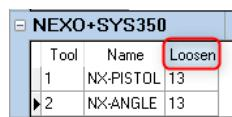

Derzeit sind die folgenden zusätzlichen Parameter (Werkzeugnummer und Werkzeugname sind für alle Werkzeuge erforderlich) für die eingebauten Werkzeugkategorien verfügbar:

Es gibt weitere benutzerdefinierte Eigenschaften auf Aufgaben- und Aktionsebene, und benutzerdefinierte Werkzeuge können auch ihre eigenen Eigenschaften hinzufügen (sieh[e 4.2.4.3](#page-28-0) unten)

HINWEIS: Die heOpMon-Konfiguration erlaubt die Definition von Werkzeug-Alias. Dies kann verwendet werden, um mehrere logische Werkzeuge (aus der heOpCfg-Konfiguration) einem einzigen physischen Werkzeug zuzuordnen.

#### **4.2.4.3 Verwendung der Vorgangsliste**

Die Operationsliste () enthält eine Liste aller konfigurierten Operationen. Je nach Zustand des Kontrollkästchens "Nur Operationen für das ausgewählte Werkzeug anzeigen" werden entweder nur die Operationen für das aktuell ausgewählte Werkzeug oder alle Operationen angezeigt.

- Das Gitter, das zur Darstellung der Vorgänge verwendet wird, ermöglicht die Gruppierung durch Ziehen und Ablegen einer Kopfzelle in den Bereich "Ziehen Sie eine Spaltenüberschrift hierher, um nach dieser Spalte zu gruppieren".
- Die Vorgangsliste ist eine praktische Ansicht für die Konfiguration des physischen Werkzeugs am Arbeitsplatz (und der Steckdosenleiste).
- Für Werkzeuge, die keine Programmnummern für die Auswahl von Parametersätzen verwenden (wie GWK-Drehmomentschlüssel), zeigt die Vorgangsliste eine Programmnummer Programmname-Zuordnung. Die Parameter werden dann in der Konfigurationsdatei station.ini der heOpMon-Workstation-Runtime gespeichert.

#### **4.2.4.4 Eigenschaften von Werkzeugen, Aufgaben und Aktionen**

Der Parameterdefinitionsbereich () ermöglicht die Verwaltung von Eigenschaften für Werkzeuge, Aufgaben und Aktionen. heOpCfg und heOpMon verwenden ein flexibles Eigenschaftssystem, um die Bearbeitung von Parametern über die GUI zu ermöglichen, sogar für benutzerdefinierte Werkzeuge. In Kombination mit dem LUA-Skripting in der heOpMon-Workstation-Runtimeumgebung ermöglicht dies die Integration einer nahezu unbegrenzten Anzahl von benutzerdefinierten Werkzeugen mit einfachem Parameterzugriff über den heOpCfg-GUI-Editor.

### **4.2.5 Job Editor**

Der Job-Editor ermöglicht die Bearbeitung von Aufgaben und Aktionen für einen Job. Der Job-Editor kann durch einen Doppelklick auf einen Job im Job-Katalog oder im Workflow geöffnet werden (sieh[e 4.2.2](#page-19-0) und [4.2.3\)](#page-22-0). Siehe Kapitel [3.3.2.2](#page-9-0) finden Sie eine Schritt-für-Schritt-Anleitung, wie der Job-Editor am besten verwendet wird, um Prozesse schnell zu definieren.

Der Editor wird als Popup-Dialog angezeigt und enthält die folgenden Abschnitte:

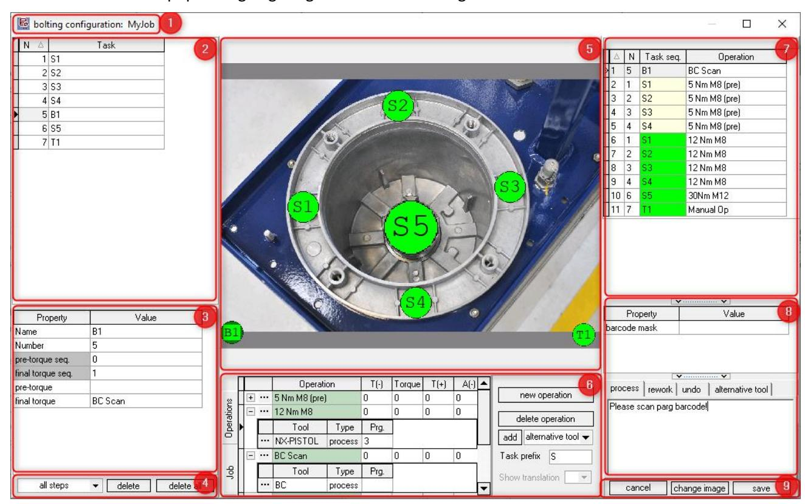

- Beschriftung des Fensters: Zeigt den Namen des aktuellen Jobs an.

- Liste der Aufgaben. Jede Aufgabe wird durch ein grafisches Objekt im Bild dargestellt (). Durch Anklicken eines Eintrags in der Liste wird die Aufgabe ausgewählt (wodurch wiederum die Aufgabeneigenschaften aktualisiert und die Aufgabe im Bild hervorgehoben wird). Durch Ziehen und Ablegen können Aufgaben neu geordnet werden, durch Klicken in die zweite Spalte kann der Aufgabenname inline bearbeitet werden.
- Eigenschaften der Aufgabe: In diesem Bereich werden alle Eigenschaften der ausgewählten Aufgabe angezeigt. Nicht ausgegraute Eigenschaften können in der Wertespalte inline bearbeitet werden. Abhängig von der Konfiguration (heOpCfg.ini) sind die folgenden Standardeigenschaften verfügbar (andere benutzerdefinierte Eigenschaften können existieren, sieh[e 4.2.4.4\)](#page-29-1): o Aufgabenname und Aufgabennummer: Die Aufgabennummer bestimmt die Reihenfolge innerhalb der Liste der Aufgaben. Beachten Sie, dass dies für die Reihenfolge, in der der Operator seine Arbeit ausführen muss, nicht relevant ist (dies wird durch die Aktionssequenz gesteuert, siehe unten). Der Aufgabenname wird in der heOpMon-Workstation-Runtime angezeigt. o Vorverarbeitung, Endverarbeitung, Nachverarbeitung/Prüfung: zeigt die verknüpften Vorgänge für den jeweiligen Schritt an. o Pre-process seq, final process seq, ...: zeigt die Aktionssequenznummer des gegebenen Schrittes an (kann hier nicht geändert werden, muss durch Neuordnung der Aktionen in der Aktionsliste geändert werden). o Positionssensor (PS): Positionsnummer, die für diesen Auftrag verwendet werden soll (nur bei externen Positioniersystemen) o appl\_start: Wird für Mehrspindeloperationen ("application start") verwendet, um mehrere Aufgaben in einem einzigen Prozess zusammenzufassen. Erfordert die Verwendung von <Präfix> plus <Nummer>, wobei <Präfix> die Anwendungsgruppe und <Nummer> den Index innerhalb der Gruppe definiert (z. B. Anwendung "M": Aufgabe 1→ M1, Aufgabe 2→ M2). Bei Schraubanwendungen definiert die angegebene <Nummer> die Kanalnummer.
- Dropdown-Liste für Ansichtsfilter und Schaltfläche für Aufgabenaktionen: Der Ansichtsfilter kann geändert werden, um bestimmte Schritte in der Ansicht ein- oder auszublenden. Wie eine Aufgabe (sieh[e 4.1\)](#page-17-1) mehrere Aktionen zugeordnet sein können, kann der Filter verwendet werden, um nur die relevanten Aktionsschritte anzuzeigen. Die Aufgaben, die den Filterkriterien nicht entsprechen, werden dann in grauer Farbe angezeigt (in der Abbildung ). Beachten Sie, dass bei allen Filtern außer "alle Schritte" die Kreise die Aktionsreihenfolge anstelle des Aufgabennamens anzeigen - dies ermöglicht einen schnellen Überblick über die geplante Reihenfolge der Arbeiten in der Bildansicht. Die Schaltflächen "Löschen" und "Alle löschen" löschen entsprechend aus der Liste der Aufgaben.
- Bildansicht. Die Ansicht zeigt das Job-Bild und die Aufgaben in einer grafischen Darstellung (als gefüllter Kreis). Jede Aufgabe wird durch einen Kreis und einen Text dargestellt (der je nach den Filtereinstellungen in entweder den Aufgabennamen oder die Aktionsfolge anzeigt). Die Zustände sind wie folgt: o Die ausgewählte Aufgabe wird in dunkelgrüner Farbe mit einem hellgrünen Rechteck um den Text herum angezeigt o Eine nicht ausgewählte Aufgabe wird in hellgrüner Farbe angezeigt o Eine herausgefilterte Aufgabe wird in grauer Farbe dargestellt

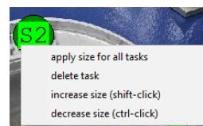

Die Aufgabenelemente (Kreise) können durch Klicken und Ziehen verschoben werden. Neue Aufgaben können durch Doppelklick in das Bild hinzugefügt werden. Klicken Sie mit der rechten Maustaste, um ein Kontextmenü mit weiteren Funktionen aufzurufen. Beachten Sie, dass das Bild auch geändert werden kann, indem Sie mit der rechten Maustaste auf das Bild klicken und "Bild ändern" aus dem Kontextmenü wählen.

- Liste der Vorgänge. Diese Liste verwaltet die Vorgänge und ihre Parameter, indem sie eine Liste von Werkzeugen mit zugehörigen Parametern (z. B. eine Parametersatznummer und Plausibilitätsprüfungsgrenzen) führt. Jeder Prozess (genannt Operation) kann dann Aufgaben/Aktionen zugewiesen werden. Da die Verwendung desselben Prozesses für mehrere Aufgaben sehr häufig ist, wird dadurch der Konfigurationsaufwand für die Einrichtung eines Jobs minimiert. Siehe Kapitel [3.3.2.2](#page-9-0) finden Sie eine kurze Schritt-für-Schritt-Anleitung, wie dies typischerweise verwendet wird. Die folgenden Aktionen sind hier möglich:

o Neuer Vorgang: Fügen Sie einen neuen (leeren) Vorgang hinzu. o Vorgang löschen: löscht den aktuell ausgewählten Vorgang o Hinzufügen (Nacharbeit, Rückgängig, Alternativwerkzeug): fügt eine neue (leere) Nacharbeits-, Rückgängig- oder Alternativwerkzeug-Operation hinzu. Dies ermöglicht es, die Standard-Rework-Operation des Werkzeugs auf einer pro-Operation-Basis zu überschreiben (z. B. Lösen mit einem anderen Werkzeug) oder spezifische Operationen für Undo oder alternative Werkzeugmodi zu spezifizieren. Die Nachbearbeitungsoperation wird immer dann ausgeführt, wenn der normale Prozess ein NIO-Ergebnis liefert, die Rückgängig- und Alternativwerkzeuge, wenn OGS in den entsprechenden Bearbeitungsmodus geschaltet ist. Beachten Sie, dass alle Werkzeuge standardmäßig ein eingebautes Verhalten für Nacharbeit, Rückgängigmachen und alternative Werkzeugoperationen haben (z. B. verwenden Anziehwerkzeuge die Löseoperation), aber Sie können dies hier außer Kraft setzen. o Wählen Sie einen Vorgang aus der Liste der vorhandenen Vorgänge aus. Klicken Sie auf die Ellipsen-Schaltfläche links neben dem Vorgangsnamen, um das Popup-Fenster der Vorgangsliste zu öffnen (siehe [4.2.4\)](#page-27-0). Wählen Sie dann das Werkzeug und den Vorgang aus und verwenden Sie ihn, indem Sie auf die Schaltfläche Akzeptieren klicken. Wenn Sie keinen passenden Vorgang finden, ändern Sie die Werte oder geben Sie die neuen Werte direkt ein. o Wählen Sie ein Werkzeug aus der Liste der Werkzeuge aus: Klicken Sie auf die Ellipsen-Schaltfläche links neben dem Feld für den Werkzeugnamen (kann bei neuen Operationen leer sein), um das Popup-Fenster für die Operationsliste zu öffnen (siehe [4.2.4\)](#page-27-0). Sie können dann das Werkzeug auswählen und verwenden, indem Sie auf die Schaltfläche Akzeptieren klicken. o Übersetzung anzeigen: wählt die aktuelle Bearbeitungssprache aus.

- Die Liste der für den Job definierten Aktionen. Beachten Sie, dass diese Liste die tatsächliche Reihenfolge der Arbeiten festlegt, die der Bediener bei der Ausführung des Jobs durchlaufen muss. Verwenden Sie Drag & Drop, um Aktionen neu anzuordnen, und klicken Sie mit der rechten Maustaste, um Vorgänge zuzuweisen (von ). Wenn Sie auf eine Aktion in der Liste klicken, wird auch die zugehörige Aufgabe ausgewählt (in der Aufgabenliste und in der Bildansicht ).

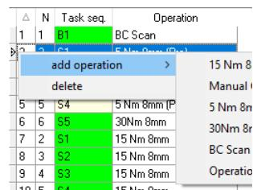

Das Rechtsklick-Kontextmenü funktioniert auch bei Mehrfachauswahlen. Um einen Vorgang mehreren Werkzeugen zuzuweisen, wählen Sie die entsprechenden Aktionen mehrfach aus (mit <ctrl>-Klick oder <shift>-Klick), klicken dann mit der rechten Maustaste und wählen den Vorgang. Dies funktioniert auch für das Hinzufügen eines weiteren Schritts (Vorprozess/Nachprozess) und kann eine enorme Zeitersparnis bedeuten.

Beachten Sie, dass jede Aktion immer mit einer einzigen Aufgabe verknüpft ist , aber eine Aufgabe kann mehrere Aktionen haben (z. B. Vorverarbeitung, Endverarbeitung und Nachprüfung). Außerdem \*muss\* jede Aktion einem Vorgang zugeordnet sein, sonst können Sie den Auftrag nicht speichern.

Die Hintergrundfarbe zeigt den Typ des Aktionsschritts an:

o Hellgrün: letzter Prozessschritt (Standard). Jeder Aufgabe \*muss\* eine Aktion für den letzten Schritt zugewiesen werden. o Gelb: Vorverarbeitungsschritt. o Hellblau: Nachbearbeitungsschritt (Kontrolle).

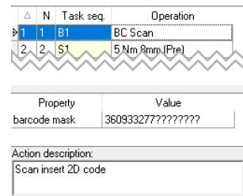

- Aktionseigenschaften und Aktionsbeschreibung. Zeigt die Eigenschaften der aktuell ausgewählten Aktion an (ausgewählt unter ). Je nach Werkzeug sind zusätzliche Aktionseigenschaften verfügbar (siehe Screenshot, z. B. erfordert das Barcode-Werkzeug das Hinzufügen einer Barcode-Maske). Weitere Informationen finden Sie in der Anleitung zur Werkzeugkonfiguration.

Die Aktionsbeschreibung wird dem Benutzer auf der heOpMon Workstation Runtime angezeigt, wenn die Aktion aktiv wird, um eine zusätzliche Textbeschreibung oder Erklärung der aktuellen Arbeit zu geben.

- Job-Aktionsschaltflächen: Die Schaltflächen "Abbrechen" und "Speichern" dienen zum Schließen des Job-Editors (Verwerfen oder Speichern der Änderungen). Wenn beim Versuch, den Job zu speichern, eine Unstimmigkeit festgestellt wird, wird ein Meldungsfenster mit Details angezeigt. In diesem Fall wird der Editor nicht geschlossen, um dem Benutzer die Möglichkeit zu geben, die Probleme zu beheben.

### **4.2.6 Datenbank-Einstellungen**

Auf die globalen Datenbankeinstellungen kann über das Hauptmenü Datenbank→ Einstellungen zugegriffen werden. Die globalen Datenbankeinstellungen werden in der Datenbank gespeichert und konfigurieren das datenbankspezifische Verhalten des Editors. Daraufhin wird der folgende Dialog angezeigt:

Die folgenden Einstellungen sind verfügbar (siehe auch Kapitel [4.2.6](#page-32-0) für weitere Informationen):

- Keep images in memory: Wenn diese Option aktiviert ist, werden alle Job-Bilder beim Starten einer Datenbank in den Speicher geladen. Der Vorteil ist, dass das Öffnen eines Jobs zur Bearbeitung schneller geht, der Nachteil ist eine längere anfängliche Ladezeit der Datenbank und ein höherer Speicherverbrauch.
- Job Versionskontrolle: Wenn diese Option aktiviert ist, wird die Job-Versionskontrolle eingeschaltet. Dadurch bleiben alte Versionen in der Datenbank erhalten (z.B. bei der Synchronisation von Jobs mit einer Server-Datenbank, siehe Kapitel [4.3.2.2\)](#page-34-1).
- Server role: falls aktiviert, dann wird die Datenbank für den Multi-User-Betrieb konfiguriert (Server-Modus, siehe Kapitel [4.3\)](#page-33-2)

- Change log level (Änderungsprotokollebene): legt fest, welche Änderungsprotokolleinträge aktiv sind (pro Job und pro Datenbank) und ob sie obligatorisch sind (beim Speichern eines Jobs oder der Datenbank muss eine Protokollmeldung hinzugefügt werden).
- Use position encoder: wenn angekreuzt, wird die Spalte "PS" zu den Auftragseigenschaften hinzugefügt (im Job Editor)
- Use socket tray: wenn angekreuzt, wird die Spalte "Socket" zu den Vorgängen Eigenschaften hinzugefügt (im Job Editor)
- Url: wenn angekreuzt, wird das Feld "url" zu den Auftragseigenschaften hinzugefügt (im Job Editor)
- Application start: wenn angekreuzt, wird das Feld "appl\_start" zu den Auftragseigenschaften hinzugefügt (im Job Editor). Diese Einstellung wird verwendet um die Schraubstellen für Multi-Spindel-Schraubsysteme zu gruppieren (für KE350).

Beachten Sie, dass sich die meisten Einstellungen in der INI-Parameterliste von Tool→ wiederfinden.

### **4.2.7 Changelog**

Um auf das Änderungsprotokoll der Datenbank zuzugreifen (wenn die Datenbank die Änderungsprotokollierung aktiviert hat, sieh[e 4.2.6\)](#page-32-0), verwenden Sie den Menüpunkt View→ Changelog. Daraufhin wird der Changelog-Dialog angezeigt:

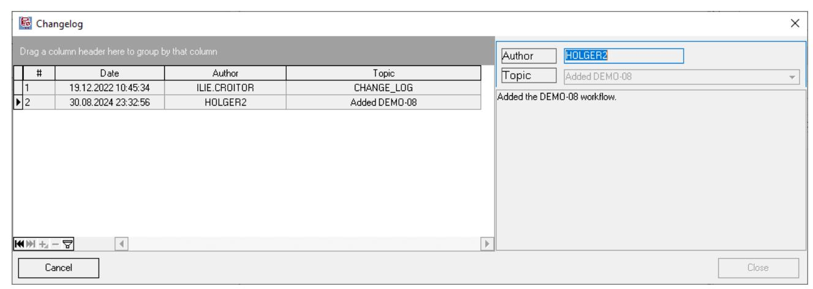

Beachten Sie, dass das Änderungsprotokoll im Nur-Lese-Modus angezeigt wird. Derselbe Dialog (im Bearbeitungsmodus) wird angezeigt, wenn ein Job oder die Datenbank gespeichert wird.

### **4.2.8 Admin-Modus**

Um den Editor im Admin-Modus zu starten, starten Sie den Editor von einer Befehlszeile aus und fügen Sie den Befehlszeilenparameter /admin hinzu. Dies aktiviert den SQL-Editor von View→ sowie zusätzliche Admin-Funktionen.

# **4.3 Server-Modus**

### **4.3.1 Übersicht**

Der Editor kann in zwei Betriebsmodi laufen, die durch die globale Einstellung "SERVER\_ROLE" in der Datenbank definiert sind (siehe Kapitel [4.4](#page-39-0) für Konfigurationsoptionen):

- Lokaler Modus (der Standard): Dies ist der Standardmodus, wenn die geöffnete Datenbank nicht die globale Eigenschaft "SERVER\_ROLE" hat oder der Wert von "SERVER\_ROLE" Null ist.
- Servermodus (wenn die globale Datenbankeigenschaft "SERVER\_ROLE" = 1): Im Vergleich zum lokalen Modus bietet der Servermodus zusätzliche Zugriffsebenen (Koordinator, Job-Editor) und

Mehrbenutzer-Synchronisation. Wenn eine Datenbank auf den Servermodus eingestellt ist, können mehrere Clients/Benutzer gleichzeitig dieselbe Datenbank bearbeiten, und die heOpCfg-Software verwaltet den gleichzeitigen Zugriff.

Wenn eine Datenbank in den Servermodus geschaltet ist, kann nur ein "Koordinator" direkt auf die Datenbank zugreifen und sie bearbeiten. Andere Benutzer (mit der Rolle "Job-Editor") können nur Jobs ausund einchecken. Ein "Job-Editor" checkt Jobs aus der Server-Datenbank aus und kopiert sie zur Bearbeitung in eine lokale Datenbank. Nachdem alle Bearbeitungen (in der lokalen Datenbank) abgeschlossen sind, kann der "Job-Editor" eine neue Version wieder in die Datenbank einchecken (hochladen).

Es kann immer nur ein einziger "Koordinator" angemeldet sein, der dann alle Objekte (Jobs und gemeinsame Objekte wie die Werkzeugliste und die Familienkonfiguration) bearbeiten kann.

### **4.3.2 Editor-Rollen**

#### **4.3.2.1 Koordinator**

Im Servermodus zeigt der Editor nach dem Verbinden mit einer Datenbank, bei der der "Servermodus" aktiviert ist, den folgenden Dialog an:

Das Dialogfeld enthält die folgenden Informationen:

- Wer als Koordinator angemeldet ist (falls vorhanden)
- Gründe dafür, dass man sich nicht als Koordinator anmelden kann (z. B. hat der Benutzer nicht das Recht, sich als Koordinator anzumelden - siehe Screenshot oben).

Wenn der Benutzer das Recht hat, sich als Koordinator anzumelden, ist die Schaltfläche "Koordinator anmelden" aktiviert. Wenn Sie darauf klicken, wird der aktuelle Benutzer angemeldet und die Datenbank gesperrt, damit andere Koordinatoren nicht darauf zugreifen können. Beachten Sie, dass die Datenbanksperre automatisch aufgehoben wird, wenn der Editor geschlossen wird oder eine andere Datenbank geöffnet wird.

#### **4.3.2.2 Job-Editor**

Benutzer mit der Rolle "Job-Editor" können gleichzeitig Jobs in der Datenbank bearbeiten. Dies funktioniert grundsätzlich wie folgt (siehe Kapitel [5.3](#page-45-1) für weitere Informationen):

- User öffnet eine Datenbank im lokalen Modus (stellen Sie sich diese als eine Teilkopie der Server-Datenbank vor, die zur Offline-Bearbeitung von Jobs verwendet wird). Beachten Sie, dass Sie auch mit einer leeren Datenbank beginnen können (Datenbank→ Neu).
- Verwenden Sie Export/Import→ Jobs synchronisieren, um den Job-Synchronisationsselektor zu öffnen:

- Im Selektor für die Job-Synchronisierung wird die aktuell im Editor geöffnete Datenbank automatisch als lokale Datenbank ausgewählt. In der zweiten Zeile wählen Sie die Datenbank aus, in die Sie die zu bearbeitenden Jobs herunterladen (auschecken) möchten:

- Nachdem Sie auf die Schaltfläche "Akzeptieren" geklickt haben, wird die Hauptansicht der Synchronisierung geöffnet:

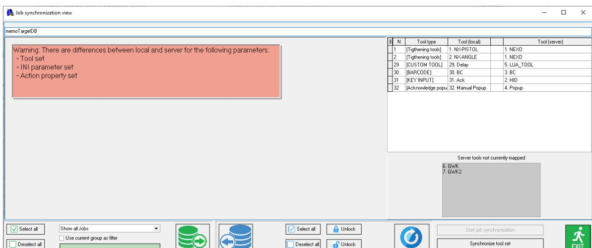

- Die Ansicht "Hauptsynchronisierung" zeigt alle Unterschiede in der Systemkonfiguration der beiden Datenbanken an und ermöglicht die Aktualisierung der lokalen Datenbank anhand der Serverdatenbank. Um fortzufahren, muss die Systemkonfiguration der lokalen Datenbank mit der Serverkonfiguration identisch sein. Sie können ein Mapping mit Hilfe des Rasters im oberen rechten Bereich des Rasters einrichten. Wenn Sie auf die Schaltfläche "Werkzeugsatz synchronisieren" klicken, werden die Änderungen in der lokalen Datenbank übernommen und die Schaltfläche "Job-Synchronisierung starten" aktiviert:

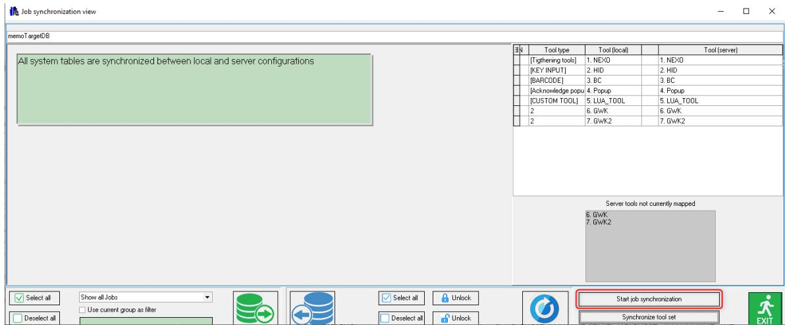

- Nachdem Sie auf die Schaltfläche "Job-Synchronisierung starten" geklickt haben, öffnet sich die Ansicht "Job-Synchronisierung":

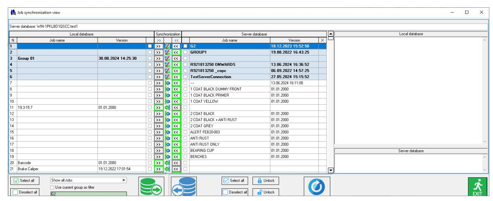

- Sie können jetzt Jobs von der Server-Datenbank in die lokale Datenbank herunterladen (für die lokale Bearbeitung) und lokale Änderungen in die Server-Datenbank hochladen (wenn es einen Versionskonflikt gibt, wird der Editor Sie darauf hinweisen und Sie müssen diesen manuell lösen).
- Wenn die Synchronisierung abgeschlossen ist, klicken Sie auf die Schaltfläche "Beenden", um zum Editor zurückzukehren.

### **4.3.3 Versionierung**

Wenn die Versionierung aktiviert ist (siehe Kapitel [4.2.6\)](#page-32-0), dann kann der Koordinator auf alte Versionen zugreifen und diese wiederherstellen. Eine neue Version wird automatisch hinzugefügt, wenn ein Job im Servermodus in eine Datenbank hochgeladen wird. Um eine alte Version zu sehen und eventuell wiederherzustellen, gehen Sie auf die Registerkarte Jobs und öffnen Sie die Ansicht des Repository (View→ Repository):

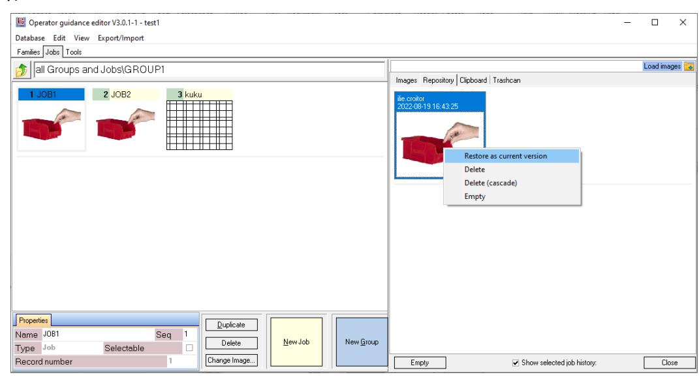

Standardmäßig werden in der Repository-Ansicht nur alte Versionen des aktuell ausgewählten Jobs angezeigt (Kontrollkästchen "Show selected job history" im unteren rechten Fensterbereich aktiviert). Wenn das Kontrollkästchen "Historie des ausgewählten Jobs anzeigen" nicht markiert ist, werden alle "alten" Versionen im Repository angezeigt.

Um den Versionsverlauf zu ändern, klicken Sie mit der rechten Maustaste auf eine der alten Versionen in der Repository-Liste und wählen dann eine der folgenden Aktionen aus:

- Als aktuelle Version wiederherstellen: Macht die ausgewählte Version zur aktiven Version (d. h. Rollback zur angegebenen Version).
- Löschen: Löscht die ausgewählte Version aus der Historie.

- Löschen (Kaskade): Löscht alle Versionen des ausgewählten Jobs aus der Historie.
- Leeren: Alle alten Versionen aus der Historie löschen.

### **4.3.4 Explizites Sperren**

In Szenarien mit mehreren Benutzern ist es manchmal hilfreich, einen Job in der Server-Datenbank zu "sperren", um Versionskonflikte zu vermeiden und den anderen Benutzern zu zeigen, dass Sie an einer Änderung arbeiten. Dazu können Sie einen Job explizit sperren, indem Sie die Synchronisationsansicht öffnen und auf die Schaltfläche "Sperren" oder "Entsperren" klicken (stellen Sie sicher, dass Sie einen oder mehrere Jobs überprüfen, bevor Sie auf die Schaltfläche klicken):

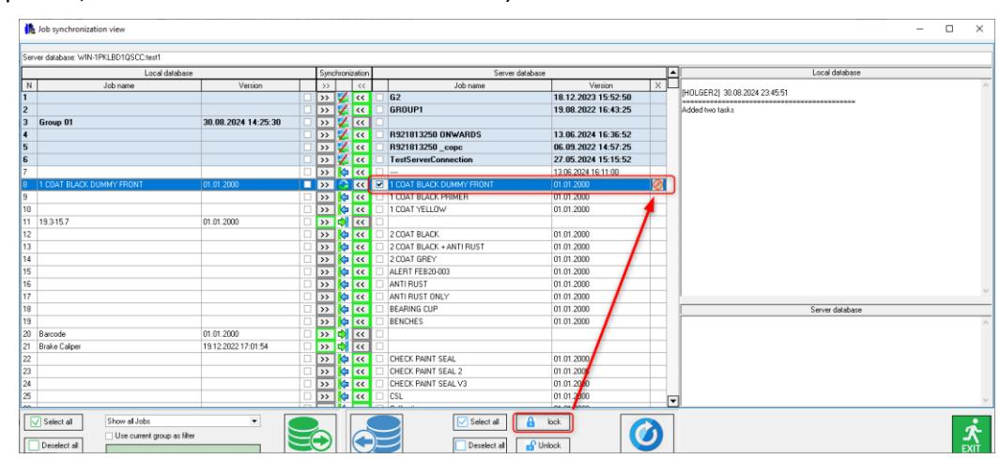

Das Schlosssymbol in der rechten Zeile zeigt den Status der Sperre an. Der Versuch, Änderungen an einem gesperrten Job hochzuladen, wird für alle Benutzer außer demjenigen, der den Job gesperrt hat, verhindert.

Beachten Sie, dass der "Koordinator" die von anderen Benutzern angelegten Sperren aufheben kann.

### **4.3.5 Active Directory-Zugangskontrolle**

Im Servermodus können Sie Active Directory-Sicherheitsgruppen verwenden, um den Benutzern automatisch die Rollen "Koordinator" und "Job-Editor" zuzuweisen. Um diese Funktion zu aktivieren, setzen Sie die folgenden globalen Parameter (Tools→ Ini-Parameter):

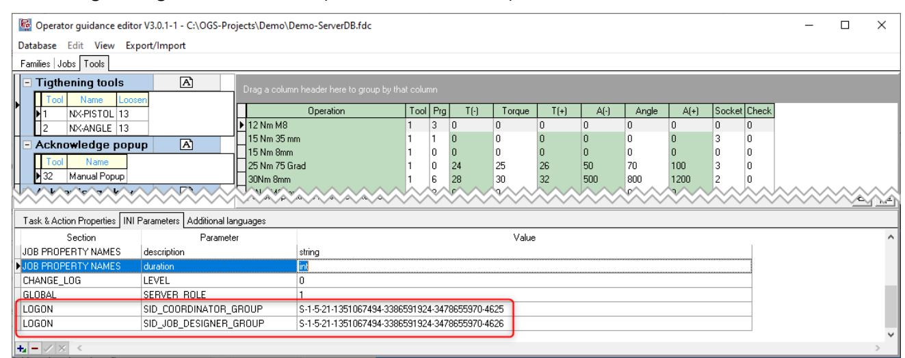

Hinweis: Um die SID für eine Active Directory-Gruppe zu erhalten, kann PsGetSid von Sysinternals verwendet werden:

Beim Starten des heOpCfg-Editors wird die aktuelle Windows-Anmeldung auf Gruppenzugehörigkeit zu den beiden SIDs geprüft und der Zugriff auf den Koordinator-/Job-Editor-Modus entsprechend validiert.

### **4.3.6 Datenbank-Shortcuts**

Das Menü Datenbank→ Wider öffnen listet die aktuell geöffneten Datenbanken sowie eine Liste der vordefinierten Datenbanken auf. Die Liste der vordefinierten Datenbanken kann im Abschnitt heOpCfg.ini [GLOBAL] eingerichtet werden (erfordert standardmäßig Admin-Rechte).

Um dauerhafte Datenbankverknüpfungen (oder Verknüpfungen) hinzuzufügen, fügen Sie diese wie folgt hinzu:

Die Syntax lautet:

CFG\_DATENBANK\_<Zahl>=<Server>:<Alias>

oder

CFG\_DATENBANK\_<Zahl>=<Pfad>

wo:

- <num> ist die fortlaufende Nummer (01...09) des Datenbankverknüpfungseintrags im Hauptmenü
- <Server> ist die IP-Adresse oder der Hostname eines entfernten Datenbankservers
- <alias> ist der Aliasname oder der Pfad (auf dem Server) der Datenbank auf dem Server
- <Pfad> ist ein lokaler Pfad auf dem System (Netzlaufwerke sind nicht zulässig)

## **4.4 Konfiguration**

### **4.4.1 Übersicht**

Die Konfiguration legt das Verhalten der Software fest - z. B. können einige Funktionen in der Konfiguration aktiviert oder deaktiviert werden. Im Allgemeinen gibt es zwei Quellen für die Konfiguration:

- 1. heOpCfg.ini (im gleichen Verzeichnis, aus dem heOpCfg.exe gestartet wird): definiert die globale (typischerweise installationsspezifische) Konfiguration und dient als "Standard" für nicht in der Datenbank definierte Konfigurationseinstellungen (siehe unten).
- 2. Die Einstellungstabelle in der Datenbank. Die Einstellungstabelle wird von heOpCfg.exe gelesen, wenn eine Datenbank geöffnet wird. Die Einstellungstabelle kann globale Einstellungen überschreiben, so dass die Konfiguration von heOpCfg.exe von der tatsächlich geöffneten Datenbank abhängen kann, so dass Sie die Einstellungen auch pro Projekt/Datenbank festlegen können (z.B. "Servermodus" aktiv, "Positionierung" aktiv, ...).

Alle Parameter werden als <section><Parametername> definiert und mit einem <Wert> versehen. Wenn ein Parameter in der Datei heOpCfg.ini angegeben ist, wird die Einstellung als <Parametername>=<Wert> in der [<section>] der Datei angegeben. Wenn die Parameter in der Datenbank festgelegt sind, befinden sie sich im Fenster "INI-Parameter" unter → :

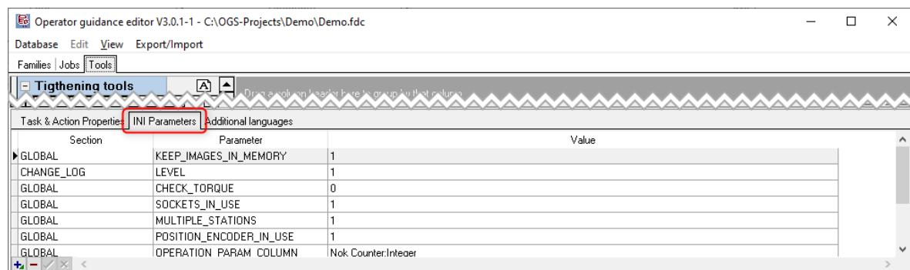

Beachten Sie, dass einige der am häufigsten verwendeten Einstellungen auch in der grafischen Benutzeroberfläche verfügbar sind. Sie können den Einstellungsdialog öffnen, indem Sie Datenbank→ Einstellungen... aus dem Hauptmenü wählen:

Siehe Kapitel [4.2.6](#page-32-0) für weitere Einzelheiten.

### **4.4.2 Abschnitte zur Konfiguration**

### **4.4.2.1 Abschnitt [GLOBAL]**

Nachfolgend sind die Parameter der Sektion [GLOBAL] aufgeführt (siehe auch Kapitel [4.3.6](#page-38-0) zum Einrichten von persistenten Datenbankverknüpfungen / Verknüpfungen, aber dies ist nur für die heOpCfg.ini-Datei) -

beachten Sie, dass einige Parameter nur in der heOpCfg.ini (ini) verfügbar sind, andere sind in db und ini verfügbar!

Hier sind die allgemeinen Parameter:

| Name                        | ini/db | Beschreibung                                          |
|-----------------------------|--------|-------------------------------------------------------|
| SERVER_ROLE                 | db     | Legt fest, ob sich die Datenbank im Servermodus       |
|                             |        | gesetzt) befindet. Siehe auch Kapite l 4.3.           |
| JOB_VERSION_CONTROL         | ini/db | Legt fest, ob die Datenbank bei der Synchronisierung  |
|                             |        | Kapite l 4.3.3.                                       |
| CHECK_TORQUE                | ini/db | Legt fest, ob der Editor die Nachbearbeitungsaktion   |
|                             |        | die Vorbearbeitungs- und die                          |
| SOCKET_IN_USE               | ini/db | Legt fest, ob der Editor den Parameter                |
|                             |        | Socketnummer in der Operationsdefinition anzeigt      |
| POSITION_ENCODER_IN_USE     | ini/db | Legt fest, ob der Editor die Spalte "PS" in der       |
| KEEP_IMAGES_IN_MEMORY       | ini/db | Wenn dieser Wert ungleich Null ist, werden alle Job  |
| OPERATION_PARAM_COLUMN      | ini/db | Definiert einen zusätzlichen Operationsparameter.     |
| SEARCH_BY_WORKFLOW_SELECTOR | ini/db | Wenn der Wert ungleich Null ist, wird das             |
|                             |        | der Familienbarcodes angezeigt. Siehe 4.2.2.4.        |
| LEVEL                       | ini/db | (nur für Administratoren) Wenn auf einen Wert         |
| MULTIPLE_STATIONS           | ini/db | Legt fest, ob der Editor die Spalte „Station“ bei der |

Um optional Standardwerte für das Öffnen der Datenbank festzulegen, verwenden Sie die folgenden Parameter:

#### **4.4.2.2 Abschnitt [LOGON]**

Im Bereich Anmeldung gibt es die folgenden Parameter:

- SID\_COORDINATOR\_GROUP: SID für die Rolle "Koordinatoren" definieren
- SID\_JOB\_DESIGNER\_GROUP: SID für die Rolle "Job-Editor" definieren

Siehe Kapitel [4.3.5](#page-37-1) für eine Beschreibung der Einrichtung der Active Directory-Zugriffskontrolle im Servermodus.

### **4.4.2.3 Abschnitt [CHANGE\_LOG]**

In der Sektion change log gibt es die folgenden Parameter:

- LEVEL: definiert die Ebene des Änderungsprotokolls

Normalerweise verwendet man den GUI-Dialog unter Datenbank → Einstellung, um die Anforderungen an das Änderungsprotokoll zu definieren (siehe [4.2.6\)](#page-32-0).

Die Änderungsprotokollebenen sind:

#### **4.4.2.4 Abschnitt [JOB PROPERTY NAMES]**

Definiert zusätzliche (benutzerdefinierte) Job-Eigenschaften. Jeder Eintrag in diesem Abschnitt hat das folgende Format:

<Job-Parametername>=<Datentyp>

Datentypen sind String, Int, Float, Logik, Zeit.

#### **4.4.2.5 Abschnitt [CSV]**

Im csv-Abschnitt gibt es die folgenden Parameter:

- SEPARATOR: Legt das Feldtrennzeichen für die CSV-Ausgabe fest (wenn nicht festgelegt, wird standardmäßig ein Komma verwendet)
- DO\_NOT\_OVERWRITE\_AVAILABLE: Legt fest, ob eine vorhandene CSV-Datei überschrieben werden kann (Standardwert = 1, d. h. vorhandene CSV-Dateien werden nicht überschrieben). Setzen Sie den Wert auf Null, um das Überschreiben vorhandener CSV-Dateien zu erlauben.

| Name             | ini/db | Beschreibung                                             |
|------------------|--------|----------------------------------------------------------|
| DATABASE         | ini    | Legt die Datenbank fest, die beim Start geöffnet werden  |
| STATION_DATABASE | Ini    | Legt die zu verwendende Standard-Stationsdatenbank fest. |

| Ebene | Ebene der Datenbank     | Job-Ebene               |
|-------|-------------------------|-------------------------|
| 0     | Kein Änderungsprotokoll | Kein Änderungsprotokoll |
| 1     | Optional                | Optional                |
| 2     | Erforderlich            | Erforderlich            |
| 3     | Erforderlich            | Optional                |
| 4     | Optional                | Erforderlich            |
| 5     | Optional                | Kein Änderungsprotokoll |
| 6     | Erforderlich            | Kein Änderungsprotokoll |
| 7     | Kein Änderungsprotokoll | Optional                |
| 8     | Kein Änderungsprotokoll | Erforderlich            |

# 5 Verwaltung der Daten

# **5.1 Übersicht**

Wie in Kapite[l 1.1b](#page-3-1)eschrieben, besteht die heOGS-Software hauptsächlich aus zwei Komponenten:

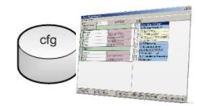

- heOGS-Editor ("heOpCfg"): Anwendung zur Erstellung und Verwaltung von Arbeitsabläufen. Die heOpCfg-Anwendung ist eine Standard-Windows-GUI-Anwendung und benötigt Maus und Tastatur zur Bedienung.
- heOGS-Runtime ("heOpMon"): Anwendung, die auf dem Arbeitsplatz eines Bedieners in der Produktionslinie läuft.

Beide Komponenten verwenden ihre eigene Datenbankdatei, um Informationen zu speichern:

- heOpCfg-Editor-Datendatei ("cfg"): speichert alle Informationen über konfigurierte Workflows (wie z.B. Job-Bilder, Workflow-Varianten, Aufgaben und Aktionsdefinitionen sowie Verknüpfungen von Operationen mit Werkzeugen) für einen einzelnen oder auch für mehrere Bedienerarbeitsplätze. In dieser Datendatei werden nur die "aktuellen" Workflow-Definitionen gespeichert, keine historischen Daten und keine historischen Workflows.
- heOpMon-Runtime Datendatei ("Daten"): speichert alle Informationen über die Workflows einer einzelnen Station und die historischen Workflow-Ergebnisdaten. Da diese Datendatei Workflow-Ergebnisdaten enthält, ermöglicht sie den Zugriff auf zuvor bearbeitete Teile und deren Status für "Pickup where you left"-Prozesse. Damit dies funktioniert, werden in der Datendatei auch historische Workflow-Definitionen gespeichert, selbst wenn sich die Workflow-Konfiguration zwischenzeitlich geändert hat.

Beachten Sie, dass alle Konfigurationsdateien einfache Dateien sind. Daher können Datenverwaltungsaufgaben wie Sicherung, Wiederherstellung und Versionierung einfach mit den Standard-Windows-Dateivorgängen (Kopieren, Einfügen, Umbenennen, Archivieren/Zippen, ...) durchgeführt werden.

# **5.2 Einstellungen**

Da die heOGS-Software in zwei Anwendungen aufgeteilt ist, kann man mehrere Betriebsszenarien realisieren, indem man wählt, wo die Software installiert wird, wo die Datendateien aufbewahrt werden und wie die Daten zwischen dem heOpCfg-Editor und der heOpMon-Runtime verschoben werden. In den folgenden Kapiteln werden typische Konfigurationen vorgestellt.

### **5.2.1 Standalone / Demo-Einrichtung**

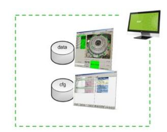

Das einfachste Setup ist die Installation beider Komponenten auf einem einzigen Rechner. In diesem Fall befinden sich beide Datenbankdateien auf demselben PC (ggf. im selben Ordner) und die Aktualisierung der heOpMon-Konfiguration kann direkt über die Funktion "Export local changes" in heOpCfg erfolgen (siehe Kapitel [3.6\)](#page-15-0).

### **5.2.2 Pro Station konfigurieren**

Dies ist die häufigste Konfiguration. Der heOpCfg-Editor läuft normalerweise auf einem Büro-PC mit separaten Konfigurationsdateien für jede Station in der Linie. Um die Konfiguration einer Station zu aktualisieren, wird die "cfg"-Datei auf den Stations-PC kopiert und dann durch die heOpImp-Anwendung importiert.

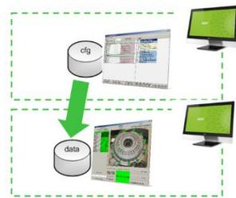

Dies hat die folgenden Vorteile:

- Alle Konfigurationsdateien (auch für mehrere Stationen) werden auf dem Büro-PC verwaltet (Backups, Version, etc.). Als bewährte Praxis kann ein Ordner/Verzeichnis pro Station verwendet werden - der vorzugsweise auf einem Netzwerk/gemeinsamen Laufwerk gespeichert sein sollte.
- Die Einführung von Änderungen an einer oder mehreren Stationen ist ein klar definierter Prozess:
  - 1. Übertragen Sie die "cfg"-Datei der Station vom Büro-PC auf den PC der Station (über das Netzwerk, mit einem USB-Stick usw.).
  - 2. Importieren Sie die neue Konfiguration in die "Daten"-Datei der Station, indem Sie die heOpImp-Anwendung auf dem PC der Station ausführen. Da dies vor Ort in der Fabrik geschieht, wird sichergestellt, dass die Aktualisierung im korrekten Zustand der Station (z. B. während einer Pause, wenn das aktuelle Werkstück vollständig fertiggestellt ist) und mit angemessenen Sicherungsmaßnahmen (es gibt z. B. eine aktuelle Sicherungskopie der "Daten"-Datei der Station) erfolgt und der geänderte Prozess validiert wird (Überwachung des ersten Teilebaus nach einer Änderung direkt an der Station).
- Da die Konfiguration im Büronetzwerk aufbewahrt wird, gibt es eine eindeutige "Single Source of Truth"-Konfiguration, bei der die Konfigurationsdaten in eine einzige Richtung laufen. Im Zweifelsfall ist die Stationskonfiguration immer "veraltet" und kann aus der aktuellen "cfg"-Konfiguration aktualisiert werden, ohne dass ein Datenverlust droht.
- Die Verteilung von Jobs auf verschiedene Stationen kann einfach mit der Funktion "Jobs verteilen" des heOpCfg-Editors vorgenommen werden (siehe Kapitel [5.3.2\)](#page-46-0).

### **5.2.3 Gemeinsame Konfiguration mit mehreren Stationen**

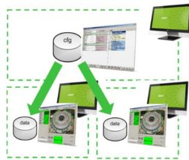

Multi station shared config speichert Workflow-Konfigurationen mehrerer Stationen in einer einzigen Konfigurationsdatenbank ("cfg"). In diesem Setup wird jede Operation einer Zielstation durch eine Nummer zugeordnet (erfordert die Aktivierung der Option "multiple\_station" in heOpCfg.ini, siehe [4.4.2.4\)](#page-41-0) - Operationen ohne Stationszuordnung (Station = 0) werden allen Stationen zugeordnet und können in Aufgaben / Jobs für alle Stationen verwendet werden):

Um die Stationskonfiguration zu aktualisieren, sind in der Regel die folgenden Schritte erforderlich:

- 1. Übertragen Sie die "cfg"-Datei an alle Stationen, die ein Update benötigen (über das Netzwerk, mit einem USB-Stick usw.).
- 2. Führen Sie heOpImp auf allen Stationen aus, um die "cfg"-Daten der Station in die "data"-Datei der Station zu importieren. Beachten Sie, dass heOpImp die Stationsnummer aus der Datei stations.ini liest,

um die Teilmenge der Workflows, Jobs und Operationen zu bestimmen, die für die Station erforderlich sind, und tatsächlich einen "teilweisen" Import durchführt.

Die wichtigsten Vorteile sind:

- Behalten Sie eine einzige Konfigurationsdatei für alle Stationen
- Ermöglicht feingranulare Änderungen an Aufgaben/Vorgängen

Die zu beachtenden Punkte sind:

- Es könnte schwierig werden, nachzuvollziehen, welche Konfigurationsänderung welche Station(en) zur Aktualisierung erfordert. Als bewährtes Verfahren sollte jede Änderung der "cfg"-Konfiguration an alle Stationen weitergegeben werden, um sicherzustellen, dass keine Aktualisierungen auf Stationsebene fehlen.
- Bei Vorgängen ohne Stationszuordnung (Station = 0) müssen die Werkzeuge in den Stationen, in denen der Vorgang ausgeführt wird, identisch vorhanden sein.
- Die Rückgängigmachung von Änderungen könnte schwieriger werden, da sich Fehler in der Konfiguration einer einzelnen Station mit gleichzeitigen (korrekten) Änderungen einer anderen Station überschneiden könnten. Ein Rollback der "cfg"-Datei auf eine frühere Version könnte dann eine korrekte Änderung verwerfen...

### **5.2.4 Zentrale Datenbank**

Zusätzlich zu einer gemeinsamen Konfiguration mehrerer Stationen (sieh[e 5.2.3\)](#page-44-1) kann auch die "Daten"-Datei der Stationen von mehreren Stationen gemeinsam genutzt werden, indem sie auf einem gemeinsamen Datenbankserver bereitgestellt wird.

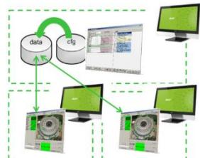

Der Hauptvorteil besteht darin, dass mit dieser Einrichtung die Arbeitsabläufe von mehreren heOpMon-Stationen gemeinsam genutzt werden können. Dies ermöglicht Szenarien, in denen z. B. zwei Bediener gleichzeitig an einem einzigen Produktteil arbeiten (z. B. linke und rechte Seite eines Autos). Beide Stationen (links und rechts) können eigene Jobs haben, aber auch gemeinsame Jobs. Der heOpMon sperrt den Zugriff auf der Job-Ebene - so dass jeder Bediener grundsätzlich an allen gemeinsamen Jobs arbeiten kann. Der erste Bediener, der einen Job startet, "besitzt" ihn jedoch (der andere Bediener ist ausgesperrt, kann aber den nächsten Job überspringen und starten). Beide Bediener können den Status aller gemeinsam genutzten Jobs sehen - auch hier wird der Status beim Start/Ende eines Jobs aktualisiert.

Beachten Sie, dass diese Einrichtung die Installation einer Datenbankserverinstanz auf einem PC/Server erfordert, der von allen Stationen aus erreichbar ist, sowie eine zuverlässige Netzwerkverbindung zwischen allen Stationen und dem Server.

# **5.3 heOpImp**

### **5.3.1 Übersicht**

Die Anwendung heOpImp ist eine kleine Hilfsanwendung zur Verwaltung der "data"-Konfigurationsdatei der Stationen. Die heOpImp-Anwendung kann entweder über die heOpCfg-Menüleiste gestartet werden (zum Importieren einer "cfg"-Konfigurationsdatei und zum Verschieben von Jobs zwischen "cfg"-Datenbanken, siehe [4.2.1\)](#page-18-1) oder durch Ausführen der ausführbaren Datei heOpImp.exe aus dem Software-Installationsordner.

Wenn Sie die Software direkt starten, wird das folgende Fenster angezeigt:

Die angebotenen Funktionen sind:

- Konfiguration importieren: Öffnet einen Dateibrowser, um eine "cfg"- Konfiguration in eine "data"-Datei einer Station zu importieren/zusammenzuführen. Siehe Kapite[l 3.6](#page-15-0) für weitere Informationen.
- Begriffseditor: ermöglicht die Bearbeitung der Texte der heOpMon-Runtime-GUI.
- Benutzerverwaltung: ermöglicht die Bearbeitung einer Liste von Benutzern/Passwörtern. Beachten Sie, dass diese Funktion stark davon abhängt, wie die Benutzerverwaltung in heOpMon konfiguriert ist und möglicherweise gar nicht verwendet wird.
- Exportieren der Job-Liste des Senders auf den SQL-Server: spezielle Funktion zum Hochladen/Zusammenführen der Job-Liste des Senders auf einen SQL-Server. Dies wird für End-of-Line-Berichte verwendet.
- Job/Vorgangsliste löschen: Löscht veraltete Daten aus der Datenbank.
- Synchronisierung von lokalen/Server-Datenbanken: Ermöglicht das Verschieben von Jobs zwischen "cfg"-Datenbanken. Siehe unten (Kapitel [5.3.2](#page-46-0) für weitere Informationen).

### **5.3.2 Lokale/Server-Datenbanken synchronisieren**

Die Funktion "Lokale/Server-Datenbanken synchronisieren" ermöglicht das Kopieren/Verschieben von Jobs zwischen zwei Datenbanken. Sie enthält Funktionen zum Sperren des Datenbankzugriffs (um gleichzeitige Änderungen an einer gemeinsam genutzten (Server-)Datenbank zu verhindern) und zur Versionierung von Jobs (um gleichzeitige Änderungen zu erkennen und zu verwalten).

Die Funktion kann auf zwei Arten aufgerufen werden:

- Durch Klicken auf die Schaltfläche "Lokale/Server-Datenbanken synchronisieren" in heOpImp. In diesem Fall fragt die Funktion zuerst nach einer Quelldatenbank (aus der sie die Jobs liest), dann nach einer Serverdatenbank (aus der sie die Jobs holt oder in die sie die Jobs schreibt).
- Durch Auswahl von "Export/Import"→ "Synchronize Jobs..." aus dem Hauptmenü in heOpCfg. In diesem Fall ist die Quelldatenbank automatisch die aktuell in heOpCfg geöffnete Datenbank. Die Software fragt dann nur noch nach einer Server-Datenbank (woher die Jobs geholt oder wohin die Jobs geschrieben werden sollen).

Beachten Sie, dass die "Server"-Datenbank "geschützt" ist - in dem Sinne, dass Sie niemals globale Definitionen überschreiben können. Das einzige, was in der "Server"-Datenbank geändert werden kann, sind die Jobs. Andere Änderungen (Familien oder Werkzeuge) werden als global betrachtet und erfordern eine direkte Verbindung ("Koordinator"-Zugang) zur Server-Datenbank.

Nachdem Quell- und Zieldatenbank ausgewählt wurden, zeigt die Software ein Übersichtsvergleichsfenster wie folgt an:

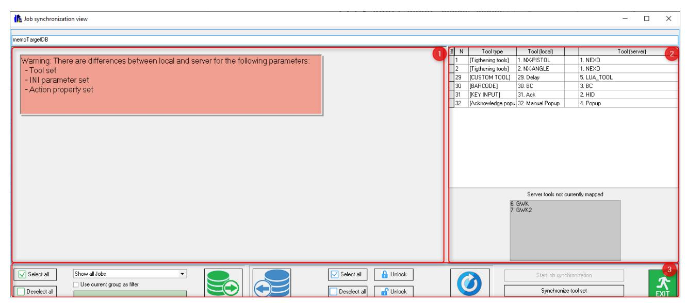

Das Fenster zeigt folgendes an:

- Übersicht "Systemparameter" Synchronisationsergebnis: Hier wird geprüft, ob die globalen Parameter und Abhängigkeiten der beiden Datenbanken kompatibel sind. Wenn nicht, wird eine rote Warnmeldung mit Details angezeigt. Wenn Sie hier weitermachen, müssen Sie die lokale Datenbank erneut synchronisieren (Kopieren der Systemparameter aus der Server-Datenbank). Wird hier eine grüne Info-Meldung angezeigt, dann sind die Systemparameter synchron - auch Mappings können dennoch unterschiedlich sein (siehe ).
- Raster der Werkzeugzuordnungen. Dieses Fenster zeigt alle Werkzeuge an, die in der lokalen und der Server-Datenbank definiert sind. Sie können die Zuordnung der Werkzeuge zwischen lokaler und Server-Datenbank ändern - wenn Sie später Jobs synchronisieren, beachtet heOpImp diese Zuordnungen.
- Aktionsbereich. In der Regel sind die Aktionen in dem im obigen Screenshot gezeigten Zustand deaktiviert, da eine Nichtübereinstimmung des Werkzeugsatzes festgestellt wurde. Die einzige aktivierte Aktion ist die Schaltfläche "Werkzeugsatz synchronisieren".

Nachdem Sie die Werkzeugzuordnung überprüft und auf die Schaltfläche "Werkzeugsatz synchronisieren" geklickt haben, wird die Ansicht wie folgt aktualisiert:

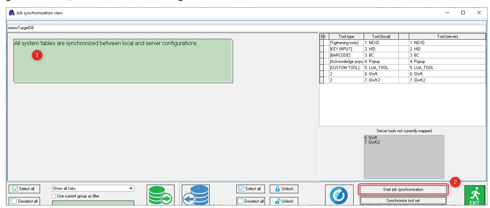

Die Ansicht zeigt nun:

- Die "Systemparameter" wurden auf grün geändert dies zeigt an, dass der Server und die lokale Datenbank für die Synchronisierung von Jobs bereit sind (alle Abhängigkeiten können aufgelöst werden) und kompatibel sind.

- Die Schaltfläche "Auftragssynchronisierung starten" ist aktiviert. Die Elemente des Aktionsfensters sind weiterhin größtenteils deaktiviert, nur die beiden Schaltflächen auf der rechten Seite sind aktiviert.

Nachdem Sie auf die Schaltfläche "Job-Synchronisierung starten" geklickt haben, wird nun endlich die Job-Vergleichsansicht wie folgt angezeigt (beachten Sie, dass die beiden vorherigen Ansichten nicht angezeigt werden, wenn die globalen Datenbankabhängigkeiten bereits zwischen der lokalen und der Server-Datenbank synchronisiert sind):

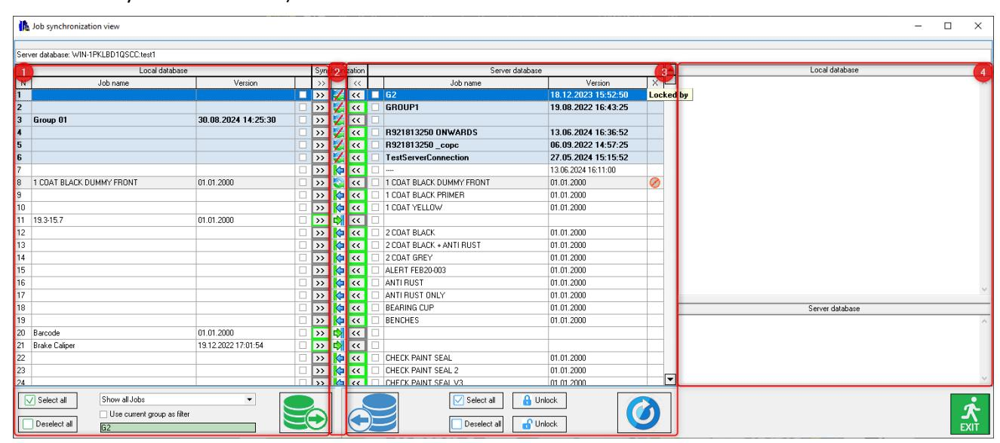

#### Das Fenster zeigt folgendes an:

- "Lokale Datenbank". Dieser Bereich zeigt die in der lokalen Datenbank verfügbaren Jobs an. Die Job-Gruppen haben einen hellblauen Hintergrund, die eigentlichen Jobs einen weißen Hintergrund. Jeder Job (und jede Gruppe) zeigt auch eine Version an (die eigentlich ein Zeitstempel der letzten Änderung ist). Am rechten Rand befindet sich ein Kontrollkästchen zur Auswahl eines Jobs (für Batch-Operationen) und eine Schaltfläche >>, die einen Job sofort auf den Server hochlädt, wenn Sie darauf klicken. Beachten Sie, dass die Schaltfläche einen grünen Rahmen hat, um den typischen Vorgang zu kennzeichnen.

Im unteren Bereich gibt es zusätzliche Aktionen, um die Ansicht zu filtern oder die Auswahl zu ändern. Ein Klick auf den großen grünen Datenbank-Sync-Button führt die vorgewählte Änderung aus (lokaler→ Server).

- Vergleichsstatus: Diese Spalte zeigt den Vergleichsstatus an. Mögliche Status sind nur links, nur rechts, identisch, unterschiedlich und nicht synchronisierbar (nur für Gruppen).
- "Server-Datenbank". In diesem Bereich werden die in der Server-Datenbank verfügbaren Jobs/Gruppen angezeigt. Die Job-Gruppen haben einen hellblauen Hintergrund, die eigentlichen Jobs einen weißen Hintergrund. Jeder Job (und jede Gruppe) zeigt auch eine Version an (die eigentlich ein Zeitstempel der letzten Änderung ist). Am linken Rand befinden sich ein Kontrollkästchen für die Auswahl eines Jobs (für Batch-Operationen) und eine Schaltfläche <<, die einen Job sofort auf den Server herunterlädt, wenn Sie darauf klicken. Beachten Sie, dass die Schaltfläche grün umrandet ist, um den typischen Vorgang anzuzeigen. Die Spalte ganz rechts zeigt den Sperrstatus des Jobs auf dem Server an (wenn er gesperrt ist, wird ein rotes Sperrzeichen angezeigt).

Im unteren Bereich gibt es zusätzliche Aktionen zum Ändern der Auswahl oder zum Sperren/Entsperren eines Jobs. Ein Klick auf die große blaue Datenbank-Sync-Schaltfläche führt die vorgewählte Änderung aus (Server→ lokal).

# **5.4 Zugangskontrolle und Sicherheit**

### **5.4.1 Übersicht**

Da es sich bei den Konfigurationsdatenbanken um einzelne Dateien handelt, kann der Zugriff auf diese Dateien mit den Standardeinstellungen des Windows-Dateisystems für die Zugriffskontrollliste (ACL) eingeschränkt werden. Die "Daten"-Datei (und andere Konfigurationsinformationen auf dem Stations-PC) wird normalerweise in einem Unterverzeichnis unterhalb des Installationsordners gespeichert. Es wird empfohlen, dass normale Benutzer nur Lesezugriff auf diesen Ordner erhalten. Der Benutzer, der die heOpImp-Anwendung ausführen darf, um "cfg"-Daten in die "data"-Datei der Stationen zu importieren, muss Schreibrechte auf die "data"-Datei (stations.fds) haben.

Beachten Sie, dass der PC, auf dem die heOpMon-Workstation-Runtimesoftware läuft, nicht unbedingt eine Netzwerkverbindung zum Büronetzwerk benötigt. Um die Konfiguration zu aktualisieren, kann die "cfg"- Datei auch auf andere Weise auf die Station übertragen werden, z. B. mit einem USB-Stick.

### **5.4.2 Fernzugriff auf den Server**

Zur Verwaltung des Fernzugriffs auf eine auf dem Server gehostete Datenbank werden Active Directory-Gruppen verwendet. Siehe Kapite[l 4.3.5](#page-37-1) für weitere Einzelheiten.