# Haller + Erne GmbH

# **Operator Guidance System Workflow Editor**

## **User guide**

HEI-71-209 Revision R04

# **Version history**

| Revision | History                                             | Author | Date       |
|----------|-----------------------------------------------------|--------|------------|
| R01      | First draft of the editor user guide heOGS V2.1     | se     | 2019-11-21 |
| R02      | First release for heOGS V2.1                        | he     | 2019-11-29 |
| R03      | Added reference section                             | he     | 2019-12-13 |
| R04      | Updated for V3.1, added server mode, added job sync | he     | 2024-08-21 |

# **About this document**

This document describes the usage of the editor to configure and edit workflows for heOGS.

# **Table of Contents**

| 1 1.1 1.2 2 2.1 2.2 3 3.1 3.2 3.3 | Introduction Overview Scenarios_______________________________________________________________________4 Installation and Configuration Requirements Installing the software Quick Start Starting the software Manage tools Edit jobs________________________________________________________________________8 | ________________________________________________________________________4 _______________________________________________________________________4 __________________________________________________________5 ___________________________________________________________________5 ____________________________________________________________5 _________________________________________________________________________6 _____________________________________________________________6 ___________________________________________________________________7 |
|-----------------------------------|---------------------------------------------------------------------------------------------------------------------------------------------------------------------------------------------------------------------------------------------------------------------------------------------------------------|------------------------------------------------------------------------------------------------------------------------------------------------------------------------------------------------------------------------------------------------------------------------------------------------------------------------------------------------------------------------------------------------------------------------------------------------------------------------------------------------------------------------------------------------------------------|
| 3.3.1                             | Job catalog                                                                                                                                                                                                                                                                                                   | 8                                                                                                                                                                                                                                                                                                                                                                                                                                                                                                                                                                |
| 3.3.2                             | Job editor                                                                                                                                                                                                                                                                                                    | 9                                                                                                                                                                                                                                                                                                                                                                                                                                                                                                                                                                |
| 3.4                               | Edit workflows                                                                                                                                                                                                                                                                                                | _________________________________________________________________13                                                                                                                                                                                                                                                                                                                                                                                                                                                                                              |
| 3.5                               | Barcodes                                                                                                                                                                                                                                                                                                      | ______________________________________________________________________14                                                                                                                                                                                                                                                                                                                                                                                                                                                                                         |
| 3.6                               | Transfer workflows to the runtime__________________________________________________16                                                                                                                                                                                                                         |                                                                                                                                                                                                                                                                                                                                                                                                                                                                                                                                                                  |
| 4                                 | Reference                                                                                                                                                                                                                                                                                                     | _________________________________________________________________________18                                                                                                                                                                                                                                                                                                                                                                                                                                                                                      |
| 4.1                               | Terms                                                                                                                                                                                                                                                                                                         | ________________________________________________________________________18                                                                                                                                                                                                                                                                                                                                                                                                                                                                                       |
| 4.2                               | Editor User Interface_____________________________________________________________19                                                                                                                                                                                                                          |                                                                                                                                                                                                                                                                                                                                                                                                                                                                                                                                                                  |
| 4.2.1                             | Overview                                                                                                                                                                                                                                                                                                      | 19                                                                                                                                                                                                                                                                                                                                                                                                                                                                                                                                                               |
| 4.2.2                             | Tab Families                                                                                                                                                                                                                                                                                                  | 20                                                                                                                                                                                                                                                                                                                                                                                                                                                                                                                                                               |
| 4.2.3                             | Tab Jobs                                                                                                                                                                                                                                                                                                      | 22                                                                                                                                                                                                                                                                                                                                                                                                                                                                                                                                                               |
| 4.2.4                             | Tab Tools                                                                                                                                                                                                                                                                                                     | 27                                                                                                                                                                                                                                                                                                                                                                                                                                                                                                                                                               |
| 4.2.5                             | Job Editor                                                                                                                                                                                                                                                                                                    | 29                                                                                                                                                                                                                                                                                                                                                                                                                                                                                                                                                               |
| 4.2.6                             | Database Settings____________________________________________________________________                                                                                                                                                                                                                         | 31                                                                                                                                                                                                                                                                                                                                                                                                                                                                                                                                                               |
| 4.2.7                             | Changelog__________________________________________________________________________                                                                                                                                                                                                                           | 32                                                                                                                                                                                                                                                                                                                                                                                                                                                                                                                                                               |
| 4.2.8                             | Admin mode________________________________________________________________________                                                                                                                                                                                                                            | 32                                                                                                                                                                                                                                                                                                                                                                                                                                                                                                                                                               |
| 4.3                               | Server Mode                                                                                                                                                                                                                                                                                                   | ___________________________________________________________________32                                                                                                                                                                                                                                                                                                                                                                                                                                                                                            |
| 4.3.1                             | Overview                                                                                                                                                                                                                                                                                                      | 32                                                                                                                                                                                                                                                                                                                                                                                                                                                                                                                                                               |
| 4.3.2                             | Editor roles                                                                                                                                                                                                                                                                                                  | 33                                                                                                                                                                                                                                                                                                                                                                                                                                                                                                                                                               |
| 4.3.3                             | Versioning__________________________________________________________________________                                                                                                                                                                                                                          | 35                                                                                                                                                                                                                                                                                                                                                                                                                                                                                                                                                               |
| 4.3.4                             | Explicit locking                                                                                                                                                                                                                                                                                              | 36                                                                                                                                                                                                                                                                                                                                                                                                                                                                                                                                                               |
| 4.3.5                             | Active directory access control                                                                                                                                                                                                                                                                               | 36                                                                                                                                                                                                                                                                                                                                                                                                                                                                                                                                                               |
| 4.3.6                             | Persistent database links                                                                                                                                                                                                                                                                                     | 37                                                                                                                                                                                                                                                                                                                                                                                                                                                                                                                                                               |
| 4.4                               | Configuration                                                                                                                                                                                                                                                                                                 | __________________________________________________________________38                                                                                                                                                                                                                                                                                                                                                                                                                                                                                             |
| 4.4.1                             | Overview                                                                                                                                                                                                                                                                                                      | 38                                                                                                                                                                                                                                                                                                                                                                                                                                                                                                                                                               |
| 4.4.2                             | Configuration sections                                                                                                                                                                                                                                                                                        | 38                                                                                                                                                                                                                                                                                                                                                                                                                                                                                                                                                               |
| 5                                 | Data management                                                                                                                                                                                                                                                                                               | __________________________________________________________________41                                                                                                                                                                                                                                                                                                                                                                                                                                                                                             |
| 5.1                               | Overview                                                                                                                                                                                                                                                                                                      | ______________________________________________________________________41                                                                                                                                                                                                                                                                                                                                                                                                                                                                                         |
| 5.2                               | Setups                                                                                                                                                                                                                                                                                                        | ________________________________________________________________________41                                                                                                                                                                                                                                                                                                                                                                                                                                                                                       |
| 5.2.1                             | Standalone / Demo setup                                                                                                                                                                                                                                                                                       | 41                                                                                                                                                                                                                                                                                                                                                                                                                                                                                                                                                               |
| 5.2.2                             | Per station config                                                                                                                                                                                                                                                                                            | 41                                                                                                                                                                                                                                                                                                                                                                                                                                                                                                                                                               |
| 5.2.3                             | Multi-station shared config                                                                                                                                                                                                                                                                                   | 42                                                                                                                                                                                                                                                                                                                                                                                                                                                                                                                                                               |
| 5.2.4                             | Central database                                                                                                                                                                                                                                                                                              | 43                                                                                                                                                                                                                                                                                                                                                                                                                                                                                                                                                               |
| 5.3                               | heOpImp                                                                                                                                                                                                                                                                                                       | ______________________________________________________________________43                                                                                                                                                                                                                                                                                                                                                                                                                                                                                         |
| 5.3.1                             | Overview                                                                                                                                                                                                                                                                                                      | 43                                                                                                                                                                                                                                                                                                                                                                                                                                                                                                                                                               |
| 5.3.2                             | Synchronize local/server databases                                                                                                                                                                                                                                                                            | 43                                                                                                                                                                                                                                                                                                                                                                                                                                                                                                                                                               |
| 5.4                               | Access control and security________________________________________________________46                                                                                                                                                                                                                         |                                                                                                                                                                                                                                                                                                                                                                                                                                                                                                                                                                  |
| 5.4.1                             | Overview                                                                                                                                                                                                                                                                                                      | 46                                                                                                                                                                                                                                                                                                                                                                                                                                                                                                                                                               |
| 5.4.2                             | Remote server access                                                                                                                                                                                                                                                                                          | 46                                                                                                                                                                                                                                                                                                                                                                                                                                                                                                                                                               |

# 1 Introduction

This document describes how to use the heOGS editor application to create and manage workflows. heOGS editor application has the following main features:

- Graphical editor to create and edit workflows including model variants and associated barcodes
- Reusing jobs and operations to quickly create multiple tasks or model variants
- Single file data storage to ease data management (backup and versioning)
- Support standard tools (scanning, tightening, pick-2-light, manual operations and instructions) and custom tools (including custom properties edited through GUI).
- Allows configuring multi-step processes (e.g. pre-tightening/final tightening) with different sequences and task specific rework processes
- Logically separates workflow configuration from station/tool configuration (for line balancing and migration scenarios)

The heOpMon workstation software running on the stations PC and controlling the actual process and tools is not described here, see the heOpMon manual for details.

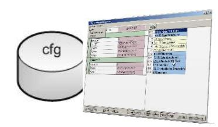

# **1.1 Overview**

The heOGS software mainly consists of two components:

- heOGS editor ("heOpCfg"): Application to create and manage workflows. The heOpCfg application is a standard Windows GUI application and needs mouse & keyboard to be used.
- heOGS runtime ("heOpMon"): Application running on an operator's workstation in the production line to visualize processes and control tools connected to the workstation. The heOpMon application is optimized for use on a touch screen in full-screen mode and normally does not use mouse & keyboard. It tries to minimize interactions and focuses on a highly visible GUI, which can even be read from a distance.

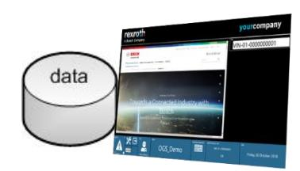

Both components use their own database file to store information:

- heOpCfg editor data file ("cfg"): stores all information about configured workflows (such as job pictures, workflow variants, tasks and action definitions and operations links to tools) for a single or even for multiple operator workstations. This data file only stores the "current" workflow definitions, no historic data and no historic workflows.
- heOpMon runtime data file ("data"): stores all information about a single stations workflows and historic workflow result data. As this data file keeps workflow result data, it allows accessing previously worked on parts and their state for "pick up where you left" processes. To make this work, even if the workflow configuration has changed in between, the data file also keeps historic workflow definitions.

Note that only heOpMon requires a license to run, heOpCfg can installed on any number of additional PC's without requiring a license.

# **1.2 Scenarios**

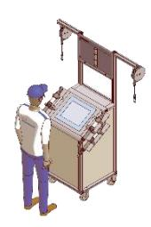

As the heOGS software is split into two applications, one can implement multiple operation scenarios by choosing where to install the software, where to keep the data files and how to move data between the heOpCfg editor and the heOpMon runtime.

# 2 Installation and Configuration

# **2.1 Requirements**

The software is supported under any current Windows version (>= Windows 10, 64bit).

# **2.2 Installing the software**

The heOGS editor (heOpCfg) is installed as component of the standard heOGS installer (or can also be installed using the standalone installer – in this case even without admin privileges). The installer can be started by running the heOGS-V<version>-setup.exe.

After choosing the installation language and the target installation folder, the installer application asks for the components to be installed. To only install the heOpCfg editor, select "Configurator & Firebird 4.0 (embedded)) as follows:

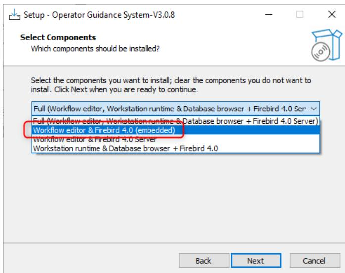

Hit "Next" until the software is finally installed.

By default, the software is installed into "C:\Program Files (x86)\Haller+Erne GmbH\OGS 3.0" and can be found in the start menu under "Operator Guidance System".

# 3 Quick Start

This section describes how to use the heOGS editor using the provided demo configuration. It shows basic operations and typical procedures for creating and modifying workflows. The following chapter [4](#page-17-0) then has a complete reference on how to use the software and all its functions.

# **3.1 Starting the software**

Start the editor by selecting Start → Operator Guidance System → Workflow Editor. This will then show the main editor screen (without a configuration file loaded):

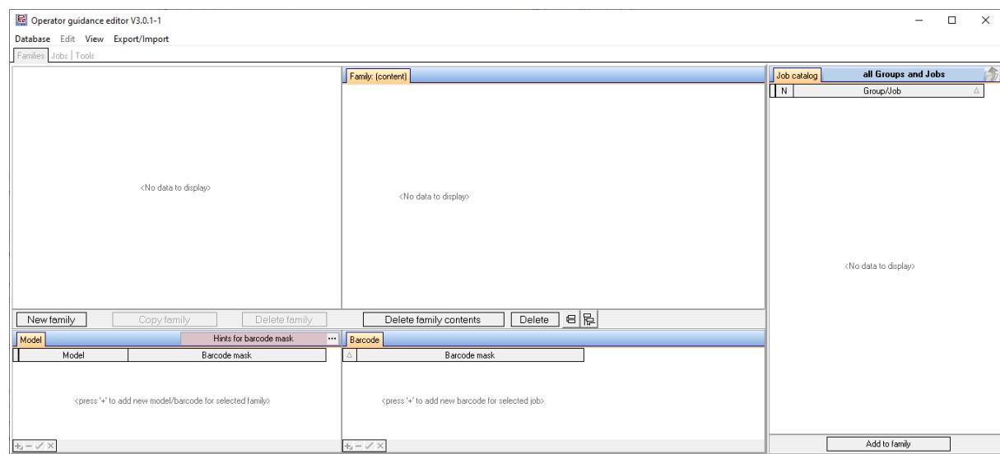

To open the demo database, use the Database → Open… menu and select the configuration data file (demo.fdc, by default located in C:\OGS-Projects\Demo). Note that the editor records recently opened files and makes them available in the Database → Reopen menu, so you can quickly access a previously used file. After opening a file, the editor activates the "Families" tab, which shows a list of all configured workflows:

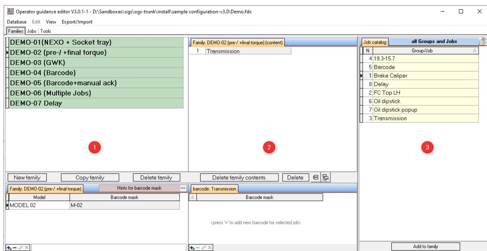

This view is separated in three columns (for more details, see chapte[r 3.4](#page-12-0) below and the reference in chapter [4.2\)](#page-18-0):

- : Shows the list of configured models ("Families"). You can add/delete models or change associated barcodes here.

- : Shows the list of jobs (screens) defined for the selected model (selected in ). You can add, delete and reorder the jobs for the current workflow here. Barcodes can be assigned to the jobs here as well (e.g. to select a job by barcode). Note that the barcodes entered here are per-model, so identical jobs can actually use different barcodes for each model). By double clicking a job, you can directly open the job editor (see chapte[r 3.3](#page-7-0) and the reference chapter [4.2.5\)](#page-28-0).
- : Shows the job catalog. This pane lists all jobs currently known to the system. Note that this behaves similar to the windows file browser, i.e. you can open a job group ("subfolder") by double clicking and also going up one level using the icon (grayed out on the top level "all Groups and Jobs").

The tab "Jobs" mainly provides a view into the job catalog with additional features to create, edit and manage jobs (see chapter [3.3](#page-7-0) and the reference chapter [4.2.3\)](#page-21-0).

The tab "Tools" manages the tools (see chapter [3.2](#page-6-0) and chapter [4.2.4](#page-26-0) for reference).

# **3.2 Manage tools**

Usually the first step to create process descriptions is to define the used tools. To do so, select the tab "Tools". The display will change to the following:

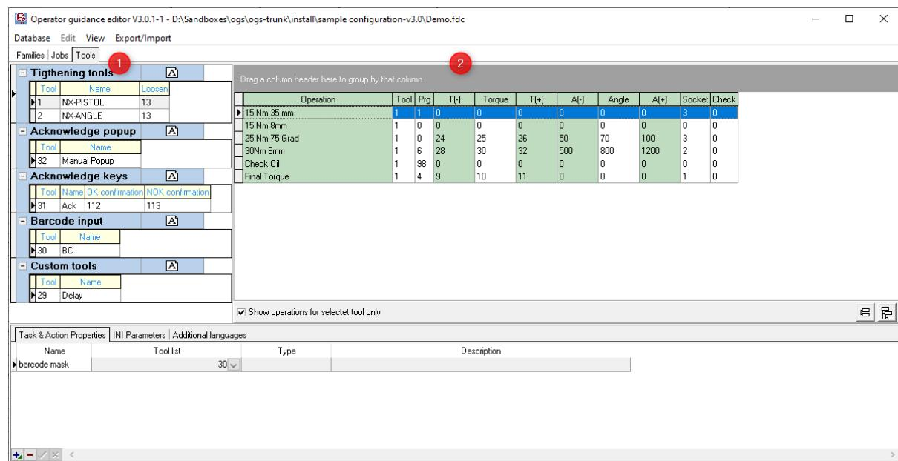

On the left side () you will see the tools grouped by functionality. Note that tools are only referred by their tool number, which allows (at least to some extent) mapping a "logical" tool defined in the workflow configuration to a "physical" tool on the workstation. On the right side (), you can see a list of known operations defined for the tool – note that this might be shown differently depending on the type of the tool. The bottom pane shows custom tool properties (see chapter [4.2.4\)](#page-26-0) for more details.

You can now start e.g. by adding a new "Tightening" tool. To do so, right-click into the area inside the "Tightening tools" group, then select "New tool" from the context menu. This will add a line inside the tool group and automatically assign the next unused tool number (you can change this of course). Depending on the tool type, you should now fill in the required parameters (commonly the tool name, for tightening tools the additional automatic loosen program number).

That's it for adding a new tool and making it available for use in workflows and jobs. You can of course also delete and edit tools here. Click through the already configured tools and note the list of operations in the righthand pane () – this quickly gives an overview of the already assigned operations for each tool. To get the full list, the checkbox "Show operations for selected tool only" can be unchecked to see all operations defined in the current database.

## **3.3 Edit jobs**

#### **3.3.1 Job catalog**

After checking the tools, let's switch to the "Jobs" tab. This tab shows the job catalog, i.e. the list of all jobs defined in the system. The tab shows an explorer like view () of the jobs (yellow header) and job groups (blue header) defined in the catalog. In the bottom pane () the properties of the currently selected job as well as some action buttons are shown:

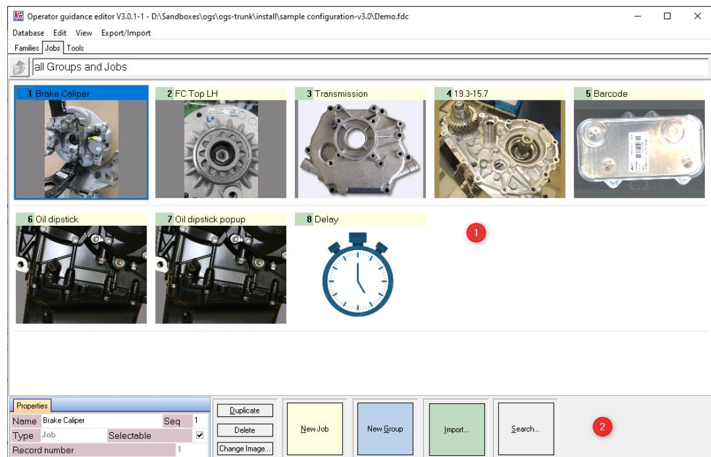

The job catalog allows managing jobs, e.g. organizing jobs into groups ("sub-folders"), copy & pasting, linking (re-use of linked job clones) and mass import of existing graphic files (menu item "Images"). See the job catalog reference in chapter [4.2.3](#page-21-0) for more details.

Key principles for defining and using jobs:

- Job names must be unique. To avoid confusion and to ease re-using jobs, the job name must be (per definition) unique. If you create a copy of a job, then usually a new name is assigned and the copy behaves as a completely independent copy of the original job. You can also create linked copies, which propagate changes, but these will have the same name.
- Each job is assigned a job picture (use a picture format of 4:3 to perfectly fill the screen on the operator's workstation). You can additionally assign URLs to the tasks later, so the operator screen will show related information from an html file or even dynamic data from your PDM or ERP system (3D views, pdf instruction sheets, …).
- Think about the number of jobs you define for a workflow and which tasks to assign to each job. As a job is usually shown as a picture on the operator's screen, you should logically group tasks such that the operator can clearly identify the tasks. Note also that a job is the key for re-usability of tasks over multiple models. Therefore, make sure to put reusable parts of your processes into separate jobs.

By double clicking a job in the job catalog, you can open the jobs editor (note that you can also open the job editor by double-clicking a job from the "Families" tab.

Let's create a new job by clicking the "new job" button in the lower pane of the job editor and enter a name in the popup. This will create a new job with the given name, but no picture assigned. Double click the newly created job to open the job editor (see next section for using the job editor).

NOTE: Instead of manually creating a job and entering its name, you can also use the image browser (see chapte[r 4.2.3.6\)](#page-24-0) from the sidebar to add a job from a list of images from the file system. You can then simply drag and drop an image file and a new job will be created with the image name and the image contents.

### **3.3.2 Job editor**

#### **3.3.2.1 Overview**

To open a job (either from the "Families" tab or the "jobs" tab) by double clicking the job image (or name). After opening the job editor, the window will look like the following:

The job editor consists of the following areas (for more details, see [4.2.5\)](#page-28-0):

- The picture view this will show the image of the job / part. Double-click to add tasks, right click to change the image. Click a task to select it (by clicking the circle representing the task). Note that creating a new task always also creates an associated action (in ).
- The list of tasks defined for this job. Can be used to select (click) and edit tasks.
- The task properties. Note that the task properties are related to the currently selected task.
- The operations defined/used in the currently edited job.
- The list of actions defined for the job. Note that this list defines the actual order of work which the operator need to step through when running the job. Use drag & drop to reorder actions and right-click to assign operations (from ). Note that each action is always associated to a single task but a task might have multiple actions (such as pre-tightening, final-tightening and check). Apart from this each action \*must\* be assigned to an operation, else you won't be able to save the job.
- Action properties for the selected action (in ). Allows adding an action description and set additional action related properties (depends on the assigned operation).

#### **3.3.2.2 Add tasks, operations and actions**

When adding a new job, the usual sequence of action is as follows:

- 1. Load a picture. To do so, right-click anywhere in the picture view () and choose an image.
- 2. Add tasks, usually by double clicking onto the spot on the picture where the task should be done (as a visual indication for the operator). Use <shift>-click or <ctrl>-click to resize the circles, click & drag to reposition the indicators. To change the names, edit in .
- 3. Choose or create operations (in ). To choose from existing operations, click the "new operation" button and click the ellipsis ("…") button left to the operation name, then choose the tool and the operation. To add a new, enter the name and other details and choose a too by clicking the ellipsis ("…") button below the operation name.
- 4. Finally, map the actions (in ) to one of the previously defined operations. This actually defines which tool and parameters (i.e. the "process") shall be used for a given task. To do so, right click an action (or <shift>-click or <ctrl>-click to select a range of actions) and right click – then choose "add operation" from the context menu and select the correct operation.

To follow the steps above, here is the result after step 1: loaded a picture:

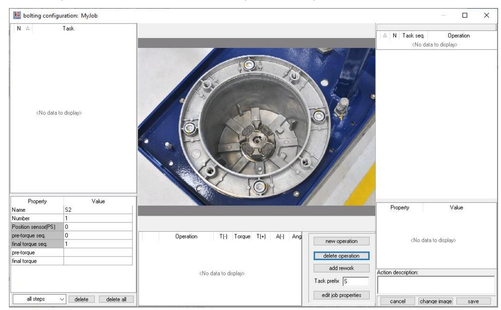

In step 2, the tasks are added by double clicking onto the bolts visible in the picture (automatically creating S1 – S4). Another task was added at the bottom right to make a manual action indication (S5, but renamed to T1 on the task list ):

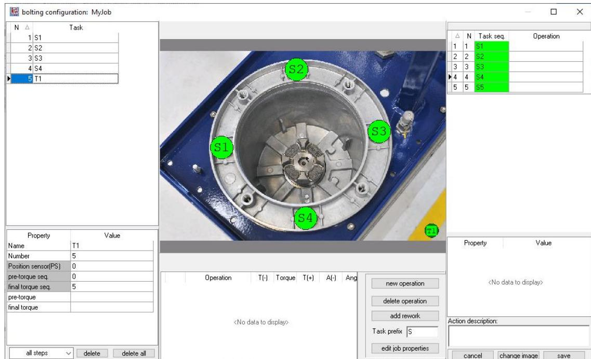

In step 3 (add/create operation in ), an already existing operation was chosen as follows: first click the "new operation" button – this adds the new "Operation 1" without any other parameters (of type process, but without any assigned tool):

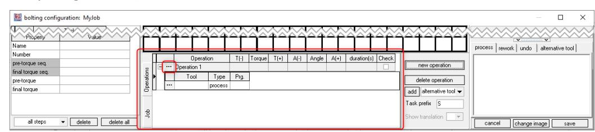

By clicking the ellipsis button left to the "Operation 1" name, the operation selection window was opened and the "NX-Pistol" tool with the "15 Nm 8mm" operation selected:

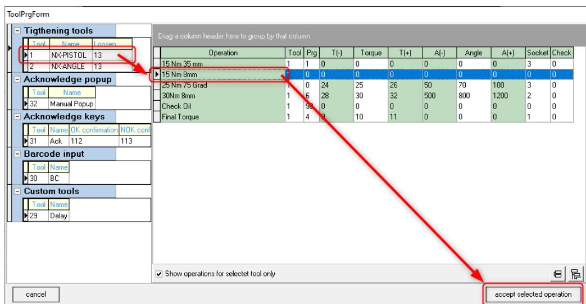

This then yields in the operation "15 Nm 8mm" added correctly. This step is repeated to add another operation, this time using the "Ack" tool with the "Manual Op" operation, so that now two operations are available:

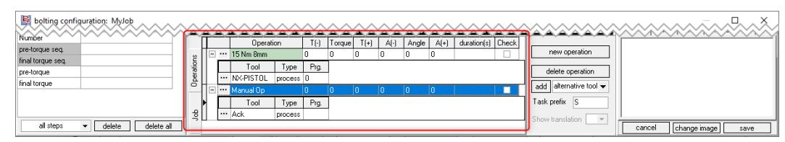

In step 4 these operations are now assigned to the actions by right-clicking the actions and selecting from the context menu:

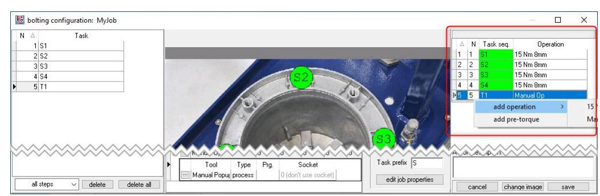

To give the operator more descriptive information, the action text description should be given for all actions which need a bit more information (especially the manual operations):

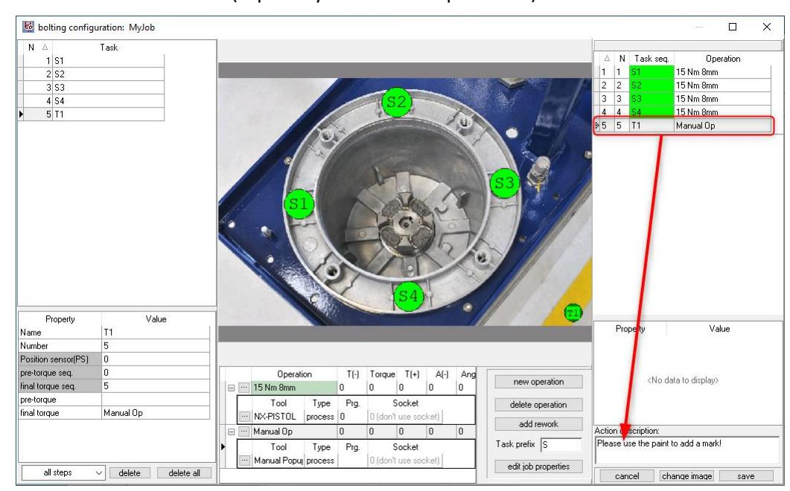

Finally hit the "save" button to return to the job catalog. Note that the previously created job "My Job" now also shows an updated thumbnail:

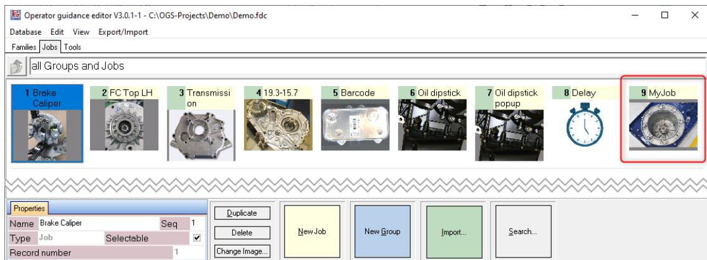

# **3.4 Edit workflows**

After the jobs are defined, the next (final) step is to setup the workflows. A workflow is a sequence of jobs for a specific product variant built in the station identified by one or more barcodes. Note that multiple product models can share the same workflow in a given station – as long as the same work steps (jobs) are done in the station (product family), a single workflow can be used (shared between different models – minimize the number of configuration) even if each model uses a different barcode (see chapter [3.5](#page-13-0) below for more information about the barcode processing).

To create/edit workflows, select the tab "Families" (see also chapte[r 3.1](#page-5-1) for an overview and chapte[r 4.2.2](#page-19-0) for the reference):

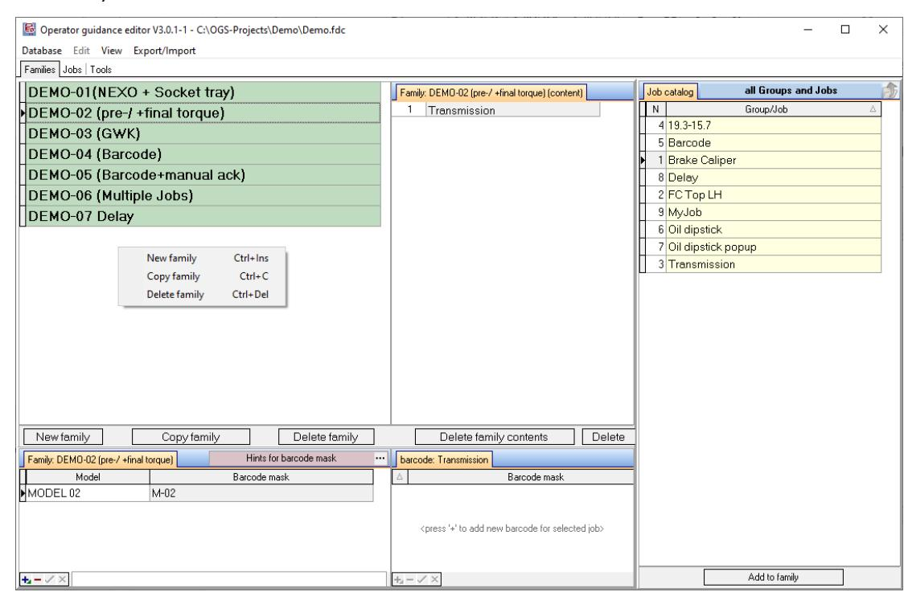

To create a new family right-click in the blank space in the left pane and select "new family" from the context menu (or use the keyboard and type <ctrl>-<ins>) – this will create a new entry named "new family 6" in the list of families.

You can click the title and edit the name (change to e.g. "Demo-08 (My Workflow)":

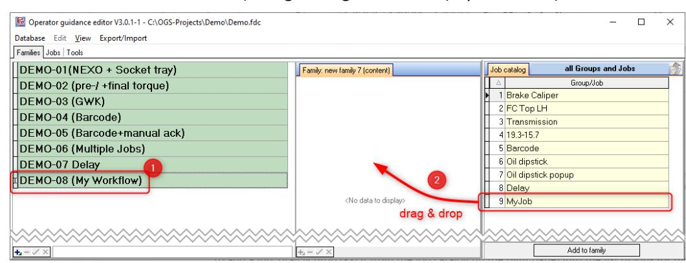

With the newly added workflow selected (), the middle pane will show the (empty) list of associated jobs. To add a job, drag & drop () it from the job catalog (in the right pane) into the list of jobs for the workflow (into the middle pane). Let's add the previously created "My Job" and two or three others. To change the order of jobs, click and drag:

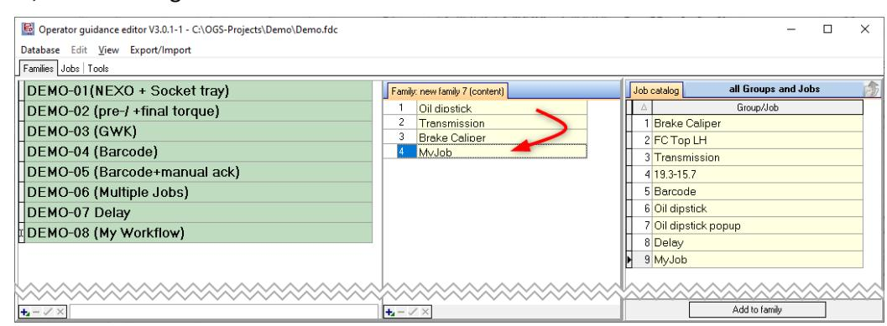

Now the new workflow is set up – to actually start it at the operator station (through heOpMon), barcodes must be assigned (see next chapter).

# **3.5 Barcodes**

Barcodes are used at various places in heOGS, e.g.:

- Select a workflow (detailed below).
- Uniquely identify a part (for traceability, rework and continue where you left)
- Jump between jobs in a workflow (select job)
- Validate and record barcodes of mounted parts during the process

Note that the term "barcode" is used as a generic term for any incoming identification data – whether it is actually a 1D- or 2D-barcode read from a barcode reader, some identification sent from another system (SignalR, MQTT, …), read from an RFID reader or entered manually (through the keyboard or the onscreen touch keyboard). Note that each source might even be processed differently, e.g. scan a single barcode, but have two fields on-screen for showing/entering the barcodes manually.

Starting a workflow on the operator station (through heOpMon) always requires reading one or more barcode(s) as a first step. The heOpMon software then decodes this information and mainly extracts the following:

- Workflow identifier ("<type>"). In the demo setup this is a 4-digit code.
- Part serial number ("<serial>"). In the demo setup this is a 3-digit code.

By default, the software concatenates these (as <type><serial>) and uses the combined string to lookup workflow in the configuration. The demo setup only uses the <type> code though.

The barcodes for a workflow are defined in the bottom left pane (see screenshot below). For each workflow, a list of models and an associated barcode mask can be added (by clicking the small "+" sign or by using the right-click context menu):

The model column value is used as a description, the barcode mask is used to match a scanned barcode to find the associated workflow. By default, the barcode mask is matched character by character with the special characters '?' (as a wildcard matching any character) and '\_' (as a wildcard ignoring any character).

As described above, the demo setup uses a 4-digit <type> code and a 3-digit <serial> code, where only <type> is used for a match, so the following barcodes will match:

| <type> | <serial> | Match?                                                                   |
|--------|----------|--------------------------------------------------------------------------|
| M-01   | 000      | Matches barcode mask “M 01” → “MODEL 01”                                 |
| M-01   | 001      | Matches barcode mask “M 01” → “MODEL 01”                                 |
| M-0    | 0001     | Will not match, as <type> is required to be 4-digits long and <serial> 3 |
| F-01   | XYZ      | Matches barcode mask “F 01” → “M ODEL 01F”                               |
| ABCD   | 123      | No match found in any workflows                                          |
| XX01   | 000      | Matches barcode mask “XX??” → “MODEL XX”                                 |
| XX02   | 123      | Matches barcode mask “XX??” → “MODEL XX”                                 |

Note that the system can be configured to not only match with fixed length codes, it is also possible to use separator chars or have complex processing (done through LUA programming scripts).

For now, select the newly added workflow "DEMO-08" and add a barcode mask to match the <type> "M-08" (by convention the "DEMO-xy" workflow uses a "M-xy" match mask in the demo) – "M-08???". Use the small + button () to add a new barcode and enter the following:

## **3.6 Transfer workflows to the runtime**

To use the configured workflows (jobs, tasks & actions) on the operator's workstation, the configuration needs to be saved and transferred to the heOpMon runtime. Please see chapter [1.1](#page-3-1) to get an overview of the files involved.

For the demo setup (where everything is installed on the same PC), do the following:

- 1. Save the workflow configuration: Use the heOpCfg main menu Database → Save changes to save any changes to the currently opened configuration database ("cfg"). This will then automatically enable the "Export changes (local)" main menu item.
- 2. Click the heOpCfg "Export changes (local)" main menu item. This will run the heOpImp application (see chapter [5.3\)](#page-42-1), which transfers workflow information from the "cfg" database file into the stations "data" database file. After the application has started, it will immediately prompt for the target "station.fds" database file ("data"). By default, this is also located in the "custom folder" of the demo installation:

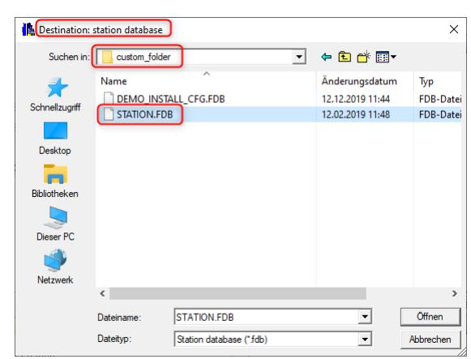

- 3. After clicking "Open", the workflows are transferred. If everything worked as expected, then the following message will be displayed:

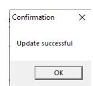

You might eventually see the following:

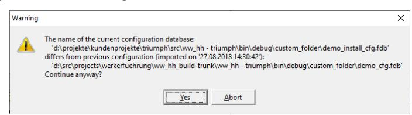

The configuration database "cfg" keeps track of the associated station "data" file – if the folder changes where the files have been previously been stored, the message is shown to make the user aware of this – and to allow him to double check if he is writing to the correct file.

The workflow configuration "cfg" is now correctly transferred to the station configuration file "data". If the heOpMon runtime is started, it will then pick up the new configuration.

Some more notes/hints:

- You can always see which configuration database file ("cfg") you are currently editing in heOpCfg by looking at the window caption of heOpCfg.
- As only a single file is used for the "cfg" file, you can use Windows Explorer to copy/move the file. This is pretty handy for versioning changes or making backups.

- As a best practice when configuring multiple stations, copy the changed "cfg" file to the target work station, then run the heOpImp transfer process there. As the "data" file on the target work station does not only contain the workflow definitions but also historic work/operation result data, this ensures that the import process always uses the most recent station "data" file.

# 4 Reference

# **4.1 Terms**

The main terms in heOGS are:

- Workflow: defines the full information about how to manufacture something in a station. A workflow consists of a series of jobs. Note that workflow specific properties can be added to a job such that a job can be reused in different workflows (e.g. barcodes to select a job). Typically, there is a workflow for each product model manufactured in the station.
- Job: defines a (reusable) set of tasks and actions with an attached job image (usually a specific view on the part). A job usually maps to a classic sheet of paper of a work plan and is intended to provide the operator easy to follow step-by-step instructions (graphically and textually). For better manageability, jobs can be organized hierarchically (grouped) in the job editor and reused (as liked clones or as independent copies). In the operator screen, the sequence of jobs is always flattened, i.e. the operator screen shows a linear list of sequenced jobs.
- Task: A task defines: o a graphical indication on where on the part (on the job picture) some work needs to be done o a set of actions (see below) related to this task

For most processes, a task equals maps 1:1 to an action. However, there are cases where multiple actions are needed to finish a task. E. g. for tightening, there might be a pre-tightening step and a final-tightening step – both are worked on the same physical bolt on the part and are related (e.g. task/bolt ok is only true, if both are ok). Therefore, both are mapped to a single task (and visually indicated by a single object on the job picture).

- Action: defines a single piece of work done by the operator. Actions include a description shown to the operator about what needs to be done. The action is always connected to a tool (and specific parameters, e.g. barcode scanner + barcode validity mask or tightening tool + parameter set + socket). This is indirectly done by assigning an operation (see below) to the action and therefore allows minimizing the amount of configuration work for multiple actions with the same tool/parameters (e.g. multiple bolts tightened with the same torque/pset).
- Action type (step type): Used with multiple actions assigned to a task available are pre-, final- and after-action types. Usually only the final action type is used, for tightening pre-tightening and aftertightening (e.g. a check done with a wrench after the final tightening of an DC-tool)
- Tool: defines a tool. Tools can be physical tools (like tightening tools, electronic wrenches, …), virtual tools (like on-screen message/acknowledge) or custom tools (implemented through LUA scripting). Tools are identified through their tool number (sometimes also referred as channel number). Note that theoretically (within limits) tools defined in the workflow can be replaced by different tools in the actual work station (the tool connection parameters are not defined in the heOpCfg, but in the station runtimes station.ini).
- Operation: defines a (reusable) kind of work done with a tool and an associated set of parameters. E.g. for tightening, an operation defines the tool to use, a parameter set and eventually the socket. The operation name is displayed in the operator screen and should indicate the type of work – e.g. "8Nm+30° M6". The operations defined for a tool are tracked by the heOpCfg editor and can easily be reused – to minimize the number of parameter sets and variants on the tool side and to minimize the amount of configuration in the workflow editor.

# **4.2 Editor User Interface**

### **4.2.1 Overview**

The user interface consists of the following main areas:

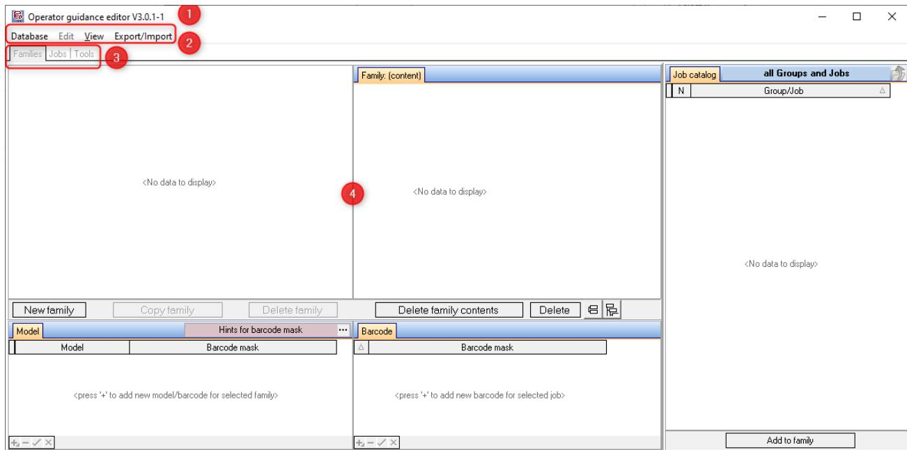

- Windows title bar. Shows the application name and version and also the path to the currently edited configuration file.
- Main menu. The application main menu depends on the currently active tab the following menu items are available: o Database: Allows opening and saving configuration database files. The database menu also keeps a list of previously opened files to quickly reopen a recent configuration. o Export changes (local): A shortcut to export data configuration to a station database file (see [3.6\)](#page-15-0). Note that this menu item is only enabled, if Database → Save changes was executed previously. o Distribute jobs: Allows pushing jobs from the currently open configuration into another configuration database file. This allows e.g. rebalancing jobs. See chapter **Error! Reference source not found.** for more details. o Images (only visible for tab "Jobs"): Opens the image browser sidebar to allow quickly adding new jobs by dragging & dropping from an explorer like filesystem view of image files. See [4.2.3](#page-21-0) for more information. o Repository (only visible for tab "Jobs"): Opens the repository sidebar for managing cut & past (or move) operations in the job catalog. See [4.2.3](#page-21-0) for more information.
- Tabs: Selects one of the main views. Available are: o Families: To manage and edit workflows (se[e 4.2.2\)](#page-19-0) o Jobs: To manage and edit jobs (se[e 4.2.3\)](#page-21-0) o Tools: To manage and edit tools (se[e 4.2.4\)](#page-26-0)
- Tab content pane. The information shown here depends on the currently selected tab (). See below for more info.

## **4.2.2 Tab Families**

#### **4.2.2.1 Overview**

The tab "Families" consists of three panes as follows:

- Families pane: The upper view shows a list of workflows, the lower view shows a list of barcodes defined for the currently selected workflow.
- Workflow sequence pane: the upper view shows a list of jobs assigned to the currently selected workflow in (note that the name of the currently selected workflow is shown in the header). The lower view shows a list of barcodes defined for the currently selected job.
- Job catalog pane: This pane lists all jobs defined in the current database file.

#### **4.2.2.2 Families pane**

The "Families" pane () shows a list of workflows in the upper view. The lower view shows a list of barcodes defined for the currently selected workflow.

The following operations are possible in the list of workflows (upper view):

- Selecting a workflow. By clicking in the list of workflows, a workflow gets selected. The selected workflow is indicated by a small triangle left to the workflow name. Changing the selected workflow updates the list of associated barcodes (lower view of the "Families" pane ) and the workflow pane ()
- Changing a workflow name: Workflow names can be "inline" edited by clicking the workflow name and typing using the keyboard.
- New family (workflow): A new workflow can be added by clicking the "new family" button, selecting the function from the right-click context menu or by hitting the <ctrl><ins> key.
- Delete family (workflow): A workflow can be deleted by clicking the "delete family" button, selecting the function from the right-click context menu or by hitting the <ctrl><del> key.
- Copy family (workflow): A workflow can be copied by clicking the "copy family" button, selecting the function from the right-click context menu or by hitting the <ctrl><c> key.

The following operations are possible in the list of workflow barcodes (lower view):

- Adding a new model/barcode: A new barcode can be added by clicking the small button in the bottom bar or by selecting the function from the right-click context menu.
- Deleting a model/barcode: A barcode can be deleted by clicking the small button in the bottom bar or by selecting the function from the right-click context menu.
- Show the barcode mask hint by clicking the ellipsis button next to the top right corner.
- Change the model/barcode name by clicking the name and editing it "inline"
- Change the barcode mask by clicking the text and editing inline. See chapte[r 3.5](#page-13-0) for more information about the barcode matching and editing.
- Search for a family by entering a barcode into the search bar (bottom right edit box) note that this requires a global parameter to enable the search box (see [4.4.2\)](#page-37-2).

#### **4.2.2.3 Workflow sequence pane**

The "Workflow sequence" pane () shows a list of jobs assigned to the currently selected workflow. The lower view shows a list of barcodes defined for the selected job.

Note that the list shows jobs and groups of jobs (jobs are shown with yellow background color, groups are shown with blue background color). The list actually shows two columns, where the first column is the sequence number, the second the job/group name.

The upper view shows the following information and allows the following actions:

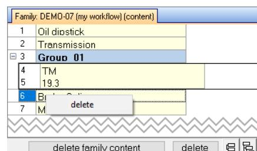

- The caption shows the name of the currently selected workflow (from the "Families" pane in )
- Adding jobs to the workflow from the job catalog (by dragging & dropping, se[e 4.2.2.4](#page-21-1) below)
- Delete all jobs from the workflow by clicking the "delete family content"
- Remove a single job from the workflow by clicking the "delete" button or selecting "delete" from the right-click context menu
- Reorder the jobs/job groups by dragging & dropping using the mouse
- Open/Close groups of jobs by clicking the +/- sign next to the group. To close all/open all, the buttons may be used.
- Select the current job/group by clicking a row. This will then show the associated barcodes in the lower view.
- Double-click a row to open the job editor (if double clicking a job row) or toggling the collapsed / expanded state of a group (if double clicking a group row)

The lower view shows the associated barcodes of the currently selected job and allows editing it (similar to the workflow barcodes, see [4.2.2.2\)](#page-19-1). Note that the job barcodes do not have a name, there is only a list of barcode masks (same wildcard characters allowed as with the workflow barcodes).

The job barcodes are stored in the context of the workflow, so (re)using the same jobs for different workflows is possible, even if each workflow uses different barcodes for the same job.

NOTE: The typical use case is to select a job by scanning an associated barcode. This allows having the operator select the job sequence instead of the (default) sequential order.

#### **4.2.2.4 Job catalog pane**

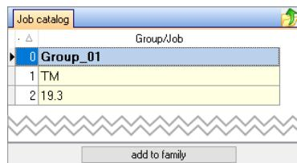

The job catalog pane () lists all jobs and job groups defined in the current database file in a Windows Explorer like list. Job groups can be thought of as "folders" (shown with blue background color), jobs as "files" (shown in yellow background color).

The job catalog is used to pick the jobs for a workflow. With the current workflow selected, a job can be inserted into the current workflow by clicking the "add to family" button or by clicking & dragging an entry with the mouse from the job catalog pane () into the workflow sequence pane ().

To navigate in the job catalog, the following operations are available:

- Double clicking a job group ("folder") drills down into the group and lists the group contents. Note that the first row always shows the "current" job group name – at the root level, this is "all Groups and Jobs".
- To go back one level, click the up arrow ( ) in the top-right corner. On the root-level, the button is grayed out.

## **4.2.3 Tab Jobs**

#### **4.2.3.1 Overview**

The tab "Jobs" shows the job catalog editor. It allows managing all jobs defined in the system. The tab shows the following sections:

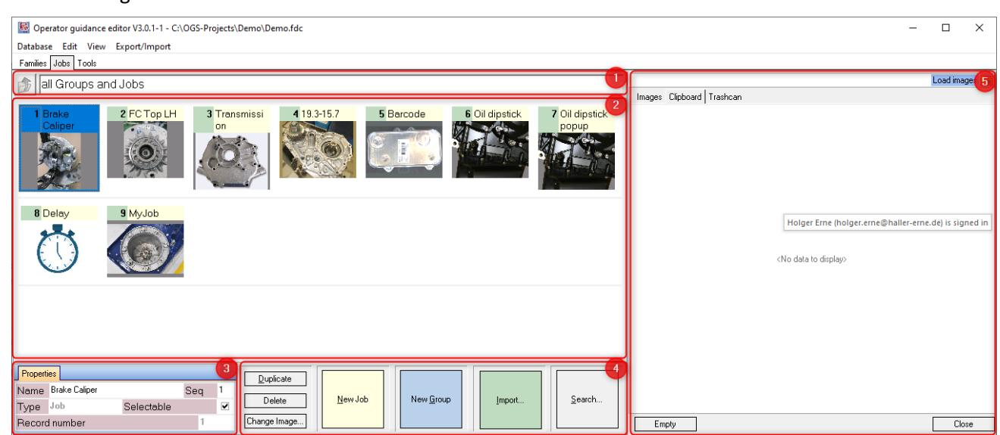

- Navigator: Shows the current group name ("folder") and the up arrow ( ) to go up one level (grayed out if the current level is the root level (named "all groups and Jobs)).
- Job list: shows the jobs at the current folder (group) level. Each job is listed with a thumbnail view of the job picture, a header with the job name and the item sequence number. Jobs are shown with yellow background color, groups with blue background color. NOTE: The sequence number defines the job order, if a group is added to a workflow.
- Item properties: Shows the properties of the currently selected item and allows editing them.
- Actions panel: provides buttons with commonly used operations as well as access to the clipboard (see als[o 4.2.3.2](#page-22-0) for information on copying, moving and linking jobs).
- Sidebar with image browser and repository browser (see [4.2.3.6\)](#page-24-0)

Please see also chapter [3.3](#page-7-0) and [3.3.1](#page-7-1) for general information about jobs and the job catalog.

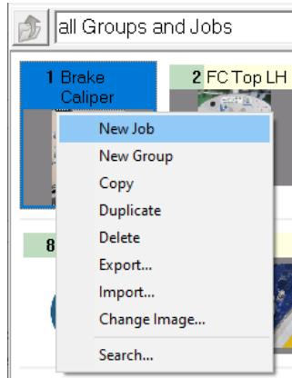

Functions available in this view are:

- Edit a job in the job editor by double-clicking a job in the list (see [3.3](#page-7-0) and [4.2.5\)](#page-28-0).
- Navigate the job/group hierarchy by double clicking a group (to drill down) or by clicking the up arrow ( ) to go up one level.
- Change a job/group name by clicking the item tile and "inline" editing the text or by changing the name property of the currently selected item in the item properties panel ().
- Reorder the items by dragging & dropping an item inside the list.
- Changing the preview size by clicking and dragging the separator between two items.
- Copy a job/group to the clipboard by selecting the function from the right-click context menu. This allows copying/moving or linking jobs, see [4.2.3.2.](#page-22-0)
- Copy a job by clicking the "copy" button from the actions panel () or by selecting the function from the right-click context menu. Note that this then directly asks for a new job name, as this executes a full copy for creating an independent clone.
- Change the picture for a job/group by clicking the "change image" button from the actions panel () or by selecting the function from the right-click context menu
- Cut (delete) a job or a group by clicking the "cut" button from the actions panel () or by selecting the function from the right-click context menu. Note that this directly deletes the item without further notice.
- Create a new (blank) job by clicking the "new job" button from the actions panel () or by dragging and dropping a picture file from the image browser (tab "Images" on the sidebar ()).
- Create a new (blank) group by clicking the "new group" button from the actions panel ()
- Inserting a previously copied item from the clipboard as an independent copy or as a linked clone by clicking the ellipsis button next to the clipboard edit field in the actions panel (, se[e 4.2.3.2\)](#page-22-0).

#### **4.2.3.2 Copying and linking jobs**

Jobs can easily be reused in different workflows (see [3.4](#page-12-0) an[d 4.2.2\)](#page-19-0). However, sometimes it is convenient to copy a job definition to create a new job based on an old one (e.g. for a modified part) or to reuse a job in different groups by linking to a job from multiple places (for complex applications). So basically, there are two operations:

- Copying a job: this creates a copy of an existing job which is identical to the original job (except it has a different name) but has no dependencies to the original job.
- Creating a reference to a job (creating a linked clone): this creates a job reference with the exact same name in another job group. At first glance, the copy looks as if it is a simple copy, but when changing parameters, all other instances of this job will have their parameters changed as well.

NOTE: As described in chapte[r 3.3](#page-7-0) ("Key principles for defining and using jobs"), a job name is unique in the system. Therefore, creating a job reference simply adds the same job name into the job catalog hierarchy. Creating a job copy requires creating a new name which then is an independent copy.

To quickly copy a job, do the following:

- 1. Select the source job to be copied. Click the "Duplicate" button from the actions panel () or selecting the "Duplicate" function from the right-click context menu (or the Edit main menu).
- 2. Enter a new name into the popup windows and hit the "accept" button

To create a reference (a linked clone) or a copy at another location in the job catalog, do the following:

- 1. Select the source job to be copied and click the right mouse button to open the context menu. Select the "Copy" function. Note that now the clipboard shows the name of the job:

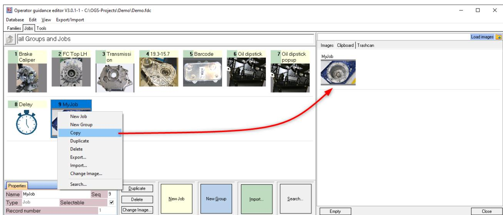

- 2. Navigate to the place where you want to add the copy or where you want to add a reference. Then right-click the job in the clipboard and choose the operation ("move" or "copy"):

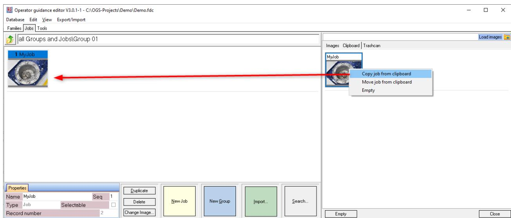

If "move" was selected, then the job will automatically be removed from the Clipboard.

#### **4.2.3.3 Moving jobs**

There is no direct "move job" command. To move a job to another location in the job catalog, create a job reference (linked clone) of the job (copy to clipboard or delete and move to trashcan) and delete the source (see [4.2.3.2](#page-22-0) above).

#### **4.2.3.4 Copying, moving and linking groups**

Groups can be copied in the same way as jobs (right-click and select "copy" or "copy to clipboard" and use the clipboard to insert into another location). However, as groups usually contain more than one job, a simple rename is not sufficient, so the system will show the copy dialog as follows:

This allows then to select on a per job base to decide from the following:

Note that there is (like with the jobs) no "move" operation. Use "reference" at the target and delete the source afterwards.

#### **4.2.3.5 Deleting groups / Trashcan**

The repository sidebar (tab "Trashcan" in the sidebar ) handles a special case when deleting groups ("cut" action executed on groups): to prevent orphaned jobs, only reference links to jobs are deleted by default. All "full" jobs are moved to the trashcan instead.

The deleted (orphaned) jobs can then be restored by dragging and dropping them from the trashcan back into the job catalog:

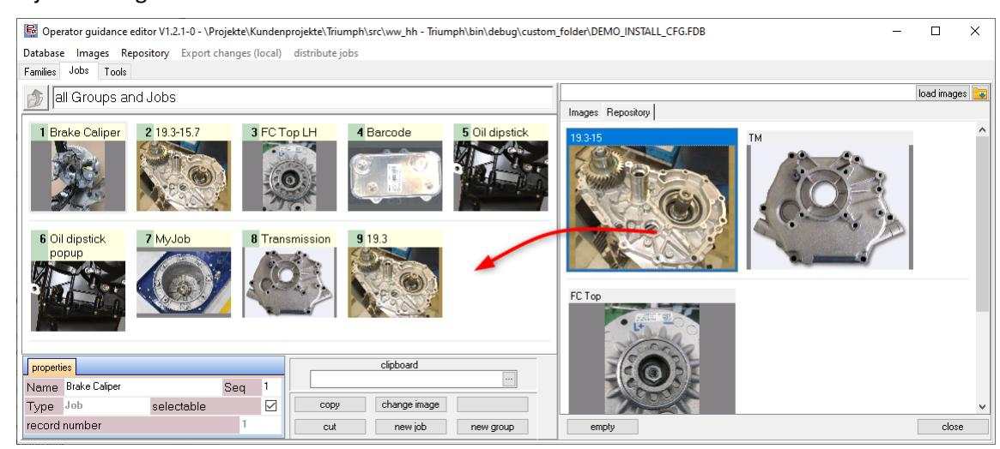

#### **4.2.3.6 Image browser**

The image browser sidebar (tab "Images" in the sidebar) allows to quickly create a large number of jobs by dragging and dropping job images from a folder with images on the disk.

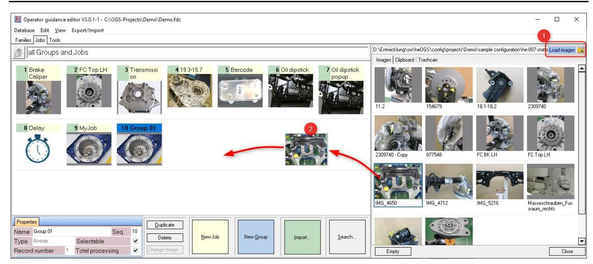

To do so, select the "Images" menu item to open the image browser sidebar and click the "load images" () button. In the directory chooser dialog, select the folder which contain the part images (note that for best results, use 4:3 picture format). After closing the dialog, the sidebar will load all image files found in the folder. Now you can drag & drop an image file () into the catalog.

#### NOTES:

- The size of the preview images can be changed by dragging the white space separator between the images.
- The newly created job automatically gets named after the dragged file.

### **4.2.3.7 Additional notes**

Job and group pictures:

- Automatically generated substitute images: o Newly created jobs and groups are assigned a default image o If there is no image assigned to a group, an image will be created by collecting the contained job pictures and assembling them into a group picture
- Pictures can also be (pdf) document screenshots, CAD drawings, …

#### Job property "selectable":

- All groups and components that are marked as "selectable" are later available in the heOpMon workstation runtime. All unchecked groups and jobs will not be available.

Group property "total processing":

- The contents of all groups marked for "total processing" will later be available to the heOpMon workstation runtime. All unchecked are also available, but their contents cannot be reached.

## **4.2.4 Tab Tools**

#### **4.2.4.1 Overview**

The tab "Tools" shows the tool editor and the list of operations. It allows managing all tools defined in the system. The tab shows the following sections:

- Tools list: Shows the list of tools grouped by tool category. Allows adding new tools and modifying tool parameters.
- Operation list: Shows the list of operations defined for a tool (if "Show operations for selected tool only" is checked) or for all tools (if the checkbox is unchecked) of the same category. Allows getting an overview of the configured operations – especially helpful to find duplicate program definitions or for creating a list used to configure the physical tools on the workstation.
- Parameter definition: Allows adding custom parameters on the tool, the task and the action level. The system comes with a few predefined properties for the builtin tool drivers, but can be extended, so that custom tool drivers can also be configured through the GUI (e.g. LUA custom tools).

#### NOTES:

- The tool number is used to match the logical tool (as used in the configuration) with the actual (physical) tool in the workstation. If carefully implemented, this allows (up to some limits) rebalancing work between stations in a line by moving jobs between stations (without having to reconfigure job tasks and actions!)
- The operation list is a handy view for configuring the physical tool at the workstation (and the socket tray).

#### **4.2.4.2 Adding and configuring tools**

The tool list () allows adding, deleting and modifying tools. The following actions are available:

- Add tool: The right-click context menu allows adding a new tool to the current tool category. By default, the newly added row assigns the next unused tool number – but this can be changed manually (use the dropdown in the first column to change it). Note that the tool number is not required to be sequential. As a best practice you should come up with a systematic numbering scheme for the tools. This is especially useful if configuring multiple station (for rebalancing stations, i.e. moving jobs between stations). You can e. g. assign tool #1 to the barcode reader, then reserve tools #2-#5 to the standard

tools (i.e. reserve 4 tools CS351/Nexo) and assign the integrated tools (Key input, by hand) to tool #31 and #31. This leaves room for hardware variants at the station level, but also enables rebalancing.

- Delete tool: Use the right-click context menu to delete a tool. Notes: o You cannot delete a tool which is currently used – the system will show a warning in this case. o You can check, if the tool is currently used by looking at the operation list () – this shows all currently assigned operations for a tool.
- Edit tool name: Change the name of a tool by clicking into the name field (inline edit) and type the new name. Note that the name for display purposes only, changing a tool name has no side-effects.
- Change tool parameters: depending on the tool category, the underlying tool driver provides additional parameters (see screenshot, e.g. CS351+Nexo ask for a "loosen" program number).

Currently the following additional parameters (tool number and tool name are required for all tools) are available for the built-in tool categories:

| Tool        | Parameter | Description                                        |
|-------------|-----------|----------------------------------------------------|
| Nexo+Sys350 | Loosen    | Program number used for automatic loosen after NOK |
| Key input   | OK        |                                                    |

More custom properties exist on the task and action level and custom tools can also add their own properties (see [4.2.4.3](#page-27-0) below)

NOTE: The heOpMon configuration allows tool alias definitions. This can be used to map multiple logical tools (from the heOpCfg configuration) to a single physical tool.

#### **4.2.4.3 Using the operation list**

The operation list () provides a list of all configured operations. Depending on the state of the checkbox "Show operations for selected tool only", either only the operations for the currently selected tool or all operations are shown.

#### NOTES:

- The grid used to show the operations allows grouping by dragging & dropping a header cell to the "Drag a column header here to group by that column" area.
- The operation list is a handy view for configuring the physical tool at the workstation (and the socket tray).
- For tools not using program numbers to select parameter sets (like GWK torque wrenches), the operation list shows a program number program name mapping. The parameters are then stored in the station.ini configuration file of the heOpMon workstation runtime.

#### **4.2.4.4 Tool, Task & Action Properties**

The parameter definition pane () allows managing properties for tools, tasks and actions. The heOpCfg and heOpMon employ a flexible property system to allow editing parameters through the GUI, even for custom defined tools. In combination with the LUA scripting in the heOpMon workstation runtime, this enables integrating a nearly unlimited range of custom tools including easy to use parameter access through the heOpCfg GUI editor.

## **4.2.5 Job Editor**

The job editor allows editing tasks & actions for a job. The job editor can be opened by double clicking a job in the job catalog or in the workflow (se[e 4.2.2](#page-19-0) and [4.2.3\)](#page-21-0). See chapter [3.3.2.2](#page-9-0) for a step-by-step guide on how the job editor is best used to quickly define processes.

The editor displays as a popup dialog and shows the following sections:

- Window caption: Shows the name of the current job.
- List of tasks. Each task is represented by a graphical object in the image (). Clicking an entry in the list selects the task (which in turn updates the task properties and highlights the task in the image). Dragging and dropping allows reordering tasks, clicking inside the second column allows inline editing of the task name.
- Task properties: This pane shows all properties of the selected task. Non-greyed properties can be inline edited in the value column. Depending on the configuration (heOpCfg.ini), the following standard properties are available (other custom properties might exist, se[e 4.2.4.4\)](#page-27-1): o Task name & task number: The task number defines the sequence inside the list of tasks. Note that this is not relevant for the order in which the operator must execute its work (this is controlled by the action sequence, see below). The task name is shown in the heOpMon workstation runtime. o Pre-process, final process, post-process/check: show the linked operations for the given step. o Pre-process seq, final process seq, …: show the action sequence number of the given step (cannot be changed here, must be changed by reordering the actions in the action list ). o Position sensor (PS): Position number to use for this task (only with external positioning systems) o appl\_start: Used for multi-spindle operations ("application start") to group multiple tasks together into a single process. Requires using a <prefix> plus <number> where <prefix> is defines the application group and <number> the index inside the group (e.g. application "M": task 1 → M1, task 2 → M2). For tightening applications, the <number> given defines the channel number.

- View filter dropdown and task action button: The view filter can be changed to show/hide specific steps from the view. As a task (see [4.1\)](#page-17-1) may have multiple actions assigned, the filter can be used to see only the relevant action steps. The tasks which do not match the filter criteria will then be shown in gray color (in the image ). Note that for all filters other than "all steps" the circles will show the action sequence instead of the task name – this allows quickly the planned order of work in the image view. The buttons "delete" and "delete all" delete from the list of tasks accordingly.
- Image view. The view shows the job image and the tasks in a graphical representation (as a filled circle). Each task is represented by a circle and a text (showing either the task name or the action sequence, depending on the filter settings in ). The states are as follows: o The selected task is shown in dark green color with a light green rectangle around the text o A non-selected task is shown in light green color o A filtered-out task is shown in gray color

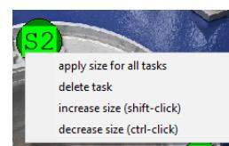

The task items (circles) can be moved around by clicking and dragging. New tasks can be added by double clicking into the image. Right click for a context menu with other operations. Note that the image can also be changed by right clicking the image and selecting "change image" from the context menu.

- List of operations. This list manages the processes and their parameters by keeping a list of tools with associated parameters (such as a parameter set number and plausibility check limits). Each process (called operation) can then be assigned to tasks/actions. As using the same process on multiple tasks is very common, this minimizes the amount of configuration work needed to set up a job. See chapter [3.3.2.2](#page-9-0) for a quick step-by-step guide on how this is typically used. The following actions are possible here: o New operation: add a new (empty) operation. o Delete operation: deletes the currently selected operation o Add (rework, undo, alternative tool): adds a new (empty) rework, undo or alternative tool operation. This allows overriding the default rework operation of the tool on a per-operation base
  - (e. g. loosen with another tool) or specify specific operations for undo or alternative tool modes. The rework operation will be executed every time the normal process returns a NOK result, the undo and alternative tools, if OGS is switched to the according processing mode. Note that all tools have a default built-in rework, undo and alternative tool operation behavior (e. g. tightening tools use the loosen operation), but you can override this here. o Select an operation from the list of existing operations. Click the ellipsis button left to the operation name to open the operation list popup (see [4.2.4\)](#page-26-0). Then choose the tool and operation and use it by clicking the accept button. If you can't find a matching process, then modify or enter the new values directly. o Select a tool from the list of tools: Click the ellipsis button left to the tool name field (might be empty for new operations) to open the operation list popup (see [4.2.4\)](#page-26-0). You can then select the tool and use it by clicking the accept button. o Show translation: selects the current editing language.
- The list of actions defined for the job. Note that this list defines the actual order of work which the operator need to step through when running the job. Use drag & drop to reorder actions and right-click to assign operations (from ). Clicking an action in the list also selects the associated task (in the task list and the image view ).

The right-click context menu also operates on multi-selections. To assign an operation to multiple tools, multi-select the relevant actions (by using <ctrl>-click or <shift>-click), then right click and choose the operation. This also works for adding another step (pre-process/post-process) and can be a huge timesaver.

Note that each action is always associated to a single task but a task might have multiple actions (such as pre-process, final-process and post-check). Also, each action \*must\* be assigned to an operation, else you won't be able to save the job.

The background color indicates the action step type:

o Light green: final process step (default). Each task \*must\* have a final step action assigned. o Yellow: pre-process step. o Light blue: post-process (check) step.

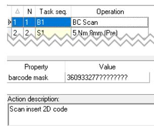

- Action properties and action description. Shows properties for the currently selected action (selected in ). Depending on the tool, additional action properties are available (see screenshot, e.g. the barcode tool requires adding a barcode mask). For more information, see the tool configuration guide.

The action description is shown to the user on the heOpMon workstation runtime when the action gets active to give an additional text description or explanation of the current work at hand.

- Job action buttons: The buttons "cancel" and "save" are used to close the job editor (discarding or saving the changes). If any inconsistency is detected while trying to save the job, then a messagebox with details is shown. In this case, the editor is not closed to allow the user to fix the problems.

## **4.2.6 Database Settings**

The global database settings can be accessed through the main menu Database → Settings. The global database settings are stored inside the database and configure database specific behavior of the editor. This will show the following dialog:

The following settings are available (see also chapter **Error! Reference source not found.** for more information):

- Keep images in memory: If checked, then all job images are loaded into memory when a database is started. The advantage is that opening a job for editing is quicker, the disadvantage is longer initial database load time and higher memory consumption.
- Job version control: If checked, enables job version control. This will keep old versions in the database (e.g. when synchronizing jobs to a server database, see chapter [4.3.2.2\)](#page-32-1).

- Server role: Check, if multi-user access to the database is needed and "Coordinator"/"Job Designer" roles for accessing shared data shall be used
- Change log level: defines which change log entries are active (per job and per database) and if they are mandatory (saving a job or the database require adding a log message).
- Use Position encoder: if checked, then the "PS" column is added to the task properties (in the job editor)
- Use socket tray: Shows or hides the "socket tray" operation property
- Url: Shows or hides the "Url" task property
- Application start: Shows or hides the "Application start" task property, which is used to group bolts for multi-spindle applications (KE350 only)

Note that most of the settings are mirrored in the Tool → INI parameters list.

## **4.2.7 Changelog**

To access the database changelog (if the database has change logging enabled, see [4.2.6\)](#page-30-0), use the View → Changelog menu item. This then shows the changelog dialog:

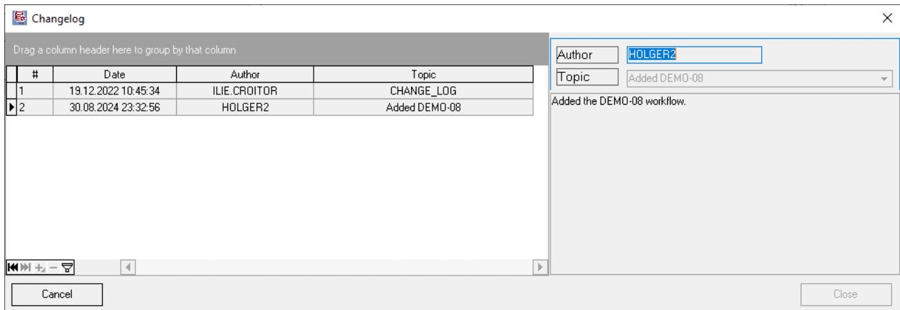

Note that the changelog is shown in read-only mode. The same dialog (in edit mode) is shown, if a job or the database is saved.

## **4.2.8 Admin mode**

To start the editor in admin mode, start the editor from a command line and append the /admin command line parameter. This enables View → SQL editor as well as additional admin features.

# **4.3 Server Mode**

## **4.3.1 Overview**

The editor can run in two operation modes, defined by the global setting "SERVER\_ROLE" in the database (see chapter [4.4](#page-37-0) for configuration options):

- Local mode (the default): This is the standard mode, if the opened database does not have the global property "SERVER\_ROLE" or the value of "SERVER\_ROLE" is zero.
- Server mode (if the database global property "SERVER\_ROLE" = 1): Compared to the local mode, the server mode adds access levels (coordinator, job editor) and multi-user synchronization. If a database is set to server mode, then multiple clients/users can simultaneously edit the same database, and the heOpCfg-Software manages concurrent access.

If a database is switched to server mode, then only a "coordinator" can access and edit the database directly. Other users (having the "job editor" role) can only check-out and check-in jobs. A "job editor" will check-out jobs from the server database and copy them for editing into a local database. After all edits are done (on the local database), then the "job editor" can check-in (upload) a new version to the database again.

Only a single "coordinator" can be logged on at a time and can then edit all objects (jobs and shared objects like the tool list and the family configuration).

## **4.3.2 Editor roles**

#### **4.3.2.1 Coordinator**

In server mode, the editor shows the following dialog after connecting to a database which has the "server mode" enabled:

The dialog provides the following information:

- Who is logged on as a coordinator (if any)
- Reasons for not being able to log on as a coordinator (e.g. the user does not have the right to log on as a coordinator – see screenshot above).

In case the user has the right to log on as a coordinator, then the "Logon coordinator" button is enabled and clicking it will log in the current user and lock the database to prevent other coordinators from accessing it. Note that the database lock is automatically released, if the editor is closed or another database is opened.

#### **4.3.2.2 Job editor**

Users with the "job editor" role can concurrently edit jobs in the database. This basically works as follows (see chapter [5.3](#page-42-1) for more information):

- User opens a database in local mode (think of it as a partial copy of the server database used to edit jobs offline). Note, that you can start with an empty database (Database → New) also.
- Use Export/Import → Synchronize jobs to open the job synchronization selector:

- In the job synchronization selector, the currently opened database from the editor is automatically selected as the local database. Use the second line to select the database where you want to download (check-out) the jobs you want to edit:

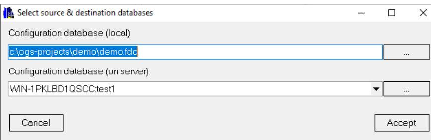

- After clicking the "Accept" button the main synchronization view will open:

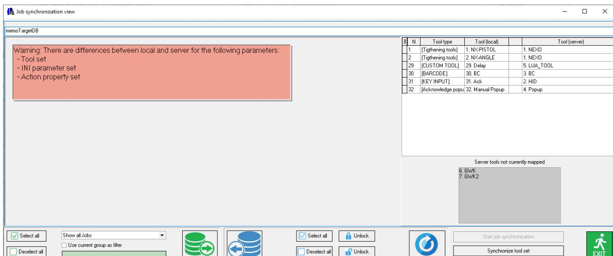

- The Main synchronization view shows any differences in the system configuration of the two databases and allows to update the local database from the server database. To continue, the system configuration of the local database must be identical to the server configuration. You can set up a mapping using the grid in the top-right grid pane. Clicking the button "Synchronize tool set" will then apply the changes to the local database and will enable the "Start job synchronization" button:

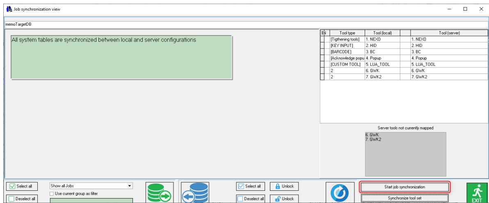

- After clicking the "Start job synchronization" button, the job synchronization view opens:

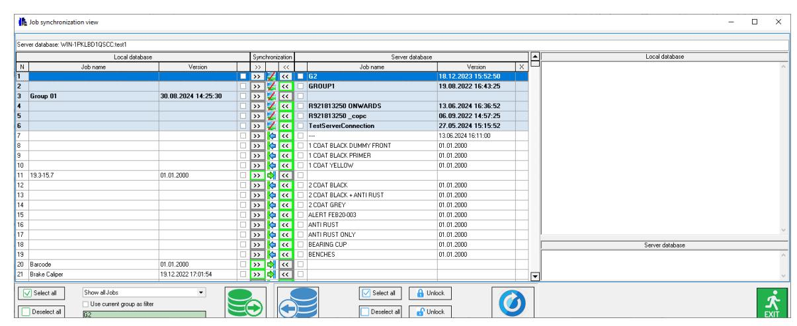

- You can now download jobs from the server database to the local database (for local editing) and upload local changes to the server database (if there is a version conflict, the editor will let you know and you will have to resolve this manually)
- If all synchronization is done, click the "Exit" button to return to the editor.

## **4.3.3 Versioning**

If versioning is enabled (see chapter [4.2.6\)](#page-30-0), then the coordinator can access and restore old versions. A new version is automatically added, whenever a job is uploaded to a database in server mode. To see and possibly restore an old version, go to the Jobs tab and open the repository view (View → Repository):

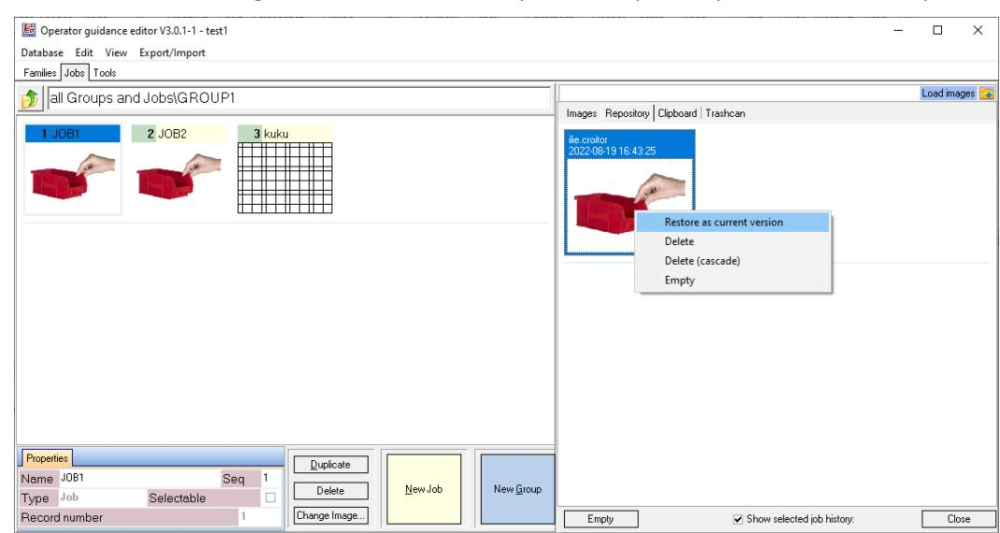

By default, the repository view only shows old versions of the currently selected job (checkbox "Show selected job history" in the bottom right pane checked). If the checkbox "Show selected job history is unchecked, then all "old" versions are shown in the repository.

To modify the version history, right-click any if the old versions in the repository list, then select one of the actions:

- Restore as current version: Make the selected version the active version (i.e. rollback to the given version).
- Delete: Delete the selected version from the history.
- Delete (cascade): Delete all versions of the selected job from the history.
- Empty: Delete all old versions from the history.

## **4.3.4 Explicit locking**

In multi-user scenarios, sometimes it is helpful to "lock" a job in the server database to prevent version conflicts and to show the other users, that you are working on a change. This can be done by explicitly locking a job by opening the synchronization view and clicking the "lock" or "unlock" button (make sure to check one or more jobs before clicking the button):

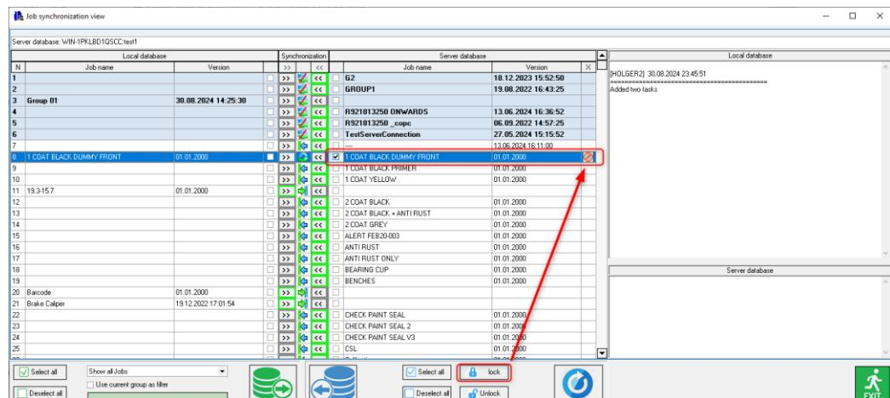

The lock icon in the rightmost row indicates the locking state. Trying to upload changes to a locked job is prevented for all users except the one who locked the job.

Note that the "coordinator" can remove locks created by other users.

## **4.3.5 Active directory access control**

In server mode, you can use active directory security groups to automatically map the "coordinator" and the "job editor" roles to users. To enable this feature, set the following global parameters (Tools → Ini-Parameters):

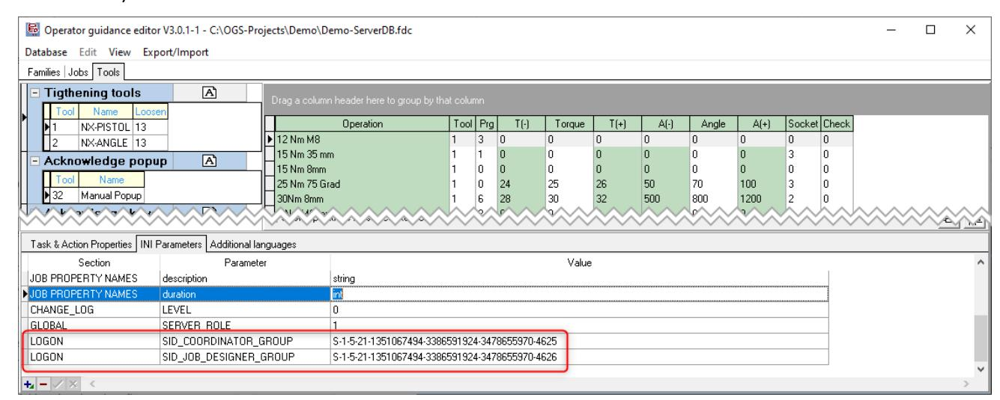

Note: to get the SID for an active directory group, PsGetSid from Sysinternals can be used:

When starting the heOpCfg editor, the current Windows logon is checked for group membership to the two SIDs and access to coordinator/job editor mode is validated accordingly.

## **4.3.6 Persistent database links**

The Database → Reopen menu lists the currently opened databases as well as a list of predefined databases. The list of predefined databases can be set up in the heOpCfg.ini [GLOBAL] section (requires Admin privileges by default).

To add persistent database links (or shortcuts), add these as follows:

The syntax is:

CFG\_DATABASE\_<num>=<server>:<alias>

or

CFG\_DATABASE\_<num>=<path>

where:

- <num> is the sequential number (01...09) of the database link entry in the main menu
- <server> is the IP address or hostname of a remote database server
- <alias> is the alias name or the path (on the server) of the database on the server
- <path> is a local path on the system (network drives are not allowed)

## **4.4 Configuration**

#### **4.4.1 Overview**

The configuration defines the behavior of the software – e.g. some features can be enabled or disabled in the configuration. Generally, there are two sources of the configuration:

- 1. heOpCfg.ini (in the same directory where heOpCfg.exe is started from): defines global (typically installation specific) configuration and serves as a "default" for configuration settings not defined in the database (see below).
- 2. The settings table in the database. The settings table is read by heOpCfg.exe whenever a database is opened. The settings table can override global settings, so the heOpCfg.exe configuration can be dependent on the actual database opened, so you can also define the settings per project/database (e.g. "Server mode" active, "positioning" active, …).

All parameters are defined as <section><parameter name> and assigned a <value>. If a parameter is specified in the heOpCfg.ini file, then the setting is specified as <parameter name>=<value> in the [<section>] of the file. If set in the database, then parameters are in the Tools → "INI parameter" pane:

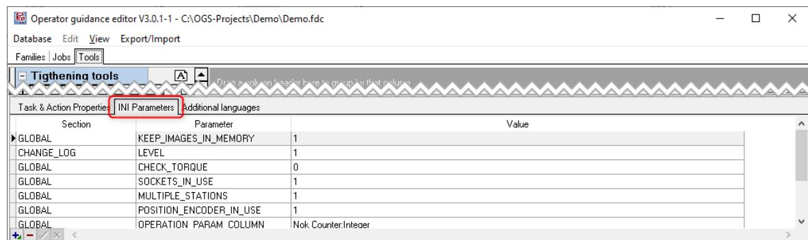

Note that some of the more commonly used settings are also exposed in the GUI. You can open the settings dialog by selecting Database → Settings… from the main menu:

See chapte[r 4.2.6](#page-30-0) for more details.

## **4.4.2 Configuration sections**

## **4.4.2.1 Section [GLOBAL]**

The following shows the parameters of the [GLOBAL] section (see also chapter [4.3.6](#page-36-0) for setting up persistent database links / shortcuts, but this is for the heOpCfg.ini file only) – note that some parameters are only available in the heOpCfg.ini (ini), others are available in db and ini!

To optionally set defaults for opening the database, use the following parameters:

### **4.4.2.2 Section [LOGON]**

In the logon section, there are the following parameters:

- SID\_COORDINATOR\_GROUP: Define SID for "coordinators" role
- SID\_JOB\_DESIGNER\_GROUP: Define SID for "job editor" role

| Name                        | ini/db | Description                                                   |
|-----------------------------|--------|---------------------------------------------------------------|
| SERVER_ROLE                 | db     | Defines, if the database is in server mode (parameter         |
|                             |        | missing or set to = 0). See also chapter 4.3.                 |
| JOB_VERSION_CONTROL         | ini/db | Defines if the database keeps old job versions when           |
|                             |        | synchronizing jobs. See also chapte r 4.3.3.                  |
| NACHANZUG                   | ini/db | Defines, if the editor shows the post-process action (if      |
| SOCKET_IN_USE               | ini/db | Defines, if the editor shows the socket number parameter      |
| POSITION_ENCODER_IN_USE     | ini/db | Defines, if the editor shows the “PS” column in the task      |
| KEEP_IMAGES_IN_MEMORY       | ini/db | If set to a nonzero value, then all job images are loaded     |
| OPERATION_PARAM_COLUMN      | ini/db | Defines an additional operation parameter. The name and       |
| SEARCH_BY_WORKFLOW_SELECTOR | ini/db | If set to a non-zero value, then the barcode search edit      |
|                             |        | box is displayed in the families barcode table. Se e 4.2.2.4. |
| LEVEL                       | ini/db | (admin only) If set to a non-zero value, then enable the      |
| MULTIPLE_STATIONS           | ini/db | Legt fest, ob der Editor die Spalte „Station“ bei der         |

| Name             | ini/db | Description                                  |
|------------------|--------|----------------------------------------------|
| DATABASE         | ini    | Defines the database to open at startup.     |
| STATION_DATABASE | Ini    | Defines the default station database to use. |

#### **4.4.2.3 Section [CHANGE\_LOG]**

In the change\_log section, there are the following parameters:

- LEVEL: defines the change log level

Typically, one uses the GUI dialog found at Database → Setting to define the change log requirements (see [4.2.7\)](#page-31-0).

The change log levels are:

### **4.4.2.4 Section [JOB PROPERTY NAMES]**

Defines additional (custom) job properties. Each entry in this section is using the following format:

<job parameter name>=<data type>

Data types are string, int, float, logic, time.

#### **4.4.2.5 Section [CSV]**

In the csv section, there are the following parameters:

- SEPARATOR: Defines the field separator character for CSV output (if not set, then default is to use a comma character)
- DO\_NOT\_OVERWRITE\_AVAILABLE: Defines if an existing CSV file can be overwritten (default is = 1, i.e. do not overwrite existing CSV files). Set to zero to allow overwriting existing CSV files.

| Level | Database level | Job level     |
|-------|----------------|---------------|
| 0     | No change log  | No change log |
| 1     | Optional       | Optional      |
| 2     | Required       | Required      |
| 3     | Required       | Optional      |
| 4     | Optional       | Required      |
| 5     | Optional       | No change log |
| 6     | Required       | No change log |
| 7     | No change log  | Optional      |
| 8     | No change log  | Required      |

# 5 Data management

# **5.1 Overview**

As described in chapter [1.1,](#page-3-1) the heOGS software mainly consists of two components:

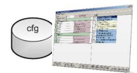

- heOGS editor ("heOpCfg"): Application to create and manage workflows. The heOpCfg application is a standard Windows GUI application and needs mouse & keyboard to be used.
- heOGS runtime ("heOpMon"): Application running on an operator's workstation in the production line.

Both components use their own database file to store information:

- heOpCfg editor data file ("cfg"): stores all information about configured workflows (such as job pictures, workflow variants, tasks and action definitions and operations links to tools) for a single or even for multiple operator workstations. This data file only stores the "current" workflow definitions, no historic data and no historic workflows.
- heOpMon runtime data file ("data"): stores all information about a single stations workflows and historic workflow result data. As this data file keeps workflow result data, it allows accessing previously worked on parts and their state for "pickup where you left" processes. To make this work, even if the workflow configuration has changed in between, the data file also keeps historic workflow definitions.

Note that all configuration files are simple files. Therefore data management tasks such as backup, restore and versioning can easily be done using the standard windows file operations (copy, paste, rename, archive/zip, …).

# **5.2 Setups**

As the heOGS software is split into two applications, one can implement multiple operation scenarios by choosing where to install the software, where to keep the data files and how to move data between the heOpCfg editor and the heOpMon runtime. The following chapters show typical setups.

## **5.2.1 Standalone / Demo setup**

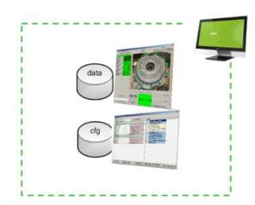

The simplest to use setup is installing both components on a single machine. In this case both database files reside on the same PC (eventually in the same folder) and updating the heOpMon configuration can be directly done through the "Export local changes" function in heOpCfg (see chapter [3.6\)](#page-15-0).

## **5.2.2 Per station config**

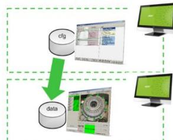

This is the most common setup. The heOpCfg editor is typically running on an office-PC with separate configuration files for each station in the line. To update a stations configuration, the "cfg" file is copied to the station PC, then imported through the heOpImp application.

This has the following advantages:

- All configuration files (even for multiple stations) are managed on the office-PC (backups, version, etc.). As a best practice, a folder/directory per station can be used – which should preferably be stored on a network/shared drive.

- Rolling out changes to one or more stations is a clearly defined process of:
  - 1. Transfer the stations "cfg" file from the office-PC to the station's PC (over the network, using an USB thumbdrive, etc).
  - 2. Import the new configuration into the stations "data" file by running the heOpImp application on the station's PC. As this is done on-site at the factory floor, this ensures that updates are done in the correct state of the station (e.g. during a break, with the current workpiece completely finished) and with proper backup measures (there is a e.g. an up-to-date backup copy of the stations "data" file) and validating the changed process (monitoring the first part build after a change directly on the station).
- As the configuration is kept in the office network, there is a clear "single source of truth" configuration, with configuration data moving in a single direction. In doubt, always the stations configuration is "outdated" and can be updated from the current "cfg" configuration without any risk of data loss.
- Rebalancing jobs between different stations can easily be done by using the "distribute jobs" function of the heOpCfg editor (see chapter **Error! Reference source not found.**).

## **5.2.3 Multi-station shared config**

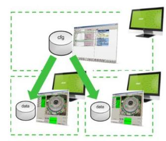

Multi station shared config keeps workflow configurations of multiple stations in a single configuration database ("cfg"). In this setup each operation is mapped to a target station by number (requires enabling the "multiple\_station" option in heOpCfg.ini, see [4.4.2.4\)](#page-39-0) – operations without station association (Station = 0) are mapped to all stations and can be used in tasks / jobs for all stations):

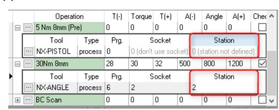

To update the stations configuration, then typically the following steps are required:

- 1. Transfer the "cfg" file to all stations requiring an update (over the network, using an USB thumbdrive, etc).
- 2. Run the heOpImp on all stations to import the "cfg" data of the station into the stations "data" file. Note that heOpImp reads the station number from the stations.ini file to determine the subset of workflows, jobs and operations required on the station and actually does a "partial" import.

The key advantages are:

- Keep a single configuration file for all stations
- Allow fine-granular changes to tasks/operations

The points to take care of are:

- It might become difficult to track which configuration change requires which station(s) to be updated. As a best practice, any change in the "cfg" configuration should be rolled out to all stations to ensure no missing updates on the station level.
- Operations without station mapping (Station = 0) require the tools to be identically available in the stations where the operation is used.
- Rolling back changes might become more difficult, as errors in the configuration of a single station might overlap with concurrent (correct) changes of another station. Rolling back the "cfg" file to a previous version might then discard a correct change…

## **5.2.4 Central database**

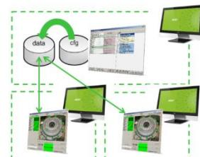

In addition to having a multi station shared configuration (see [5.2.3\)](#page-41-0), also the stations "data" file can be shared by multiple stations by deploying it on a shared database server.

The main benefit is that with this setup, workflows can be shared between multiple heOpMon station instances. This allows scenarios, where e.g. two operators are working on a single product piece at the same time (e.g. left and right side of a car). Both stations (left and right) may have dedicated jobs, but also shared jobs. The heOpMon locks access on the job level – such that each operator can basically work on all shared jobs. However, the first operator which starts a job then "owns" it (the other operator is locked out but can skip and start the next job). Both operators can see the status of all shared jobs – again the status is updated which start/end of a job.

Note that this setup requires installing a database server instance on a PC/server reachable from all stations and a reliable network connection between all stations and the server.

# **5.3 heOpImp**

## **5.3.1 Overview**

The heOpImp application is a small helper application to manage the stations "data" configuration file. The heOpImp application can either be started through the heOpCfg menu bar (for importing a "cfg" configuration file and for moving jobs between "cfg" databases, see [4.2.1\)](#page-18-1) or by running the heOpImp.exe executable from the software installation folder.

If starting the software directly, the following window will be shown:

- Function provided are:
- Import configuration: opens a file browser to import/merge a "cfg" configuration into a stations "data" file. See chapter [3.6](#page-15-0) for more information.
- Terms editor: allows editing the heOpMon runtime GUI texts.
- User management: allows editing a list of users/passwords. Note that this function heavily depends on how the user management is configured in heOpMon and might not even be used at all.
- Export station job list to SQL server: special function to upload/merge the stations job list to a SQL server. This is used for end-of-line reports.
- Clear job/operation list: deletes outdated data from the database.
- Synchronize local/server databases: Allows moving jobs between "cfg" database. See below (chapter **Error! Reference source not found.** for more info).

## **5.3.2 Synchronize local/server databases**

The synchronize local/server databases function allows copying/moving jobs between two databases. It includes features for locking database access (to prevent concurrent changes on a shared (server) database) and versioning of jobs (for detecting concurrent changes and manage changes).

The function can be invoked through in two ways:

- By clicking the button "Synchronize local/server databases" in heOpImp. In this case the function asks for a source database first (where it reads the jobs from), then for a server database (where to get the jobs from or where to write the jobs to).

- By selecting "Export/Import" → "Synchronize Jobs…" from the main menu in heOpCfg. In this case, the source database is automatically the current database opened in heOpCfg. The software then only asks for a server database (where to get the jobs from or where to write the jobs to).

Note that the "server" database is "protected" – in a sense, that you never can overwrite global definitions. The only thing which can be changed in the "server" database are the jobs. Other changes (families or tools) are considered global and require direct connection ("coordinator" access) to the server database.

After source and target databases are selected, the software shows an overview comparison window as follows:

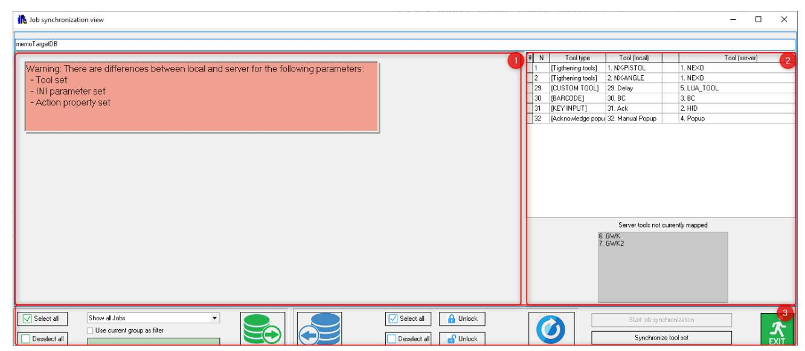

#### The window shows the following:

- "System parameters" overview synchronization result: this checks, is global parameters and dependencies of the two databases are compatible. If not, then a red warning message with details is shown. Continuing from here requires resynchronizing the local database (copying the system parameters from the server database). If a green info message is shown here, then the system parameters are in sync – too mappings can nevertheless be different (see ).
- Tool mappings grid. This pane shows all tools defined in the local and the server database. You can change the mapping of the tools between local and server database – when you synchronize jobs later, then heOpImp respects these mappings.
- Action pane. Usually, the actions are mostly disabled in the state shown in the above screenshot, as a tool set mismatch is detected. The only enabled action is the button "Synchronize tool set".

After checking the tool mapping and clicking the "Synchronize tool set" button, the view gets updated as follows:

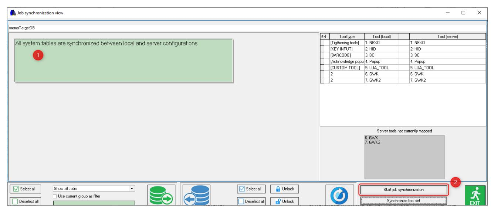

The view now shows:

- "System parameters" changed to green indicating that server and local database are ready for synchronizing jobs (all dependencies can be resolved) and are compatible.
- The "Start job synchronization" button is enabled. The action pane elements are still mostly disabled, only the two buttons on the right are enabled.

After clicking the "Start job synchronization" button, now finally the job compare view is shown as follows (note that the previous two views are not show, if the global database dependencies are already in sync between local and server database):

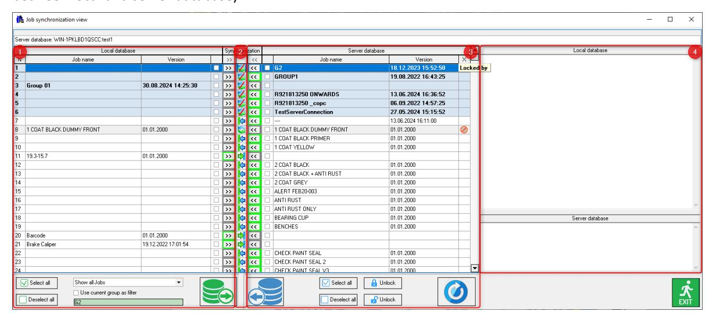

The window shows the following:

- "Local database". This pane shows the jobs available in the local database. The job groups use a lightblue background color, the actual jobs show a white background. Each job (and group) also shows a version (which is actually a timestamp of the last change). On the righthand border, there is a checkbox for selecting a job (for batch operations) and a >> button, which immediately uploads a job to the server when clicked. Note that the button has a green border to indicate the typical operation.

In the lower area, there are additional actions to filter the view or to change the selection. Clicking the large green database sync button executes the preselected change (local → server).

- Comparison state: this column shows the comparison state, possible states are left only, right only, identical, different and cannot sync (only for groups).
- "Server database". This pane shows the jobs/groups available in the server database. The job groups use a lightblue background color, the actual jobs show a white background. Each job (and group) also shows a version (which is actually a timestamp of the last change). On the lefthand border, there is a checkbox for selecting a job (for batch operations) and a << button, which immediately downloads a job to the server when clicked. Note that the button has a green border to indicate the typical operation. The rightmost column indicates the server job lock state (if locked shows a red blocked sign).

In the lower area, there are additional actions to change the selection or lock/unlock a job. Clicking the large blue database sync button executes the preselected change (server → local).

To quit the application, click the "Exit" button.

# **5.4 Access control and security**

## **5.4.1 Overview**

As the configuration databases are single files, access to these files can be restricted using standard Windows access control list (ACL) file system settings. The "data" file (and other configuration information at the station PC) is usually stored in a subdirectory below the installation folder. It is recommended that normal users are only granted read-only access to this folder. The user who is allowed to run the heOpImp application to import "cfg" data into the stations "data" file must have write access to the "data" file (stations.fds).

Note that the PC running the heOpMon workstation runtime software does not necessarily need a network connection to the office network. To update configuration, the "cfg" data file can also be transferred to the station via other means, e.g. a USB thumb drive.

## **5.4.2 Remote server access**

To manage remote access to a server hosted database, active directory groups are used. See chapte[r 4.3.5](#page-35-1) for more details.